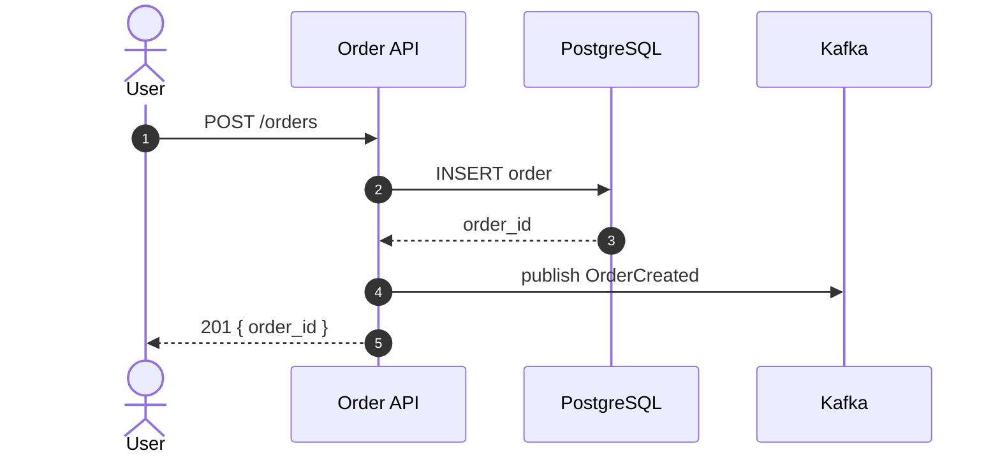
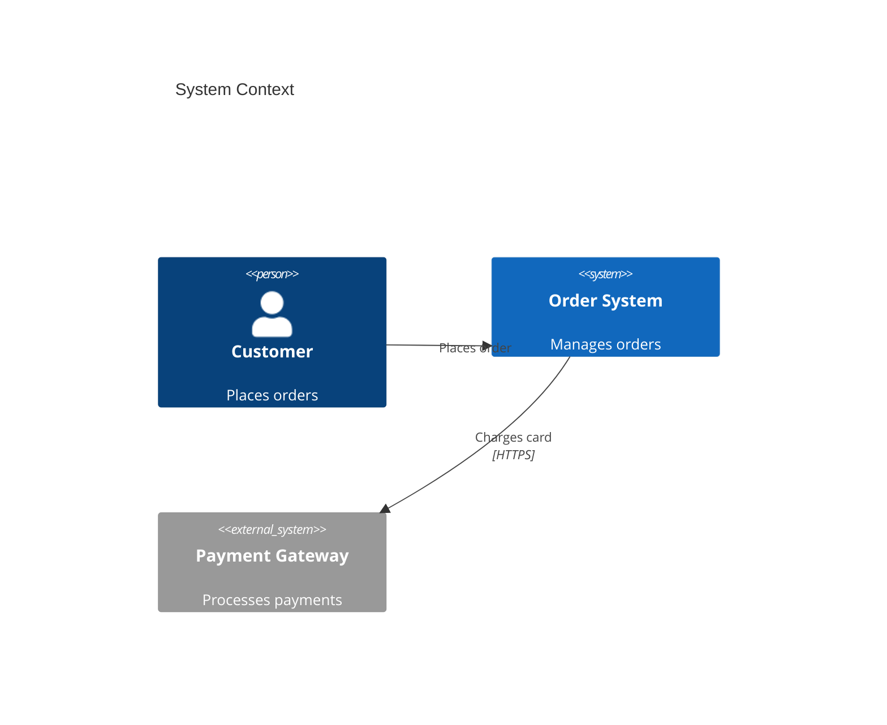
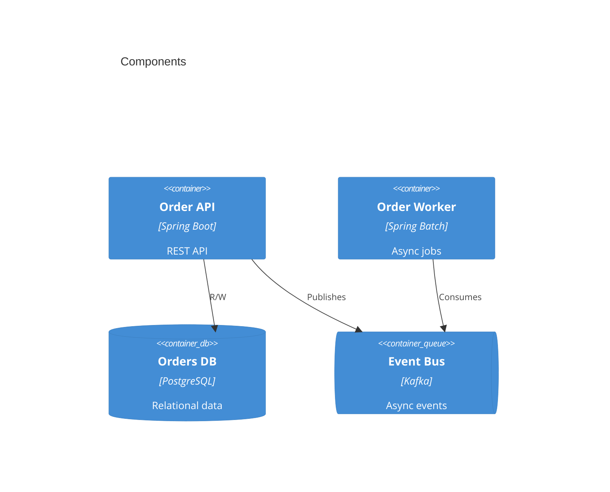
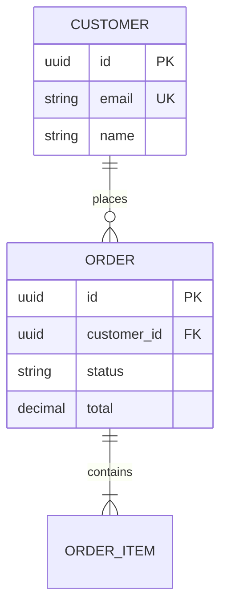
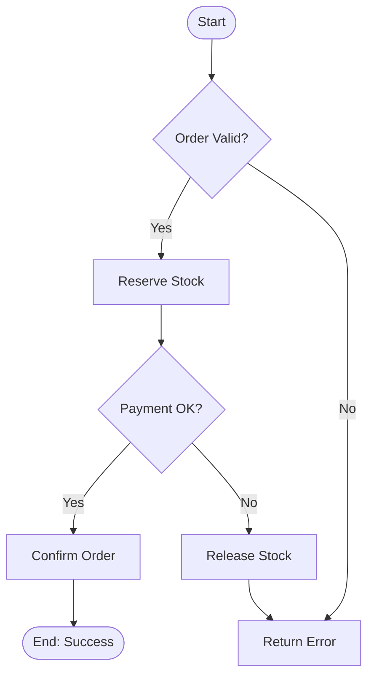
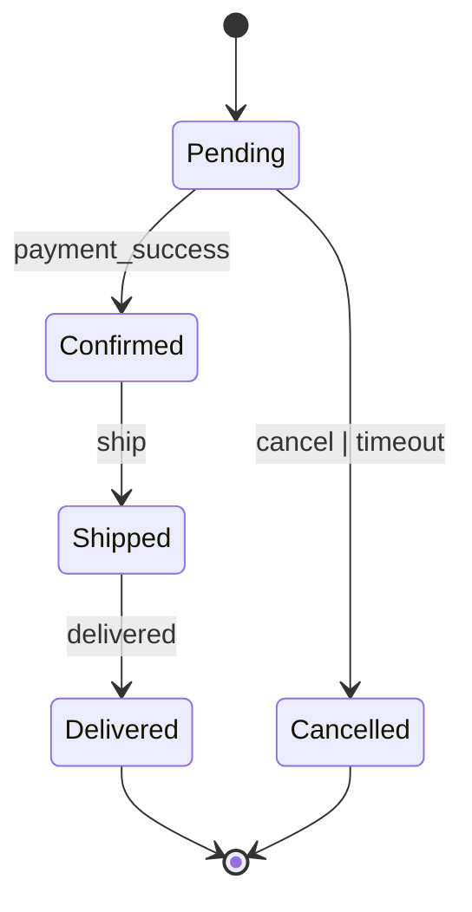
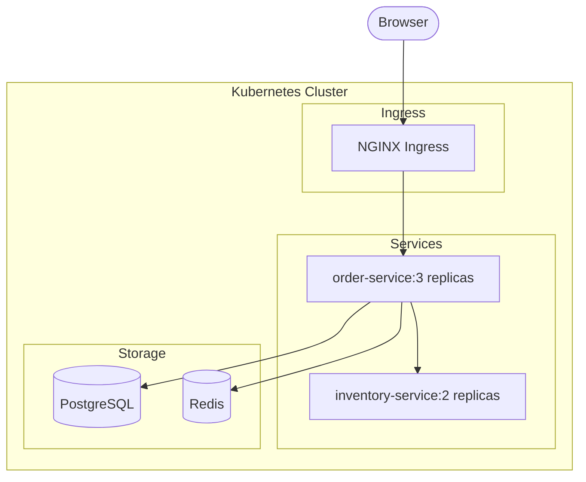
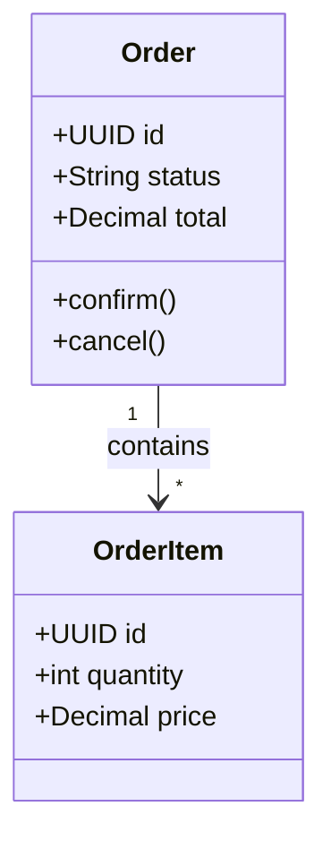

# Mermaid Diagram Types Reference

All diagrams are written in Mermaid syntax and saved as `.mmd` files.

## Supported Diagram Types

### 1. Sequence Diagram

**Use for**: workflows, API interactions, event flows.

### 2. C4 Context Diagram

**Use for**: system overview, stakeholder view.

### 3. C4 Component Diagram

**Use for**: service architecture.

### 4. Entity Relationship Diagram

**Use for**: data model, database design.

### 5. Flowchart (Business Logic)

**Use for**: business rule flows, decision trees.

### 6. State Diagram

**Use for**: entity lifecycle, order states, workflow states.

### 7. Deployment Diagram (Graph)

**Use for**: infrastructure, deployment topology.

### 8. Class Diagram

**Use for**: domain model, OOP relationships.

## Naming Convention
| Diagram | File Name |
|---------|----------|
| Architecture context | `architecture.mmd` |
| Components | `components.mmd` |
| Sequence for WF-NNN | `seq-wf-001.mmd` |
| ER diagram | `er-diagram.mmd` |
| Deployment | `deployment.mmd` |
| State machine | `state-<entity>.mmd` |
| Flowchart | `flow-<rule-or-process>.mmd` |
