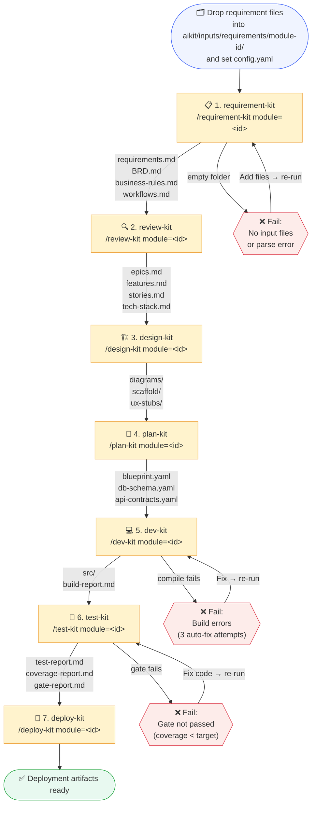

# AIKit Pipeline Flow

Visual guide to the order of kit execution, stage gates, inputs, and outputs.

---

## Pipeline Sequence



---

## Stage Gate Reference

Each kit checks `aikit/logs/stage-tracker.yaml` before starting. If the prerequisite stage is not `completed`, the kit aborts immediately with a clear message.

| # | Kit | Command | Prerequisite | Aborts if |
|---|-----|---------|-------------|-----------|
| 1 | **requirement-kit** | `/requirement-kit module=<id>` | _none_ — first stage | Input folder is empty |
| 2 | **review-kit** | `/review-kit module=<id>` | `requirement_kit = completed` | No `requirements.md` / `BRD.md` |
| 3 | **design-kit** | `/design-kit module=<id>` | `review_kit = completed` | No `stories.md` / `tech-stack.md` |
| 4 | **plan-kit** | `/plan-kit module=<id>` | `design_kit = completed` | No `scaffold/` or diagrams |
| 5 | **dev-kit** | `/dev-kit module=<id>` | `plan_kit = completed` | No `blueprint.yaml` |
| 6 | **test-kit** | `/test-kit module=<id>` | `dev_kit = completed` | Build gate not passed |
| 7 | **deploy-kit** | `/deploy-kit module=<id>` | `test_kit = completed` | Coverage gate not passed |

---

## What Each Kit Reads and Writes

### 1 — requirement-kit
```
READS:   aikit/inputs/requirements/<module-id>/   ← your .pdf/.docx/.xlsx/.csv files
RUNS:    aikit/tools/convert_requirements.py      ← converts to .md first
WRITES:  aikit/outputs/<module-id>/requirements/
            requirements.md       ← consolidated raw requirements
            business-rules.md     ← extracted BR-NNN rules
            workflows.md          ← extracted WF-NNN workflows
            BRD.md                ← formal Business Requirements Document
```

### 2 — review-kit
```
READS:   aikit/outputs/<module-id>/requirements/*.md
         (interactive clarification session with you)
WRITES:  aikit/outputs/<module-id>/review/
            clarifications.md     ← answered ambiguities
            tech-stack.md         ← technology decisions
            epics.md              ← EPIC-NNN list
            features.md           ← FEAT-NNN list
            stories.md            ← US-NNN with BDD acceptance criteria
```

### 3 — design-kit
```
READS:   aikit/outputs/<module-id>/review/*.md
WRITES:  aikit/outputs/<module-id>/design/
            diagrams/             ← .mmd Mermaid files (C4, sequence, ER, deployment)
            scaffold/             ← technology-agnostic directory stubs per service
            ux-stubs/             ← per-page HTML/JSX/TSX stub files
            db-design.md          ← initial schema notes
```

### 4 — plan-kit
```
READS:   aikit/outputs/<module-id>/design/
         aikit/blueprint/cross-cutting.yaml      ← checks for reusable cross-module components
WRITES:  aikit/outputs/<module-id>/plan/
            blueprint.yaml        ← master plan: services, stories map, tech, deps
            tech-decisions.yaml   ← ADRs for every major technology choice
            db-schema.yaml        ← full tables/columns/indexes/migrations
            api-contracts.yaml    ← OpenAPI 3.0 for all service APIs
         aikit/blueprint/modules/<module-id>.yaml ← snapshot in cross-module registry
```

### 5 — dev-kit
```
READS:   aikit/outputs/<module-id>/plan/blueprint.yaml
         aikit/outputs/<module-id>/design/scaffold/  (fills in TODOs)
         aikit/outputs/<module-id>/design/ux-stubs/  (fills in TODOs)
WRITES:  aikit/outputs/<module-id>/dev/
            src/                  ← full implementation source code
            build-report.md       ← build result (PASS/FAIL + error details)
            build.log             ← raw compiler/tool output
```

### 6 — test-kit
```
READS:   aikit/outputs/<module-id>/dev/src/
         aikit/outputs/<module-id>/review/stories.md
         aikit/outputs/<module-id>/requirements/business-rules.md
WRITES:  aikit/outputs/<module-id>/test/
            test-cases/           ← unit + integration tests per story
            gate-report.md        ← build gate (PASS/PARTIAL/FAIL)
            test-report.md        ← test run results
            coverage-report.md    ← story × acceptance criteria matrix
```

### 7 — deploy-kit
```
READS:   aikit/outputs/<module-id>/plan/blueprint.yaml
         aikit/outputs/<module-id>/plan/tech-decisions.yaml
         aikit/outputs/<module-id>/dev/src/  (for Dockerfile generation)
WRITES:  aikit/outputs/<module-id>/deploy/
            terraform/            ← HCL modules (VPC, DB, cache, IAM, secrets)
            helm/<service>/       ← Helm 3 charts per microservice
            deployment-guide.md   ← step-by-step apply guide with commands
```

---

## Stage Status Lifecycle

```
not-started  ──►  in-progress  ──►  completed
                       │
                       └──►  failed  ──►  (fix and re-run same kit)
```

Check status at any time by reading:
```
aikit/logs/stage-tracker.yaml
```

---

## Re-run Rules

| Scenario | Action |
|----------|--------|
| Stage is `completed`, no new files | Kit will ask for confirmation before re-running |
| Stage is `failed` | Fix the underlying issue, then re-run the **same** kit |
| Adding new requirements to an existing module | Re-run from `requirement-kit` (incremental mode — appends, does not overwrite) |
| Need to change tech stack after review-kit | Re-run `review-kit` → then re-run all subsequent kits |
| Build failure in dev-kit | dev-kit auto-retries 3 times; if still failing, fix and re-run `dev-kit` only |
| Coverage gate fails in test-kit | Fix the code in `dev-kit` output, re-run `test-kit` |

---

## Quick Reference — Full Pipeline Run

```bash
# Step 1 — install converter dependencies (once per machine)
pip install -r aikit/tools/requirements.txt

# Step 2 — set up module config
cp aikit/config.yaml.template aikit/inputs/requirements/<module-id>/config.yaml
# edit config.yaml: set module.id, module.name, module.type

# Step 3 — run each kit in order (paste into Copilot Chat)
/requirement-kit module=<module-id>
/review-kit      module=<module-id>
/design-kit      module=<module-id>
/plan-kit        module=<module-id>
/dev-kit         module=<module-id>
/test-kit        module=<module-id>
/deploy-kit      module=<module-id>
```

---

## Multiple Modules (Cross-Module Blueprint)

When running aikit for more than one module in the same product:

```
Module A pipeline  ──►  plan-kit writes aikit/blueprint/modules/module-a.yaml
                                    and updates aikit/blueprint/cross-cutting.yaml

Module B pipeline  ──►  plan-kit READS cross-cutting.yaml to reuse shared
                                    components instead of re-generating them
```

Run each module's full pipeline independently, but always complete **plan-kit** on Module A before starting **plan-kit** on Module B if B depends on A's shared components.
