# AWS SAA-C03 - Compute Services Flow Diagrams

## EC2 Instance Lifecycle and Management

## EC2 Purchasing Options Decision Tree

```mermaid
flowchart TD
    Start([Choose EC2 Pricing]) --> WorkloadType{Workload Type?}
    
    WorkloadType --> |Steady State<br/>Predictable| Predictable{Commitment Length?}
    WorkloadType --> |Variable<br/>Unpredictable| Variable
    WorkloadType --> |Short-term<br/>Flexible| ShortTerm
    WorkloadType --> |Fault Tolerant<br/>Flexible Time| Flexible
    
    Predictable --> |1-3 Years| Reserved{Need Flexibility?}
    Reserved --> |No Changes Needed| StandardRI[Standard Reserved<br/>---<br/>💰 Up to 75% Savings<br/>📅 1 or 3 Year Term<br/>🔒 Cannot Change Family]
    Reserved --> |May Change Type| ConvertibleRI[Convertible Reserved<br/>---<br/>💰 Up to 66% Savings<br/>📅 1 or 3 Year Term<br/>🔄 Can Change Family]
    
    Predictable --> |Recurring Schedule| ScheduledRI[Scheduled Reserved<br/>---<br/>💰 Discount on Schedule<br/>📅 Daily/Weekly/Monthly<br/>⏰ Predictable Pattern]
    
    Variable --> ComputePlan{Compute Type?}
    ComputePlan --> |Any Instance| ComputeSavings[Compute Savings Plan<br/>---<br/>💰 Up to 66% Savings<br/>🌍 Any Region/Family<br/>💻 Flexible]
    ComputePlan --> |Same Family| EC2Savings[EC2 Instance Savings Plan<br/>---<br/>💰 Up to 72% Savings<br/>📍 Same Region/Family<br/>📏 Flexible Size]
    
    ShortTerm --> OnDemand[On-Demand Instances<br/>---<br/>💰 Highest Cost<br/>⚡ Instant Access<br/>🚫 No Commitment<br/>⏱️ Per Hour/Second Billing]
    
    Flexible --> SpotCheck{Can Handle<br/>Interruption?}
    SpotCheck --> |Yes| Spot[Spot Instances<br/>---<br/>💰 Up to 90% Savings<br/>⚠️ 2-Min Termination Notice<br/>📊 Market Price<br/>✅ Fault-Tolerant Workloads]
    SpotCheck --> |No| OnDemand
    
    WorkloadType --> |Compliance<br/>Licensing| Compliance{Per-Host or<br/>Per-Instance?}
    Compliance --> |Per-Host Licensing| DedicatedHost[Dedicated Hosts<br/>---<br/>💰 Most Expensive<br/>🏢 Physical Server<br/>📋 BYOL Support<br/>🔒 Compliance Ready]
    Compliance --> |Per-Instance Isolation| DedicatedInst[Dedicated Instances<br/>---<br/>💰 High Cost<br/>🔐 Hardware Isolation<br/>👥 Single Tenant]
    
    style StandardRI fill:#4CAF50
    style ConvertibleRI fill:#2196F3
    style Spot fill:#FF9800
    style OnDemand fill:#9E9E9E
    style DedicatedHost fill:#673AB7
```

## EC2 Placement Groups Decision

```mermaid
flowchart TD
    Start([Choose Placement Group]) --> Need{What's Your Priority?}
    
    Need --> |Low Latency<br/>High Throughput| Cluster[Cluster Placement Group<br/>---<br/>📍 Single AZ<br/>⚡ 10 Gbps Network<br/>🔗 Tightly Coupled<br/>❌ Limited Fault Tolerance]
    
    Need --> |High Availability<br/>Isolation| Spread[Spread Placement Group<br/>---<br/>📍 Multiple AZs<br/>🔒 Distinct Hardware<br/>📊 Max 7 Instances/AZ<br/>✅ Critical Applications]
    
    Need --> |Large Distributed<br/>Workloads| Partition[Partition Placement Group<br/>---<br/>📍 Multiple AZs<br/>📦 Logical Partitions<br/>🔧 Own Rack per Partition<br/>✅ Hadoop, Cassandra, Kafka]
    
    Cluster --> ClusterUse[Use Cases:<br/>• HPC Applications<br/>• Big Data Analytics<br/>• Low-Latency Networks]
    
    Spread --> SpreadUse[Use Cases:<br/>• Critical Applications<br/>• High Availability<br/>• Individual Instances]
    
    Partition --> PartitionUse[Use Cases:<br/>• HDFS, HBase<br/>• Cassandra<br/>• Kafka Clusters]
    
    style Cluster fill:#FF6B6B
    style Spread fill:#4ECDC4
    style Partition fill:#FFD93D
```

## Lambda Function Configuration & Limits

```mermaid
flowchart TD
    Start([Lambda Function]) --> Memory[Configure Memory<br/>---<br/>📏 Range: 128 MB - 10,240 MB<br/>⚡ CPU Proportional to Memory<br/>💰 Cost = Memory × Duration]
    
    Memory --> MemoryTiers{Memory Tier?}
    MemoryTiers --> |128-1769 MB| SmallMem[Variable CPU<br/>Network: Up to 10 Gbps]
    MemoryTiers --> |1770-3008 MB| MediumMem[1 vCPU<br/>Network: Up to 10 Gbps]
    MemoryTiers --> |3009-5307 MB| LargeMem[2 vCPU<br/>Network: Up to 10 Gbps]
    MemoryTiers --> |5308-10240 MB| XLargeMem[Variable CPU<br/>Network: Up to 25 Gbps]
    
    SmallMem --> Timeout
    MediumMem --> Timeout
    LargeMem --> Timeout
    XLargeMem --> Timeout
    
    Timeout[Configure Timeout<br/>---<br/>⏱️ Default: 3 seconds<br/>⏱️ Maximum: 900 seconds 15 min<br/>💡 Set based on needs] --> Concurrency
    
    Concurrency[Concurrency Settings<br/>---<br/>📊 Account Limit: 1,000/region<br/>🎯 Reserved: Guaranteed capacity<br/>⚡ Unreserved: Shared pool] --> ConcurrencyType{Concurrency Type?}
    
    ConcurrencyType --> |Guarantee Capacity| Reserved[Reserved Concurrency<br/>---<br/>✅ Guaranteed Execution<br/>💰 No Extra Charge<br/>🎯 Specific Functions]
    
    ConcurrencyType --> |Limit Maximum| Provisioned[Provisioned Concurrency<br/>---<br/>⚡ Pre-warmed Instances<br/>🚀 No Cold Starts<br/>💰 Additional Charge<br/>⏱️ Always Ready]
    
    ConcurrencyType --> |Default Behavior| Unreserved[Unreserved Concurrency<br/>---<br/>📊 Shared Pool<br/>❄️ Cold Starts Possible<br/>💰 Cost Effective]
    
    Reserved --> Storage
    Provisioned --> Storage
    Unreserved --> Storage
    
    Storage[Ephemeral Storage<br/>---<br/>📦 /tmp Directory<br/>💾 Default: 512 MB<br/>📏 Max: 10,240 MB<br/>⚠️ Not Persistent]
    
    Storage --> Invocation{Invocation Type?}
    
    Invocation --> |Real-time| Synchronous[Synchronous<br/>---<br/>⏱️ Wait for Response<br/>🔄 3 Retries on Error<br/>📱 API Gateway, ALB]
    
    Invocation --> |Fire & Forget| Asynchronous[Asynchronous<br/>---<br/>📬 Event Queue<br/>🔄 2 Retries Automatic<br/>💾 DLQ Support<br/>📧 S3, SNS, EventBridge]
    
    Invocation --> |Batch Processing| EventSource[Event Source Mapping<br/>---<br/>📊 Poll-based<br/>🔄 Batch Size Config<br/>📦 SQS, Kinesis, DynamoDB]
    
    style Synchronous fill:#4CAF50
    style Asynchronous fill:#2196F3
    style EventSource fill:#FF9800
```

## Lambda Cold Start vs Warm Start

```mermaid
flowchart TD
    Trigger([Event Triggers Lambda]) --> CheckEnv{Execution<br/>Environment<br/>Available?}
    
    CheckEnv --> |No| ColdStart[COLD START<br/>---<br/>⏱️ Higher Latency<br/>🆕 New Container<br/>📦 Load Code<br/>🔧 Initialize Runtime]
    
    CheckEnv --> |Yes| WarmStart[WARM START<br/>---<br/>⚡ Low Latency 1-10ms<br/>♻️ Reuse Container<br/>💾 Code Already Loaded<br/>🎯 Direct Handler Call]
    
    ColdStart --> Init[Initialization Phase<br/>---<br/>1️⃣ Download Code<br/>2️⃣ Start Runtime<br/>3️⃣ Run Init Code<br/>⏱️ 100ms - Few Seconds]
    
    Init --> Handler[Execute Handler]
    WarmStart --> Handler
    
    Handler --> Complete[Return Response]
    Complete --> KeepWarm{Keep Container<br/>Warm?}
    
    KeepWarm --> |Recent Activity| Retain[Retain Container<br/>---<br/>⏱️ ~5-15 Minutes<br/>♻️ Available for Reuse<br/>💡 Provisioned Concurrency]
    
    KeepWarm --> |Idle Too Long| Freeze[Freeze & Terminate<br/>---<br/>⏱️ After Idle Period<br/>🔄 Next = Cold Start]
    
    Retain --> WarmStart
    Freeze --> ColdStart
    
    style ColdStart fill:#FF6B6B
    style WarmStart fill:#90EE90
    style Handler fill:#4ECDC4
```

## Lambda Integration Patterns

## EC2 Auto Scaling Architecture

```mermaid
flowchart TD
    Start([Auto Scaling Group]) --> Config[Launch Configuration/Template<br/>---<br/>🖼️ AMI ID<br/>💻 Instance Type<br/>🔑 Key Pair<br/>🛡️ Security Groups<br/>💾 Storage Config]
    
    Config --> ASG[Auto Scaling Group Settings<br/>---<br/>📊 Min Size Default: 1<br/>🎯 Desired Capacity<br/>📈 Max Size Default: 1<br/>🏢 VPC & Subnets<br/>⚖️ Load Balancer Optional]
    
    ASG --> Policy{Scaling Policy Type?}
    
    Policy --> |Maintain Count| Target[Target Tracking<br/>---<br/>🎯 Target Metric<br/>📊 CPU, Memory, ALB Requests<br/>⚙️ Auto Adjust<br/>💡 Easiest to Setup]
    
    Policy --> |Step-based| Step[Step Scaling<br/>---<br/>📈 Multiple Steps<br/>⚠️ CloudWatch Alarms<br/>📊 +2 @80%, +5 @90%<br/>🔽 Remove on Scale Down]
    
    Policy --> |Simple Threshold| Simple[Simple Scaling<br/>---<br/>⚠️ Single Alarm<br/>➕ Add/Remove Instances<br/>⏸️ Cooldown Period<br/>💡 Legacy Approach]
    
    Policy --> |Time-based| Scheduled[Scheduled Scaling<br/>---<br/>📅 Date/Time Based<br/>🔄 Recurring Schedule<br/>🕐 Predictable Patterns<br/>💼 Business Hours]
    
    Policy --> |ML-based| Predictive[Predictive Scaling<br/>---<br/>🤖 ML Forecasting<br/>📊 Historical Data<br/>⚡ Proactive Scaling<br/>💡 Combined with Dynamic]
    
    Target --> Monitor
    Step --> Monitor
    Simple --> Monitor
    Scheduled --> Monitor
    Predictive --> Monitor
    
    Monitor[CloudWatch Monitoring<br/>---<br/>📊 CPU Utilization<br/>💾 Memory Custom<br/>🌐 Network I/O<br/>⚖️ Load Balancer Metrics]
    
    Monitor --> Health[Health Checks<br/>---<br/>✅ EC2 Status Checks<br/>⚖️ ELB Health Checks<br/>⏱️ Grace Period: 300s default<br/>🔄 Replace Unhealthy]
    
    Health --> Action{Scaling Action?}
    
    Action --> |Scale Out| Launch[Launch New Instances<br/>---<br/>1️⃣ Launch from Template<br/>2️⃣ Wait Grace Period<br/>3️⃣ Register with ELB<br/>4️⃣ Health Check Pass]
    
    Action --> |Scale In| Terminate[Terminate Instances<br/>---<br/>🎯 Termination Policy<br/>⏱️ Cooldown Period<br/>🔒 Scale-in Protection<br/>⚖️ Balance AZs]
    
    Launch --> Running[Instances Running<br/>---<br/>⚖️ Distributed Across AZs<br/>✅ Passing Health Checks<br/>🔄 Continuous Monitoring]
    
    Terminate --> Running
    
    Running --> Monitor
    
    style ASG fill:#4CAF50
    style Target fill:#2196F3
    style Running fill:#90EE90
```

## Auto Scaling Termination Policies

```mermaid
flowchart TD
    Start([Scale-In Event]) --> Policy{Termination<br/>Policy?}
    
    Policy --> |Default| Default[Default Policy<br/>---<br/>1️⃣ Select AZ with Most Instances<br/>2️⃣ Oldest Launch Config<br/>3️⃣ Closest to Billing Hour]
    
    Policy --> |Oldest| OldestLaunch[OldestLaunchConfiguration<br/>---<br/>🗓️ Oldest Launch Config<br/>💡 Upgrade Strategy<br/>🔄 Gradual Replacement]
    
    Policy --> |Newest| NewestInstance[NewestInstance<br/>---<br/>🆕 Terminate Newest<br/>🧪 Testing New Versions<br/>⏮️ Rollback Strategy]
    
    Policy --> |Closest Billing| ClosestBilling[ClosestNextInstanceHour<br/>---<br/>💰 Cost Optimization<br/>⏱️ Billing Hour Aware<br/>💵 Minimize Waste]
    
    Policy --> |Oldest Instance| OldestInstance[OldestInstance<br/>---<br/>⏰ Longest Running<br/>♻️ Instance Rotation<br/>🔄 Refresh Fleet]
    
    Policy --> |Custom| Custom[Custom Policy via Lambda<br/>---<br/>🤖 Lambda Function<br/>📊 Custom Logic<br/>🎯 Business Rules]
    
    Default --> Protection{Instance<br/>Protection?}
    OldestLaunch --> Protection
    NewestInstance --> Protection
    ClosestBilling --> Protection
    OldestInstance --> Protection
    Custom --> Protection
    
    Protection --> |Protected| Skip[Skip Instance<br/>---<br/>🔒 Scale-in Protection<br/>✅ Keep Running<br/>💡 Critical Instances]
    
    Protection --> |Not Protected| Balance{AZ Balance<br/>Maintained?}
    
    Balance --> |Yes| Terminate[Terminate Instance<br/>---<br/>1️⃣ Deregister from ELB<br/>2️⃣ Connection Draining<br/>3️⃣ Terminate EC2<br/>✅ Update ASG Count]
    
    Balance --> |No| SelectDifferent[Select Different AZ<br/>---<br/>⚖️ Maintain Balance<br/>🌐 Even Distribution<br/>✅ High Availability]
    
    SelectDifferent --> Terminate
    
    Skip --> SelectNext[Select Next Instance<br/>Based on Policy]
    SelectNext --> Protection
    
    Terminate --> Complete([Scale-In Complete])
    
    style Default fill:#4CAF50
    style Protection fill:#FF9800
    style Terminate fill:#FF6B6B
```

