# AWS SAA-C03 - Storage Services Flow Diagrams

## S3 Storage Classes Decision Tree

## S3 Object Lifecycle Management

```mermaid
flowchart TD
    Upload([Object Uploaded]) --> Standard[S3 Standard<br/>---<br/>Day 0<br/>💰 $0.023/GB/month<br/>🔥 Frequent Access]
    
    Standard --> |After 30 Days<br/>Access Decreases| Transition1{Lifecycle Rule}
    
    Transition1 --> |Rule: Move to IA| StandardIA[S3 Standard-IA<br/>---<br/>Day 30<br/>💰 $0.0125/GB/month<br/>📊 Infrequent Access<br/>⚡ Still Fast Retrieval]
    
    StandardIA --> |After 60 Days<br/>Rarely Accessed| Transition2{Lifecycle Rule}
    
    Transition2 --> |Rule: Move to Intelligent| IntelligentTier[S3 Intelligent-Tiering<br/>---<br/>Day 90<br/>🤖 Auto-Optimization<br/>💰 Monitoring + Storage<br/>📊 Adaptive Tiering]
    
    Transition2 --> |Rule: Archive| GlacierIR[Glacier Instant Retrieval<br/>---<br/>Day 90<br/>💰 $0.004/GB/month<br/>⏱️ Ms Retrieval<br/>🗄️ Quarterly Access]
    
    GlacierIR --> |After 180 Days<br/>Long-term Archive| Transition3{Lifecycle Rule}
    
    Transition3 --> |Rule: Deep Archive| GlacierFlex[Glacier Flexible Retrieval<br/>---<br/>Day 180<br/>💰 $0.0036/GB/month<br/>⏱️ Hours Retrieval<br/>📅 1-2x per Year]
    
    GlacierFlex --> |After 1+ Years<br/>Compliance Hold| Transition4{Lifecycle Rule}
    
    Transition4 --> |Rule: Compliance| DeepArchive[Glacier Deep Archive<br/>---<br/>Day 365+<br/>💰 $0.00099/GB/month<br/>⏱️ 12-48 Hours Retrieval<br/>🗃️ 7-10 Year Retention]
    
    DeepArchive --> |After 7 Years<br/>Retention Complete| Expiration{Lifecycle Rule}
    
    Expiration --> |Rule: Delete| Delete[Delete Object<br/>---<br/>🗑️ Permanent Deletion<br/>💰 No More Charges<br/>✅ Compliance Met]
    
    IntelligentTier --> |Auto Moves Between<br/>Access Tiers| IntelligentTier
    
    style Standard fill:#4CAF50
    style StandardIA fill:#8BC34A
    style IntelligentTier fill:#9C27B0
    style GlacierIR fill:#2196F3
    style GlacierFlex fill:#3F51B5
    style DeepArchive fill:#1A237E
    style Delete fill:#FF5252
```

## S3 Security Architecture

```mermaid
flowchart TD
    Access([Access Request]) --> PublicBlock{Block Public<br/>Access?}
    
    PublicBlock --> |Enabled Default<br/>Recommended| Blocked[Public Access Blocked<br/>---<br/>🔒 Account Level<br/>🔒 Bucket Level<br/>✅ Best Practice<br/>🛡️ Prevent Data Leaks]
    
    PublicBlock --> |Disabled<br/>Use with Caution| CheckAuth{Authentication?}
    
    Blocked --> CheckAuth
    
    CheckAuth --> |AWS Signature| IAM{IAM Policy<br/>Check}
    CheckAuth --> |No Signature| BucketPolicy{Bucket Policy<br/>Check}
    
    IAM --> |Allow| BucketPolicy
    IAM --> |Deny| Denied[Access Denied<br/>---<br/>❌ 403 Forbidden<br/>📋 Check IAM Policy<br/>🔍 CloudTrail Logs]
    
    BucketPolicy --> |Allow| ACL{S3 ACL<br/>Check}
    BucketPolicy --> |Deny| Denied
    
    ACL --> |Allow| Encryption{Encryption<br/>Required?}
    ACL --> |Deny| Denied
    
    Encryption --> |Yes| EncType{Encryption<br/>Type?}
    Encryption --> |No| VPC{VPC Endpoint<br/>Used?}
    
    EncType --> |SSE-S3| SSES3[SSE-S3<br/>---<br/>🔑 AWS Managed Keys<br/>🔐 AES-256<br/>🆓 No Additional Cost<br/>📁 Default Option<br/>🔄 Automatic Rotation]
    
    EncType --> |SSE-KMS| SSEKMS[SSE-KMS<br/>---<br/>🔑 KMS Managed Keys<br/>🔐 Customer Master Key<br/>📊 Audit Trail<br/>🎛️ Key Rotation Control<br/>💰 KMS Costs Apply<br/>🔢 Request Limits]
    
    EncType --> |SSE-C| SSEC[SSE-C<br/>---<br/>🔑 Customer Provided Keys<br/>🔐 Client Manages Keys<br/>🔒 HTTPS Required<br/>💼 Full Key Control<br/>⚠️ Key Management Burden]
    
    EncType --> |Client-Side| ClientSide[Client-Side Encryption<br/>---<br/>🔑 Encrypt Before Upload<br/>🔐 Client SDK<br/>💼 Full Control<br/>⚠️ App Responsibility]
    
    SSES3 --> VPC
    SSEKMS --> VPC
    SSEC --> VPC
    ClientSide --> VPC
    
    VPC --> |Yes| VPCEndpoint[VPC Endpoint Access<br/>---<br/>🌐 Private Connection<br/>🚫 No Internet Gateway<br/>💰 Lower Data Transfer<br/>🔒 Enhanced Security]
    
    VPC --> |No| Internet[Internet Access<br/>---<br/>🌍 Public Internet<br/>🔐 HTTPS Recommended<br/>💰 Data Transfer Costs]
    
    VPCEndpoint --> Allowed
    Internet --> Allowed
    
    Allowed[Access Granted<br/>---<br/>✅ 200 OK<br/>📊 CloudWatch Metrics<br/>📋 Access Logs<br/>🔍 CloudTrail Events]
    
    style Blocked fill:#4CAF50
    style Denied fill:#FF5252
    style Allowed fill:#8BC34A
    style SSEKMS fill:#2196F3
    style VPCEndpoint fill:#9C27B0
```

## EBS Volume Types Decision

```mermaid
flowchart TD
    Start([Choose EBS Volume]) --> Workload{Workload Type?}
    
    Workload --> |Transactional<br/>Small Random I/O| SSD
    Workload --> |Throughput<br/>Large Sequential I/O| HDD
    
    SSD{IOPS<br/>Requirements?}
    
    SSD --> |< 16,000 IOPS<br/>General Use| GP{Cost vs<br/>Performance?}
    
    GP --> |Cost Effective<br/>Default Choice| GP3[gp3 General Purpose SSD<br/>---<br/>💾 Size: 1 GB - 16 TB<br/>⚡ Baseline: 3,000 IOPS<br/>📈 Max: 16,000 IOPS<br/>📊 Throughput: 125-1,000 MB/s<br/>💰 Best Price/Performance<br/>🎯 Provision IOPS Independently<br/>---<br/>Use Cases:<br/>• Boot Volumes<br/>• Virtual Desktops<br/>• Dev/Test<br/>• Low-Latency Apps]
    
    GP --> |Legacy<br/>Existing Volumes| GP2[gp2 General Purpose SSD<br/>---<br/>💾 Size: 1 GB - 16 TB<br/>⚡ 3 IOPS per GB<br/>📊 Min: 100 IOPS<br/>📈 Max: 16,000 IOPS<br/>🔋 Burst: 3,000 IOPS < 1 TB<br/>💰 Higher Cost than gp3<br/>---<br/>💡 Migrate to gp3]
    
    SSD --> |> 16,000 IOPS<br/>Mission Critical| Provisioned{Durability<br/>Needs?}
    
    Provisioned --> |Standard<br/>High Performance| IO1[io1 Provisioned IOPS SSD<br/>---<br/>💾 Size: 4 GB - 16 TB<br/>⚡ Up to 64,000 IOPS<br/>📊 Up to 1,000 MB/s<br/>📈 50:1 IOPS to GB Ratio<br/>💾 Durability: 99.8-99.9%<br/>💰 High Cost<br/>---<br/>Use Cases:<br/>• Large Databases<br/>• I/O Intensive Apps<br/>• EBS Multi-Attach Support]
    
    Provisioned --> |Maximum<br/>Critical Apps| IO2[io2 Provisioned IOPS SSD<br/>---<br/>💾 Size: 4 GB - 64 TB<br/>⚡ Up to 256,000 IOPS<br/>📊 Up to 4,000 MB/s<br/>📈 1,000:1 IOPS to GB Ratio<br/>💾 Durability: 99.999%<br/>💰 Highest Cost<br/>🔐 EBS Multi-Attach<br/>---<br/>Use Cases:<br/>• Mission-Critical DBs<br/>• SAP HANA<br/>• Oracle<br/>• SQL Server]
    
    Provisioned --> |Block Express<br/>Highest Performance| IO2BE[io2 Block Express<br/>---<br/>💾 Size: 4 GB - 64 TB<br/>⚡ Up to 256,000 IOPS<br/>📊 Up to 4,000 MB/s<br/>📈 1,000:1 Ratio<br/>💾 Durability: 99.999%<br/>⏱️ Sub-Millisecond Latency<br/>🚀 R5b Instances<br/>---<br/>Use Cases:<br/>• Largest DBs<br/>• SAP HANA]
    
    HDD{Throughput<br/>Requirements?}
    
    HDD --> |Frequent Access<br/>High Throughput| ST1[st1 Throughput Optimized HDD<br/>---<br/>💾 Size: 125 GB - 16 TB<br/>📊 Throughput: Up to 500 MB/s<br/>⚡ Max: 500 IOPS<br/>💰 Low Cost<br/>🚫 Cannot be Boot Volume<br/>---<br/>Use Cases:<br/>• Big Data<br/>• Data Warehouses<br/>• Log Processing<br/>• Kafka<br/>• Streaming Workloads]
    
    HDD --> |Infrequent Access<br/>Cold Data| SC1[sc1 Cold HDD<br/>---<br/>💾 Size: 125 GB - 16 TB<br/>📊 Throughput: Up to 250 MB/s<br/>⚡ Max: 250 IOPS<br/>💰 Lowest Cost<br/>🚫 Cannot be Boot Volume<br/>---<br/>Use Cases:<br/>• Infrequent Access<br/>• Archival Storage<br/>• Lowest Cost Scenarios<br/>• Cold Data]
    
    HDD --> |Legacy<br/>Magnetic| Magnetic[Magnetic Standard<br/>---<br/>💾 Size: 1 GB - 1 TB<br/>⚡ ~100 IOPS Avg<br/>📊 Low Throughput<br/>💡 Previous Generation<br/>⚠️ Not Recommended<br/>---<br/>Migrate to gp3 or st1/sc1]
    
    style GP3 fill:#4CAF50
    style IO2 fill:#FF6B6B
    style IO2BE fill:#E91E63
    style ST1 fill:#2196F3
    style SC1 fill:#607D8B
```

## EBS Snapshot and Backup Strategy

```mermaid
flowchart TD
    Start([EBS Volume]) --> Create[Create Snapshot<br/>---<br/>📸 Point-in-Time Copy<br/>📦 Incremental Backup<br/>☁️ Stored in S3<br/>🌐 Regional Resource]
    
    Create --> First{First<br/>Snapshot?}
    
    First --> |Yes| FullCopy[Full Snapshot<br/>---<br/>💾 Complete Volume Copy<br/>⏱️ Longer Time<br/>💰 Full Size Charged<br/>📊 Baseline for Incrementals]
    
    First --> |No| Incremental[Incremental Snapshot<br/>---<br/>💾 Only Changed Blocks<br/>⚡ Faster Creation<br/>💰 Only Changes Charged<br/>🔗 References Previous Snapshot]
    
    FullCopy --> Stored
    Incremental --> Stored
    
    Stored[Snapshot Stored<br/>---<br/>☁️ S3 Backend<br/>🌐 Within Region<br/>💾 11 9's Durability<br/>🔐 Encrypted if Source Is] --> Actions{Snapshot<br/>Actions?}
    
    Actions --> |Create New Volume| Restore[Restore Volume<br/>---<br/>💾 Create New EBS Volume<br/>📍 Same or Different AZ<br/>⚡ Available Immediately<br/>📊 Lazy Load Data<br/>💡 Pre-warm for Performance]
    
    Actions --> |Disaster Recovery| Copy[Copy to Another Region<br/>---<br/>🌍 Cross-Region Copy<br/>🔐 Re-encrypt with Different Key<br/>💰 Data Transfer Charges<br/>🛡️ DR Strategy<br/>⏱️ Manual or Automated]
    
    Actions --> |Share| Share[Share Snapshot<br/>---<br/>👥 Share with Other Accounts<br/>📢 Make Public Optional<br/>🔐 Cannot Share Encrypted<br/>💡 Copy Then Share]
    
    Actions --> |Archive| Archive[Archive Snapshot<br/>---<br/>📦 EBS Snapshot Archive Tier<br/>💰 75% Cheaper Storage<br/>⏱️ 24-72 Hours Restore<br/>📅 Min: 90 Days<br/>💡 Long-term Retention]
    
    Actions --> |Automate| DLM[Data Lifecycle Manager<br/>---<br/>🤖 Automated Schedules<br/>📅 Retention Policies<br/>🏷️ Tag-based Rules<br/>🔄 Cross-Region Copies<br/>🗑️ Automatic Deletion<br/>💰 Cost Optimization]
    
    Actions --> |Delete| DeleteSnap{Has<br/>Dependencies?}
    
    DeleteSnap --> |No| Delete[Delete Snapshot<br/>---<br/>🗑️ Permanent Deletion<br/>💰 Stop Storage Charges<br/>⚠️ Cannot Undo<br/>✅ No Impact on Volume]
    
    DeleteSnap --> |Yes - Used by AMI| CannotDelete[Cannot Delete<br/>---<br/>❌ Snapshot in Use<br/>🖼️ Deregister AMI First<br/>🔗 Check Dependencies]
    
    Restore --> NewVolume[New EBS Volume<br/>---<br/>✅ Fully Functional<br/>📍 In Selected AZ<br/>⚡ Attach to Instance<br/>💾 Same Data as Snapshot]
    
    Copy --> CrossRegion[Snapshot in New Region<br/>---<br/>🌍 Independent Copy<br/>🛡️ DR Ready<br/>💰 Separate Charges<br/>🔐 Optionally Re-encrypted]
    
    Archive --> Archived[Archived Snapshot<br/>---<br/>💰 Cheapest Storage<br/>📦 Full Snapshot Data<br/>⏱️ Slower Restore<br/>💡 Compliance/Archive]
    
    DLM --> AutoSnapshot[Automated Snapshots<br/>---<br/>🔄 Regular Schedule<br/>📅 Retention Management<br/>💰 Cost Controlled<br/>🤖 Hands-free]
    
    style Create fill:#4CAF50
    style Incremental fill:#8BC34A
    style DLM fill:#2196F3
    style Archive fill:#607D8B
```

## EFS (Elastic File System) Architecture

```mermaid
flowchart LR
    subgraph VPC
        subgraph AZ-1
            EC2-1[EC2 Instance]
            MT-1[Mount Target<br/>---<br/>📍 ENI in Subnet<br/>🔒 Security Group<br/>💰 Per-AZ Charge]
        end
        
        subgraph AZ-2
            EC2-2[EC2 Instance]
            MT-2[Mount Target<br/>---<br/>📍 ENI in Subnet<br/>🔒 Security Group<br/>💰 Per-AZ Charge]
        end
        
        subgraph AZ-3
            EC2-3[EC2 Instance]
            MT-3[Mount Target<br/>---<br/>📍 ENI in Subnet<br/>🔒 Security Group<br/>💰 Per-AZ Charge]
        end
    end
    
    subgraph EFS Service
        FileSystem[EFS File System<br/>---<br/>📁 Shared File Storage<br/>🌐 Regional Resource<br/>⚡ Parallel Access<br/>📈 Petabyte Scale<br/>🔐 POSIX Compliant]
    end
    
    EC2-1 --> |NFS v4.1<br/>Mount| MT-1
    EC2-2 --> |NFS v4.1<br/>Mount| MT-2
    EC2-3 --> |NFS v4.1<br/>Mount| MT-3
    
    MT-1 --> FileSystem
    MT-2 --> FileSystem
    MT-3 --> FileSystem
    
    FileSystem --> Storage{Storage<br/>Class?}
    
    Storage --> Standard[EFS Standard<br/>---<br/>💾 Frequently Accessed<br/>⚡ Low Latency<br/>💰 Higher Cost<br/>🌐 Multi-AZ Default]
    
    Storage --> IA[EFS Infrequent Access<br/>---<br/>💾 Not Frequently Accessed<br/>💰 Lower Storage Cost<br/>📤 Retrieval Fee<br/>🤖 Auto Lifecycle]
    
    Storage --> OneZone[EFS One Zone<br/>---<br/>📍 Single AZ<br/>💰 Cheaper 47%<br/>⚠️ Lower Availability<br/>💡 Dev/Test]
    
    Storage --> OneZoneIA[EFS One Zone-IA<br/>---<br/>📍 Single AZ<br/>💰 Lowest Cost<br/>📤 Retrieval Fee<br/>⚠️ Non-Critical Data]
    
    FileSystem --> Performance{Performance<br/>Mode?}
    
    Performance --> GeneralPurpose[General Purpose<br/>---<br/>⚡ Low Latency<br/>📊 Max 7,000 Ops/sec<br/>💡 Default Choice<br/>✅ Most Workloads]
    
    Performance --> MaxIO[Max I/O<br/>---<br/>⚡ Higher Latency<br/>📊 500,000+ Ops/sec<br/>📈 Highly Parallel<br/>💡 Big Data, Media]
    
    FileSystem --> Throughput{Throughput<br/>Mode?}
    
    Throughput --> Bursting[Bursting<br/>---<br/>📊 Scales with Size<br/>💾 50 MB/s per TB<br/>🔋 Burst to 100 MB/s<br/>💰 Included Cost]
    
    Throughput --> Provisioned[Provisioned<br/>---<br/>🎯 Fixed Throughput<br/>📊 Independent of Size<br/>💰 Additional Cost<br/>💡 Predictable Performance]
    
    Throughput --> Elastic[Elastic Recommended<br/>---<br/>🤖 Auto-Scales<br/>📊 Up to 3 GB/s Read<br/>📊 Up to 1 GB/s Write<br/>💰 Pay for Use<br/>⚡ Automatic Scaling]
    
    style FileSystem fill:#FF6B6B
    style Standard fill:#4CAF50
    style IA fill:#FFC107
    style Elastic fill:#2196F3
```

## EBS vs EFS vs S3 Comparison

```mermaid
flowchart TD
    Start([Choose Storage]) --> UseCase{Storage Use Case?}
    
    UseCase --> |Block Storage<br/>Single Instance| BlockStorage[EBS - Elastic Block Store<br/>---<br/>📦 Block-level Storage<br/>🖥️ Attach to Single EC2<br/>📍 AZ-Specific<br/>⚡ Low Latency<br/>💾 Root & Data Volumes<br/>📸 Snapshots to S3<br/>---<br/>Types:<br/>• gp3: General Purpose<br/>• io2: High Performance<br/>• st1: Throughput HDD<br/>• sc1: Cold HDD<br/>---<br/>💰 Pay per GB Provisioned<br/>💡 Databases, Boot Volumes]
    
    UseCase --> |File Storage<br/>Multiple Instances| FileStorage[EFS - Elastic File System<br/>---<br/>📁 File-level Storage<br/>👥 Multi-Attach Multiple EC2<br/>🌐 Regional Multi-AZ<br/>📈 Auto-Scaling<br/>🔐 POSIX Compliant<br/>🐧 Linux Only NFS v4.1<br/>---<br/>Storage Classes:<br/>• Standard: Frequent<br/>• IA: Infrequent<br/>• One Zone: Lower Cost<br/>---<br/>💰 Pay per GB Used<br/>💡 Shared Files, Web Serving]
    
    UseCase --> |Object Storage<br/>Internet Scale| ObjectStorage[S3 - Simple Storage Service<br/>---<br/>☁️ Object Storage<br/>🌍 Global Namespace<br/>🌐 Regional Data<br/>📊 Unlimited Capacity<br/>🔗 HTTP/HTTPS Access<br/>📱 REST API<br/>---<br/>Storage Classes:<br/>• Standard: Frequent<br/>• IA: Infrequent<br/>• Intelligent-Tiering<br/>• Glacier: Archive<br/>---<br/>💰 Pay per GB Stored & Transferred<br/>💡 Static Content, Backups]
    
    UseCase --> |Windows File Share<br/>SMB Protocol| WindowsShare[FSx for Windows<br/>---<br/>🪟 Windows File Server<br/>📁 SMB Protocol<br/>🔐 Active Directory<br/>👥 Multi-AZ Support<br/>💾 SSD & HDD Options<br/>---<br/>💰 Pay for Storage & Throughput<br/>💡 Windows Apps, Shares]
    
    UseCase --> |High Performance<br/>HPC/ML| HighPerf[FSx for Lustre<br/>---<br/>⚡ High Performance<br/>🔬 HPC Workloads<br/>📊 ML Training<br/>🔗 S3 Integration<br/>💨 Sub-ms Latency<br/>📈 100s GB/s Throughput<br/>---<br/>💰 Pay for Storage & Throughput<br/>💡 Video Processing, Analytics]
    
    BlockStorage --> EBSFeatures[EBS Features:<br/>---<br/>✅ Snapshots<br/>✅ Encryption<br/>✅ Multi-Attach io1/io2<br/>✅ Fast Snapshot Restore<br/>✅ CloudWatch Metrics<br/>❌ Not Shared by Default<br/>❌ AZ Locked]
    
    FileStorage --> EFSFeatures[EFS Features:<br/>---<br/>✅ Automatic Scaling<br/>✅ Lifecycle Management<br/>✅ Encryption at Rest<br/>✅ Multi-AZ Availability<br/>✅ VPC or Direct Connect<br/>✅ Parallel Access<br/>❌ No Windows Support]
    
    ObjectStorage --> S3Features[S3 Features:<br/>---<br/>✅ Versioning<br/>✅ Lifecycle Policies<br/>✅ Replication<br/>✅ Event Notifications<br/>✅ Static Website<br/>✅ Global Access<br/>❌ Not a File System<br/>❌ Not for Boot Volumes]
    
    style BlockStorage fill:#FF6B6B
    style FileStorage fill:#4CAF50
    style ObjectStorage fill:#2196F3
    style HighPerf fill:#9C27B0
```

