# AWS SAA-C03 - Networking Services Flow Diagrams

## VPC Architecture and Components

```mermaid
flowchart TD
    Start([Create VPC]) --> CIDR[Define CIDR Block<br/>---<br/>📊 Primary: Required<br/>📏 Size: /16 to /28<br/>💡 Example: 10.0.0.0/16<br/>🔢 IPs: 65,536<br/>---<br/>🔄 Secondary: Up to 4<br/>⚠️ Cannot Overlap<br/>❌ Cannot Change Primary]
    
    CIDR --> Subnets[Create Subnets<br/>---<br/>🌐 Distribute Across AZs<br/>📍 AZ-Specific Resource<br/>💡 Best Practice: 3 AZs<br/>---<br/>Reserved IPs per Subnet:<br/>• .0: Network Address<br/>• .1: VPC Router<br/>• .2: DNS Server<br/>• .3: Future Use<br/>• .255: Broadcast]
    
    Subnets --> SubnetType{Subnet Type?}
    
    SubnetType --> |Internet Access<br/>Public IPs| PublicSubnet[Public Subnet<br/>---<br/>🌍 Route to IGW<br/>✅ Auto-assign Public IP<br/>🖥️ Public-facing Resources<br/>---<br/>CIDR Examples:<br/>• 10.0.1.0/24 AZ-A<br/>• 10.0.2.0/24 AZ-B<br/>• 10.0.3.0/24 AZ-C<br/>---<br/>Use Cases:<br/>• Load Balancers<br/>• Bastion Hosts<br/>• NAT Gateways<br/>• Web Servers]
    
    SubnetType --> |No Direct Internet<br/>Private IPs| PrivateSubnet[Private Subnet<br/>---<br/>🔒 No Route to IGW<br/>📤 NAT for Outbound<br/>🛡️ Protected Resources<br/>---<br/>CIDR Examples:<br/>• 10.0.11.0/24 AZ-A<br/>• 10.0.12.0/24 AZ-B<br/>• 10.0.13.0/24 AZ-C<br/>---<br/>Use Cases:<br/>• Application Servers<br/>• Databases<br/>• Internal Services<br/>• Backend Systems]
    
    SubnetType --> |Isolated<br/>No Internet| IsolatedSubnet[Isolated Subnet<br/>---<br/>🔐 No Internet at All<br/>🗄️ Database Tier<br/>🛡️ Maximum Security<br/>---<br/>CIDR Examples:<br/>• 10.0.21.0/24 AZ-A<br/>• 10.0.22.0/24 AZ-B<br/>• 10.0.23.0/24 AZ-C<br/>---<br/>Use Cases:<br/>• Critical Databases<br/>• Sensitive Data<br/>• Compliance Requirements]
    
    PublicSubnet --> IGW
    PrivateSubnet --> NAT
    IsolatedSubnet --> NoInternet[No Internet Gateway<br/>---<br/>✅ VPC Endpoints<br/>✅ VPC Peering<br/>✅ Direct Connect<br/>✅ VPN<br/>❌ Internet Access]
    
    IGW[Internet Gateway<br/>---<br/>🌍 Internet Connectivity<br/>🔢 One per VPC<br/>🚀 Horizontally Scaled<br/>♾️ No Bandwidth Limit<br/>🔄 NAT for Public IPs<br/>💰 No Charges<br/>---<br/>Route Table Entry:<br/>Destination: 0.0.0.0/0<br/>Target: igw-xxxxx]
    
    NAT[NAT Gateway<br/>---<br/>📤 Outbound Internet Only<br/>📍 Deploy in Public Subnet<br/>🔢 One per AZ for HA<br/>💰 Hourly + Data Charges<br/>⚡ Up to 45 Gbps<br/>🔒 Managed Service<br/>---<br/>Route Table Entry:<br/>Destination: 0.0.0.0/0<br/>Target: nat-xxxxx<br/>---<br/>💡 Use NAT Instance for:<br/>• Port Forwarding<br/>• Bastion<br/>• Cost Savings Low Traffic]
    
    IGW --> RouteTables
    NAT --> RouteTables
    NoInternet --> RouteTables
    
    RouteTables[Route Tables<br/>---<br/>🗺️ Control Traffic Flow<br/>📋 Main + Custom Routes<br/>🎯 Most Specific Wins<br/>---<br/>Types:<br/>• Main Route Table<br/>• Custom Route Tables<br/>• Edge Route Tables<br/>---<br/>Priority:<br/>1️⃣ Local Routes Always<br/>2️⃣ Longest Prefix Match<br/>3️⃣ Static over Propagated]
    
    RouteTables --> Security
    
    Security{Security Layers?}
    
    Security --> |Instance Level<br/>Stateful| SG[Security Groups<br/>---<br/>🛡️ Virtual Firewall<br/>✅ Stateful Returns Auto<br/>➕ Allow Rules Only<br/>🔗 Reference Other SGs<br/>🖥️ Instance Level<br/>---<br/>Default:<br/>• Inbound: Deny All<br/>• Outbound: Allow All<br/>---<br/>💡 Best Practices:<br/>• Least Privilege<br/>• Descriptive Names<br/>• SG References<br/>• Separate Tiers]
    
    Security --> |Subnet Level<br/>Stateless| NACL[Network ACLs<br/>---<br/>🛡️ Subnet Firewall<br/>❌ Stateless Both Directions<br/>➕➖ Allow + Deny Rules<br/>🔢 Numbered Rules 1-32766<br/>📊 Processed in Order<br/>---<br/>Default NACL:<br/>• Allow All In/Out<br/>---<br/>Custom NACL:<br/>• Deny All by Default<br/>---<br/>💡 Use Cases:<br/>• Block Specific IPs<br/>• Subnet Protection<br/>• Compliance]
    
    SG --> VPCEndpoints
    NACL --> VPCEndpoints
    
    VPCEndpoints[VPC Endpoints<br/>---<br/>🔒 Private AWS Service Access<br/>🚫 No Internet Gateway<br/>💰 Lower Data Transfer<br/>---<br/>Types:<br/>1️⃣ Interface Endpoint<br/>2️⃣ Gateway Endpoint]
    
    VPCEndpoints --> EndpointType{Endpoint Type?}
    
    EndpointType --> |S3 & DynamoDB<br/>Free| Gateway[Gateway Endpoint<br/>---<br/>🎯 Services: S3, DynamoDB<br/>🗺️ Route Table Entry<br/>💰 Free<br/>🌐 Regional<br/>---<br/>Configuration:<br/>• Create Endpoint<br/>• Select Route Tables<br/>• Automatic Routes<br/>---<br/>💡 Always Use for S3/DDB]
    
    EndpointType --> |Other AWS Services<br/>PrivateLink| Interface[Interface Endpoint<br/>---<br/>📡 ENI in Subnet<br/>🔒 PrivateLink Technology<br/>💰 Hourly + Data Charges<br/>🔐 Security Group Protected<br/>---<br/>Supports:<br/>• EC2, SNS, SQS, etc<br/>• Your Services<br/>• 3rd Party Services<br/>---<br/>💡 Private DNS Enabled]
    
    style PublicSubnet fill:#4CAF50
    style PrivateSubnet fill:#2196F3
    style IsolatedSubnet fill:#FF6B6B
    style IGW fill:#FF9800
    style NAT fill:#9C27B0
```

## VPC Connectivity Options

```mermaid
flowchart TD
    Start([VPC Connectivity]) --> ConnectType{Connection Type?}
    
    ConnectType --> |VPC to VPC<br/>Same Account| Peering[VPC Peering<br/>---<br/>🔗 1-to-1 Connection<br/>🌐 Same or Cross-Region<br/>📊 Non-Transitive<br/>💰 Data Transfer Charges<br/>---<br/>Requirements:<br/>❌ No CIDR Overlap<br/>✅ Update Route Tables<br/>✅ Update Security Groups<br/>---<br/>Limitations:<br/>• No Transitive Routing<br/>• Full Mesh for Multiple<br/>• Max: 125 Peerings/VPC<br/>---<br/>💡 Simple, Cost-Effective]
    
    ConnectType --> |Multiple VPCs<br/>Hub-Spoke| TransitGW[Transit Gateway<br/>---<br/>🌟 Central Hub<br/>🔄 Transitive Routing<br/>🌍 Cross-Region Support<br/>📊 Up to 5,000 VPCs<br/>💰 Hourly + Data Charges<br/>---<br/>Features:<br/>• Multicast Support<br/>• Route Tables<br/>• VPN Attachments<br/>• Direct Connect<br/>---<br/>Attachments:<br/>• VPCs<br/>• VPN<br/>• Direct Connect<br/>• Peering<br/>---<br/>💡 Enterprise Solution]
    
    ConnectType --> |On-Premises<br/>Encrypted Tunnel| VPN[Site-to-Site VPN<br/>---<br/>🔒 IPsec Encryption<br/>🌐 Internet-based<br/>⚡ Up to 1.25 Gbps<br/>💰 Hourly + Data Out<br/>⏱️ Minutes to Setup<br/>---<br/>Components:<br/>• Virtual Private Gateway<br/>• Customer Gateway<br/>• 2 Tunnels HA<br/>---<br/>Use Cases:<br/>• Quick Setup<br/>• Backup Connection<br/>• Cost-Effective<br/>• Disaster Recovery<br/>---<br/>💡 Fast Implementation]
    
    ConnectType --> |On-Premises<br/>Dedicated Link| DirectConnect[AWS Direct Connect<br/>---<br/>🔌 Dedicated Network<br/>🚀 Up to 100 Gbps<br/>🔒 Private Connection<br/>💰 Port + Data Transfer<br/>⏱️ Weeks to Setup<br/>---<br/>Speeds:<br/>• Dedicated: 1/10/100 Gbps<br/>• Hosted: 50M-10G<br/>---<br/>Features:<br/>• Lower Latency<br/>• Consistent Network<br/>• Reduced Costs High Volume<br/>• Private/Public VIF<br/>---<br/>💡 Enterprise Production]
    
    ConnectType --> |Client to VPC<br/>Remote Access| ClientVPN[AWS Client VPN<br/>---<br/>👤 Remote User Access<br/>🔒 OpenVPN Protocol<br/>🌐 Internet-based<br/>💰 Per Hour + Connections<br/>---<br/>Features:<br/>• Split Tunnel<br/>• MFA Support<br/>• AD Integration<br/>• Certificate Auth<br/>---<br/>Use Cases:<br/>• Remote Workers<br/>• Contractors<br/>• Mobile Users<br/>---<br/>💡 Remote Workforce]
    
    Peering --> PeeringDetails[Peering Configuration<br/>---<br/>Setup Steps:<br/>1️⃣ Create Peering Request<br/>2️⃣ Accept Request<br/>3️⃣ Update Route Tables<br/>4️⃣ Update Security Groups<br/>---<br/>Route Example:<br/>VPC-A 10.0.0.0/16<br/>VPC-B 10.1.0.0/16<br/>---<br/>VPC-A Route:<br/>10.1.0.0/16 → pcx-xxxxx<br/>---<br/>VPC-B Route:<br/>10.0.0.0/16 → pcx-xxxxx]
    
    TransitGW --> TGWDetails[Transit Gateway Setup<br/>---<br/>Architecture:<br/>├─ VPC Attachments<br/>├─ VPN Attachments<br/>├─ DX Attachments<br/>└─ Peering Attachments<br/>---<br/>Route Tables:<br/>• Association<br/>• Propagation<br/>• Static Routes<br/>---<br/>💰 Pricing:<br/>• $0.05/hour per attachment<br/>• $0.02/GB data processed<br/>---<br/>💡 Scales to 5,000 VPCs]
    
    VPN --> VPNDetails[VPN Configuration<br/>---<br/>Components:<br/>┌─ VPC Side:<br/>│  └─ Virtual Private Gateway<br/>│     └─ Attached to VPC<br/>└─ Customer Side:<br/>   └─ Customer Gateway<br/>      └─ Public IP/BGP ASN<br/>---<br/>Redundancy:<br/>• 2 Tunnels per Connection<br/>• Multi-AZ VGW<br/>• Multiple Connections<br/>---<br/>Routing:<br/>• Static Routes<br/>• BGP Dynamic Routing<br/>---<br/>💡 Backup for Direct Connect]
    
    DirectConnect --> DXDetails[Direct Connect Setup<br/>---<br/>Connection Types:<br/>1️⃣ Dedicated Connection<br/>   └─ 1, 10, 100 Gbps<br/>   └─ Physical Port<br/>---<br/>2️⃣ Hosted Connection<br/>   └─ 50Mbps - 10Gbps<br/>   └─ Via APN Partner<br/>---<br/>Virtual Interfaces:<br/>• Private VIF → VPC<br/>• Public VIF → Public Services<br/>• Transit VIF → Transit GW<br/>---<br/>⏱️ Lead Time: 1+ Month<br/>💡 Use VPN During Setup]
    
    style Peering fill:#4CAF50
    style TransitGW fill:#FF6B6B
    style VPN fill:#2196F3
    style DirectConnect fill:#9C27B0
```

## Load Balancer Types Decision

```mermaid
flowchart TD
    Start([Choose Load Balancer]) --> Protocol{Protocol<br/>Requirements?}
    
    Protocol --> |HTTP/HTTPS<br/>Layer 7| ApplicationLB[Application Load Balancer<br/>---<br/>📡 Layer 7 Application<br/>🌐 HTTP/HTTPS/gRPC<br/>🎯 Advanced Routing<br/>💡 Default for Web Apps<br/>---<br/>Features:<br/>• Path-based Routing<br/>• Host-based Routing<br/>• Query String Routing<br/>• Header-based Routing<br/>• WebSocket Support<br/>• HTTP/2 Support<br/>---<br/>Targets:<br/>• EC2 Instances<br/>• IP Addresses<br/>• Lambda Functions<br/>• Containers ECS/EKS<br/>---<br/>💰 LCU-based Pricing]
    
    Protocol --> |TCP/UDP/TLS<br/>Layer 4| NetworkLB[Network Load Balancer<br/>---<br/>⚡ Layer 4 Transport<br/>🚀 Ultra-High Performance<br/>💨 Millions Requests/sec<br/>⏱️ Sub-ms Latency<br/>---<br/>Features:<br/>• Static IP per AZ<br/>• Elastic IP Support<br/>• Source IP Preservation<br/>• TLS Termination<br/>• PrivateLink Support<br/>---<br/>Targets:<br/>• EC2 Instances<br/>• IP Addresses<br/>• Application LB<br/>---<br/>💰 NLCU-based Pricing<br/>💡 Gaming, IoT, Financial]
    
    Protocol --> |Layer 3<br/>IP Protocol| GatewayLB[Gateway Load Balancer<br/>---<br/>🛡️ Layer 3 Network<br/>🔍 Security Appliances<br/>🔄 Traffic Inspection<br/>---<br/>Features:<br/>• GENEVE Protocol<br/>• Transparent Gateway<br/>• Scale 3rd Party<br/>---<br/>Use Cases:<br/>• Firewalls<br/>• IDS/IPS<br/>• Deep Packet Inspection<br/>---<br/>💡 Security Appliances]
    
    Protocol --> |Legacy<br/>Layer 4 & 7| ClassicLB[Classic Load Balancer<br/>---<br/>⚠️ Previous Generation<br/>📦 Layer 4 & 7<br/>🔙 Migrate to ALB/NLB<br/>---<br/>Features:<br/>• EC2-Classic Support<br/>• Basic Routing<br/>• Limited Features<br/>---<br/>❌ Not Recommended<br/>💡 Migrate Away]
    
    ApplicationLB --> ALBFeatures[ALB Advanced Routing<br/>---<br/>Path-Based:<br/>example.com/api → API TG<br/>example.com/images → IMG TG<br/>---<br/>Host-Based:<br/>api.example.com → API TG<br/>www.example.com → WEB TG<br/>---<br/>Query String:<br/>?version=v2 → V2 TG<br/>?version=v1 → V1 TG<br/>---<br/>Header-Based:<br/>User-Agent: mobile → Mobile TG<br/>---<br/>💡 Rule Priority: 1-50000]
    
    NetworkLB --> NLBFeatures[NLB Performance<br/>---<br/>Performance:<br/>⚡ Millions Requests/sec<br/>⏱️ ~100 μs Latency<br/>🚀 Scales Automatically<br/>---<br/>Static IPs:<br/>• 1 Static IP per AZ<br/>• Assign Elastic IPs<br/>• Whitelist Friendly<br/>---<br/>Preservation:<br/>• Source IP Preserved<br/>• Client IP Visible<br/>• No X-Forwarded-For<br/>---<br/>💡 Financial Trading<br/>💡 Gaming Applications<br/>💡 IoT]
    
    GatewayLB --> GWLBFeatures[GWLB Architecture<br/>---<br/>Flow:<br/>1️⃣ Traffic → GWLB<br/>2️⃣ GWLB → Security Appliance<br/>3️⃣ Inspect/Process<br/>4️⃣ Return to GWLB<br/>5️⃣ Forward to Destination<br/>---<br/>GENEVE Protocol:<br/>• Port 6081<br/>• Encapsulation<br/>• Preserve Packet<br/>---<br/>💡 3rd Party Security<br/>💡 Palo Alto, Fortinet<br/>💡 Check Point]
    
    ALBFeatures --> TargetGroups
    NLBFeatures --> TargetGroups
    
    TargetGroups[Target Groups<br/>---<br/>📊 Register Targets<br/>✅ Health Checks<br/>🎯 Route Traffic<br/>---<br/>Attributes:<br/>• Deregistration Delay: 300s<br/>• Stickiness Optional<br/>• Algorithm: Round Robin<br/>• Slow Start: 0-900s<br/>---<br/>Health Check:<br/>• Protocol: HTTP/HTTPS/TCP<br/>• Interval: 5-300s<br/>• Timeout: 2-120s<br/>• Healthy: 2-10 checks<br/>• Unhealthy: 2-10 checks<br/>---<br/>💡 Multiple Target Groups<br/>per Load Balancer]
    
    TargetGroups --> CrossZone{Cross-Zone<br/>Load Balancing?}
    
    CrossZone --> |Enabled<br/>Equal Distribution| EnabledCZ[Cross-Zone Enabled<br/>---<br/>✅ Even Distribution<br/>🌐 All AZ Targets<br/>💰 ALB: Included<br/>💰 NLB: Extra Charge<br/>---<br/>Example:<br/>AZ-A: 2 Instances<br/>AZ-B: 8 Instances<br/>---<br/>Traffic Split:<br/>Each: 10% 1/10<br/>---<br/>💡 Recommended]
    
    CrossZone --> |Disabled<br/>Per-AZ| DisabledCZ[Cross-Zone Disabled<br/>---<br/>📍 Within AZ Only<br/>⚖️ Uneven if Unbalanced<br/>💰 No Extra Charge<br/>---<br/>Example:<br/>AZ-A: 2 Instances<br/>AZ-B: 8 Instances<br/>---<br/>Traffic Split:<br/>AZ-A: 50% → 25% each<br/>AZ-B: 50% → 6.25% each<br/>---<br/>⚠️ Can Be Unbalanced]
    
    style ApplicationLB fill:#4CAF50
    style NetworkLB fill:#FF6B6B
    style GatewayLB fill:#9C27B0
    style EnabledCZ fill:#2196F3
```

## Route 53 Routing Policies

```mermaid
flowchart TD
    Start([DNS Query]) --> Policy{Routing Policy?}
    
    Policy --> |Single Resource<br/>Basic DNS| Simple[Simple Routing<br/>---<br/>🎯 Single Resource<br/>📝 One or Multiple IPs<br/>🎲 Random if Multiple<br/>❌ No Health Checks<br/>---<br/>Use Case:<br/>• Single Web Server<br/>• Static Website<br/>• Simple Setup<br/>---<br/>Example:<br/>example.com → 1.2.3.4<br/>---<br/>💡 Default Policy]
    
    Policy --> |Multiple Resources<br/>Random Selection| MultiValue[Multi-Value Answer<br/>---<br/>📊 Up to 8 Records<br/>✅ Health Check Support<br/>🎲 Random Subset<br/>🛡️ Remove Unhealthy<br/>---<br/>Use Case:<br/>• Client-side Load Balance<br/>• Simple Redundancy<br/>---<br/>Example:<br/>example.com →<br/>├─ 1.2.3.4 Healthy<br/>├─ 1.2.3.5 Healthy<br/>└─ 1.2.3.6 Unhealthy ❌<br/>---<br/>Returns: 1.2.3.4, 1.2.3.5<br/>💡 Basic Failover]
    
    Policy --> |Priority Based<br/>Primary/Secondary| Failover[Failover Routing<br/>---<br/>🎯 Primary/Secondary<br/>✅ Mandatory Health Checks<br/>🔄 Auto Failover<br/>---<br/>Configuration:<br/>┌─ Primary Resource<br/>│  └─ Active Normally<br/>└─ Secondary Resource<br/>   └─ Standby Backup<br/>---<br/>Use Case:<br/>• Active-Passive<br/>• DR Setup<br/>• High Availability<br/>---<br/>💡 Simple HA Pattern]
    
    Policy --> |Geographic<br/>Location Based| Geolocation[Geolocation Routing<br/>---<br/>🌍 User Location Based<br/>📍 Continent/Country/State<br/>🌐 Default Location<br/>✅ Health Checks Optional<br/>---<br/>Priority:<br/>1️⃣ State/Province<br/>2️⃣ Country<br/>3️⃣ Continent<br/>4️⃣ Default<br/>---<br/>Use Cases:<br/>• Content Localization<br/>• Compliance Data Residency<br/>• Language-specific<br/>• Copyright Restrictions<br/>---<br/>💡 Legal Compliance]
    
    Policy --> |Proximity<br/>Nearest Resource| Geoproximity[Geoproximity Routing<br/>---<br/>📏 Geographic Proximity<br/>🎚️ Bias: -99 to +99<br/>🌐 Route 53 Traffic Flow<br/>✅ Health Checks<br/>---<br/>Bias Effect:<br/>• Positive: More Traffic<br/>• Negative: Less Traffic<br/>• 0: Geographic Distance<br/>---<br/>Use Cases:<br/>• Shift Traffic Regions<br/>• Testing<br/>• Gradual Migration<br/>---<br/>💡 Traffic Control]
    
    Policy --> |Performance<br/>Lowest Latency| Latency[Latency-Based Routing<br/>---<br/>⚡ Lowest Latency<br/>🌐 AWS Region Based<br/>✅ Health Checks<br/>🔄 Dynamic Selection<br/>---<br/>How it Works:<br/>1️⃣ Measure Latency<br/>2️⃣ Route to Fastest<br/>3️⃣ Re-evaluate Each Query<br/>---<br/>Use Cases:<br/>• Global Applications<br/>• Best User Experience<br/>• Multi-Region Deployment<br/>---<br/>Example:<br/>User in London →<br/>eu-west-1 20ms ✅<br/>us-east-1 80ms<br/>---<br/>💡 Performance Priority]
    
    Policy --> |Traffic Distribution<br/>Weighted Split| Weighted[Weighted Routing<br/>---<br/>⚖️ Percentage Based<br/>🎯 Traffic Split Control<br/>✅ Health Checks<br/>🔢 Weight: 0-255<br/>---<br/>Calculation:<br/>Weight / Sum of Weights<br/>---<br/>Example:<br/>├─ Record A: 70 70%<br/>├─ Record B: 20 20%<br/>└─ Record C: 10 10%<br/>---<br/>Use Cases:<br/>• Blue/Green Deploy<br/>• A/B Testing<br/>• Gradual Migration<br/>• Canary Releases<br/>---<br/>💡 Deployment Strategy]
    
    Simple --> TTL[DNS TTL Caching<br/>---<br/>⏱️ Time to Live<br/>🕐 Seconds to Cache<br/>---<br/>Guidelines:<br/>• Short 60s: Frequent Changes<br/>• Medium 300s: Standard<br/>• Long 3600s: Static<br/>---<br/>Tradeoff:<br/>✅ Short: Quick Changes<br/>❌ Short: More Queries 💰<br/>✅ Long: Fewer Queries<br/>❌ Long: Slow Changes]
    
    Failover --> HealthCheck[Health Checks<br/>---<br/>✅ Endpoint Monitoring<br/>⏱️ Interval: 30s 10s Fast<br/>📊 String Matching Optional<br/>🔔 CloudWatch Integration<br/>---<br/>Types:<br/>1️⃣ Endpoint Health Check<br/>2️⃣ Calculated Status<br/>3️⃣ CloudWatch Alarm State<br/>---<br/>Thresholds:<br/>• Default: 3 Failures<br/>• Fast: 3 Failures @ 10s<br/>---<br/>💰 $0.50/month per check<br/>💡 Critical for Failover]
    
    style Simple fill:#4CAF50
    style Failover fill:#FF6B6B
    style Latency fill:#2196F3
    style Weighted fill:#9C27B0
```

## CloudFront Distribution Architecture

```mermaid
flowchart LR
    User([End User<br/>🌍 Global]) --> Edge[CloudFront Edge Location<br/>---<br/>📍 225+ Locations<br/>💾 Cache Content<br/>⚡ Low Latency<br/>🌐 Worldwide]
    
    Edge --> CacheCheck{Content<br/>in Cache?}
    
    CacheCheck --> |Cache Hit<br/>Fresh Content| Serve[Serve from Cache<br/>---<br/>⚡ Immediate Response<br/>💰 No Origin Request<br/>⏱️ Milliseconds<br/>📊 Cache Hit Ratio Target: >85%]
    
    CacheCheck --> |Cache Miss<br/>Not in Cache| Regional[Regional Edge Cache<br/>---<br/>📦 Larger Cache<br/>🌐 Regional Layer<br/>⏱️ Longer TTL<br/>💡 Between Edge & Origin]
    
    Regional --> RegionalCheck{In Regional<br/>Cache?}
    
    RegionalCheck --> |Yes| Serve
    
    RegionalCheck --> |No| Origin{Origin<br/>Type?}
    
    Origin --> |Static Content<br/>Objects| S3Origin[S3 Origin<br/>---<br/>☁️ S3 Bucket<br/>🔒 OAI Access<br/>🌐 Regional<br/>💾 Static Assets<br/>---<br/>Best For:<br/>• Images<br/>• Videos<br/>• Downloads<br/>• Static Sites<br/>---<br/>Features:<br/>• Bucket Policy<br/>• OAI Integration<br/>• Private Content]
    
    Origin --> |Dynamic Content<br/>Application| CustomOrigin[Custom Origin<br/>---<br/>🖥️ HTTP Server<br/>💻 EC2/ALB/On-Prem<br/>🔐 Custom Headers<br/>---<br/>Supported:<br/>• EC2 Instances<br/>• ALB/NLB<br/>• API Gateway<br/>• Any HTTP Server<br/>---<br/>Features:<br/>• Origin Shield<br/>• Custom Timeouts<br/>• Origin Failover]
    
    Origin --> |Mixed<br/>Multiple Origins| MultiOrigin[Multiple Origins<br/>---<br/>🎯 Path-based Routing<br/>🔀 Origin Groups<br/>---<br/>Examples:<br/>/api/* → ALB<br/>/images/* → S3<br/>/videos/* → S3<br/>---<br/>💡 Microservices]
    
    S3Origin --> Fetch[Fetch from Origin<br/>---<br/>📥 GET Request<br/>⏱️ Origin Response Time<br/>💰 Data Transfer Out<br/>🔄 Store in Cache]
    
    CustomOrigin --> Fetch
    MultiOrigin --> Fetch
    
    Fetch --> Cache[Cache at Edge<br/>---<br/>💾 Store Content<br/>⏱️ TTL Based<br/>🎯 Cache Key<br/>---<br/>Default TTL: 24 Hours<br/>Min TTL: 0<br/>Max TTL: 31536000 1 year<br/>---<br/>Cache Behaviors:<br/>• Path Patterns<br/>• Query Strings<br/>• Headers<br/>• Cookies]
    
    Cache --> Serve
    
    Serve --> Features[CloudFront Features<br/>---<br/>🔒 Security:<br/>• AWS WAF Integration<br/>• AWS Shield DDoS<br/>• SSL/TLS HTTPS<br/>• Signed URLs/Cookies<br/>• Field-Level Encryption<br/>• Geo Restriction<br/>---<br/>⚡ Performance:<br/>• HTTP/2, HTTP/3<br/>• Gzip Compression<br/>• Lambda@Edge<br/>• CloudFront Functions<br/>---<br/>💰 Pricing:<br/>• Data Transfer Out<br/>• Requests<br/>• Optional Features]
    
    PriceClass[Price Classes<br/>---<br/>Class 100:<br/>🌐 All Edge Locations<br/>💰 Highest Cost<br/>✅ Best Performance<br/>---<br/>Class 200:<br/>🌐 Most Locations<br/>❌ Exclude Expensive<br/>💰 Medium Cost<br/>---<br/>Class 100:<br/>🌐 NA & Europe Only<br/>💰 Lowest Cost<br/>⚠️ Limited Coverage<br/>---<br/>💡 Choose Based on Users]
    
    Invalidation[Cache Invalidation<br/>---<br/>🗑️ Remove from Cache<br/>🔄 Force Refresh<br/>---<br/>Methods:<br/>1️⃣ Invalidation Request<br/>   💰 First 1000 Free/month<br/>   💰 $0.005 per path after<br/>---<br/>2️⃣ Versioned URLs<br/>   💰 Free<br/>   💡 Recommended<br/>   example.com/v2/image.jpg<br/>---<br/>3️⃣ TTL Expiry<br/>   ⏱️ Wait for TTL<br/>   💰 Free]
    
    style Edge fill:#FF6B6B
    style S3Origin fill:#4CAF50
    style CustomOrigin fill:#2196F3
    style Serve fill:#FFC107
```

