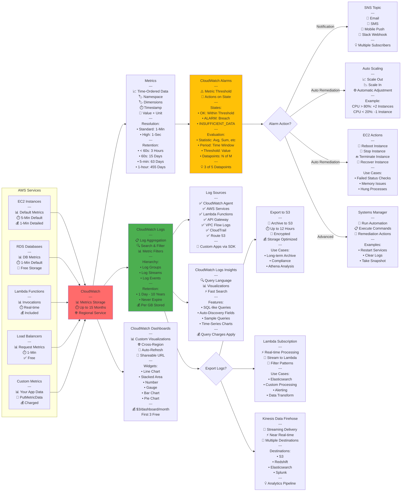

# AWS SAA-C03 - Security & Management Services Flow Diagrams

## IAM Identity and Access Management

```mermaid
flowchart TD
    Start([AWS Account]) --> Root[Root User<br/>---<br/>👑 Full Access<br/>📧 Email Login<br/>⚠️ Avoid Daily Use<br/>🔒 Enable MFA<br/>---<br/>Root-Only Tasks:<br/>• Close Account<br/>• Change Support Plan<br/>• Restore IAM Permissions<br/>• Change Account Settings<br/>---<br/>💡 Create Admin IAM User]
    
    Root --> CreateIAM[Create IAM Resources]
    
    CreateIAM --> IdentityType{Identity Type?}
    
    IdentityType --> |Individual Access<br/>Long-term Creds| Users[IAM Users<br/>---<br/>👤 Individual Identity<br/>🔑 Permanent Credentials<br/>🔐 Username + Password<br/>🔑 Access Keys Optional<br/>---<br/>Max: 5,000 Users/Account<br/>---<br/>Best Practices:<br/>✅ Unique User per Person<br/>✅ Enable MFA<br/>✅ Password Policy<br/>❌ Don't Share<br/>❌ Don't Embed Keys]
    
    IdentityType --> |Collection of Users<br/>Simplify Management| Groups[IAM Groups<br/>---<br/>👥 Collection of Users<br/>🎯 Assign Policies to Group<br/>📊 Users Inherit Permissions<br/>---<br/>Limitations:<br/>❌ No Nested Groups<br/>❌ No Default Group<br/>✅ User in Multiple Groups<br/>---<br/>Examples:<br/>• Developers<br/>• Admins<br/>• Testers<br/>• ReadOnly]
    
    IdentityType --> |AWS Services<br/>Temporary Creds| Roles[IAM Roles<br/>---<br/>🤖 For AWS Services<br/>⏱️ Temporary Credentials<br/>🔄 Assumable<br/>🔐 No Long-term Keys<br/>---<br/>Use Cases:<br/>• EC2 → S3 Access<br/>• Lambda → DynamoDB<br/>• Cross-Account Access<br/>• Federation SSO<br/>• Emergency Access<br/>---<br/>💡 Preferred over Keys]
    
    Users --> Authenticate{Authentication?}
    
    Authenticate --> |Console Access| Console[Console Password<br/>---<br/>🔐 Password Policy:<br/>• Min Length: 6-128<br/>• Require Uppercase<br/>• Require Lowercase<br/>• Require Numbers<br/>• Require Symbols<br/>• Password Expiry<br/>• Prevent Reuse<br/>---<br/>MFA Options:<br/>• Virtual MFA App<br/>• Hardware Token<br/>• U2F Security Key<br/>---<br/>💡 Enforce MFA]
    
    Authenticate --> |Programmatic<br/>API/CLI/SDK| AccessKeys[Access Keys<br/>---<br/>🔑 Access Key ID<br/>🔐 Secret Access Key<br/>---<br/>Limits:<br/>• Max 2 Keys per User<br/>• For Rotation<br/>---<br/>Best Practices:<br/>✅ Rotate Regularly<br/>✅ Delete Unused<br/>❌ Never Share<br/>❌ Never Commit to Git<br/>💡 Use Roles Instead]
    
    Console --> Authorization
    AccessKeys --> Authorization
    
    Roles --> AssumeRole[Assume Role<br/>---<br/>🎭 Temporary Credentials<br/>⏱️ 15 min - 12 hours<br/>🔄 Auto Rotate<br/>---<br/>Process:<br/>1️⃣ Call AssumeRole API<br/>2️⃣ Get Temp Credentials<br/>3️⃣ Use for AWS Calls<br/>4️⃣ Expire Automatically<br/>---<br/>Trust Policy:<br/>Define who can assume]
    
    AssumeRole --> Authorization
    
    Authorization[Authorization<br/>🎯 Policy Evaluation]
    
    Authorization --> Policies{Policy Types?}
    
    Policies --> |AWS Managed<br/>Pre-built| AWSManaged[AWS Managed Policies<br/>---<br/>✅ Created by AWS<br/>🔄 Updated by AWS<br/>📦 Common Use Cases<br/>---<br/>Examples:<br/>• AdministratorAccess<br/>• PowerUserAccess<br/>• ReadOnlyAccess<br/>• AmazonS3FullAccess<br/>• AmazonEC2ReadOnly<br/>---<br/>💡 Good Starting Point<br/>⚠️ May Be Too Permissive]
    
    Policies --> |Customer Managed<br/>Custom| CustomerManaged[Customer Managed Policies<br/>---<br/>🎯 Custom Permissions<br/>✏️ You Create & Maintain<br/>🔄 Version Control<br/>♻️ Reusable<br/>---<br/>Benefits:<br/>• Least Privilege<br/>• Specific to Needs<br/>• Audit Trail<br/>---<br/>Max Size: 6,144 chars<br/>💡 Recommended Approach]
    
    Policies --> |One-time Use<br/>Direct Attach| Inline[Inline Policies<br/>---<br/>🔗 Embedded in Identity<br/>1️⃣ One-to-One Relationship<br/>🗑️ Deleted with Identity<br/>---<br/>Use When:<br/>• Strict 1:1 Mapping<br/>• Never Reuse<br/>• Tight Coupling<br/>---<br/>❌ Not Recommended<br/>💡 Use Managed Instead]
    
    AWSManaged --> PolicyStructure
    CustomerManaged --> PolicyStructure
    Inline --> PolicyStructure
    
    PolicyStructure[Policy Structure JSON<br/>---<br/>Elements:<br/>• Version: "2012-10-17"<br/>• Statement: Array<br/>  ├─ Effect: Allow/Deny<br/>  ├─ Action: What<br/>  ├─ Resource: Where<br/>  └─ Condition: When<br/>---<br/>Example:<br/>"Effect": "Allow"<br/>"Action": "s3:GetObject"<br/>"Resource": "arn:aws:s3:::bucket/*"<br/>"Condition": "IpAddress"]
    
    PolicyStructure --> Evaluation[Policy Evaluation Logic<br/>---<br/>Decision Process:<br/>1️⃣ Default: DENY<br/>2️⃣ Explicit DENY? → DENY<br/>3️⃣ Explicit ALLOW? → ALLOW<br/>4️⃣ Implicit DENY → DENY<br/>---<br/>Order:<br/>🚫 Explicit Deny Wins Always<br/>✅ Allow if No Deny<br/>❌ Deny by Default<br/>---<br/>Policy Types Combined:<br/>• Identity-based<br/>• Resource-based<br/>• Permission Boundaries<br/>• SCPs Organizations<br/>• Session Policies]
    
    Groups --> AttachPolicy[Attach Policies to Group]
    AttachPolicy --> Users
    
    style Root fill:#FF6B6B
    style Roles fill:#4CAF50
    style CustomerManaged fill:#2196F3
```

## KMS Key Management Service

```mermaid
flowchart TD
    Start([Data Encryption Need]) --> KeyType{Key Type?}
    
    KeyType --> |AWS Managed<br/>Free| AWSManaged[AWS Managed Keys<br/>---<br/>🔑 aws/service-name<br/>🆓 No Cost<br/>🔄 Auto-Rotation 3 Years<br/>❌ Cannot Disable<br/>❌ Cannot Delete<br/>---<br/>Created When:<br/>• First encrypt in service<br/>• Per service, per region<br/>---<br/>Examples:<br/>• aws/s3<br/>• aws/ebs<br/>• aws/rds<br/>---<br/>💡 Easiest Option]
    
    KeyType --> |Customer Managed<br/>Full Control| CustomerManaged[Customer Managed Keys CMK<br/>---<br/>🎯 Full Control<br/>💰 $1/month per Key<br/>🔄 Manual/Auto Rotation<br/>✅ Enable/Disable<br/>🗑️ Schedule Deletion<br/>---<br/>Key Features:<br/>• Custom Key Policy<br/>• Audit with CloudTrail<br/>• Grant Management<br/>• Cross-Account Access<br/>---<br/>💡 Recommended for Control]
    
    KeyType --> |Imported<br/>Bring Your Own| BYOKey[Imported Keys<br/>---<br/>🔑 Your Key Material<br/>💰 $1/month per Key<br/>❌ No Auto-Rotation<br/>⚠️ Manual Rotation<br/>🗑️ Can Delete Material<br/>---<br/>Use Cases:<br/>• Regulatory Requirement<br/>• Existing Key Infrastructure<br/>• Compliance Needs<br/>---<br/>⚠️ Additional Complexity]
    
    CustomerManaged --> KeySpec{Key Spec?}
    
    KeySpec --> |Symmetric<br/>Default| Symmetric[Symmetric Keys AES-256<br/>---<br/>🔐 Single Key Encrypt/Decrypt<br/>🎯 256-bit Key<br/>⚡ Fast Performance<br/>✅ Default Choice<br/>---<br/>Never Leaves KMS:<br/>🔒 Cannot Export<br/>🔒 Cannot View<br/>🔒 API Calls Only<br/>---<br/>Supported Services:<br/>• All AWS Services<br/>• Envelope Encryption<br/>---<br/>💡 Recommended]
    
    KeySpec --> |Asymmetric<br/>Public/Private| Asymmetric[Asymmetric Keys RSA/ECC<br/>---<br/>🔑 Public Key Downloadable<br/>🔐 Private Key in KMS<br/>---<br/>Use Cases:<br/>• Digital Signatures<br/>• Encryption Outside AWS<br/>• Public Key Distribution<br/>---<br/>Key Specs:<br/>• RSA 2048/3072/4096<br/>• ECC NIST P-256/384/521<br/>---<br/>💡 Specific Use Cases Only]
    
    Symmetric --> Operations[KMS Operations<br/>---<br/>Encryption:<br/>• Encrypt: Up to 4 KB<br/>• Decrypt: Encrypted data<br/>• ReEncrypt: New CMK<br/>• GenerateDataKey: Envelope<br/>---<br/>Key Management:<br/>• CreateKey<br/>• EnableKey/DisableKey<br/>• ScheduleKeyDeletion<br/>• DescribeKey<br/>---<br/>Access Control:<br/>• Key Policies Required<br/>• IAM Policies Optional<br/>• Grants Programmatic]
    
    Asymmetric --> Operations
    
    Operations --> Limits[KMS Limits<br/>---<br/>API Quotas Shared:<br/>📊 Symmetric:<br/>  5,500/sec - 10,000/sec<br/>  Varies by Region<br/>---<br/>📊 Asymmetric RSA:<br/>  500/sec Decrypt/Sign<br/>---<br/>📊 Asymmetric ECC:<br/>  300/sec Sign<br/>  500/sec Verify<br/>---<br/>⚠️ Throttling if Exceeded<br/>💡 Use Data Key Caching<br/>💡 Request Quota Increase]
    
    Operations --> EnvelopeEnc[Envelope Encryption<br/>---<br/>🎯 Best Practice Pattern<br/>---<br/>Process:<br/>1️⃣ GenerateDataKey API<br/>   └─ Returns:<br/>      • Plaintext Data Key<br/>      • Encrypted Data Key<br/>---<br/>2️⃣ Encrypt Data Locally<br/>   └─ Use Plaintext Key<br/>   └─ Delete Plaintext Key<br/>---<br/>3️⃣ Store Together<br/>   └─ Encrypted Data<br/>   └─ Encrypted Data Key<br/>---<br/>Decrypt Process:<br/>1️⃣ KMS Decrypt Data Key<br/>2️⃣ Decrypt Data Locally<br/>3️⃣ Delete Plaintext Key<br/>---<br/>Benefits:<br/>✅ Encrypt Large Data<br/>✅ No KMS Size Limit<br/>✅ Better Performance<br/>✅ Network Efficiency]
    
    EnvelopeEnc --> KeyPolicy[Key Policies<br/>---<br/>🔒 Primary Access Control<br/>📋 Required for All Keys<br/>---<br/>Default Policy:<br/>✅ Root account full access<br/>✅ IAM policies can add<br/>---<br/>Custom Policy Elements:<br/>• Principal: Who<br/>• Action: What<br/>• Resource: "*" CMK<br/>• Condition: When<br/>---<br/>Cross-Account:<br/>1️⃣ Allow in Key Policy<br/>2️⃣ IAM Policy in Other Acct<br/>---<br/>💡 Least Privilege]
    
    KeyPolicy --> Rotation[Key Rotation<br/>---<br/>Automatic Rotation:<br/>🔄 Every 365 Days<br/>🔑 New Backing Key<br/>🎯 Same CMK ID<br/>✅ Old Keys Retained<br/>💡 Enable for All<br/>---<br/>Manual Rotation:<br/>🔄 Your Schedule<br/>🔑 New CMK<br/>🔄 Update Aliases<br/>⚠️ Application Changes<br/>---<br/>Imported Keys:<br/>❌ No Auto-Rotation<br/>🔄 Manual Only<br/>⚠️ Your Responsibility]
    
    Rotation --> MultiRegion{Multi-Region<br/>Keys?}
    
    MultiRegion --> |Yes<br/>Global Apps| MRK[Multi-Region Keys<br/>---<br/>🌍 Same Key ID<br/>🔑 Same Key Material<br/>🌐 Multiple Regions<br/>---<br/>Primary + Replicas:<br/>• 1 Primary Region<br/>• N Replica Regions<br/>---<br/>Use Cases:<br/>• Global Applications<br/>• Disaster Recovery<br/>• Data Migration<br/>• Multi-Region Encryption<br/>---<br/>⚠️ Same Policy Across<br/>💡 Simplifies DR]
    
    MultiRegion --> |No<br/>Single Region| SingleRegion[Single-Region Keys<br/>---<br/>📍 One Region Only<br/>💡 Default & Recommended<br/>✅ Lower Complexity<br/>---<br/>For Cross-Region:<br/>• Copy Encrypted Data<br/>• ReEncrypt in Target<br/>• Different CMK<br/>---<br/>💡 Most Use Cases]
    
    style AWSManaged fill:#4CAF50
    style Symmetric fill:#2196F3
    style EnvelopeEnc fill:#FF6B6B
```

## CloudWatch Monitoring Architecture



## CloudTrail Audit Logging

```mermaid
flowchart TD
    Start([AWS API Call]) --> CT[CloudTrail<br/>---<br/>📋 Audit Logging Service<br/>🔍 Governance & Compliance<br/>🕵️ Security Analysis<br/>📊 Operational Troubleshooting]
    
    CT --> TrailType{Trail Type?}
    
    TrailType --> |Single Region<br/>Default| SingleRegion[Single Region Trail<br/>---<br/>📍 One Region Only<br/>💰 Lower Cost<br/>📊 Regional Events<br/>---<br/>Limitations:<br/>❌ No Global Services<br/>❌ Region-Specific<br/>---<br/>💡 Testing/Dev Only]
    
    TrailType --> |All Regions<br/>Recommended| AllRegions[Multi-Region Trail<br/>---<br/>🌍 All Current + Future<br/>✅ Global Services<br/>📊 Comprehensive Audit<br/>💰 Single Trail Cost<br/>---<br/>Includes:<br/>• IAM Events<br/>• Route 53 Events<br/>• CloudFront Events<br/>---<br/>💡 Production Standard]
    
    TrailType --> |Across Accounts<br/>Enterprise| Organization[Organization Trail<br/>---<br/>🏢 Master Account Creates<br/>👥 All Member Accounts<br/>📊 Centralized Logging<br/>🔐 Central Security Team<br/>---<br/>Benefits:<br/>• Single Pane of Glass<br/>• Compliance<br/>• Cost Efficient<br/>---<br/>💡 Enterprise Governance]
    
    AllRegions --> EventType{Event Types?}
    
    EventType --> |API Activity<br/>Default| Management[Management Events<br/>---<br/>🎯 Control Plane Operations<br/>✅ Free First Copy<br/>---<br/>Examples:<br/>• CreateBucket<br/>• TerminateInstances<br/>• CreateUser<br/>• PutBucketPolicy<br/>• CreateVpc<br/>---<br/>Read/Write Split:<br/>• Read Events Free<br/>• Write Events Free 1st Copy<br/>---<br/>💡 Always Enable]
    
    EventType --> |Object Level<br/>Optional| Data[Data Events<br/>---<br/>🗂️ Data Plane Operations<br/>💰 Additional Charges<br/>📊 High Volume<br/>---<br/>S3 Examples:<br/>• GetObject<br/>• PutObject<br/>• DeleteObject<br/>---<br/>Lambda Examples:<br/>• Invoke Function<br/>---<br/>💰 $0.10 per 100,000 events<br/>💡 Enable for Critical Buckets]
    
    EventType --> |AWS Services<br/>Extended| Insights[CloudTrail Insights<br/>---<br/>🤖 ML-Powered<br/>🔍 Anomaly Detection<br/>⚠️ Unusual Activity<br/>💰 Additional Cost<br/>---<br/>Detects:<br/>• Unusual API Call Rate<br/>• Error Rate Spikes<br/>• Service Limit Breaches<br/>• IAM Actions<br/>---<br/>Analysis:<br/>• Baseline Normal<br/>• Alert on Deviation<br/>---<br/>💡 Security Monitoring]
    
    Management --> Delivery
    Data --> Delivery
    Insights --> Delivery
    
    Delivery[Log Delivery<br/>---<br/>⏱️ 15 Minutes Typical<br/>📦 JSON Format<br/>🔐 Optional Encryption<br/>✅ Log File Validation]
    
    Delivery --> Destination{Destination?}
    
    Destination --> S3Dest[S3 Bucket<br/>---<br/>💾 Primary Destination<br/>📁 Organized by Date<br/>🔐 SSE-S3 or SSE-KMS<br/>---<br/>Structure:<br/>AWSLogs/<br/>  AccountId/<br/>    CloudTrail/<br/>      Region/<br/>        YYYY/MM/DD/<br/>---<br/>💰 S3 Storage Costs<br/>💡 Enable Versioning<br/>💡 Set Lifecycle Rules]
    
    Destination --> CWLogs[CloudWatch Logs<br/>---<br/>⚡ Real-time Monitoring<br/>🔍 Search & Filter<br/>📊 Metric Filters<br/>⚠️ Alarms<br/>---<br/>Use Cases:<br/>• Real-time Alerts<br/>• Security Monitoring<br/>• Compliance Checks<br/>---<br/>💰 CW Logs Charges<br/>💡 Filter Critical Events]
    
    Destination --> EventBridge[EventBridge<br/>---<br/>⚡ Event-Driven<br/>🎯 Rule-Based Actions<br/>🔄 Automated Response<br/>---<br/>Actions:<br/>• Lambda Function<br/>• SNS Notification<br/>• Step Functions<br/>• Systems Manager<br/>---<br/>💡 Automated Remediation]
    
    S3Dest --> Analysis[Log Analysis<br/>---<br/>Tools:<br/>1️⃣ Athena<br/>   └─ SQL Queries<br/>   └─ Serverless<br/>---<br/>2️⃣ CloudWatch Insights<br/>   └─ Real-time Search<br/>---<br/>3️⃣ Third-Party SIEM<br/>   └─ Splunk<br/>   └─ Elasticsearch<br/>---<br/>💡 Use Athena for Ad-hoc]
    
    Analysis --> UseCases[CloudTrail Use Cases<br/>---<br/>🔒 Security:<br/>• Unauthorized Access<br/>• Failed Login Attempts<br/>• Policy Changes<br/>• Resource Deletions<br/>---<br/>📊 Compliance:<br/>• Audit Trail<br/>• Regulatory Requirements<br/>• Change Tracking<br/>---<br/>🔍 Troubleshooting:<br/>• Who Made Change?<br/>• When Did It Occur?<br/>• What Was Changed?<br/>---<br/>💡 Enable on Day 1]
    
    style AllRegions fill:#4CAF50
    style Management fill:#2196F3
    style Data fill:#FFC107
    style Insights fill:#9C27B0
```



## AWS Config Compliance Monitoring

```mermaid
flowchart TD
    Start([AWS Config]) --> Enable[Enable AWS Config<br/>---<br/>📊 Resource Inventory<br/>📜 Configuration History<br/>✅ Compliance Rules<br/>⚡ Change Notifications<br/>---<br/>💰 Pricing:<br/>• $0.003 per item recorded<br/>• $0.001 per rule evaluation<br/>• S3 & SNS charges]
    
    Enable --> Resources{What to Record?}
    
    Resources --> |All Resources<br/>Recommended| AllResources[Record All Resources<br/>---<br/>✅ Current Resources<br/>✅ Future Resource Types<br/>🌍 Regional + Global<br/>---<br/>Includes:<br/>• All Supported Services<br/>• Auto-add New Types<br/>---<br/>💡 Comprehensive Coverage<br/>✅ Best Practice]
    
    Resources --> |Specific Resources<br/>Cost Optimization| Specific[Record Specific Resources<br/>---<br/>🎯 Choose Resource Types<br/>💰 Lower Cost<br/>📊 Focused Monitoring<br/>---<br/>Examples:<br/>• EC2 Instances Only<br/>• S3 Buckets Only<br/>• Security Groups<br/>---<br/>⚠️ May Miss Resources<br/>💡 Production: Use All]
    
    AllResources --> Snapshot[Configuration Items CI<br/>---<br/>📸 Point-in-Time Snapshot<br/>⏱️ Recorded on Change<br/>📋 JSON Document<br/>---<br/>Contains:<br/>• Resource Type<br/>• Resource ID<br/>• Configuration<br/>• Relationships<br/>• Metadata<br/>• Tags<br/>---<br/>Stored in S3]
    
    Specific --> Snapshot
    
    Snapshot --> Timeline[Configuration Timeline<br/>---<br/>📅 Historical View<br/>🔍 Track Changes<br/>📊 Relationships<br/>---<br/>View:<br/>• Current Configuration<br/>• Configuration History<br/>• Related Resources<br/>• CloudTrail Events<br/>• Compliance Status<br/>---<br/>💡 Audit & Troubleshooting]
    
    Timeline --> Rules{Config Rules?}
    
    Rules --> |AWS Managed<br/>Pre-built| ManagedRules[AWS Managed Rules<br/>---<br/>✅ 200+ Pre-built Rules<br/>🔄 Updated by AWS<br/>💡 Best Practices<br/>---<br/>Categories:<br/>• Security<br/>• Operational Excellence<br/>• Cost Optimization<br/>• Reliability<br/>---<br/>Examples:<br/>• encrypted-volumes<br/>• s3-bucket-public-read<br/>• iam-password-policy<br/>• rds-multi-az-support<br/>---<br/>💡 Start Here]
    
    Rules --> |Custom<br/>Lambda-based| CustomRules[Custom Config Rules<br/>---<br/>🎯 Your Requirements<br/>🔧 Lambda Function<br/>📝 Custom Logic<br/>---<br/>Evaluation Triggers:<br/>• Configuration Change<br/>• Periodic Schedule<br/>---<br/>Return:<br/>• COMPLIANT<br/>• NON_COMPLIANT<br/>• NOT_APPLICABLE<br/>---<br/>💡 Specific Needs]
    
    Rules --> |Pre-packaged<br/>Solutions| Conformance[Conformance Packs<br/>---<br/>📦 Collection of Rules<br/>🎯 Compliance Framework<br/>📋 YAML Template<br/>---<br/>Examples:<br/>• PCI-DSS<br/>• HIPAA<br/>• CIS Benchmarks<br/>• AWS Best Practices<br/>---<br/>Deploy:<br/>• Account Level<br/>• Organization Level<br/>---<br/>💡 Compliance Automation]
    
    ManagedRules --> Evaluation
    CustomRules --> Evaluation
    Conformance --> Evaluation
    
    Evaluation[Rule Evaluation<br/>---<br/>⚙️ Triggers:<br/>1️⃣ Configuration Change<br/>2️⃣ Periodic 1/3/6/12/24 hrs<br/>---<br/>Process:<br/>1️⃣ Detect Change<br/>2️⃣ Evaluate Against Rules<br/>3️⃣ Determine Compliance<br/>4️⃣ Record Result<br/>5️⃣ Notify if Non-Compliant<br/>---<br/>Results:<br/>✅ COMPLIANT<br/>❌ NON_COMPLIANT<br/>⚠️ INSUFFICIENT_DATA]
    
    Evaluation --> Remediation{Auto-Remediation?}
    
    Remediation --> |Manual<br/>Review & Fix| Manual[Manual Remediation<br/>---<br/>👤 Human Review<br/>🔍 Investigation<br/>✏️ Manual Fix<br/>---<br/>Process:<br/>1️⃣ Receive Notification<br/>2️⃣ Review Non-Compliance<br/>3️⃣ Determine Action<br/>4️⃣ Apply Fix<br/>5️⃣ Re-evaluate<br/>---<br/>💡 Complex Changes]
    
    Remediation --> |Automatic<br/>SSM Automation| Auto[Automatic Remediation<br/>---<br/>🤖 Auto-Fix on Detection<br/>⚡ Systems Manager Automation<br/>🔄 Immediate Action<br/>---<br/>Examples:<br/>• Stop Non-Compliant EC2<br/>• Enable Encryption<br/>• Remove Public Access<br/>• Apply Security Group<br/>---<br/>Configuration:<br/>• Retry Attempts<br/>• Auto-Remediation Delay<br/>---<br/>💡 Operational Efficiency]
    
    Manual --> Dashboard
    Auto --> Dashboard
    
    Dashboard[Config Dashboard<br/>---<br/>📊 Compliance Summary<br/>📈 Resource Inventory<br/>🎯 Rule Compliance<br/>---<br/>Views:<br/>• Compliance by Resource<br/>• Compliance by Rule<br/>• Resource Timeline<br/>• Configuration History<br/>---<br/>Export:<br/>• S3 Bucket<br/>• Athena Queries<br/>• QuickSight Dashboards]
    
    Dashboard --> Aggregator[Config Aggregator<br/>---<br/>🏢 Multi-Account View<br/>🌍 Multi-Region View<br/>📊 Centralized Compliance<br/>---<br/>Use Cases:<br/>• Organization-wide View<br/>• Security Team Dashboard<br/>• Compliance Reporting<br/>---<br/>Setup:<br/>1️⃣ Create Aggregator<br/>2️⃣ Add Accounts/Regions<br/>3️⃣ Authorize Access<br/>4️⃣ View Aggregated Data<br/>---<br/>💡 Enterprise Governance]
    
    style AllResources fill:#4CAF50
    style ManagedRules fill:#2196F3
    style Auto fill:#FF6B6B
    style Aggregator fill:#9C27B0
```


