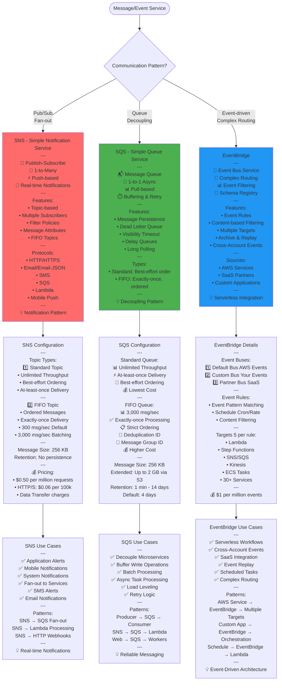
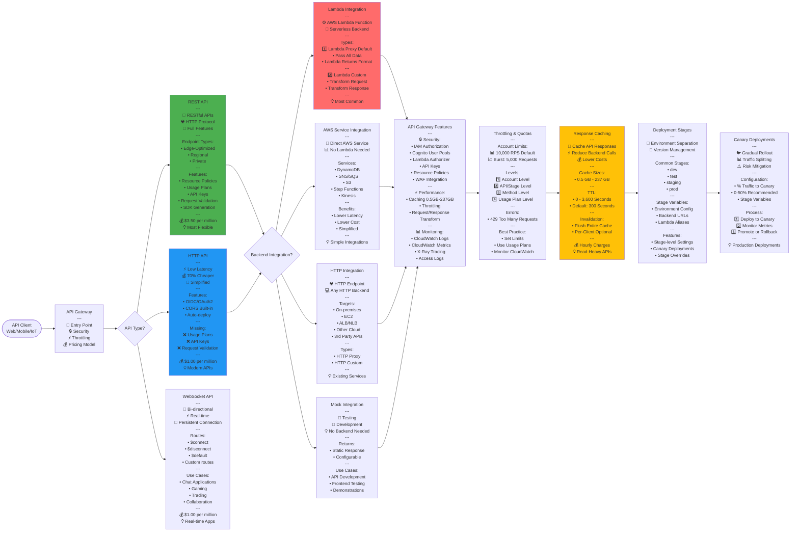
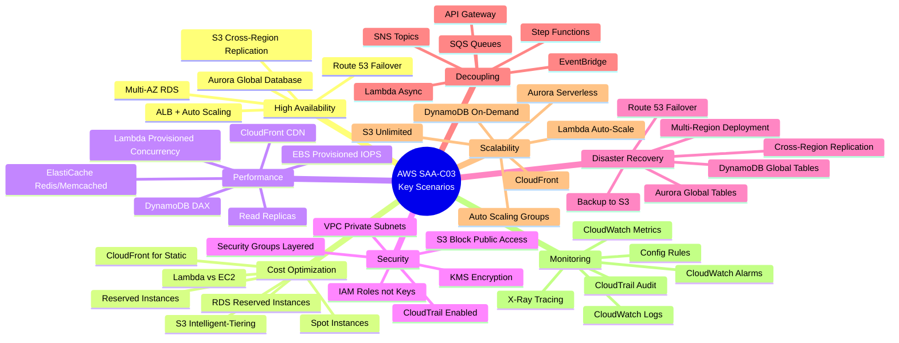

# AWS SAA-C03 - Messaging & Additional Services Flow Diagrams

## SNS vs SQS vs EventBridge Decision



## SQS Queue Configuration Deep Dive

```mermaid
flowchart TD
    Start([Create SQS Queue]) --> QueueType{Queue Type?}
    
    QueueType --> |Unordered<br/>High Throughput| Standard[Standard Queue<br/>---<br/>⚡ Unlimited Throughput<br/>📊 At-least-once Delivery<br/>🔄 Best-effort Ordering<br/>💡 May have Duplicates<br/>---<br/>Performance:<br/>• Nearly Unlimited TPS<br/>• Low Latency <10ms<br/>---<br/>💰 Most Cost-Effective<br/>💡 Default Choice]
    
    QueueType --> |Ordered<br/>Exactly-once| FIFO[FIFO Queue<br/>---<br/>📋 Strict Ordering<br/>✅ Exactly-once Processing<br/>🎯 Message Grouping<br/>🔑 Deduplication<br/>---<br/>Performance:<br/>• 300 msgs/sec Default<br/>• 3,000 msgs/sec Batching<br/>---<br/>Name: Must end with .fifo<br/>💰 Higher Cost<br/>💡 Critical Ordering]
    
    Standard --> Settings
    FIFO --> Settings
    
    Settings[Queue Settings<br/>---<br/>📊 Message Retention:<br/>• Default: 4 Days<br/>• Min: 1 Minute<br/>• Max: 14 Days<br/>---<br/>📏 Message Size:<br/>• Max: 256 KB<br/>• Extended via S3: 2 GB<br/>---<br/>⏱️ Visibility Timeout:<br/>• Default: 30 Seconds<br/>• Max: 12 Hours<br/>---<br/>⏳ Delivery Delay:<br/>• 0 - 15 Minutes<br/>• Per Queue or Message]
    
    Settings --> VisibilityTimeout[Visibility Timeout<br/>---<br/>🎯 Hide During Processing<br/>⏱️ Consumer Processing Time<br/>🔄 Reappear if Not Deleted<br/>---<br/>Process:<br/>1️⃣ Consumer Receives Message<br/>2️⃣ Message Hidden Timeout<br/>3️⃣ Consumer Processes<br/>4️⃣ Consumer Deletes<br/>---<br/>If Not Deleted:<br/>⏱️ After Timeout Expires<br/>🔄 Visible Again<br/>📊 Receive Count Increments<br/>---<br/>Best Practice:<br/>Set > Max Processing Time<br/>Use ChangeMessageVisibility]
    
    VisibilityTimeout --> Polling{Polling Method?}
    
    Polling --> |Default<br/>Immediate| ShortPoll[Short Polling<br/>---<br/>⚡ Returns Immediately<br/>📊 Samples Subset of Servers<br/>💡 Empty Response Possible<br/>---<br/>WaitTimeSeconds: 0<br/>---<br/>Characteristics:<br/>• More API Calls<br/>• Higher Cost<br/>• May Miss Messages<br/>• Lower Latency<br/>---<br/>❌ Not Recommended<br/>💡 Use Long Polling]
    
    Polling --> |Recommended<br/>Wait for Messages| LongPoll[Long Polling<br/>---<br/>⏱️ Wait for Messages<br/>📊 Queries All Servers<br/>💰 Reduces API Calls<br/>✅ Fewer Empty Responses<br/>---<br/>WaitTimeSeconds: 1-20<br/>Recommended: 20<br/>---<br/>Benefits:<br/>• Lower Cost<br/>• Reduced Empty Responses<br/>• Better for Consumers<br/>---<br/>✅ Best Practice<br/>💡 Always Enable]
    
    ShortPoll --> DLQ
    LongPoll --> DLQ
    
    DLQ[Dead Letter Queue DLQ<br/>---<br/>⚰️ Failed Message Handling<br/>🔄 After Max Receives<br/>📊 Troubleshooting Aid<br/>---<br/>Configuration:<br/>• Source Queue<br/>• DLQ Target<br/>• maxReceiveCount: 1-1000<br/>---<br/>Process:<br/>1️⃣ Message Fails Processing<br/>2️⃣ Receive Count Increments<br/>3️⃣ Exceeds maxReceiveCount<br/>4️⃣ Moved to DLQ<br/>---<br/>DLQ Retention:<br/>Same as Source<br/>---<br/>💡 Essential for Production]
    
    DLQ --> Redrive[Redrive Policy<br/>---<br/>🔄 Move Back from DLQ<br/>🔧 After Issue Fixed<br/>---<br/>Redrive Options:<br/>1️⃣ Redrive to Source<br/>2️⃣ Redrive to Custom Queue<br/>---<br/>Use Cases:<br/>• Bug Fixed<br/>• Service Restored<br/>• Reprocess Messages<br/>---<br/>Console Feature:<br/>Redrive Messages Button]
    
    Redrive --> DelayQueue[Delay Queues<br/>---<br/>⏳ Postpone Delivery<br/>⏱️ 0 - 15 Minutes<br/>---<br/>Levels:<br/>1️⃣ Queue-level Default<br/>2️⃣ Message-level Override<br/>---<br/>Use Cases:<br/>• Rate Limiting<br/>• Time-based Processing<br/>• Staged Workflows<br/>---<br/>Example:<br/>Order → 5 min delay → Process]
    
    DelayQueue --> MessageAttributes[Message Attributes<br/>---<br/>🏷️ Metadata Key-Value<br/>📊 Up to 10 Attributes<br/>💡 Filter & Route<br/>---<br/>Types:<br/>• String<br/>• Number<br/>• Binary<br/>---<br/>Use Cases:<br/>• Message Filtering<br/>• Routing Logic<br/>• Processing Hints<br/>• Priority Handling<br/>---<br/>Not Counted in Size]
    
    MessageAttributes --> Security[Security Features<br/>---<br/>🔐 Encryption at Rest:<br/>• SSE-SQS AWS Managed<br/>• SSE-KMS Customer Key<br/>---<br/>🔐 Encryption in Transit:<br/>• HTTPS Endpoints<br/>---<br/>🛡️ Access Control:<br/>• IAM Policies<br/>• SQS Access Policies<br/>• VPC Endpoints<br/>---<br/>📋 CloudTrail Logging:<br/>• API Call Audit<br/>---<br/>💡 Enable for Production]
    
    Security --> Monitoring[SQS Monitoring<br/>---<br/>📊 CloudWatch Metrics:<br/>• ApproximateNumberOfMessages<br/>• ApproximateAgeOfOldestMessage<br/>• NumberOfMessagesSent<br/>• NumberOfMessagesReceived<br/>• NumberOfMessagesDeleted<br/>• NumberOfEmptyReceives<br/>---<br/>⚠️ Alarms:<br/>• Queue Depth High<br/>• Old Messages Stuck<br/>• Consumer Lag<br/>---<br/>💡 Monitor Queue Health]
    
    style Standard fill:#4CAF50
    style FIFO fill:#FF6B6B
    style LongPoll fill:#2196F3
    style DLQ fill:#FFC107
```



## Step Functions State Machine

```mermaid
flowchart TD
    Start([Start Execution]) --> StateMachine[AWS Step Functions<br/>---<br/>🔄 Orchestration Service<br/>📊 Visual Workflow<br/>🎯 Serverless Coordination<br/>---<br/>Types:<br/>1️⃣ Standard Workflows<br/>2️⃣ Express Workflows]
    
    StateMachine --> WorkflowType{Workflow Type?}
    
    WorkflowType --> |Long-running<br/>Exactly-once| StandardWF[Standard Workflows<br/>---<br/>⏱️ Max Duration: 1 Year<br/>✅ Exactly-once Execution<br/>📊 Full Execution History<br/>💾 Audit Trail<br/>---<br/>Features:<br/>• Visual Debugging<br/>• Step-by-step Execution<br/>• Automatic Retries<br/>• Error Handling<br/>---<br/>💰 Pricing:<br/>$0.025 per 1,000 transitions<br/>---<br/>💡 Long-running Processes]
    
    WorkflowType --> |High-volume<br/>At-least-once| ExpressWF[Express Workflows<br/>---<br/>⏱️ Max Duration: 5 Minutes<br/>📊 At-least-once Execution<br/>⚡ High Throughput<br/>💰 Low Cost<br/>---<br/>Sub-types:<br/>• Synchronous: Wait for result<br/>• Asynchronous: Fire & forget<br/>---<br/>💰 Pricing:<br/>$1 per 1M executions<br/>$0.00001667 per GB-second<br/>---<br/>💡 IoT, Streaming, Mobile]
    
    StandardWF --> States
    ExpressWF --> States
    
    States[State Types<br/>---<br/>Available States:]
    
    States --> Task[Task State<br/>---<br/>⚙️ Do Work<br/>🎯 Single Unit<br/>---<br/>Integrations:<br/>• Lambda Function<br/>• ECS/Fargate Task<br/>• Batch Job<br/>• SNS/SQS<br/>• DynamoDB<br/>• Glue Job<br/>• SageMaker<br/>• Step Functions Nested<br/>---<br/>💡 Most Common State]
    
    States --> Choice[Choice State<br/>---<br/>🔀 Conditional Logic<br/>📊 Branch Execution<br/>---<br/>Operators:<br/>• StringEquals<br/>• NumericGreaterThan<br/>• BooleanEquals<br/>• TimestampEquals<br/>• And/Or/Not<br/>---<br/>Example:<br/>If status == "approved"<br/>  → ProcessOrder<br/>Else<br/>  → RejectOrder]
    
    States --> Parallel[Parallel State<br/>---<br/>⚡ Concurrent Execution<br/>🔄 Multiple Branches<br/>⏱️ Wait for All<br/>---<br/>Use Cases:<br/>• Independent Tasks<br/>• Fan-out Processing<br/>• Parallel API Calls<br/>---<br/>Example:<br/>Process Order:<br/>├─ Update Inventory<br/>├─ Charge Payment<br/>└─ Send Notification]
    
    States --> Wait[Wait State<br/>---<br/>⏱️ Delay Execution<br/>---<br/>Wait Types:<br/>1️⃣ Seconds: Fixed Duration<br/>2️⃣ Timestamp: Until Time<br/>3️⃣ SecondsPath: Dynamic<br/>4️⃣ TimestampPath: Dynamic<br/>---<br/>Use Cases:<br/>• Rate Limiting<br/>• Polling Intervals<br/>• Scheduled Actions]
    
    States --> Succeed[Succeed State<br/>---<br/>✅ Successful Termination<br/>🎯 End Execution<br/>💡 Explicit Success]
    
    States --> Fail[Fail State<br/>---<br/>❌ Failed Termination<br/>⚠️ Error & Cause<br/>💡 Explicit Failure]
    
    States --> Pass[Pass State<br/>---<br/>📊 Transform Data<br/>🔄 Pass Through<br/>💡 Testing & Debugging]
    
    States --> Map[Map State<br/>---<br/>🔄 Iterate Over Items<br/>📊 Process Array<br/>⚡ Parallel Processing<br/>---<br/>Configuration:<br/>• MaxConcurrency<br/>• Iterator Definition<br/>---<br/>Example:<br/>For each item in orders:<br/>  ProcessOrder item]
    
    Task --> ErrorHandling[Error Handling<br/>---<br/>🔄 Retry Configuration:<br/>• ErrorEquals: Error Types<br/>• IntervalSeconds: Delay<br/>• MaxAttempts: Retry Count<br/>• BackoffRate: Multiplier<br/>---<br/>⚠️ Catch Configuration:<br/>• ErrorEquals: Error Types<br/>• Next: Fallback State<br/>• ResultPath: Error Info<br/>---<br/>Error Types:<br/>• States.ALL<br/>• States.Timeout<br/>• States.TaskFailed<br/>• Custom Errors]
    
    ErrorHandling --> Integration[Service Integrations<br/>---<br/>Integration Patterns:<br/>---<br/>1️⃣ Request-Response Default<br/>   • Call & Continue<br/>   • Async Processing<br/>---<br/>2️⃣ Run Job .sync<br/>   • Wait for Completion<br/>   • Sync Processing<br/>---<br/>3️⃣ Wait for Callback .waitForTaskToken<br/>   • Pause Until Callback<br/>   • Human Approval<br/>   • External System]
    
    Integration --> UseCases[Step Functions Use Cases<br/>---<br/>✅ Order Processing:<br/>├─ Validate Order<br/>├─ Check Inventory<br/>├─ Process Payment<br/>├─ Ship Order<br/>└─ Send Confirmation<br/>---<br/>✅ Data Processing:<br/>├─ Extract from S3<br/>├─ Transform with Lambda<br/>├─ Load to Database<br/>└─ Send Report<br/>---<br/>✅ Human Approval:<br/>├─ Submit Request<br/>├─ Wait for Approval<br/>├─ Process if Approved<br/>└─ Notify Result<br/>---<br/>💡 Complex Workflows]
    
    style StandardWF fill:#4CAF50
    style ExpressWF fill:#FF6B6B
    style Task fill:#2196F3
    style Parallel fill:#9C27B0
```

## API Gateway Architecture



## Exam Scenarios Summary



## Common Architecture Patterns

```mermaid
flowchart TB
    subgraph Pattern1 [Three-Tier Web App]
        User1([Users]) --> CF1[CloudFront]
        CF1 --> ALB1[Application<br/>Load Balancer]
        ALB1 --> ASG1[Auto Scaling<br/>Group]
        ASG1 --> RDS1[(RDS Multi-AZ<br/>Primary + Standby)]
        ASG1 --> ElastiCache1[(ElastiCache<br/>Session Store)]
        S3_1[S3 Bucket<br/>Static Assets] --> CF1
    end
    
    subgraph Pattern2 [Serverless App]
        User2([Users]) --> CF2[CloudFront]
        CF2 --> S3_2[S3 Static<br/>Website]
        S3_2 --> APIGW[API Gateway]
        APIGW --> Lambda[Lambda<br/>Functions]
        Lambda --> DDB[(DynamoDB<br/>Tables)]
        Lambda --> S3_3[S3<br/>Data Storage]
    end
    
    subgraph Pattern3 [Event-Driven]
        Source[Event Source<br/>S3, DynamoDB] --> EventBridge[EventBridge<br/>Event Bus]
        EventBridge --> Lambda3[Lambda<br/>Processing]
        EventBridge --> SQS3[SQS<br/>Queue]
        EventBridge --> SNS3[SNS<br/>Notifications]
        SQS3 --> EC2_3[EC2<br/>Workers]
        Lambda3 --> DDB3[(DynamoDB)]
    end
    
    subgraph Pattern4 [Data Processing]
        S3Source[S3<br/>Data Lake] --> Glue[AWS Glue<br/>ETL]
        Glue --> S3Processed[S3<br/>Processed Data]
        S3Processed --> Athena[Athena<br/>SQL Queries]
        S3Processed --> Redshift[(Redshift<br/>Data Warehouse)]
        Athena --> QuickSight[QuickSight<br/>BI Dashboards]
        Redshift --> QuickSight
    end
    
    style Pattern1 fill:#e1f5e1
    style Pattern2 fill:#e1e5f5
    style Pattern3 fill:#f5e1e1
    style Pattern4 fill:#f5f5e1
```


