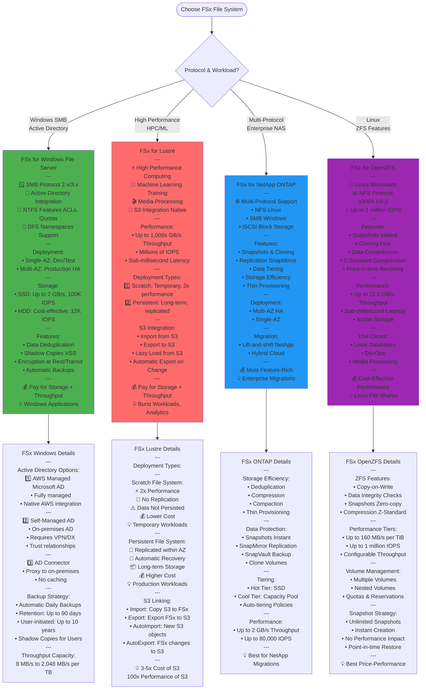
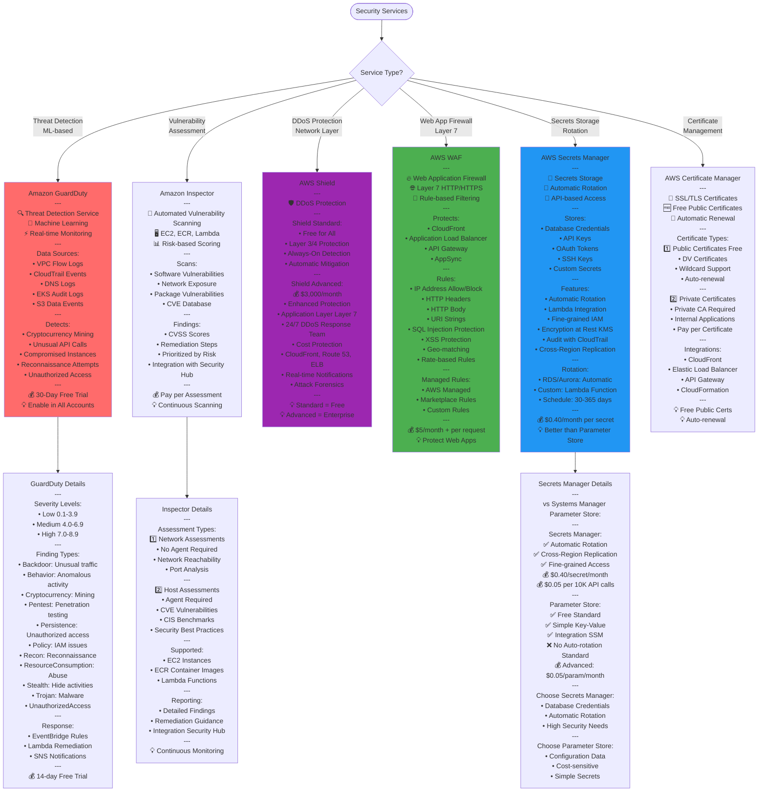
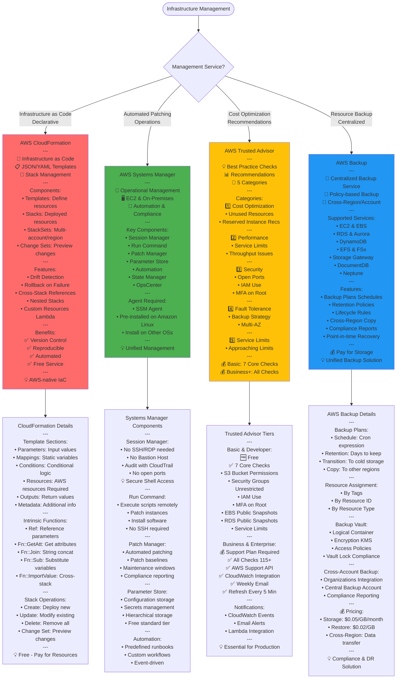

# AWS SAA-C03 - Additional Services Flow Diagrams

## FSx File Systems Decision Tree



## Cognito Authentication & Authorization

```mermaid
flowchart TD
    Start([User Authentication Need]) --> CognitoType{Cognito Component?}
    
    CognitoType --> |User Directory<br/>Authentication| UserPools[Cognito User Pools<br/>---<br/>👤 User Directory Service<br/>🔐 Sign-up & Sign-in<br/>🎯 Authentication Only<br/>---<br/>Authentication Methods:<br/>• Username/Password<br/>• Email/Phone + Password<br/>• Social Providers<br/>• SAML/OIDC Federation<br/>• Multi-Factor Auth MFA<br/>---<br/>Features:<br/>• User Management<br/>• Password Policies<br/>• Account Recovery<br/>• Email/SMS Verification<br/>• Lambda Triggers<br/>---<br/>💡 "Who are you?"]
    
    CognitoType --> |AWS Credentials<br/>Authorization| IdentityPools[Cognito Identity Pools<br/>Federated Identities<br/>---<br/>🎫 Temporary AWS Credentials<br/>🔑 IAM Role Assumption<br/>🎯 Authorization for AWS<br/>---<br/>Identity Providers:<br/>• Cognito User Pools<br/>• Social Facebook, Google<br/>• SAML<br/>• OpenID Connect<br/>• Guest Unauthenticated<br/>---<br/>Returns:<br/>• Access Key ID<br/>• Secret Access Key<br/>• Session Token<br/>• Expiration<br/>---<br/>💡 "What can you access?"]
    
    UserPools --> UserPoolsFeatures[User Pool Features<br/>---<br/>Tokens Issued JWT:<br/>1️⃣ ID Token<br/>   • User Identity Info<br/>   • User Attributes<br/>   • Valid: 1 hour default<br/>---<br/>2️⃣ Access Token<br/>   • Authorization to Resources<br/>   • Contains Scopes<br/>   • Valid: 1 hour default<br/>---<br/>3️⃣ Refresh Token<br/>   • Get New Tokens<br/>   • Valid: 30 days default<br/>   • Max: 10 years<br/>---<br/>MFA Options:<br/>• SMS Text Message<br/>• TOTP Time-based<br/>• Software Token Apps<br/>---<br/>Advanced Security:<br/>• Adaptive Authentication<br/>• Compromised Credentials<br/>• Risk-based Auth]
    
    IdentityPools --> IdentityPoolsFeatures[Identity Pool Features<br/>---<br/>IAM Roles:<br/>• Authenticated Role<br/>• Unauthenticated Role<br/>• Role-based Access<br/>---<br/>Access Control:<br/>• Fine-grained AWS Access<br/>• Temporary Credentials<br/>• Automatic Rotation<br/>---<br/>Policy Variables:<br/>• cognito-identity.amazonaws.com:sub<br/>• User-specific Permissions<br/>• Dynamic Policies<br/>---<br/>Use Cases:<br/>• Mobile App → S3 Access<br/>• Web App → DynamoDB<br/>• IoT Device → IoT Core<br/>• Guest Access Limited]
    
    UserPoolsFeatures --> Integration{Integration<br/>Pattern?}
    
    Integration --> |API Access| APIGW[API Gateway + User Pools<br/>---<br/>Flow:<br/>1️⃣ User Authenticates<br/>2️⃣ Receives ID/Access Token<br/>3️⃣ Calls API with Token<br/>4️⃣ API Gateway Validates<br/>5️⃣ Passes to Backend<br/>---<br/>Configuration:<br/>• Cognito Authorizer<br/>• Token Validation<br/>• Automatic Verification<br/>---<br/>💡 Serverless Auth Pattern]
    
    Integration --> |Web/Mobile App| AppIntegration[Application Integration<br/>---<br/>Web App Flow:<br/>1️⃣ Hosted UI or Custom<br/>2️⃣ OAuth 2.0/OIDC<br/>3️⃣ Callback URL<br/>4️⃣ Token Exchange<br/>---<br/>Mobile App Flow:<br/>1️⃣ AWS Amplify SDK<br/>2️⃣ Native Sign-in<br/>3️⃣ Token Management<br/>4️⃣ Automatic Refresh<br/>---<br/>Social Login:<br/>• Facebook<br/>• Google<br/>• Amazon<br/>• Apple<br/>---<br/>💡 Drop-in UI Available]
    
    Integration --> |Enterprise SSO| Federation[Enterprise Federation<br/>---<br/>SAML 2.0:<br/>• Corporate IdP<br/>• Okta, OneLogin<br/>• Azure AD<br/>---<br/>OpenID Connect:<br/>• Custom OIDC Provider<br/>• JWT-based<br/>---<br/>Process:<br/>1️⃣ User → Corporate IdP<br/>2️⃣ IdP → SAML/OIDC Token<br/>3️⃣ Token → User Pool<br/>4️⃣ User Pool → JWT Tokens<br/>---<br/>💡 Enterprise SSO Solution]
    
    IdentityPoolsFeatures --> AWSAccess[AWS Resource Access<br/>---<br/>Direct Access Pattern:<br/>Mobile/Web App<br/>↓ Authenticate<br/>Cognito Identity Pool<br/>↓ Assume IAM Role<br/>Temporary Credentials<br/>↓ Direct Access<br/>AWS Services S3, DynamoDB<br/>---<br/>Benefits:<br/>✅ No Backend Server<br/>✅ Secure Credentials<br/>✅ Fine-grained Control<br/>✅ Cost-effective<br/>---<br/>💡 Serverless Pattern]
    
    style UserPools fill:#4CAF50
    style IdentityPools fill:#2196F3
    style APIGW fill:#FF6B6B
```

## AWS Organizations Structure & SCPs

```mermaid
flowchart TD
    Start([AWS Organization]) --> Root[Root<br/>---<br/>🏢 Organization Container<br/>👑 Management Account<br/>📊 All Member Accounts<br/>---<br/>Management Account:<br/>• Pays All Charges<br/>• Full Admin Control<br/>• Cannot be Restricted by SCP<br/>• Creates Organization<br/>---<br/>Member Accounts:<br/>• Subject to SCPs<br/>• One Org at a Time<br/>• Can be Moved between OUs]
    
    Root --> OUStructure{Organizational Units?}
    
    OUStructure --> |Environment-based| EnvOU[Environment OUs<br/>---<br/>Root<br/>├── Production OU<br/>│   ├── Prod-Web<br/>│   └── Prod-DB<br/>├── Staging OU<br/>│   └── Staging-Test<br/>└── Development OU<br/>    ├── Dev-Team1<br/>    └── Dev-Team2<br/>---<br/>Benefits:<br/>• Clear Separation<br/>• Different Policies<br/>• Cost Tracking<br/>---<br/>💡 Most Common Pattern]
    
    OUStructure --> |Function-based| FunctionOU[Functional OUs<br/>---<br/>Root<br/>├── Security OU<br/>│   ├── Log Archive<br/>│   └── Security Audit<br/>├── Shared Services OU<br/>│   ├── Networking<br/>│   └── DNS<br/>└── Workloads OU<br/>    ├── Applications<br/>    └── Databases<br/>---<br/>Benefits:<br/>• Service Isolation<br/>• Centralized Services<br/>• Security Focus<br/>---<br/>💡 Enterprise Pattern]
    
    OUStructure --> |Business Unit| BusinessOU[Business Unit OUs<br/>---<br/>Root<br/>├── Marketing OU<br/>│   ├── Campaigns<br/>│   └── Analytics<br/>├── Finance OU<br/>│   ├── Accounting<br/>│   └── Reporting<br/>└── Engineering OU<br/>    ├── Product-A<br/>    └── Product-B<br/>---<br/>Benefits:<br/>• Department Isolation<br/>• Cost Allocation<br/>• Autonomy<br/>---<br/>💡 Large Organizations]
    
    EnvOU --> SCP
    FunctionOU --> SCP
    BusinessOU --> SCP
    
    SCP[Service Control Policies SCPs<br/>---<br/>🛡️ Permission Boundaries<br/>🚫 Guardrails NOT Grants<br/>📋 JSON Policy Documents<br/>---<br/>Characteristics:<br/>• Restrict Maximum Permissions<br/>• Hierarchical Inheritance<br/>• Affect IAM Users & Roles<br/>• Don't Affect Management Acct<br/>---<br/>Evaluation:<br/>Account Must Pass:<br/>1️⃣ SCP Check<br/>2️⃣ IAM Permission Check<br/>Both Required!]
    
    SCP --> SCPType{SCP Strategy?}
    
    SCPType --> |Default<br/>More Permissive| DenyList[Deny List Blacklist<br/>---<br/>📋 Default: Allow All<br/>🚫 Explicitly Deny Specific<br/>---<br/>Example:<br/>"Effect": "Deny"<br/>"Action": "ec2:TerminateInstances"<br/>---<br/>Use Cases:<br/>• Prevent Region Access<br/>• Block Services<br/>• Protect Resources<br/>• Compliance Requirements<br/>---<br/>Common Denies:<br/>• Leaving Region<br/>• Root User Actions<br/>• Disabling CloudTrail<br/>• Deleting KMS Keys<br/>---<br/>💡 Easier to Manage]
    
    SCPType --> |Restrictive<br/>More Secure| AllowList[Allow List Whitelist<br/>---<br/>📋 Default: Deny All<br/>✅ Explicitly Allow Specific<br/>---<br/>Example:<br/>"Effect": "Allow"<br/>"Action": ["s3:*", "ec2:*"]<br/>---<br/>Use Cases:<br/>• High Security<br/>• Regulatory Compliance<br/>• Limited Service Access<br/>• Sandbox Accounts<br/>---<br/>Requirements:<br/>• Must Allow All Needed<br/>• More Maintenance<br/>• Careful Planning<br/>---<br/>💡 Maximum Security]
    
    DenyList --> SCPExamples[Common SCP Patterns<br/>---<br/>1️⃣ Restrict Regions:<br/>"Condition": <br/>  "StringNotEquals":<br/>    "aws:RequestedRegion":<br/>      ["us-east-1", "us-west-2"]<br/>---<br/>2️⃣ Require MFA:<br/>"Condition":<br/>  "BoolIfExists":<br/>    "aws:MultiFactorAuthPresent": "false"<br/>---<br/>3️⃣ Prevent Root Access:<br/>"Condition":<br/>  "StringLike":<br/>    "aws:PrincipalArn": "arn:aws:iam::*:root"<br/>---<br/>4️⃣ Enforce Encryption:<br/>"Condition":<br/>  "StringNotEquals":<br/>    "s3:x-amz-server-side-encryption":<br/>      "AES256"]
    
    AllowList --> SCPExamples
    
    SCPExamples --> ConsolidatedBilling[Consolidated Billing<br/>---<br/>💰 Single Bill for All Accounts<br/>📊 Volume Discounts<br/>🎯 Cost Allocation Tags<br/>---<br/>Benefits:<br/>• Volume Pricing Tiers<br/>• Reserved Instance Sharing<br/>• Savings Plan Sharing<br/>• Unified Billing View<br/>---<br/>Cost Allocation:<br/>• Tag-based Breakdown<br/>• Per-Account Costs<br/>• Per-OU Reports<br/>• Detailed Cost Explorer<br/>---<br/>Pricing Advantages:<br/>✅ S3 Volume Discounts<br/>✅ EC2 RI Sharing<br/>✅ Compute Savings Plans<br/>---<br/>💡 Major Cost Benefit]
    
    ConsolidatedBilling --> Features[Organizations Features<br/>---<br/>🔧 Service Integration:<br/>• CloudTrail → Org Trail<br/>• Config → Org Aggregator<br/>• GuardDuty → Org<br/>• Security Hub → Org<br/>• Firewall Manager → Org<br/>---<br/>🔒 Security:<br/>• Centralized Logging<br/>• Cross-Account Roles<br/>• Compliance Policies<br/>• Tag Policies<br/>---<br/>📊 Management:<br/>• Account Creation API<br/>• Automatic Account Setup<br/>• StackSets Deployment<br/>---<br/>💡 Enterprise Governance]
    
    style Root fill:#FF6B6B
    style EnvOU fill:#4CAF50
    style DenyList fill:#2196F3
    style ConsolidatedBilling fill:#FFC107
```

## Additional Security Services



## Infrastructure as Code & Management



## Storage Gateway Types

```mermaid
flowchart TD
    Start([Hybrid Cloud Storage]) --> GWType{Gateway Type?}
    
    GWType --> |File Access<br/>NFS/SMB| FileGateway[File Gateway<br/>---<br/>📁 NFS & SMB Protocol<br/>☁️ Files Stored in S3<br/>💾 Local Cache<br/>---<br/>How it Works:<br/>1️⃣ Deploy Gateway On-Prem/EC2<br/>2️⃣ Mount NFS/SMB Share<br/>3️⃣ Write Files Locally<br/>4️⃣ Async Upload to S3<br/>5️⃣ Local Cache for Recent<br/>---<br/>S3 Storage Classes:<br/>• Standard<br/>• Standard-IA<br/>• One Zone-IA<br/>• Intelligent-Tiering<br/>---<br/>Use Cases:<br/>• Backup to Cloud<br/>• File Share Migration<br/>• Cloud Bursting<br/>• Archive to S3<br/>---<br/>💡 Most Common Type]
    
    GWType --> |Block Storage<br/>iSCSI| VolumeGateway[Volume Gateway<br/>---<br/>💾 Block Storage iSCSI<br/>🖥️ Virtual Hard Drives<br/>📦 EBS Snapshots<br/>---<br/>Two Modes:<br/>1️⃣ Cached Volumes<br/>2️⃣ Stored Volumes]
    
    GWType --> |Tape Backup<br/>VTL| TapeGateway[Tape Gateway VTL<br/>---<br/>📼 Virtual Tape Library<br/>💾 Backup to S3/Glacier<br/>🔄 Existing Backup Software<br/>---<br/>Components:<br/>• Virtual Tapes<br/>• Virtual Tape Library VTL<br/>• Virtual Tape Shelf VTS<br/>---<br/>Storage:<br/>• Active Tapes → S3<br/>• Archived Tapes → Glacier<br/>---<br/>Compatible With:<br/>• NetBackup<br/>• Veeam<br/>• Backup Exec<br/>• All Major Backup Apps<br/>---<br/>Use Cases:<br/>• Replace Physical Tapes<br/>• Long-term Archive<br/>• Compliance<br/>---<br/>💡 Legacy Backup Migration]
    
    VolumeGateway --> VolumeMode{Volume Mode?}
    
    VolumeMode --> |Primary Cloud<br/>Hot Data Local| Cached[Cached Volumes<br/>---<br/>☁️ Primary Data in S3<br/>💾 Cache Recent Data Locally<br/>📦 Low-latency Access<br/>---<br/>How it Works:<br/>1️⃣ Full Data in S3<br/>2️⃣ Recent Data Cached<br/>3️⃣ Point-in-time Snapshots<br/>4️⃣ EBS Snapshots in S3<br/>---<br/>Capacity:<br/>• Volume Size: 1 GB - 32 TB<br/>• Total Volumes: 32 per gateway<br/>• Max Storage: 1 PB<br/>---<br/>Benefits:<br/>✅ Lower On-Prem Storage<br/>✅ Scalable<br/>✅ Durable in S3<br/>---<br/>💡 Cloud-First Strategy]
    
    VolumeMode --> |Primary On-Prem<br/>Backup to Cloud| Stored[Stored Volumes<br/>---<br/>💾 Primary Data On-Premises<br/>☁️ Async Backup to S3<br/>📦 Local Low Latency<br/>---<br/>How it Works:<br/>1️⃣ Full Data On-Premises<br/>2️⃣ Async Copy to S3<br/>3️⃣ Point-in-time Snapshots<br/>4️⃣ EBS Snapshots in S3<br/>---<br/>Capacity:<br/>• Volume Size: 1 GB - 16 TB<br/>• Total Volumes: 32 per gateway<br/>• Max Storage: 512 TB<br/>---<br/>Benefits:<br/>✅ Low-latency Local Access<br/>✅ Durable S3 Backup<br/>✅ DR in Cloud<br/>---<br/>💡 On-Prem-First Strategy]
    
    FileGateway --> FileDetails[File Gateway Details<br/>---<br/>Protocols:<br/>• NFS v3, v4.1<br/>• SMB v2, v3<br/>---<br/>Active Directory:<br/>• SMB requires AD<br/>• User authentication<br/>• Access control<br/>---<br/>Local Cache:<br/>• SSD recommended<br/>• Stores recent files<br/>• Reduces latency<br/>• Automatic eviction<br/>---<br/>S3 Features:<br/>• S3 Lifecycle Policies<br/>• S3 Versioning<br/>• S3 Replication<br/>• S3 Object Lock<br/>---<br/>💡 Direct S3 API Access Too]
    
    TapeGateway --> TapeDetails[Tape Gateway Details<br/>---<br/>Virtual Tape:<br/>• Size: 100 GB - 5 TB<br/>• Total: 1,500 tapes<br/>• Max: 1 PB<br/>---<br/>Storage Tiers:<br/>1️⃣ VTL Virtual Tape Library<br/>   • Active Tapes<br/>   • S3 Storage<br/>   • Immediate Restore<br/>---<br/>2️⃣ VTS Virtual Tape Shelf<br/>   • Archived Tapes<br/>   • Glacier Storage<br/>   • 3-5 Hours Restore<br/>---<br/>Backup Software:<br/>✅ Works with existing<br/>✅ No code changes<br/>✅ Standard iSCSI<br/>---<br/>💡 Cost-Effective Archive]
    
    Cached --> GatewayCommon[Common Features<br/>---<br/>Deployment Options:<br/>• VMware ESXi<br/>• Microsoft Hyper-V<br/>• Linux KVM<br/>• EC2 Instance<br/>• Hardware Appliance<br/>---<br/>Bandwidth Optimization:<br/>• Compression<br/>• Bandwidth Throttling<br/>• Upload Buffer<br/>---<br/>Security:<br/>• Encryption in Transit SSL<br/>• Encryption at Rest S3<br/>• IAM for Access Control<br/>---<br/>Monitoring:<br/>• CloudWatch Metrics<br/>• CloudWatch Alarms<br/>• Health Notifications<br/>---<br/>💡 Hybrid Cloud Bridge]
    
    Stored --> GatewayCommon
    
    style FileGateway fill:#4CAF50
    style Cached fill:#2196F3
    style TapeGateway fill:#9C27B0
```


