# AWS SAA-C03 - Final Services Flow Diagrams

## Active Directory Services

```mermaid
flowchart TD
    Start([Active Directory Need]) --> ADType{Directory Service Type?}
    
    ADType --> |Fully Managed<br/>AWS AD| ManagedAD[AWS Managed Microsoft AD<br/>---<br/>🏢 Full Microsoft AD Features<br/>☁️ AWS Managed<br/>🔐 Trust Relationships<br/>---<br/>Features:<br/>• Actual Microsoft AD<br/>• Multi-AZ Deployment<br/>• Automatic Backups<br/>• Patch Management<br/>• Schema Extensions<br/>• LDAP Support<br/>---<br/>Editions:<br/>1️⃣ Standard<br/>   • Up to 5,000 users<br/>   • Small/midsize<br/>   💰 ~$1.80/hour<br/>---<br/>2️⃣ Enterprise<br/>   • Up to 500,000 users<br/>   • Large organizations<br/>   💰 ~$2.60/hour<br/>---<br/>💡 Full AD Capabilities]
    
    ADType --> |Proxy to On-Prem<br/>Lightweight| ADConnector[AD Connector<br/>---<br/>🔗 Proxy to On-Premises AD<br/>🚫 No Caching<br/>🔌 VPN/DX Required<br/>---<br/>How it Works:<br/>1️⃣ Deployed in AWS<br/>2️⃣ Forwards Auth Requests<br/>3️⃣ To On-Premises AD<br/>4️⃣ No Data Cached<br/>---<br/>Use Cases:<br/>• Existing On-Prem AD<br/>• AWS SSO<br/>• EC2 Domain Join<br/>• WorkSpaces/WorkDocs<br/>---<br/>Requirements:<br/>• VPN or Direct Connect<br/>• On-Prem AD Available<br/>• Low Latency Required<br/>---<br/>💰 ~$0.05/hour<br/>💡 Simple Proxy]
    
    ADType --> |Lightweight<br/>Linux Compatible| SimpleAD[Simple AD<br/>---<br/>🐧 Samba-based AD<br/>💡 Basic AD Features<br/>💰 Low Cost<br/>---<br/>Based On:<br/>• Samba 4<br/>• Linux Compatible<br/>• Limited AD Features<br/>---<br/>Supports:<br/>• User Accounts<br/>• Group Memberships<br/>• Kerberos SSO<br/>• Group Policies<br/>---<br/>Does NOT Support:<br/>❌ Trust Relationships<br/>❌ DNS Dynamic Updates<br/>❌ Schema Extensions<br/>❌ MFA<br/>❌ LDAPS<br/>---<br/>Sizes:<br/>• Small: 500 users<br/>• Large: 5,000 users<br/>---<br/>💰 Cheapest Option<br/>💡 Simple Workloads Only]
    
    ManagedAD --> ManagedDetails[Managed AD Use Cases<br/>---<br/>Trust Relationships:<br/>• One-way Trust<br/>• Two-way Trust<br/>• Forest Trust<br/>• On-Prem ↔ AWS<br/>---<br/>Integrations:<br/>• RDS SQL Server<br/>• Amazon WorkSpaces<br/>• Amazon WorkDocs<br/>• AWS SSO<br/>• EC2 Windows Domain Join<br/>• FSx for Windows<br/>---<br/>Multi-Region:<br/>• Deploy in Multiple Regions<br/>• Automatic Replication<br/>• Global Applications<br/>---<br/>Compliance:<br/>• Meets PCI DSS<br/>• HIPAA Eligible<br/>• FedRAMP Authorized<br/>---<br/>💡 Enterprise-Grade AD]
    
    ADConnector --> ConnectorDetails[AD Connector Details<br/>---<br/>Advantages:<br/>✅ Use Existing AD<br/>✅ No Data Duplication<br/>✅ Existing Credentials<br/>✅ On-Prem Policies Apply<br/>---<br/>Limitations:<br/>❌ Requires Connectivity<br/>❌ No MFA Support<br/>❌ Latency Dependent<br/>❌ Single Point Dependencies<br/>---<br/>Sizing:<br/>• Small: 500 users<br/>• Large: 5,000 users<br/>• Multiple connectors for HA<br/>---<br/>Network Requirements:<br/>• Ports 389, 636 LDAP<br/>• Port 88 Kerberos<br/>• DNS Resolution<br/>---<br/>💡 Temporary Bridge]
    
    SimpleAD --> SimpleDetails[Simple AD Details<br/>---<br/>Good For:<br/>✅ Simple workloads<br/>✅ Budget conscious<br/>✅ Linux applications<br/>✅ Basic auth needs<br/>---<br/>Not Good For:<br/>❌ Production workloads<br/>❌ Complex AD features<br/>❌ Trust relationships<br/>❌ Compliance needs<br/>---<br/>Pricing:<br/>• Small: ~$0.05/hour<br/>• Large: ~$0.10/hour<br/>---<br/>Alternative:<br/>Consider AWS Managed AD<br/>for production workloads<br/>---<br/>💡 Dev/Test Environments]
    
    style ManagedAD fill:#4CAF50
    style ADConnector fill:#2196F3
    style SimpleAD fill:#FFC107
```

## AWS Global Accelerator

```mermaid
flowchart TD
    Start([Global Application<br/>Performance]) --> GA[AWS Global Accelerator<br/>---<br/>🌍 Global Network Layer<br/>⚡ Performance Optimization<br/>🛡️ DDoS Protection<br/>---<br/>What it Does:<br/>• Anycast IP Addresses 2 static<br/>• Edge Locations Entry Points<br/>• AWS Global Network<br/>• Direct to Application<br/>---<br/>Components:<br/>1️⃣ Static Anycast IPs<br/>2️⃣ Accelerator<br/>3️⃣ Listener<br/>4️⃣ Endpoint Group<br/>5️⃣ Endpoints<br/>---<br/>💡 Improve Global Latency]
    
    GA --> vsCloudFront{Global Accelerator<br/>vs CloudFront?}
    
    vsCloudFront --> GAUse[Use Global Accelerator<br/>---<br/>Best For:<br/>✅ Non-HTTP protocols<br/>   • TCP, UDP<br/>   • Gaming<br/>   • IoT<br/>   • VoIP<br/>---<br/>✅ Static IP Required<br/>   • Whitelisting<br/>   • Firewall rules<br/>   • Client restrictions<br/>---<br/>✅ Fast Regional Failover<br/>   • Health checks<br/>   • Instant failover<br/>   • < 30 seconds<br/>---<br/>Endpoints:<br/>• Application Load Balancer<br/>• Network Load Balancer<br/>• EC2 Instances<br/>• Elastic IP Addresses<br/>---<br/>💡 Non-cacheable, Real-time]
    
    vsCloudFront --> CFUse[Use CloudFront<br/>---<br/>Best For:<br/>✅ HTTP/HTTPS Only<br/>✅ Cacheable Content<br/>   • Images, videos<br/>   • Static files<br/>   • API responses<br/>---<br/>✅ Dynamic Content<br/>   • With caching rules<br/>---<br/>✅ Edge Processing<br/>   • Lambda@Edge<br/>   • CloudFront Functions<br/>---<br/>Differences:<br/>• Caching at edge<br/>• Content transformation<br/>• Origin Shield<br/>---<br/>💡 Content Delivery]
    
    GAUse --> GAFeatures[Global Accelerator Features<br/>---<br/>Static Anycast IPs:<br/>• 2 IPs Provided<br/>• Fixed Entry Points<br/>• Global Routing<br/>• DDoS Protection Shield<br/>---<br/>Health Checks:<br/>• Continuous Monitoring<br/>• Automatic Failover<br/>• Multi-region HA<br/>---<br/>Traffic Management:<br/>• Traffic Dials %<br/>• Endpoint Weights<br/>• Blue/Green Deployments<br/>---<br/>Client Affinity:<br/>• Source IP<br/>• None random<br/>---<br/>Performance:<br/>• 60% latency reduction<br/>• AWS backbone network<br/>• Congestion avoidance<br/>---<br/>💰 $0.025/hour + data transfer<br/>💡 Enterprise Applications]
    
    style GA fill:#FF6B6B
    style GAUse fill:#4CAF50
```

## Amazon Redshift Data Warehouse

```mermaid
flowchart TD
    Start([Data Warehouse Need]) --> Redshift[Amazon Redshift<br/>---<br/>📊 Petabyte-scale Data Warehouse<br/>💰 Cost-effective Analytics<br/>🔍 SQL-based Analysis<br/>---<br/>Architecture:<br/>• Leader Node Query Planning<br/>• Compute Nodes Data Storage<br/>• Columnar Storage<br/>• Massive Parallel Processing MPP<br/>---<br/>Performance:<br/>• 10x Faster than Traditional<br/>• Parallel Query Execution<br/>• Result Caching<br/>• Compiled Code<br/>---<br/>💡 OLAP Workloads]
    
    Redshift --> ClusterType{Cluster Type?}
    
    ClusterType --> |Fixed Capacity<br/>Provisioned| Provisioned[Redshift Provisioned<br/>---<br/>🖥️ Choose Node Type/Count<br/>⚡ Predictable Performance<br/>💰 Reserved Instances<br/>---<br/>Node Types:<br/>1️⃣ RA3 Recommended<br/>   • Managed Storage<br/>   • Scale compute/storage independently<br/>   • ra3.xlplus, ra3.4xlarge, ra3.16xlarge<br/>---<br/>2️⃣ DC2 Compute Intensive<br/>   • SSD storage<br/>   • dc2.large, dc2.8xlarge<br/>---<br/>Cluster Size:<br/>• Single Node: Dev/Test<br/>• Multi-Node: Production<br/>   - 1 Leader Node<br/>   - Up to 128 Compute Nodes<br/>---<br/>💡 Steady Workloads]
    
    ClusterType --> |Auto-scale<br/>Serverless| Serverless[Redshift Serverless<br/>---<br/>⚡ Auto-scaling<br/>💰 Pay per RPU<br/>🎯 Variable Workloads<br/>---<br/>Features:<br/>• No Infrastructure Management<br/>• Automatic Scaling<br/>• Pay for Usage<br/>• RPU Redshift Processing Units<br/>---<br/>Base Capacity:<br/>• Min: 8 RPUs default<br/>• Max: 512 RPUs<br/>• Auto-pause when idle<br/>---<br/>Use Cases:<br/>• Unpredictable Workloads<br/>• Dev/Test<br/>• Intermittent Analytics<br/>• New Applications<br/>---<br/>💰 $0.36/RPU-hour<br/>💡 Simplest Option]
    
    Provisioned --> Features[Redshift Features<br/>---<br/>Storage:<br/>• Columnar Storage<br/>• Data Compression<br/>• Zone Maps Pruning<br/>---<br/>Performance:<br/>• Materialized Views<br/>• Result Caching<br/>• Short Query Acceleration<br/>• Concurrency Scaling<br/>---<br/>Data Loading:<br/>• COPY Command S3<br/>• Kinesis Data Firehose<br/>• AWS DMS<br/>• INSERT Batched<br/>---<br/>Distribution Styles:<br/>• AUTO Recommended<br/>• EVEN Round-robin<br/>• KEY Co-locate rows<br/>• ALL Copy to all nodes<br/>---<br/>💡 Optimizations Critical]
    
    Serverless --> Features
    
    Features --> Integration[Integration & Security<br/>---<br/>Data Sources:<br/>• S3 Data Lake<br/>• RDS Databases<br/>• DynamoDB<br/>• EMR<br/>• Kinesis<br/>---<br/>BI Tools:<br/>• QuickSight<br/>• Tableau<br/>• PowerBI<br/>• Looker<br/>---<br/>Security:<br/>• VPC Isolation<br/>• Encryption at Rest KMS/CloudHSM<br/>• Encryption in Transit SSL<br/>• IAM Authentication<br/>• Database Audit Logging<br/>---<br/>Backup & Recovery:<br/>• Automatic Snapshots<br/>• Manual Snapshots<br/>• Cross-Region Copy<br/>• Retention: 1-35 days<br/>• Point-in-time Recovery<br/>---<br/>💡 Enterprise Security]
    
    Integration --> UseCases[Redshift Use Cases<br/>---<br/>✅ Best For:<br/>• Business Intelligence<br/>• OLAP Analytics<br/>• Complex Joins<br/>• Aggregations<br/>• Historical Analysis<br/>• Reporting Dashboards<br/>• Data Warehousing<br/>---<br/>❌ Not For:<br/>• OLTP Transactions<br/>• Real-time < 1 sec<br/>• Simple Key-Value<br/>• High Frequency Writes<br/>---<br/>vs Other Services:<br/>• RDS: Transactional OLTP<br/>• DynamoDB: Key-value, NoSQL<br/>• Athena: Query S3, serverless<br/>• EMR: Big Data Processing<br/>---<br/>💡 Petabyte Analytics]
    
    UseCases --> Spectrum[Redshift Spectrum<br/>---<br/>🔍 Query S3 Data Directly<br/>💾 No Data Loading<br/>📊 Extend Redshift Queries<br/>---<br/>How it Works:<br/>1️⃣ Data stays in S3<br/>2️⃣ External Tables in Redshift<br/>3️⃣ Query joins S3 + Redshift<br/>4️⃣ Scale independently<br/>---<br/>Benefits:<br/>• No ETL to Load<br/>• Separate Compute/Storage<br/>• Query Exabytes in S3<br/>• Join with Redshift tables<br/>---<br/>Supported Formats:<br/>• Parquet<br/>• ORC<br/>• JSON<br/>• CSV<br/>• Avro<br/>---<br/>💰 $5 per TB scanned<br/>💡 Data Lake Analytics]
    
    style Redshift fill:#FF6B6B
    style Provisioned fill:#4CAF50
    style Serverless fill:#2196F3
```

## Comparison Charts for Exam

```mermaid
flowchart TD
    Start([Service Comparison]) --> Type{Comparison Type?}
    
    Type --> |Database<br/>Selection| DBCompare[Database Selection Guide<br/>---<br/>Relational RDBMS:<br/>• RDS: Managed SQL<br/>• Aurora: Cloud-native, faster<br/>• Redshift: Data warehouse OLAP<br/>---<br/>NoSQL:<br/>• DynamoDB: Key-value, millisecond<br/>• DocumentDB: MongoDB compatible<br/>• Neptune: Graph database<br/>• ElastiCache: In-memory cache<br/>---<br/>Query Engines:<br/>• Athena: Query S3 serverless<br/>• EMR: Big data Hadoop/Spark<br/>---<br/>💡 Choose by Access Pattern]
    
    Type --> |Storage<br/>Decision| StorageCompare[Storage Decision Tree<br/>---<br/>Block Storage:<br/>• EBS: EC2 attached, persistent<br/>• Instance Store: Ephemeral, fast<br/>---<br/>File Storage:<br/>• EFS: Shared NFS, Linux<br/>• FSx Windows: SMB, AD<br/>• FSx Lustre: HPC, ML<br/>• FSx ONTAP: Multi-protocol<br/>• FSx OpenZFS: Linux, ZFS<br/>---<br/>Object Storage:<br/>• S3: Unlimited, scalable<br/>• S3 Glacier: Archive<br/>---<br/>Hybrid:<br/>• Storage Gateway: On-prem bridge<br/>---<br/>💡 Choose by Access Pattern]
    
    Type --> |Networking<br/>Connectivity| NetworkCompare[Network Connectivity<br/>---<br/>VPC to VPC:<br/>• VPC Peering: 1-to-1<br/>• Transit Gateway: Hub-spoke, many<br/>---<br/>On-Premises:<br/>• Site-to-Site VPN: Encrypted internet<br/>• Direct Connect: Dedicated, private<br/>• Direct Connect + VPN: Encrypted DX<br/>---<br/>Global:<br/>• CloudFront: CDN cache<br/>• Global Accelerator: Anycast IPs<br/>---<br/>Load Balancing:<br/>• ALB: Layer 7 HTTP/HTTPS<br/>• NLB: Layer 4 TCP/UDP<br/>• GLB: Layer 3 Gateway<br/>---<br/>💡 Choose by Requirements]
    
    Type --> |Security<br/>Services| SecurityCompare[Security Service Matrix<br/>---<br/>Identity:<br/>• IAM: AWS resource access<br/>• Cognito: User auth for apps<br/>• Directory Service: Active Directory<br/>---<br/>Threat Detection:<br/>• GuardDuty: ML threat detection<br/>• Inspector: Vulnerability scanning<br/>• Macie: S3 sensitive data<br/>---<br/>Protection:<br/>• WAF: Web application firewall<br/>• Shield: DDoS protection<br/>• Firewall Manager: Centralized rules<br/>---<br/>Secrets:<br/>• Secrets Manager: Auto-rotation<br/>• Parameter Store: Configuration<br/>• KMS: Encryption keys<br/>---<br/>💡 Defense in Depth]
    
    DBCompare --> DBDetails[Database Comparison Details<br/>---<br/>When to Use RDS:<br/>✅ SQL queries<br/>✅ ACID transactions<br/>✅ Joins, relations<br/>✅ < 64 TB<br/>---<br/>When to Use Aurora:<br/>✅ High availability needs<br/>✅ Read replicas 15<br/>✅ Auto-scaling storage<br/>✅ Cloud-native features<br/>💰 20% more than RDS<br/>---<br/>When to Use DynamoDB:<br/>✅ Millisecond latency<br/>✅ Serverless<br/>✅ Massive scale<br/>✅ Key-value access<br/>✅ Mobile/Gaming<br/>---<br/>When to Use Redshift:<br/>✅ Analytics OLAP<br/>✅ Petabyte scale<br/>✅ Complex queries<br/>✅ BI tools<br/>---<br/>💡 Access Pattern Decides]
    
    StorageCompare --> StorageDetails[Storage Comparison Details<br/>---<br/>EBS vs EFS vs FSx:<br/>---<br/>EBS:<br/>• Single AZ<br/>• Single EC2 io2 Multi-attach<br/>• High performance IOPS<br/>💰 Most cost-effective<br/>---<br/>EFS:<br/>• Multi-AZ<br/>• Linux only NFS<br/>• Shared access 1000s<br/>• Auto-scaling<br/>💰 3x EBS cost<br/>---<br/>FSx Windows:<br/>• Multi-AZ<br/>• Windows SMB<br/>• Active Directory<br/>💰 More expensive<br/>---<br/>FSx Lustre:<br/>• High performance<br/>• ML/HPC workloads<br/>• S3 integration<br/>💰 3-5x S3<br/>---<br/>💡 OS & Protocol Decide]
    
    NetworkCompare --> NetworkDetails[Networking Details<br/>---<br/>VPN vs Direct Connect:<br/>---<br/>VPN:<br/>✅ Quick setup minutes<br/>✅ Encrypted<br/>✅ Over internet<br/>💰 Cheap<br/>⚠️ Variable bandwidth<br/>⚠️ Variable latency<br/>---<br/>Direct Connect:<br/>✅ Dedicated bandwidth<br/>✅ Consistent latency<br/>✅ Private connection<br/>💰 Expensive<br/>⚠️ Setup takes weeks<br/>---<br/>Transit Gateway vs VPC Peering:<br/>---<br/>Peering:<br/>• 1-to-1 connection<br/>• N² connections for full mesh<br/>• Limited management<br/>---<br/>Transit Gateway:<br/>• Hub-spoke model<br/>• Single connection point<br/>• Centralized routing<br/>• Scales easily<br/>---<br/>💡 Scale & Speed Decide]
    
    SecurityCompare --> SecurityDetails[Security Details<br/>---<br/>GuardDuty vs Inspector:<br/>---<br/>GuardDuty:<br/>• Threat detection<br/>• Account-level<br/>• ML-based<br/>• VPC, CloudTrail, DNS<br/>• Cryptocurrency, attacks<br/>---<br/>Inspector:<br/>• Vulnerability assessment<br/>• Resource-level EC2, ECR<br/>• CVE scanning<br/>• Network exposure<br/>• Software packages<br/>---<br/>Secrets Manager vs Parameter Store:<br/>---<br/>Secrets Manager:<br/>✅ Auto-rotation<br/>✅ Cross-region replication<br/>💰 $0.40/secret/month<br/>---<br/>Parameter Store:<br/>✅ Free standard<br/>✅ Simple key-value<br/>❌ No auto-rotation standard<br/>💰 Advanced $0.05/month<br/>---<br/>💡 Requirement Decides]
    
    style DBCompare fill:#4CAF50
    style StorageCompare fill:#2196F3
    style NetworkCompare fill:#FF6B6B
    style SecurityCompare fill:#9C27B0
```

## Exam Scenario Decision Trees

```mermaid
flowchart TD
    Start([Common Exam Scenarios]) --> Scenario{Scenario Type?}
    
    Scenario --> |DR Strategy<br/>RTO/RPO| DR[Disaster Recovery<br/>---<br/>Strategies by Cost/RTO:<br/>---<br/>1️⃣ Backup & Restore:<br/>💰 Cheapest<br/>⏱️ RTO: Hours/Days<br/>⏱️ RPO: Hours<br/>💡 Backups to S3/Glacier<br/>---<br/>2️⃣ Pilot Light:<br/>💰 Low Cost<br/>⏱️ RTO: 10s of Minutes<br/>⏱️ RPO: Minutes<br/>💡 Core services running<br/>---<br/>3️⃣ Warm Standby:<br/>💰 Medium Cost<br/>⏱️ RTO: Minutes<br/>⏱️ RPO: Seconds<br/>💡 Scaled-down version<br/>---<br/>4️⃣ Multi-Site Active-Active:<br/>💰 Most Expensive<br/>⏱️ RTO: Real-time<br/>⏱️ RPO: None<br/>💡 Full production site]
    
    Scenario --> |Cost Optimization<br/>Reduce Spend| Cost[Cost Optimization<br/>---<br/>Compute:<br/>• Right-size instances<br/>• Spot for batch/flexible<br/>• Reserved for steady<br/>• Savings Plans<br/>• Auto Scaling<br/>• Lambda for intermittent<br/>---<br/>Storage:<br/>• S3 Lifecycle Policies<br/>• Glacier for archives<br/>• EBS gp3 instead of io2<br/>• Delete snapshots<br/>• EFS Lifecycle to IA<br/>---<br/>Database:<br/>• Aurora Serverless v2<br/>• RDS Reserved Instances<br/>• DynamoDB On-Demand<br/>• Delete unused databases<br/>---<br/>Networking:<br/>• CloudFront reduce origin requests<br/>• VPC Endpoints avoid NAT<br/>• Data transfer optimization]
    
    Scenario --> |High Availability<br/>Fault Tolerance| HA[High Availability<br/>---<br/>Multi-AZ Patterns:<br/>---<br/>Compute:<br/>• ASG across AZs<br/>• ELB health checks<br/>• Multi-AZ deployment<br/>---<br/>Database:<br/>• RDS Multi-AZ<br/>• Aurora Multi-AZ<br/>• DynamoDB Global Tables<br/>• ElastiCache Multi-AZ<br/>---<br/>Storage:<br/>• S3 Standard 11 9s<br/>• EFS Multi-AZ<br/>• FSx Multi-AZ<br/>---<br/>Key Principles:<br/>✅ No single point of failure<br/>✅ Automated failover<br/>✅ Health monitoring<br/>✅ Data replication]
    
    Scenario --> |Migration<br/>Cloud Strategy| Migration[Migration Strategy<br/>---<br/>6 Rs Framework:<br/>---<br/>1️⃣ Rehost Lift & Shift:<br/>• VM Import/Export<br/>• AWS MGN<br/>• Fastest, no changes<br/>---<br/>2️⃣ Replatform:<br/>• RDS instead of self-managed<br/>• Elastic Beanstalk<br/>• Minimal changes<br/>---<br/>3️⃣ Repurchase:<br/>• SaaS replacement<br/>• Abandon legacy<br/>---<br/>4️⃣ Refactor Re-architect:<br/>• Cloud-native<br/>• Microservices<br/>• Serverless<br/>---<br/>5️⃣ Retire:<br/>• Decommission<br/>---<br/>6️⃣ Retain:<br/>• Keep on-premises]
    
    DR --> DRDetails[DR Implementation<br/>---<br/>Backup & Restore:<br/>• AWS Backup<br/>• S3 Cross-Region Copy<br/>• AMIs to other regions<br/>• Database snapshots<br/>• CloudFormation templates<br/>---<br/>Pilot Light:<br/>• Critical data replicated<br/>• Core EC2 stopped<br/>• RDS Multi-AZ ready<br/>• Automation to scale up<br/>---<br/>Warm Standby:<br/>• Scaled-down running<br/>• ASG with min capacity<br/>• Database replicas<br/>• Route 53 failover<br/>---<br/>Multi-Site:<br/>• Full production clone<br/>• Active-Active with Route 53<br/>• Real-time replication<br/>• Most expensive]
    
    Cost --> CostDetails[Cost Optimization Tools<br/>---<br/>AWS Tools:<br/>• Cost Explorer: Visualize spend<br/>• Cost Anomaly Detection: Alerts<br/>• Budgets: Set spending limits<br/>• Trusted Advisor: Recommendations<br/>• Compute Optimizer: Right-size<br/>---<br/>Best Practices:<br/>• Tag everything<br/>• Use Cost Allocation Tags<br/>• Review regularly<br/>• Delete unused resources<br/>• Monitor Reserved Instance utilization<br/>• Use Savings Plans<br/>---<br/>Quick Wins:<br/>• Delete unattached EBS<br/>• Delete old snapshots<br/>• Stop unused instances<br/>• S3 Lifecycle policies<br/>• Right-size databases]
    
    HA --> HADetails[HA Best Practices<br/>---<br/>Application Layer:<br/>• Stateless design<br/>• Horizontal scaling<br/>• Health checks everywhere<br/>• Graceful degradation<br/>---<br/>Data Layer:<br/>• Async replication<br/>• Multi-AZ always<br/>• Read replicas<br/>• Backup automation<br/>---<br/>Network Layer:<br/>• Multi-AZ Load Balancers<br/>• Route 53 health checks<br/>• VPC design with subnets per AZ<br/>• Elastic IPs for failover<br/>---<br/>Monitoring:<br/>• CloudWatch alarms<br/>• Auto-recovery<br/>• SNS notifications<br/>• Automated remediation]
    
    Migration --> MigrationDetails[Migration Tools<br/>---<br/>Discovery:<br/>• Application Discovery Service<br/>• Migration Evaluator<br/>---<br/>Server Migration:<br/>• AWS MGN Migration Hub<br/>• Server Migration Service SMS<br/>• VM Import/Export<br/>---<br/>Database Migration:<br/>• AWS DMS<br/>• Schema Conversion Tool SCT<br/>• Native tools dump/restore<br/>---<br/>Data Transfer:<br/>• DataSync: Online transfer<br/>• Snowball: Offline 80TB<br/>• Snowmobile: Exabytes<br/>• S3 Transfer Acceleration<br/>---<br/>💡 Choose by Size & Speed]
    
    style DR fill:#FF6B6B
    style Cost fill:#4CAF50
    style HA fill:#2196F3
    style Migration fill:#9C27B0
```

## Quick Default Values Reference

```mermaid
flowchart LR
    Start([Default Values<br/>for Exam]) --> Category{Category?}
    
    Category --> Compute[Compute Defaults<br/>---<br/>EC2:<br/>• Default VPC: One per region<br/>• Default Subnet: One per AZ<br/>• Max 5 EIPs per region<br/>• Instance Tenancy: Shared<br/>---<br/>Auto Scaling:<br/>• Health Check Grace: 300s<br/>• Cooldown: 300s<br/>• Default Termination: Oldest<br/>---<br/>Lambda:<br/>• Timeout: 3s default, 15min max<br/>• Memory: 128MB default, 10GB max<br/>• /tmp: 512MB default, 10GB max<br/>• Concurrency: 1000 default<br/>---<br/>💡 Know these by heart!]
    
    Category --> Storage[Storage Defaults<br/>---<br/>S3:<br/>• Default Encryption: SSE-S3<br/>• Max Object: 5TB<br/>• Multipart: >100MB recommended<br/>• Bucket Limit: 100 default<br/>---<br/>EBS:<br/>• gp3 Baseline: 3000 IOPS<br/>• gp3 Throughput: 125 MB/s<br/>• Snapshot: Incremental<br/>---<br/>EFS:<br/>• Throughput: Bursting default<br/>• Performance: General Purpose<br/>---<br/>Glacier:<br/>• Expedited: 1-5 min<br/>• Standard: 3-5 hours<br/>• Bulk: 5-12 hours]
    
    Category --> Database[Database Defaults<br/>---<br/>RDS:<br/>• Backup Retention: 7 days<br/>• Backup Window: Automatic<br/>• Maintenance: Auto minor upgrade<br/>• Port MySQL: 3306<br/>• Port PostgreSQL: 5432<br/>• Port SQL Server: 1433<br/>---<br/>DynamoDB:<br/>• Read Consistency: Eventual<br/>• WCU: 1 write/sec<br/>• RCU: 2 reads/sec eventual<br/>• TTL: Disabled<br/>---<br/>Aurora:<br/>• Replicas: 15 max<br/>• Backup: 1-35 days<br/>• Endpoints: Reader/Writer]
    
    Category --> Network[Network Defaults<br/>---<br/>VPC:<br/>• CIDR: /16 to /28<br/>• Tenancy: Default<br/>• DNS: Enabled<br/>---<br/>Security Group:<br/>• Default: Allow all outbound<br/>• Default: Deny all inbound<br/>• Stateful: Return allowed<br/>---<br/>NACL:<br/>• Default: Allow all in/out<br/>• Stateless: Explicit return<br/>• Rule Numbers: 100 increment<br/>---<br/>ELB:<br/>• Idle Timeout: 60s<br/>• Cross-Zone: ALB enabled<br/>• Health Check: 30s interval]
    
    style Compute fill:#FF6B6B
    style Storage fill:#4CAF50
    style Database fill:#2196F3
    style Network fill:#9C27B0
```

