# AWS SAA-C03 - Database Services Flow Diagrams

## RDS Database Engine Selection

```mermaid
flowchart TD
    Start([Choose Database]) --> Need{Database Requirements?}
    
    Need --> |MySQL Compatible<br/>High Performance| Aurora{Aurora or<br/>Standard MySQL?}
    
    Aurora --> |5x Performance<br/>Cloud-Native| AuroraMySQL[Amazon Aurora MySQL<br/>---<br/>⚡ 5x MySQL Performance<br/>💾 Up to 128 TB Storage<br/>📈 Auto-Scaling Storage<br/>🌐 Up to 15 Read Replicas<br/>⏱️ < 30s Failover<br/>🔄 Continuous Backup to S3<br/>💰 Higher Cost 2x RDS<br/>---<br/>Features:<br/>• Serverless Option<br/>• Global Database<br/>• Backtrack<br/>• Multi-Master Optional]
    
    Aurora --> |Standard MySQL<br/>Cost Effective| MySQL[RDS for MySQL<br/>---<br/>📊 Versions: 5.7, 8.0<br/>💾 Max: 64 TB gp3<br/>🌐 Up to 5 Read Replicas<br/>⏱️ 1-2 min Failover<br/>💰 Lower Cost<br/>🔧 More Control<br/>---<br/>Use Cases:<br/>• Web Applications<br/>• E-commerce<br/>• Mobile Apps]
    
    Need --> |PostgreSQL Compatible<br/>Advanced Features| AuroraPostgres{Aurora or<br/>Standard?}
    
    AuroraPostgres --> |3x Performance<br/>Cloud-Native| AuroraPostgreSQL[Amazon Aurora PostgreSQL<br/>---<br/>⚡ 3x PostgreSQL Performance<br/>💾 Up to 128 TB Storage<br/>📈 Auto-Scaling Storage<br/>🌐 Up to 15 Read Replicas<br/>🔧 PostgreSQL Extensions<br/>💡 Babelfish for SQL Server<br/>---<br/>Features:<br/>• Serverless v2<br/>• Global Database<br/>• ML Integration<br/>• Advanced Analytics]
    
    AuroraPostgres --> |Standard PostgreSQL<br/>More Control| PostgreSQL[RDS for PostgreSQL<br/>---<br/>📊 Versions: 11-15<br/>💾 Max: 64 TB<br/>🌐 Up to 5 Read Replicas<br/>🔧 Full PostgreSQL Features<br/>📊 Complex Queries<br/>🎯 JSON Support<br/>---<br/>Use Cases:<br/>• Data Analytics<br/>• GIS Applications<br/>• Complex Queries]
    
    Need --> |Oracle Database<br/>Enterprise Apps| Oracle[RDS for Oracle<br/>---<br/>📊 Versions: 19c, 21c<br/>💼 Editions: SE, EE<br/>📋 BYOL or License Included<br/>💾 Max: 64 TB<br/>🌐 Up to 5 Read Replicas<br/>🔧 Oracle Features<br/>💰 Expensive<br/>---<br/>Options:<br/>• Transparent Data Encryption<br/>• Advanced Security<br/>• Oracle RAC Alternative: Multi-AZ]
    
    Need --> |SQL Server<br/>Windows/.NET| SQLServer[RDS for SQL Server<br/>---<br/>📊 Versions: 2017-2022<br/>💼 Express, Web, Std, Enterprise<br/>💾 Max: 16 TB<br/>🪟 Windows Authentication<br/>🔐 Always Encrypted<br/>🌐 Read Replicas Available<br/>---<br/>Features:<br/>• Multi-AZ Mirroring<br/>• Native Backup/Restore<br/>• SQL Server Agent]
    
    Need --> |MySQL Fork<br/>Drop-in Replacement| MariaDB[RDS for MariaDB<br/>---<br/>📊 Versions: 10.4-10.6<br/>💾 Max: 64 TB<br/>🌐 Up to 5 Read Replicas<br/>🔄 MySQL Compatible<br/>⚡ Better Performance<br/>💰 No Licensing Costs<br/>---<br/>Use Cases:<br/>• MySQL Migration<br/>• Open Source Projects<br/>• Web Applications]
    
    Need --> |NoSQL<br/>Key-Value| NoSQL[Consider DynamoDB<br/>---<br/>💡 Fully Managed NoSQL<br/>⚡ Single-Digit ms Latency<br/>📈 Auto-Scaling<br/>💰 Pay per Request<br/>🌍 Global Tables]
    
    style AuroraMySQL fill:#FF6B6B
    style AuroraPostgreSQL fill:#4CAF50
    style MySQL fill:#2196F3
    style PostgreSQL fill:#9C27B0
```

## RDS Multi-AZ vs Read Replicas

```mermaid
flowchart TD
    Start([RDS High Availability]) --> Purpose{Primary Goal?}
    
    Purpose --> |Disaster Recovery<br/>High Availability| MultiAZ[Multi-AZ Deployment<br/>---<br/>🎯 Purpose: HA & DR<br/>🌐 Synchronous Replication<br/>⏱️ Automatic Failover 1-2 min<br/>📍 Different AZ, Same Region<br/>🔐 Same Endpoint<br/>📊 No Read Traffic on Standby<br/>💰 ~2x Cost<br/>✅ Zero Downtime Maintenance<br/>---<br/>📋 Default: Disabled<br/>⚠️ Availability: 99.95%]
    
    Purpose --> |Read Scalability<br/>Performance| ReadReplica[Read Replicas<br/>---<br/>🎯 Purpose: Read Scaling<br/>🌐 Asynchronous Replication<br/>📖 Serve Read Traffic<br/>📍 Same/Cross Region<br/>🔗 Separate Endpoints<br/>📊 Up to 5 Replicas 15 for Aurora<br/>💰 Per Replica Cost<br/>⚡ Offload Reporting<br/>---<br/>📋 Replication Lag Possible<br/>🔧 Manual Promotion to Primary]
    
    MultiAZ --> MultiAZDetails[Multi-AZ Configuration<br/>---<br/>Architecture:<br/>├─ Primary DB in AZ-A<br/>├─ Standby DB in AZ-B<br/>├─ Synchronous Replication<br/>└─ Single DNS Endpoint<br/>---<br/>Failover Scenarios:<br/>✅ Primary DB Failure<br/>✅ AZ Outage<br/>✅ Instance Type Change<br/>✅ Software Patching<br/>✅ Storage Failure<br/>✅ Network Issues<br/>---<br/>Process:<br/>1️⃣ Detect Failure<br/>2️⃣ Update DNS CNAME<br/>3️⃣ Promote Standby<br/>4️⃣ Resume Operations]
    
    ReadReplica --> ReplicaDetails[Read Replica Configuration<br/>---<br/>Architecture:<br/>├─ Primary DB Write<br/>├─ Replica 1 Read<br/>├─ Replica 2 Read<br/>├─ Replica N Read<br/>└─ Asynchronous Replication<br/>---<br/>Capabilities:<br/>✅ Cross-Region Replication<br/>✅ Promote to Primary<br/>✅ Cascade Replication<br/>✅ Different Instance Size<br/>✅ Different Storage Type<br/>---<br/>Use Cases:<br/>📊 Analytics Queries<br/>📈 Reporting Workloads<br/>🌍 Geographic Distribution<br/>🔍 Read-Heavy Applications]
    
    MultiAZDetails --> Combine{Can Combine<br/>Both?}
    ReplicaDetails --> Combine
    
    Combine --> |Yes!| Combined[Multi-AZ + Read Replicas<br/>---<br/>🏆 Best of Both Worlds<br/>🛡️ High Availability<br/>📈 Read Scalability<br/>🌍 Disaster Recovery<br/>---<br/>Configuration:<br/>├─ Multi-AZ Primary<br/>├─ Standby for HA<br/>├─ Read Replicas for Scale<br/>└─ Optional Cross-Region<br/>---<br/>💰 Highest Cost<br/>✅ Enterprise Grade<br/>🎯 Production Workloads]
    
    style MultiAZ fill:#4CAF50
    style ReadReplica fill:#2196F3
    style Combined fill:#FF6B6B
```

## RDS Storage and Performance

```mermaid
flowchart TD
    Start([RDS Storage]) --> StorageType{Storage Type?}
    
    StorageType --> |General Purpose<br/>Cost-Effective| GP{gp2 or gp3?}
    
    GP --> |Legacy<br/>Burst Model| GP2[General Purpose SSD gp2<br/>---<br/>💾 Size: 20 GB - 64 TB<br/>⚡ Baseline: 3 IOPS/GB<br/>📊 Min: 100 IOPS<br/>📈 Max: 16,000 IOPS<br/>🔋 Burst: 3,000 IOPS < 1TB<br/>💰 Moderate Cost<br/>---<br/>💡 Migrate to gp3<br/>🎯 Default for older DBs]
    
    GP --> |Modern<br/>Recommended| GP3[General Purpose SSD gp3<br/>---<br/>💾 Size: 20 GB - 64 TB<br/>⚡ Baseline: 3,000 IOPS<br/>📊 Provision: 3K-16K IOPS<br/>📈 Throughput: 125-1000 MB/s<br/>💰 20% Cheaper than gp2<br/>🎯 Independent IOPS/Throughput<br/>---<br/>Use Cases:<br/>• Most Workloads<br/>• Dev/Test/Prod<br/>• MySQL, PostgreSQL<br/>• MariaDB<br/>💡 Default Choice]
    
    StorageType --> |High Performance<br/>Mission Critical| Provisioned{io1 or io2?}
    
    Provisioned --> |Standard<br/>High IOPS| IO1[Provisioned IOPS SSD io1<br/>---<br/>💾 Size: 100 GB - 64 TB<br/>⚡ IOPS: 1,000 - 64,000<br/>📈 Throughput: Up to 1,000 MB/s<br/>📊 50:1 IOPS to GB Ratio<br/>💾 Durability: 99.8-99.9%<br/>💰 High Cost<br/>---<br/>Use Cases:<br/>• I/O Intensive DBs<br/>• High Transaction Rate<br/>• Large Databases]
    
    Provisioned --> |Latest<br/>Best Durability| IO2[Provisioned IOPS SSD io2<br/>---<br/>💾 Size: 100 GB - 64 TB<br/>⚡ IOPS: 1,000 - 256,000<br/>📈 Throughput: Up to 4,000 MB/s<br/>📊 500:1 IOPS to GB Ratio<br/>💾 Durability: 99.999%<br/>💰 Same Price as io1<br/>---<br/>Features:<br/>• Oracle RAC Support<br/>• SQL Server FCI<br/>• Mission-Critical Apps<br/>💡 Choose over io1]
    
    StorageType --> |Legacy<br/>Not Recommended| Magnetic[Magnetic Storage<br/>---<br/>💾 Size: 20 GB - 3 TB<br/>⚡ Max: ~200 IOPS<br/>📊 Low Throughput<br/>💰 Low Cost<br/>⚠️ Previous Generation<br/>---<br/>❌ Not for Production<br/>💡 Migrate to gp3]
    
    GP3 --> AutoScale[Storage Auto Scaling<br/>---<br/>📈 Automatic Growth<br/>🎯 Set Maximum Limit<br/>⚡ Trigger: 90% Full<br/>📊 Increase: 10% or 10GB<br/>⏱️ Check: Every 6 Hours<br/>🔄 No Downtime<br/>💰 Pay as You Grow<br/>---<br/>Configuration:<br/>├─ Enable Auto Scaling<br/>├─ Set Max Storage<br/>└─ Automatic Adjustment<br/>---<br/>💡 Recommended Enabled]
    
    IO2 --> AutoScale
    
    AutoScale --> Performance[Performance Insights<br/>---<br/>📊 Database Performance Monitoring<br/>🔍 Wait Events Analysis<br/>📈 Resource Utilization<br/>🎯 Top SQL Queries<br/>⏱️ 7 Days Free Retention<br/>💰 Longer Retention: Paid<br/>---<br/>Metrics:<br/>• DB Load<br/>• Active Sessions<br/>• Wait Events<br/>• SQL Performance<br/>---<br/>✅ Enable for Production]
    
    Performance --> Monitoring[CloudWatch Metrics<br/>---<br/>📊 Default Metrics Free:<br/>• CPUUtilization<br/>• DatabaseConnections<br/>• FreeableMemory<br/>• FreeStorageSpace<br/>• ReadIOPS / WriteIOPS<br/>• ReadLatency / WriteLatency<br/>• NetworkThroughput<br/>---<br/>⏱️ 1-Min Granularity<br/>⚠️ CloudWatch Alarms<br/>📧 SNS Notifications]
    
    style GP3 fill:#4CAF50
    style IO2 fill:#FF6B6B
    style AutoScale fill:#2196F3
```

## DynamoDB Capacity Modes

```mermaid
flowchart TD
    Start([DynamoDB Table]) --> CapacityMode{Capacity Mode?}
    
    CapacityMode --> |Unpredictable<br/>Variable Traffic| OnDemand[On-Demand Mode<br/>---<br/>💰 Pay-per-Request<br/>📊 Automatic Scaling<br/>⚡ No Capacity Planning<br/>🎯 Read: $0.25/million<br/>📝 Write: $1.25/million<br/>💡 No Minimum Charges<br/>---<br/>Characteristics:<br/>• Instant Scalability<br/>• No Throttling<br/>• Unknown Workloads<br/>• Spiky Traffic<br/>---<br/>💸 2.5x Cost vs Provisioned<br/>✅ Default Recommendation]
    
    CapacityMode --> |Predictable<br/>Steady Traffic| Provisioned[Provisioned Mode<br/>---<br/>🎯 Specify Read/Write Units<br/>📊 Manual Scaling<br/>💰 Lower Cost Predictable<br/>⚠️ Can Be Throttled<br/>---<br/>Pricing:<br/>• WCU: $0.00065/hour<br/>• RCU: $0.00013/hour<br/>• Storage: $0.25/GB/month<br/>---<br/>💡 Best for Steady Workload]
    
    OnDemand --> OnDemandDetails[On-Demand Details<br/>---<br/>📈 Scales Automatically<br/>🔄 Adapts to Traffic<br/>⚡ Handles 2x Previous Peak<br/>⏱️ No Warmup Required<br/>---<br/>Use Cases:<br/>✅ New Applications<br/>✅ Unpredictable Workloads<br/>✅ Serverless Apps<br/>✅ Pay-as-you-go Model<br/>---<br/>Switching:<br/>🔄 Once per 24 Hours]
    
    Provisioned --> AutoScaling{Enable<br/>Auto Scaling?}
    
    AutoScaling --> |Yes<br/>Recommended| WithAutoScale[Provisioned + Auto Scaling<br/>---<br/>🎯 Set Min/Max Capacity<br/>📊 Target Utilization 70%<br/>🔄 Scale Up: Minutes<br/>🔽 Scale Down: Minutes<br/>💰 Cost Optimized<br/>---<br/>Configuration:<br/>├─ Min Capacity<br/>├─ Max Capacity<br/>├─ Target Utilization<br/>└─ Scaling Policy<br/>---<br/>💡 Best Practice]
    
    AutoScaling --> |No<br/>Fixed Capacity| WithoutAutoScale[Fixed Provisioned Capacity<br/>---<br/>🔒 Static WCU/RCU<br/>⚠️ Risk of Throttling<br/>💰 May Overprovision<br/>📊 Manual Adjustment<br/>---<br/>When to Use:<br/>• Extremely Predictable<br/>• Reserved Capacity<br/>• Cost-Optimized Reserved<br/>---<br/>⚠️ Monitor Throttling]
    
    WithAutoScale --> CapacityUnits
    WithoutAutoScale --> CapacityUnits
    
    CapacityUnits[Capacity Units Explained<br/>---<br/>Read Capacity Unit RCU:<br/>• 1 RCU = 1 Strongly Consistent Read<br/>• 1 RCU = 2 Eventually Consistent Reads<br/>• Item size: Up to 4 KB<br/>• Formula: Ceiling ItemSize/4KB × ReadType<br/>---<br/>Write Capacity Unit WCU:<br/>• 1 WCU = 1 Write per Second<br/>• Item size: Up to 1 KB<br/>• Formula: Ceiling ItemSize/1KB<br/>---<br/>Examples:<br/>📖 Read 10KB Item Strongly:<br/>   = Ceiling10/4 × 1 = 3 RCUs<br/>📝 Write 3.5KB Item:<br/>   = Ceiling3.5/1 = 4 WCUs]
    
    CapacityUnits --> Consistency{Read<br/>Consistency?}
    
    Consistency --> |Strongly Consistent<br/>Latest Data| Strong[Strongly Consistent Read<br/>---<br/>✅ Most Recent Data<br/>⏱️ Higher Latency<br/>💰 2x RCU Cost<br/>🔐 All Replicas Confirmed<br/>---<br/>Use Cases:<br/>• Financial Transactions<br/>• Inventory Management<br/>• Critical Reads<br/>---<br/>📊 1 RCU = 1 Read/sec]
    
    Consistency --> |Eventually Consistent<br/>Lower Cost| Eventual[Eventually Consistent Read<br/>---<br/>📖 Might Not Reflect Latest<br/>⏱️ Lower Latency<br/>💰 Half RCU Cost<br/>⚡ Default Mode<br/>---<br/>Use Cases:<br/>• Social Media Feeds<br/>• Analytics<br/>• Non-Critical Data<br/>---<br/>📊 1 RCU = 2 Reads/sec]
    
    Consistency --> |Real-time Updates<br/>Stream Processing| Transactional[Transactional Reads<br/>---<br/>🔒 ACID Guarantees<br/>💰 2x Normal Cost<br/>🔐 Isolation Guaranteed<br/>⚡ Multiple Items<br/>---<br/>TransactGetItems:<br/>• Up to 25 Items<br/>• All or Nothing<br/>• Strongly Consistent<br/>---<br/>💡 Use for Critical Ops]
    
    style OnDemand fill:#4CAF50
    style WithAutoScale fill:#2196F3
    style Strong fill:#FF6B6B
```

## DynamoDB Global Tables & Streams

```mermaid
flowchart LR
    subgraph Region-1 [US-East-1]
        Table1[DynamoDB Table<br/>---<br/>🌍 Active-Active<br/>📝 Read/Write Local<br/>⚡ Low Latency]
        Stream1[DynamoDB Stream<br/>---<br/>📊 Change Data Capture<br/>⏱️ 24 Hour Retention<br/>🔄 Ordered by Key]
        Lambda1[Lambda Function<br/>---<br/>⚙️ Process Changes<br/>📧 Trigger Actions<br/>🔄 Real-time Processing]
    end
    
    subgraph Region-2 [EU-West-1]
        Table2[DynamoDB Table<br/>---<br/>🌍 Active-Active<br/>📝 Read/Write Local<br/>⚡ Low Latency]
        Stream2[DynamoDB Stream<br/>---<br/>📊 Change Data Capture<br/>⏱️ 24 Hour Retention<br/>🔄 Ordered by Key]
        Lambda2[Lambda Function<br/>---<br/>⚙️ Process Changes<br/>📧 Trigger Actions<br/>🔄 Real-time Processing]
    end
    
    subgraph Region-3 [AP-Southeast-1]
        Table3[DynamoDB Table<br/>---<br/>🌍 Active-Active<br/>📝 Read/Write Local<br/>⚡ Low Latency]
        Stream3[DynamoDB Stream<br/>---<br/>📊 Change Data Capture<br/>⏱️ 24 Hour Retention<br/>🔄 Ordered by Key]
        Lambda3[Lambda Function<br/>---<br/>⚙️ Process Changes<br/>📧 Trigger Actions<br/>🔄 Real-time Processing]
    end
    
    Table1 <--> |Bi-Directional<br/>Replication<br/>< 1 Second| Table2
    Table2 <--> |Bi-Directional<br/>Replication<br/>< 1 Second| Table3
    Table3 <--> |Bi-Directional<br/>Replication<br/>< 1 Second| Table1
    
    Table1 --> Stream1
    Stream1 --> Lambda1
    
    Table2 --> Stream2
    Stream2 --> Lambda2
    
    Table3 --> Stream3
    Stream3 --> Lambda3
    
    Lambda1 --> |Trigger| Action1[Actions:<br/>📧 Send Notification<br/>📊 Update Analytics<br/>🔄 Sync to S3<br/>⚡ ElasticSearch Index]
    
    Lambda2 --> |Trigger| Action2[Actions:<br/>📧 Send Notification<br/>📊 Update Analytics<br/>🔄 Sync to S3<br/>⚡ ElasticSearch Index]
    
    Lambda3 --> |Trigger| Action3[Actions:<br/>📧 Send Notification<br/>📊 Update Analytics<br/>🔄 Sync to S3<br/>⚡ ElasticSearch Index]
    
    GlobalFeatures[Global Tables Features:<br/>---<br/>🌍 Multi-Region Active-Active<br/>📝 Local Reads & Writes<br/>⚡ Sub-Second Replication<br/>🔄 Automatic Conflict Resolution<br/>💾 99.999% Availability SLA<br/>🛡️ Disaster Recovery<br/>---<br/>Requirements:<br/>✅ Streams Enabled<br/>✅ Same Table Name<br/>✅ Same Primary Key<br/>---<br/>💰 Replicated Write Cost<br/>💡 Global Application Support]
    
    StreamFeatures[DynamoDB Streams:<br/>---<br/>📊 Capture Changes<br/>⏱️ Time-Ordered Sequence<br/>🔑 Partitioned by Key<br/>⏰ 24 Hour Retention<br/>---<br/>View Types:<br/>• KEYS_ONLY<br/>• NEW_IMAGE<br/>• OLD_IMAGE<br/>• NEW_AND_OLD_IMAGES<br/>---<br/>Use Cases:<br/>✅ Replication<br/>✅ Analytics<br/>✅ Notifications<br/>✅ Audit Logging<br/>✅ Materialized Views]
    
    style Table1 fill:#FF6B6B
    style Table2 fill:#4CAF50
    style Table3 fill:#2196F3
```

## Database Selection Decision Tree

```mermaid
flowchart TD
    Start([Choose Database]) --> DataModel{Data Model?}
    
    DataModel --> |Structured<br/>SQL/ACID| Relational
    DataModel --> |Unstructured<br/>Flexible Schema| NoSQL
    DataModel --> |Graph<br/>Relationships| Graph[Amazon Neptune<br/>---<br/>🔗 Graph Database<br/>📊 Relationships First<br/>🌐 Social Networks<br/>🔍 Fraud Detection<br/>💡 Knowledge Graphs]
    DataModel --> |Time Series<br/>IoT Data| TimeSeries[Amazon Timestream<br/>---<br/>⏱️ Time Series Data<br/>📊 IoT Applications<br/>📈 1000x Faster than RDBMS<br/>💰 1/10th Cost<br/>💡 DevOps, Monitoring]
    DataModel --> |In-Memory<br/>Caching| Cache
    
    Relational --> RDBMSType{Database Type?}
    
    RDBMSType --> |Cloud-Native<br/>Best Performance| AuroraChoice[Amazon Aurora<br/>---<br/>⚡ 5x MySQL / 3x PostgreSQL<br/>💾 Auto-Scaling Storage<br/>🌐 15 Read Replicas<br/>🔄 Continuous Backup<br/>🌍 Global Database<br/>💰 Premium Pricing<br/>---<br/>💡 Production Workloads]
    
    RDBMSType --> |Standard<br/>Cost-Effective| RDSChoice[Amazon RDS<br/>---<br/>🗄️ MySQL, PostgreSQL,<br/>  MariaDB, Oracle, SQL Server<br/>💾 Up to 64 TB<br/>🌐 5 Read Replicas<br/>🛡️ Multi-AZ HA<br/>💰 Lower Cost<br/>---<br/>💡 Standard Workloads]
    
    RDBMSType --> |Full Control<br/>Custom Config| EC2DB[Database on EC2<br/>---<br/>🖥️ Full OS Access<br/>🔧 Custom Configuration<br/>📦 Any Database<br/>⚠️ Manual Management<br/>💰 EC2 Costs<br/>---<br/>💡 Special Requirements Only]
    
    NoSQL --> NoSQLType{NoSQL Type?}
    
    NoSQLType --> |Key-Value<br/>Document| DynamoDB[Amazon DynamoDB<br/>---<br/>⚡ Single-Digit ms Latency<br/>📈 Unlimited Scale<br/>🌍 Global Tables<br/>💰 Pay-per-Request<br/>💾 Fully Managed<br/>🔄 Streams for CDC<br/>---<br/>Use Cases:<br/>• Mobile Apps<br/>• Gaming<br/>• IoT<br/>• Session Management<br/>💡 Serverless Apps]
    
    NoSQLType --> |Document<br/>Flexible| DocumentDB[Amazon DocumentDB<br/>---<br/>🔗 MongoDB Compatible<br/>📄 JSON Documents<br/>💾 Up to 64 TB<br/>🌐 15 Read Replicas<br/>🔄 Auto-Scaling<br/>---<br/>Use Cases:<br/>• Content Management<br/>• Catalogs<br/>• User Profiles<br/>💡 MongoDB Workloads]
    
    NoSQLType --> |Wide Column<br/>Cassandra| Keyspaces[Amazon Keyspaces<br/>---<br/>🗄️ Cassandra Compatible<br/>📊 Wide Column Store<br/>⚡ Millisecond Latency<br/>📈 Unlimited Scale<br/>💾 Fully Managed<br/>---<br/>Use Cases:<br/>• High-Scale Apps<br/>• IoT Data<br/>• Time Series<br/>💡 Cassandra Workloads]
    
    Cache --> CacheType{Cache Purpose?}
    
    CacheType --> |General Purpose<br/>Popular Choice| ElastiCache[Amazon ElastiCache<br/>---<br/>Engines:<br/>• Redis Multi-AZ<br/>• Memcached Simple<br/>---<br/>⚡ Sub-Millisecond Latency<br/>🔐 Redis: Persistence<br/>📊 Redis: Advanced Types<br/>💨 Memcached: Simple<br/>---<br/>Use Cases:<br/>• Session Store<br/>• Leaderboards<br/>• Real-time Analytics]
    
    CacheType --> |Serverless<br/>On-Demand| MemoryDB[Amazon MemoryDB for Redis<br/>---<br/>⚡ Microsecond Latency<br/>💾 Durable In-Memory<br/>🔒 Multi-AZ Durability<br/>🌐 Cluster Mode<br/>💰 Higher Cost<br/>---<br/>💡 Primary Database<br/>Use Redis as DB]
    
    style AuroraChoice fill:#FF6B6B
    style DynamoDB fill:#4CAF50
    style ElastiCache fill:#2196F3
    style Graph fill:#9C27B0
```

