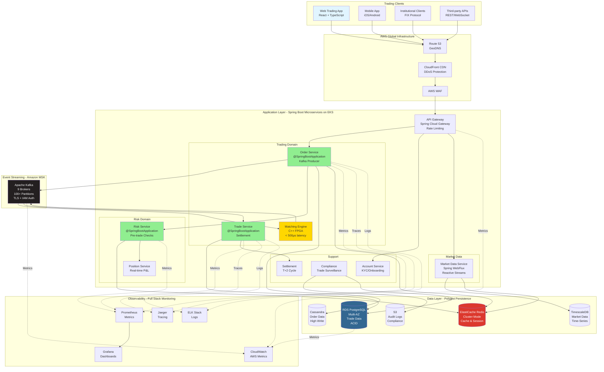
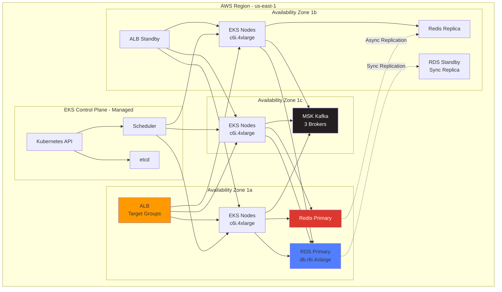
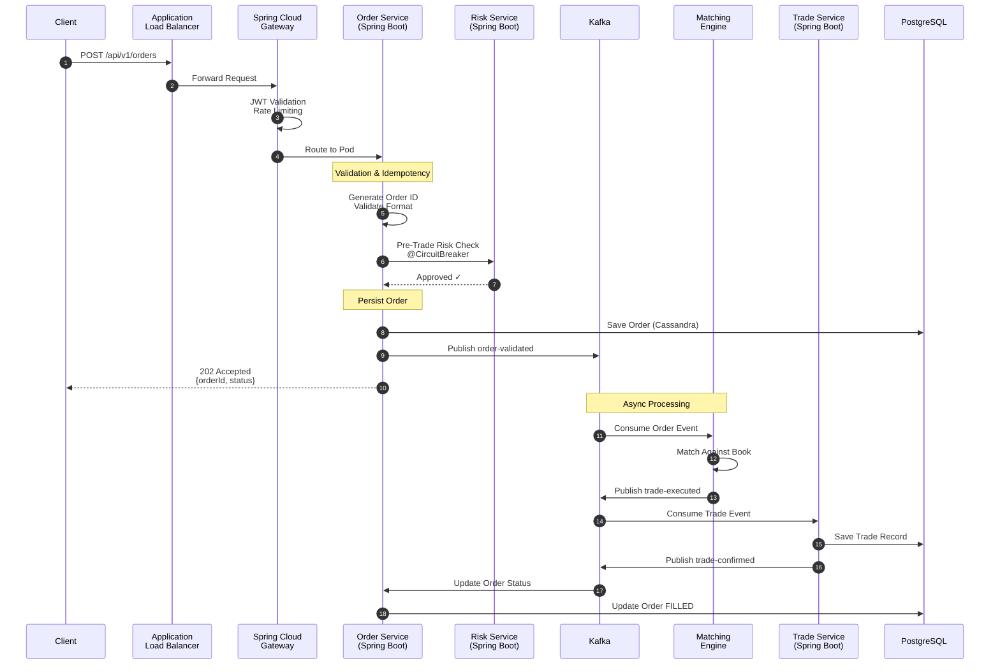
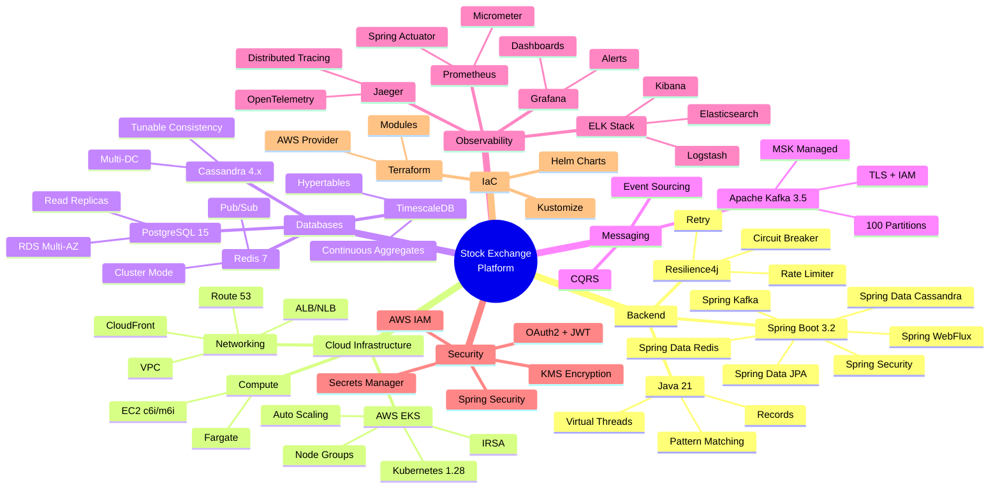
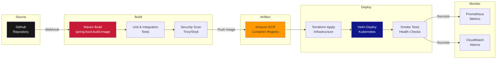
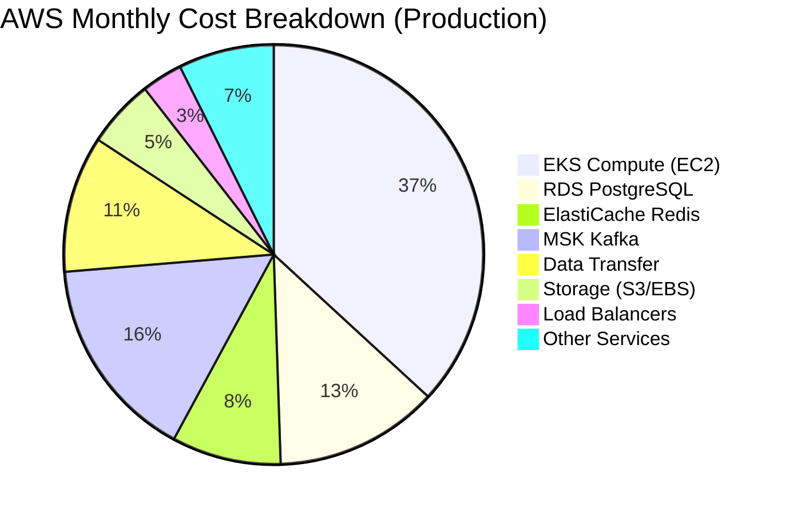

# Stock Exchange System - Visual Architecture Summary

## Complete System Overview



## Spring Boot Order Service Architecture

```mermaid
graph TB
    subgraph "Order Service Pod - Spring Boot 3.2"
        Controller[OrderController<br/>@RestController<br/>REST Endpoints]
        Service[OrderService<br/>@Service<br/>Business Logic]
        
        subgraph "Data Access Layer"
            JPARepo[OrderRepository<br/>Spring Data JPA]
            CassandraRepo[OrderCassandraRepository<br/>Spring Data Cassandra]
            RedisRepo[OrderCacheRepository<br/>Spring Data Redis]
        end
        
        subgraph "Integration Layer"
            KafkaProducer[OrderKafkaProducer<br/>@KafkaTemplate]
            FeignClient[RiskServiceClient<br/>@FeignClient<br/>Circuit Breaker]
        end
        
        subgraph "Cross-Cutting Concerns"
            Security[Spring Security<br/>JWT Validation]
            Resilience[Resilience4j<br/>Circuit Breaker<br/>Retry<br/>Rate Limiter]
            Actuator[Spring Boot Actuator<br/>Health<br/>Metrics<br/>Prometheus]
            Tracing[Spring Cloud Sleuth<br/>Distributed Tracing]
        end
    end

    Controller --> Service
    Service --> JPARepo
    Service --> CassandraRepo
    Service --> RedisRepo
    Service --> KafkaProducer
    Service --> FeignClient

    Controller --> Security
    Service --> Resilience
    Service --> Actuator
    Service --> Tracing

    JPARepo --> PostgreSQL[(PostgreSQL)]
    CassandraRepo --> Cassandra[(Cassandra)]
    RedisRepo --> Redis[(Redis)]
    KafkaProducer --> Kafka[Kafka Topic]
    FeignClient --> RiskService[Risk Service]

    style Controller fill:#90EE90
    style Service fill:#87CEEB
    style Resilience fill:#FFD700
```

## AWS EKS Deployment Architecture



## Data Flow - Order to Trade Execution



## Technology Stack Visualization



## Deployment Pipeline



## Performance Characteristics

| Component | Latency Target | Throughput Target | Availability |
|-----------|---------------|-------------------|--------------|
| Order Acknowledgment | < 1ms (p99) | 10M orders/sec | 99.999% |
| Matching Engine | < 500μs | 1M matches/sec | 99.999% |
| Market Data Pub | < 100μs | 100M msg/sec | 99.99% |
| Risk Check | < 500μs | 10M checks/sec | 99.99% |
| REST API | < 50ms (p95) | 1M req/sec | 99.9% |
| Database Write | < 10ms (p99) | 100K writes/sec | 99.99% |

## Cost Optimization (Monthly)



**Total Monthly Cost**: ~$95,000 USD
- **Daily**: ~$3,167
- **Annual**: ~$1.14M

**Cost Optimization Strategies**:
- Use Savings Plans (40% discount on compute)
- Reserved Instances for steady-state workloads
- Spot Instances for batch processing (90% discount)
- S3 Intelligent-Tiering for logs
- Right-size instances based on metrics
- Delete unused snapshots and AMIs

---

**Document Version**: 1.0  
**Last Updated**: January 17, 2026  
**Purpose**: Visual summary of complete stock exchange architecture
