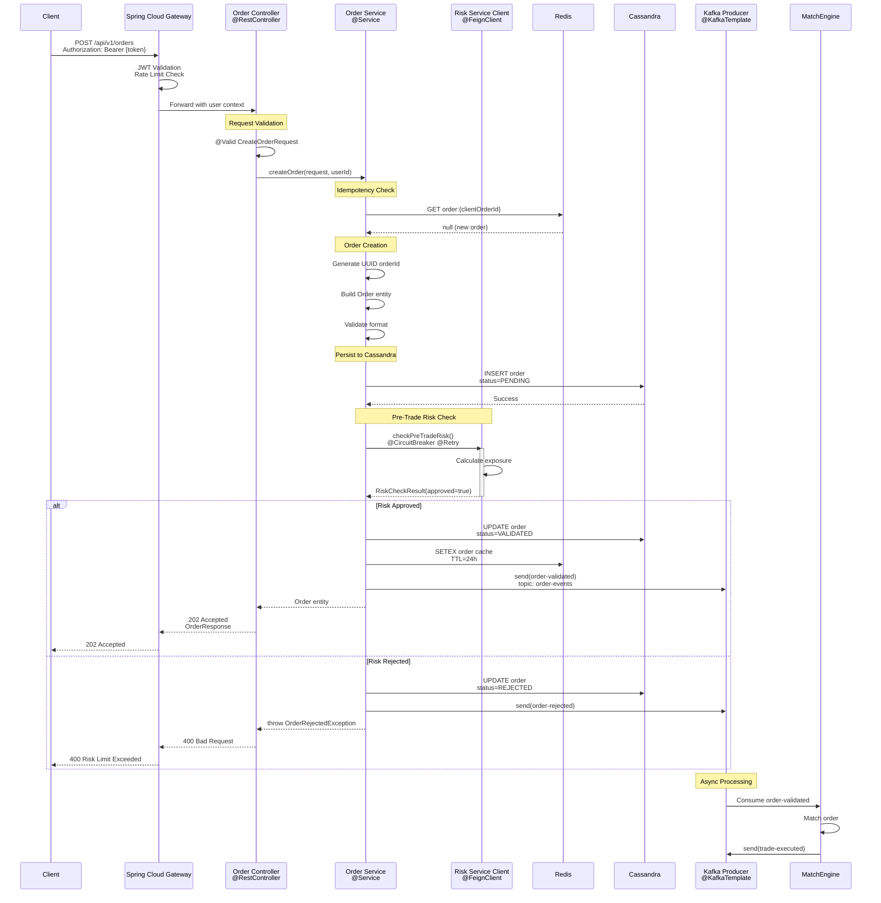

# Spring Boot Implementation Guide for Stock Exchange Microservices

## Overview

This guide provides comprehensive implementation details for building stock exchange microservices using **Spring Boot 3.x**, Spring Cloud, and modern Java patterns. It covers architecture, configuration, code examples, and best practices specific to financial trading systems.

## Architecture Diagram - Spring Boot Microservices

```mermaid
graph TB
    subgraph "External Clients"
        Web[Web Trading Platform<br/>React/Angular]
        Mobile[Mobile App<br/>iOS/Android]
        FIXClient[FIX Protocol Clients<br/>Institutional Traders]
        ThirdParty[Third-party API Clients]
    end

    subgraph "Edge Layer - Spring Cloud Gateway"
        Gateway[API Gateway<br/>@SpringBootApplication<br/>Spring Cloud Gateway]
        RateLimiter[Rate Limiter<br/>Redis Token Bucket]
        CircuitBreaker[Circuit Breaker<br/>Resilience4j]
    end

    subgraph "Service Discovery - Consul"
        Consul[HashiCorp Consul<br/>Service Registry]
    end

    subgraph "Trading Domain Services"
        OrderSvc[Order Service<br/>@SpringBootApplication<br/>Port: 8081]
        MatchEngine[Matching Engine<br/>C++/Rust + Spring Integration<br/>Port: 8082]
        TradeSvc[Trade Service<br/>@SpringBootApplication<br/>Port: 8083]
        MDSvc[Market Data Service<br/>Spring WebFlux<br/>Port: 8084]
    end

    subgraph "Risk Domain Services"
        RiskSvc[Risk Service<br/>@SpringBootApplication<br/>Port: 8091]
        MarginSvc[Margin Service<br/>@SpringBootApplication<br/>Port: 8092]
        PositionSvc[Position Service<br/>@SpringBootApplication<br/>Port: 8093]
    end

    subgraph "Business Support Services"
        AccountSvc[Account Service<br/>@SpringBootApplication<br/>Port: 8101]
        SettlementSvc[Settlement Service<br/>@SpringBootApplication<br/>Port: 8102]
        ComplianceSvc[Compliance Service<br/>@SpringBootApplication<br/>Port: 8103]
        NotificationSvc[Notification Service<br/>@SpringBootApplication<br/>Port: 8104]
    end

    subgraph "Event Streaming - Apache Kafka"
        OrderTopic[order-events<br/>Partitions: 50]
        TradeTopic[trade-events<br/>Partitions: 30]
        RiskTopic[risk-events<br/>Partitions: 20]
        MDTopic[market-data<br/>Partitions: 100]
    end

    subgraph "Data Layer"
        PostgreSQL[(PostgreSQL<br/>Trade Data)]
        Cassandra[(Cassandra<br/>Order Data)]
        Redis[(Redis Cluster<br/>Cache & Session)]
        TimescaleDB[(TimescaleDB<br/>Time-Series)]
    end

    subgraph "Observability Stack"
        Prometheus[Prometheus<br/>Metrics Collection]
        Grafana[Grafana<br/>Visualization]
        Jaeger[Jaeger<br/>Distributed Tracing]
        ELK[ELK Stack<br/>Centralized Logging]
    end

    Web --> Gateway
    Mobile --> Gateway
    FIXClient --> Gateway
    ThirdParty --> Gateway

    Gateway --> RateLimiter
    Gateway --> CircuitBreaker
    Gateway <--> Consul

    Gateway --> OrderSvc
    Gateway --> AccountSvc
    Gateway --> MDSvc

    OrderSvc <--> Consul
    TradeSvc <--> Consul
    RiskSvc <--> Consul
    MDSvc <--> Consul

    OrderSvc --> OrderTopic
    OrderSvc --> RiskSvc
    OrderSvc --> Redis
    OrderSvc --> Cassandra

    MatchEngine --> OrderTopic
    MatchEngine --> TradeTopic
    MatchEngine --> MDTopic

    TradeSvc --> TradeTopic
    TradeSvc --> SettlementSvc
    TradeSvc --> PostgreSQL

    RiskSvc --> RiskTopic
    RiskSvc --> PositionSvc
    RiskSvc --> Redis

    MDSvc --> MDTopic
    MDSvc --> TimescaleDB

    OrderSvc -.->|/actuator/prometheus| Prometheus
    TradeSvc -.->|/actuator/prometheus| Prometheus
    RiskSvc -.->|/actuator/prometheus| Prometheus
    Prometheus --> Grafana

    OrderSvc -.->|Logs| ELK
    TradeSvc -.->|Logs| ELK

    OrderSvc -.->|Traces| Jaeger
    TradeSvc -.->|Traces| Jaeger
```



## Order Service Flow Diagram



## Spring Boot Technology Stack

### Core Dependencies (pom.xml)

```xml
<?xml version="1.0" encoding="UTF-8"?>
<project xmlns="http://maven.apache.org/POM/4.0.0"
         xmlns:xsi="http://www.w3.org/2001/XMLSchema-instance"
         xsi:schemaLocation="http://maven.apache.org/POM/4.0.0 
         https://maven.apache.org/xsd/maven-4.0.0.xsd">
    <modelVersion>4.0.0</modelVersion>
    
    <parent>
        <groupId>org.springframework.boot</groupId>
        <artifactId>spring-boot-starter-parent</artifactId>
        <version>3.2.1</version>
        <relativePath/>
    </parent>
    
    <groupId>com.exchange</groupId>
    <artifactId>order-service</artifactId>
    <version>1.0.0</version>
    <name>Order Service</name>
    <description>Order Management Service for Stock Exchange</description>
    
    <properties>
        <java.version>21</java.version>
        <spring-cloud.version>2023.0.0</spring-cloud.version>
        <resilience4j.version>2.1.0</resilience4j.version>
        <cassandra-driver.version>4.17.0</cassandra-driver.version>
    </properties>
    
    <dependencies>
        <!-- Spring Boot Starters -->
        <dependency>
            <groupId>org.springframework.boot</groupId>
            <artifactId>spring-boot-starter-web</artifactId>
        </dependency>
        
        <dependency>
            <groupId>org.springframework.boot</groupId>
            <artifactId>spring-boot-starter-data-jpa</artifactId>
        </dependency>
        
        <dependency>
            <groupId>org.springframework.boot</groupId>
            <artifactId>spring-boot-starter-data-redis</artifactId>
        </dependency>
        
        <dependency>
            <groupId>org.springframework.boot</groupId>
            <artifactId>spring-boot-starter-data-cassandra</artifactId>
        </dependency>
        
        <dependency>
            <groupId>org.springframework.boot</groupId>
            <artifactId>spring-boot-starter-validation</artifactId>
        </dependency>
        
        <dependency>
            <groupId>org.springframework.boot</groupId>
            <artifactId>spring-boot-starter-security</artifactId>
        </dependency>
        
        <dependency>
            <groupId>org.springframework.boot</groupId>
            <artifactId>spring-boot-starter-actuator</artifactId>
        </dependency>
        
        <!-- Spring Kafka -->
        <dependency>
            <groupId>org.springframework.kafka</groupId>
            <artifactId>spring-kafka</artifactId>
        </dependency>
        
        <!-- Spring Cloud -->
        <dependency>
            <groupId>org.springframework.cloud</groupId>
            <artifactId>spring-cloud-starter-consul-discovery</artifactId>
        </dependency>
        
        <dependency>
            <groupId>org.springframework.cloud</groupId>
            <artifactId>spring-cloud-starter-openfeign</artifactId>
        </dependency>
        
        <dependency>
            <groupId>org.springframework.cloud</groupId>
            <artifactId>spring-cloud-starter-loadbalancer</artifactId>
        </dependency>
        
        <!-- Resilience4j -->
        <dependency>
            <groupId>io.github.resilience4j</groupId>
            <artifactId>resilience4j-spring-boot3</artifactId>
            <version>${resilience4j.version}</version>
        </dependency>
        
        <dependency>
            <groupId>io.github.resilience4j</groupId>
            <artifactId>resilience4j-circuitbreaker</artifactId>
            <version>${resilience4j.version}</version>
        </dependency>
        
        <dependency>
            <groupId>io.github.resilience4j</groupId>
            <artifactId>resilience4j-retry</artifactId>
            <version>${resilience4j.version}</version>
        </dependency>
        
        <dependency>
            <groupId>io.github.resilience4j</groupId>
            <artifactId>resilience4j-timelimiter</artifactId>
            <version>${resilience4j.version}</version>
        </dependency>
        
        <!-- Observability -->
        <dependency>
            <groupId>io.micrometer</groupId>
            <artifactId>micrometer-registry-prometheus</artifactId>
        </dependency>
        
        <dependency>
            <groupId>io.micrometer</groupId>
            <artifactId>micrometer-tracing-bridge-brave</artifactId>
        </dependency>
        
        <dependency>
            <groupId>io.zipkin.reporter2</groupId>
            <artifactId>zipkin-reporter-brave</artifactId>
        </dependency>
        
        <!-- Database Drivers -->
        <dependency>
            <groupId>org.postgresql</groupId>
            <artifactId>postgresql</artifactId>
        </dependency>
        
        <dependency>
            <groupId>com.datastax.oss</groupId>
            <artifactId>java-driver-core</artifactId>
            <version>${cassandra-driver.version}</version>
        </dependency>
        
        <!-- Utilities -->
        <dependency>
            <groupId>org.projectlombok</groupId>
            <artifactId>lombok</artifactId>
            <optional>true</optional>
        </dependency>
        
        <dependency>
            <groupId>org.mapstruct</groupId>
            <artifactId>mapstruct</artifactId>
            <version>1.5.5.Final</version>
        </dependency>
        
        <!-- Testing -->
        <dependency>
            <groupId>org.springframework.boot</groupId>
            <artifactId>spring-boot-starter-test</artifactId>
            <scope>test</scope>
        </dependency>
        
        <dependency>
            <groupId>org.springframework.kafka</groupId>
            <artifactId>spring-kafka-test</artifactId>
            <scope>test</scope>
        </dependency>
        
        <dependency>
            <groupId>org.testcontainers</groupId>
            <artifactId>postgresql</artifactId>
            <scope>test</scope>
        </dependency>
        
        <dependency>
            <groupId>org.testcontainers</groupId>
            <artifactId>kafka</artifactId>
            <scope>test</scope>
        </dependency>
    </dependencies>
    
    <dependencyManagement>
        <dependencies>
            <dependency>
                <groupId>org.springframework.cloud</groupId>
                <artifactId>spring-cloud-dependencies</artifactId>
                <version>${spring-cloud.version}</version>
                <type>pom</type>
                <scope>import</scope>
            </dependency>
        </dependencies>
    </dependencyManagement>
    
    <build>
        <plugins>
            <plugin>
                <groupId>org.springframework.boot</groupId>
                <artifactId>spring-boot-maven-plugin</artifactId>
                <configuration>
                    <excludes>
                        <exclude>
                            <groupId>org.projectlombok</groupId>
                            <artifactId>lombok</artifactId>
                        </exclude>
                    </excludes>
                </configuration>
            </plugin>
        </plugins>
    </build>
</project>
```

## Order Service Implementation

### Application Main Class

```java
package com.exchange.order;

import org.springframework.boot.SpringApplication;
import org.springframework.boot.autoconfigure.SpringBootApplication;
import org.springframework.cloud.client.discovery.EnableDiscoveryClient;
import org.springframework.cloud.openfeign.EnableFeignClients;
import org.springframework.data.cassandra.repository.config.EnableCassandraRepositories;
import org.springframework.data.jpa.repository.config.EnableJpaRepositories;
import org.springframework.kafka.annotation.EnableKafka;
import org.springframework.scheduling.annotation.EnableAsync;
import org.springframework.cache.annotation.EnableCaching;

@SpringBootApplication
@EnableDiscoveryClient
@EnableFeignClients
@EnableKafka
@EnableCaching
@EnableAsync
@EnableJpaRepositories(basePackages = "com.exchange.order.repository.jpa")
@EnableCassandraRepositories(basePackages = "com.exchange.order.repository.cassandra")
public class OrderServiceApplication {
    
    public static void main(String[] args) {
        SpringApplication.run(OrderServiceApplication.class, args);
    }
}
```

### Configuration (application.yml)

```yaml
spring:
  application:
    name: order-service
  
  profiles:
    active: ${SPRING_PROFILE:dev}
  
  # PostgreSQL Configuration (for audit/reference data)
  datasource:
    url: jdbc:postgresql://${DB_HOST:localhost}:5432/trading
    username: ${DB_USER:postgres}
    password: ${DB_PASSWORD:secret}
    hikari:
      maximum-pool-size: 50
      minimum-idle: 10
      connection-timeout: 20000
      idle-timeout: 300000
      max-lifetime: 1200000
      pool-name: OrderService-HikariCP
  
  jpa:
    hibernate:
      ddl-auto: validate
    properties:
      hibernate:
        dialect: org.hibernate.dialect.PostgreSQLDialect
        format_sql: false
        jdbc:
          batch_size: 50
          batch_versioned_data: true
        order_inserts: true
        order_updates: true
    show-sql: false
  
  # Cassandra Configuration (for order data)
  data:
    cassandra:
      keyspace-name: trading
      contact-points: ${CASSANDRA_HOSTS:localhost}
      port: 9042
      local-datacenter: ${CASSANDRA_DC:datacenter1}
      username: ${CASSANDRA_USER:cassandra}
      password: ${CASSANDRA_PASSWORD:cassandra}
      schema-action: none
      request:
        timeout: 5s
        consistency: LOCAL_QUORUM
      pool:
        max-requests-per-connection: 32768
        idle-timeout: 120s
  
  # Redis Configuration
  redis:
    host: ${REDIS_HOST:localhost}
    port: 6379
    password: ${REDIS_PASSWORD:}
    database: 0
    lettuce:
      pool:
        max-active: 100
        max-idle: 20
        min-idle: 10
        max-wait: 2000ms
      shutdown-timeout: 200ms
  
  # Kafka Configuration
  kafka:
    bootstrap-servers: ${KAFKA_BROKERS:localhost:9092}
    producer:
      key-serializer: org.apache.kafka.common.serialization.StringSerializer
      value-serializer: org.springframework.kafka.support.serializer.JsonSerializer
      acks: all
      retries: 3
      properties:
        enable.idempotence: true
        max.in.flight.requests.per.connection: 5
        compression.type: lz4
        linger.ms: 10
        batch.size: 16384
    consumer:
      group-id: order-service-consumer-group
      key-deserializer: org.apache.kafka.common.serialization.StringDeserializer
      value-deserializer: org.springframework.kafka.support.serializer.JsonDeserializer
      auto-offset-reset: earliest
      enable-auto-commit: false
      max-poll-records: 500
      properties:
        spring.json.trusted.packages: "com.exchange.*"
        isolation.level: read_committed
    listener:
      ack-mode: manual
      concurrency: 10
      type: batch
  
  # Cloud Configuration
  cloud:
    consul:
      host: ${CONSUL_HOST:localhost}
      port: 8500
      discovery:
        enabled: true
        instance-id: ${spring.application.name}:${random.value}
        health-check-path: /actuator/health
        health-check-interval: 10s
        health-check-critical-timeout: 30s
        prefer-ip-address: true
        hostname: ${HOST_NAME:localhost}
        tags:
          - version=v1.0.0
          - domain=trading
    loadbalancer:
      cache:
        enabled: true
        ttl: 30s

# OpenFeign Configuration
feign:
  client:
    config:
      default:
        connectTimeout: 5000
        readTimeout: 10000
        loggerLevel: basic
      risk-service:
        connectTimeout: 2000
        readTimeout: 5000
        loggerLevel: full
  circuitbreaker:
    enabled: true
    alphanumeric-ids:
      enabled: true

# Resilience4j Configuration
resilience4j:
  circuitbreaker:
    configs:
      default:
        register-health-indicator: true
        sliding-window-size: 100
        sliding-window-type: COUNT_BASED
        minimum-number-of-calls: 10
        failure-rate-threshold: 50
        wait-duration-in-open-state: 10s
        permitted-number-of-calls-in-half-open-state: 10
        automatic-transition-from-open-to-half-open-enabled: true
        record-exceptions:
          - java.net.ConnectException
          - java.net.SocketTimeoutException
        ignore-exceptions:
          - com.exchange.order.exception.OrderValidationException
    instances:
      risk-service:
        base-config: default
        failure-rate-threshold: 60
        wait-duration-in-open-state: 15s
  
  retry:
    configs:
      default:
        max-attempts: 3
        wait-duration: 500ms
        enable-exponential-backoff: true
        exponential-backoff-multiplier: 2
        retry-exceptions:
          - java.net.ConnectException
          - java.net.SocketTimeoutException
    instances:
      risk-service:
        base-config: default
        max-attempts: 2
  
  timelimiter:
    configs:
      default:
        timeout-duration: 5s
        cancel-running-future: true
    instances:
      risk-service:
        timeout-duration: 3s
  
  ratelimiter:
    configs:
      default:
        limit-for-period: 100
        limit-refresh-period: 1s
        timeout-duration: 0s
    instances:
      order-creation:
        limit-for-period: 1000
        limit-refresh-period: 1s

# Actuator Configuration
management:
  endpoints:
    web:
      exposure:
        include: health,metrics,prometheus,info,env,threaddump,heapdump
      base-path: /actuator
  endpoint:
    health:
      show-details: always
      probes:
        enabled: true
  health:
    livenessState:
      enabled: true
    readinessState:
      enabled: true
    cassandra:
      enabled: true
    redis:
      enabled: true
    db:
      enabled: true
  metrics:
    export:
      prometheus:
        enabled: true
        step: 10s
    distribution:
      percentiles-histogram:
        http.server.requests: true
      percentiles:
        http.server.requests: 0.5, 0.95, 0.99, 0.999
    tags:
      application: ${spring.application.name}
      environment: ${SPRING_PROFILE:dev}
      region: ${AWS_REGION:us-east-1}
  tracing:
    sampling:
      probability: 1.0
  zipkin:
    tracing:
      endpoint: ${ZIPKIN_URL:http://localhost:9411/api/v2/spans}

# Logging Configuration
logging:
  level:
    root: INFO
    com.exchange.order: DEBUG
    org.springframework.kafka: WARN
    org.springframework.data.cassandra: WARN
    org.hibernate.SQL: INFO
    io.github.resilience4j: DEBUG
  pattern:
    console: "%d{yyyy-MM-dd HH:mm:ss.SSS} [%thread] [%X{traceId}/%X{spanId}] %-5level %logger{36} - %msg%n"
    file: "%d{yyyy-MM-dd HH:mm:ss.SSS} [%thread] [%X{traceId}/%X{spanId}] %-5level %logger{36} - %msg%n"
  file:
    name: /var/log/order-service/application.log
    max-size: 100MB
    max-history: 30
    total-size-cap: 3GB

# Server Configuration
server:
  port: 8081
  compression:
    enabled: true
    mime-types: application/json,application/xml,text/html,text/xml,text/plain
  tomcat:
    threads:
      max: 200
      min-spare: 10
    accept-count: 100
    max-connections: 10000
    connection-timeout: 20000

# Custom Application Properties
trading:
  order:
    max-quantity: 1000000
    max-price: 1000000.00
    validation-timeout-ms: 100
    risk-check-timeout-ms: 500
    idempotency-ttl-hours: 24
  kafka:
    topics:
      order-events: order-events
      trade-events: trade-events
      risk-events: risk-events
      market-data: market-data
```

### REST Controller

```java
package com.exchange.order.controller;

import com.exchange.order.dto.CreateOrderRequest;
import com.exchange.order.dto.OrderResponse;
import com.exchange.order.model.Order;
import com.exchange.order.model.OrderStatus;
import com.exchange.order.service.OrderService;
import com.exchange.order.mapper.OrderMapper;
import io.micrometer.core.annotation.Timed;
import jakarta.validation.Valid;
import lombok.RequiredArgsConstructor;
import lombok.extern.slf4j.Slf4j;
import org.springframework.data.domain.Page;
import org.springframework.data.domain.PageRequest;
import org.springframework.data.domain.Pageable;
import org.springframework.data.domain.Sort;
import org.springframework.http.HttpStatus;
import org.springframework.http.ResponseEntity;
import org.springframework.security.access.prepost.PreAuthorize;
import org.springframework.web.bind.annotation.*;

@RestController
@RequestMapping("/api/v1/orders")
@RequiredArgsConstructor
@Slf4j
public class OrderController {
    
    private final OrderService orderService;
    private final OrderMapper orderMapper;
    
    @PostMapping
    @ResponseStatus(HttpStatus.ACCEPTED)
    @PreAuthorize("hasAuthority('SCOPE_order:create')")
    @Timed(value = "order.creation", description = "Time taken to create order")
    public ResponseEntity<OrderResponse> createOrder(
            @Valid @RequestBody CreateOrderRequest request,
            @RequestHeader("X-User-Id") String userId,
            @RequestHeader("X-Request-Id") String requestId) {
        
        log.info("Received order request - userId: {}, requestId: {}, symbol: {}, side: {}, quantity: {}", 
                userId, requestId, request.getSymbol(), request.getSide(), request.getQuantity());
        
        Order order = orderService.createOrder(request, userId, requestId);
        OrderResponse response = orderMapper.toResponse(order);
        
        log.info("Order created successfully - orderId: {}, status: {}", order.getOrderId(), order.getStatus());
        
        return ResponseEntity.accepted()
                .header("X-Order-Id", order.getOrderId())
                .header("Location", "/api/v1/orders/" + order.getOrderId())
                .body(response);
    }
    
    @GetMapping("/{orderId}")
    @PreAuthorize("hasAuthority('SCOPE_order:read')")
    @Timed(value = "order.retrieval", description = "Time taken to retrieve order")
    public ResponseEntity<OrderResponse> getOrder(
            @PathVariable String orderId,
            @RequestHeader("X-User-Id") String userId) {
        
        log.debug("Fetching order - orderId: {}, userId: {}", orderId, userId);
        
        Order order = orderService.getOrder(orderId, userId);
        OrderResponse response = orderMapper.toResponse(order);
        
        return ResponseEntity.ok(response);
    }
    
    @DeleteMapping("/{orderId}")
    @PreAuthorize("hasAuthority('SCOPE_order:cancel')")
    @Timed(value = "order.cancellation", description = "Time taken to cancel order")
    public ResponseEntity<Void> cancelOrder(
            @PathVariable String orderId,
            @RequestHeader("X-User-Id") String userId) {
        
        log.info("Cancelling order - orderId: {}, userId: {}", orderId, userId);
        
        orderService.cancelOrder(orderId, userId);
        
        log.info("Order cancelled successfully - orderId: {}", orderId);
        
        return ResponseEntity.noContent().build();
    }
    
    @GetMapping
    @PreAuthorize("hasAuthority('SCOPE_order:read')")
    @Timed(value = "order.list", description = "Time taken to list user orders")
    public ResponseEntity<Page<OrderResponse>> getUserOrders(
            @RequestHeader("X-User-Id") String userId,
            @RequestParam(defaultValue = "0") int page,
            @RequestParam(defaultValue = "20") int size,
            @RequestParam(defaultValue = "createdAt") String sortBy,
            @RequestParam(defaultValue = "DESC") Sort.Direction direction,
            @RequestParam(required = false) OrderStatus status,
            @RequestParam(required = false) String symbol) {
        
        log.debug("Fetching user orders - userId: {}, page: {}, size: {}, status: {}, symbol: {}", 
                userId, page, size, status, symbol);
        
        Pageable pageable = PageRequest.of(page, size, Sort.by(direction, sortBy));
        Page<Order> orders = orderService.getUserOrders(userId, status, symbol, pageable);
        Page<OrderResponse> response = orders.map(orderMapper::toResponse);
        
        return ResponseEntity.ok(response);
    }
    
    @PatchMapping("/{orderId}")
    @PreAuthorize("hasAuthority('SCOPE_order:modify')")
    @Timed(value = "order.modification", description = "Time taken to modify order")
    public ResponseEntity<OrderResponse> modifyOrder(
            @PathVariable String orderId,
            @Valid @RequestBody ModifyOrderRequest request,
            @RequestHeader("X-User-Id") String userId) {
        
        log.info("Modifying order - orderId: {}, userId: {}, newQuantity: {}, newPrice: {}", 
                orderId, userId, request.getNewQuantity(), request.getNewPrice());
        
        Order order = orderService.modifyOrder(orderId, userId, request);
        OrderResponse response = orderMapper.toResponse(order);
        
        log.info("Order modified successfully - orderId: {}", orderId);
        
        return ResponseEntity.ok(response);
    }
}
```

### Service Layer

```java
package com.exchange.order.service;

import com.exchange.order.client.RiskServiceClient;
import com.exchange.order.dto.CreateOrderRequest;
import com.exchange.order.dto.RiskCheckResult;
import com.exchange.order.exception.OrderNotFoundException;
import com.exchange.order.exception.OrderRejectedException;
import com.exchange.order.exception.UnauthorizedAccessException;
import com.exchange.order.kafka.OrderKafkaProducer;
import com.exchange.order.model.Order;
import com.exchange.order.model.OrderStatus;
import com.exchange.order.repository.cassandra.OrderCassandraRepository;
import com.exchange.order.repository.redis.OrderCacheRepository;
import com.exchange.order.util.IdGenerator;
import io.github.resilience4j.circuitbreaker.annotation.CircuitBreaker;
import io.github.resilience4j.retry.annotation.Retry;
import io.github.resilience4j.timelimiter.annotation.TimeLimiter;
import io.micrometer.core.instrument.Counter;
import io.micrometer.core.instrument.MeterRegistry;
import lombok.RequiredArgsConstructor;
import lombok.extern.slf4j.Slf4j;
import org.springframework.beans.factory.annotation.Value;
import org.springframework.cache.annotation.CacheEvict;
import org.springframework.cache.annotation.Cacheable;
import org.springframework.data.domain.Page;
import org.springframework.data.domain.Pageable;
import org.springframework.stereotype.Service;
import org.springframework.transaction.annotation.Transactional;

import java.math.BigDecimal;
import java.time.Instant;
import java.util.Optional;
import java.util.concurrent.CompletableFuture;

@Service
@RequiredArgsConstructor
@Slf4j
public class OrderService {
    
    private final OrderCassandraRepository orderRepository;
    private final OrderCacheRepository orderCacheRepository;
    private final RiskServiceClient riskServiceClient;
    private final OrderKafkaProducer orderKafkaProducer;
    private final IdGenerator idGenerator;
    private final MeterRegistry meterRegistry;
    
    @Value("${trading.order.validation-timeout-ms}")
    private long validationTimeoutMs;
    
    @Value("${trading.order.max-quantity}")
    private long maxQuantity;
    
    @Value("${trading.order.max-price}")
    private BigDecimal maxPrice;
    
    private Counter orderCreatedCounter;
    private Counter orderRejectedCounter;
    private Counter orderValidatedCounter;
    
    @PostConstruct
    public void initMetrics() {
        orderCreatedCounter = Counter.builder("orders.created")
                .description("Number of orders created")
                .tag("service", "order-service")
                .register(meterRegistry);
        
        orderRejectedCounter = Counter.builder("orders.rejected")
                .description("Number of orders rejected")
                .tag("service", "order-service")
                .register(meterRegistry);
        
        orderValidatedCounter = Counter.builder("orders.validated")
                .description("Number of orders validated")
                .tag("service", "order-service")
                .register(meterRegistry);
    }
    
    @Transactional
    public Order createOrder(CreateOrderRequest request, String userId, String requestId) {
        // 1. Check idempotency
        Optional<Order> existingOrder = orderCacheRepository.findByClientOrderId(requestId);
        if (existingOrder.isPresent()) {
            log.info("Order already processed (idempotent) - clientOrderId: {}", requestId);
            return existingOrder.get();
        }
        
        // 2. Create order entity
        Order order = Order.builder()
                .orderId(idGenerator.generateOrderId())
                .userId(userId)
                .clientOrderId(requestId)
                .symbol(request.getSymbol())
                .side(request.getSide())
                .orderType(request.getOrderType())
                .quantity(request.getQuantity())
                .price(request.getPrice())
                .timeInForce(request.getTimeInForce())
                .status(OrderStatus.PENDING)
                .filledQuantity(BigDecimal.ZERO)
                .createdAt(Instant.now())
                .updatedAt(Instant.now())
                .build();
        
        orderCreatedCounter.increment();
        
        // 3. Validate order format
        validateOrderFormat(order);
        
        // 4. Save to Cassandra (high-write throughput)
        orderRepository.save(order);
        log.debug("Order saved to Cassandra - orderId: {}", order.getOrderId());
        
        // 5. Pre-trade risk check with circuit breaker
        RiskCheckResult riskResult = checkRiskWithTimeout(order);
        
        if (!riskResult.isApproved()) {
            order.setStatus(OrderStatus.REJECTED);
            order.setRejectionReason(riskResult.getReason());
            order.setUpdatedAt(Instant.now());
            orderRepository.save(order);
            
            orderRejectedCounter.increment();
            
            // Publish rejection event
            orderKafkaProducer.publishOrderRejected(order);
            
            log.warn("Order rejected by risk - orderId: {}, reason: {}", 
                    order.getOrderId(), riskResult.getReason());
            
            throw new OrderRejectedException(riskResult.getReason());
        }
        
        // 6. Update status to validated
        order.setStatus(OrderStatus.VALIDATED);
        order.setValidatedAt(Instant.now());
        order.setUpdatedAt(Instant.now());
        orderRepository.save(order);
        
        orderValidatedCounter.increment();
        
        // 7. Cache order for idempotency and fast retrieval
        orderCacheRepository.save(order);
        
        // 8. Publish to Kafka for async processing
        orderKafkaProducer.publishOrderValidated(order);
        
        log.info("Order validated and published - orderId: {}, symbol: {}, side: {}, quantity: {}", 
                order.getOrderId(), order.getSymbol(), order.getSide(), order.getQuantity());
        
        return order;
    }
    
    @CircuitBreaker(name = "risk-service", fallbackMethod = "riskCheckFallback")
    @Retry(name = "risk-service")
    @TimeLimiter(name = "risk-service")
    private CompletableFuture<RiskCheckResult> checkRiskWithTimeout(Order order) {
        return CompletableFuture.supplyAsync(() -> 
            riskServiceClient.checkPreTradeRisk(
                    order.getUserId(),
                    order.getSymbol(),
                    order.getSide(),
                    order.getQuantity(),
                    order.getPrice()
            )
        );
    }
    
    private CompletableFuture<RiskCheckResult> riskCheckFallback(Order order, Exception e) {
        log.error("Risk check failed - orderId: {}, error: {}", order.getOrderId(), e.getMessage());
        // Conservative approach: reject order if risk service unavailable
        return CompletableFuture.completedFuture(
                RiskCheckResult.rejected("Risk service unavailable: " + e.getMessage())
        );
    }
    
    private void validateOrderFormat(Order order) {
        if (order.getQuantity().compareTo(BigDecimal.valueOf(maxQuantity)) > 0) {
            throw new OrderValidationException("Quantity exceeds maximum: " + maxQuantity);
        }
        
        if (order.getPrice() != null && order.getPrice().compareTo(maxPrice) > 0) {
            throw new OrderValidationException("Price exceeds maximum: " + maxPrice);
        }
        
        if (order.getQuantity().compareTo(BigDecimal.ZERO) <= 0) {
            throw new OrderValidationException("Quantity must be positive");
        }
        
        if (order.getPrice() != null && order.getPrice().compareTo(BigDecimal.ZERO) <= 0) {
            throw new OrderValidationException("Price must be positive");
        }
    }
    
    @Cacheable(value = "orders", key = "#orderId", unless = "#result == null")
    public Order getOrder(String orderId, String userId) {
        Order order = orderRepository.findByOrderId(orderId)
                .orElseThrow(() -> new OrderNotFoundException("Order not found: " + orderId));
        
        // Authorization check
        if (!order.getUserId().equals(userId)) {
            throw new UnauthorizedAccessException("User not authorized to access this order");
        }
        
        return order;
    }
    
    @CacheEvict(value = "orders", key = "#orderId")
    @Transactional
    public void cancelOrder(String orderId, String userId) {
        Order order = getOrder(orderId, userId);
        
        if (order.getStatus() == OrderStatus.FILLED || 
            order.getStatus() == OrderStatus.CANCELLED) {
            throw new OrderValidationException("Order cannot be cancelled in current status: " + order.getStatus());
        }
        
        order.setStatus(OrderStatus.CANCELLED);
        order.setUpdatedAt(Instant.now());
        orderRepository.save(order);
        
        // Publish cancellation event
        orderKafkaProducer.publishOrderCancelled(order);
        
        log.info("Order cancelled - orderId: {}", orderId);
    }
    
    public Page<Order> getUserOrders(String userId, OrderStatus status, String symbol, Pageable pageable) {
        if (status != null && symbol != null) {
            return orderRepository.findByUserIdAndStatusAndSymbol(userId, status, symbol, pageable);
        } else if (status != null) {
            return orderRepository.findByUserIdAndStatus(userId, status, pageable);
        } else if (symbol != null) {
            return orderRepository.findByUserIdAndSymbol(userId, symbol, pageable);
        } else {
            return orderRepository.findByUserId(userId, pageable);
        }
    }
}
```

(Continued in next response due to length...)
