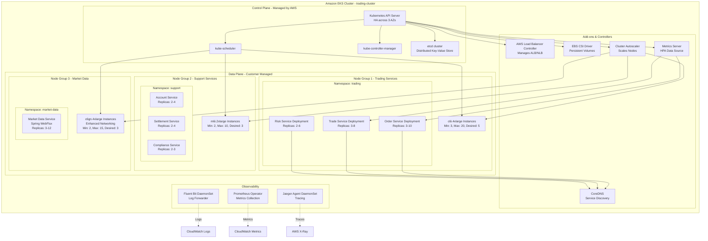

# AWS Cloud Architecture for Stock Exchange - Spring Boot Deployment

## Overview

This guide provides comprehensive AWS architecture diagrams and deployment strategies for Spring Boot microservices in a stock exchange system, including infrastructure as code, auto-scaling, and high-availability patterns.

## Complete AWS Architecture Diagram

```mermaid
graph TB
    subgraph "External Access"
        Users[Global Users]
        Institutions[Institutional Clients<br/>FIX Protocol]
        Partners[Third-party Partners<br/>REST API]
    end

    subgraph "AWS Global Services"
        Route53[Amazon Route 53<br/>DNS & Traffic Management]
        CloudFront[Amazon CloudFront<br/>CDN & DDoS Protection]
        WAF[AWS WAF<br/>Web Application Firewall]
        Shield[AWS Shield Advanced<br/>DDoS Protection]
    end

    subgraph "AWS US-East-1 Region - Primary"
        subgraph "Availability Zone 1"
            direction TB
            subgraph "Public Subnet 1A"
                NAT1[NAT Gateway]
                ALB1[Application Load Balancer<br/>Primary]
            end
            
            subgraph "Private Subnet 1A - App Tier"
                EKS_Node1[EKS Worker Nodes<br/>c6i.4xlarge]
                subgraph "Pods Zone 1A"
                    OrderPod1[Order Service Pods<br/>Spring Boot]
                    TradePod1[Trade Service Pods<br/>Spring Boot]
                    RiskPod1[Risk Service Pods<br/>Spring Boot]
                end
            end
            
            subgraph "Private Subnet 1A - Data Tier"
                RDS_Primary[RDS PostgreSQL<br/>Primary Instance<br/>db.r6i.4xlarge]
                ElastiCache1[ElastiCache Redis<br/>Primary Nodes]
            end
        end

        subgraph "Availability Zone 2"
            direction TB
            subgraph "Public Subnet 1B"
                NAT2[NAT Gateway]
                ALB2[Application Load Balancer<br/>Standby]
            end
            
            subgraph "Private Subnet 1B - App Tier"
                EKS_Node2[EKS Worker Nodes<br/>c6i.4xlarge]
                subgraph "Pods Zone 1B"
                    OrderPod2[Order Service Pods<br/>Spring Boot]
                    TradePod2[Trade Service Pods<br/>Spring Boot]
                    RiskPod2[Risk Service Pods<br/>Spring Boot]
                end
            end
            
            subgraph "Private Subnet 1B - Data Tier"
                RDS_Standby[RDS PostgreSQL<br/>Standby Replica<br/>db.r6i.4xlarge]
                ElastiCache2[ElastiCache Redis<br/>Replica Nodes]
            end
        end

        subgraph "Availability Zone 3"
            direction TB
            subgraph "Public Subnet 1C"
                NAT3[NAT Gateway]
            end
            
            subgraph "Private Subnet 1C - App Tier"
                EKS_Node3[EKS Worker Nodes<br/>c6i.4xlarge]
                subgraph "Pods Zone 1C"
                    OrderPod3[Order Service Pods<br/>Spring Boot]
                    TradePod3[Trade Service Pods<br/>Spring Boot]
                    RiskPod3[Risk Service Pods<br/>Spring Boot]
                end
            end
            
            subgraph "Private Subnet 1C - Data Tier"
                MSK_Cluster[Amazon MSK<br/>Kafka Cluster<br/>3 Brokers]
            end
        end

        subgraph "Shared Services"
            EKS_Control[EKS Control Plane<br/>Managed by AWS]
            ECR[Amazon ECR<br/>Container Registry]
            SecretsManager[AWS Secrets Manager<br/>Credentials]
            KMS[AWS KMS<br/>Encryption Keys]
            CloudWatch[Amazon CloudWatch<br/>Metrics & Logs]
            XRay[AWS X-Ray<br/>Distributed Tracing]
            S3_Logs[S3 Buckets<br/>Audit Logs & Backups]
        end
    end

    subgraph "AWS US-West-2 Region - DR"
        RDS_DR[RDS PostgreSQL<br/>Cross-Region Read Replica]
        S3_DR[S3 Bucket<br/>DR Backups]
        EKS_DR[EKS Cluster<br/>Scaled to Zero]
    end

    Users --> Route53
    Institutions --> Route53
    Partners --> Route53

    Route53 --> CloudFront
    CloudFront --> WAF
    WAF --> Shield
    Shield --> ALB1
    Shield --> ALB2

    ALB1 --> EKS_Node1
    ALB1 --> EKS_Node2
    ALB1 --> EKS_Node3
    ALB2 --> EKS_Node1
    ALB2 --> EKS_Node2
    ALB2 --> EKS_Node3

    EKS_Node1 --> OrderPod1
    EKS_Node1 --> TradePod1
    EKS_Node1 --> RiskPod1

    EKS_Node2 --> OrderPod2
    EKS_Node2 --> TradePod2
    EKS_Node2 --> RiskPod2

    EKS_Node3 --> OrderPod3
    EKS_Node3 --> TradePod3
    EKS_Node3 --> RiskPod3

    OrderPod1 --> RDS_Primary
    OrderPod2 --> RDS_Primary
    OrderPod3 --> RDS_Primary

    OrderPod1 --> ElastiCache1
    OrderPod2 --> ElastiCache2
    OrderPod3 --> ElastiCache1

    OrderPod1 --> MSK_Cluster
    OrderPod2 --> MSK_Cluster
    OrderPod3 --> MSK_Cluster

    TradePod1 --> RDS_Primary
    RiskPod1 --> ElastiCache1

    RDS_Primary -.->|Sync Replication| RDS_Standby
    RDS_Primary -.->|Async Replication| RDS_DR

    ElastiCache1 -.->|Replication| ElastiCache2

    EKS_Control -.->|Manages| EKS_Node1
    EKS_Control -.->|Manages| EKS_Node2
    EKS_Control -.->|Manages| EKS_Node3

    EKS_Node1 -.->|Pull Images| ECR
    EKS_Node2 -.->|Pull Images| ECR
    EKS_Node3 -.->|Pull Images| ECR

    OrderPod1 -.->|Fetch Secrets| SecretsManager
    OrderPod1 -.->|Encrypt/Decrypt| KMS
    OrderPod1 -.->|Metrics| CloudWatch
    OrderPod1 -.->|Traces| XRay
    OrderPod1 -.->|Logs| S3_Logs

    RDS_Primary -.->|Backups| S3_Logs
    S3_Logs -.->|Replication| S3_DR

    style Users fill:#e1f5ff
    style Route53 fill:#ff9900
    style CloudFront fill:#ff9900
    style EKS_Control fill:#ff9900
    style RDS_Primary fill:#527FFF
    style MSK_Cluster fill:#231F20
    style ElastiCache1 fill:#C925D1
```



## EKS Cluster Architecture



## AWS Service Mapping for Spring Boot

### Compute Layer

**Amazon EKS (Elastic Kubernetes Service)**:
- **Purpose**: Primary orchestration platform for Spring Boot microservices
- **Configuration**:
  - Kubernetes version: 1.28+
  - Control plane: Managed, HA across 3 AZs
  - Node groups: Multiple groups for different workload types
  - IAM Roles for Service Accounts (IRSA) for pod-level permissions
  - VPC CNI for pod networking
  
- **Node Group Design**:
  ```yaml
  # Trading Services Node Group (Compute-Optimized)
  - Name: trading-services-ng
    Instance Type: c6i.4xlarge (16 vCPU, 32 GB RAM)
    Min Size: 3
    Max Size: 20
    Desired: 5
    Labels:
      workload: trading
      criticality: high
    Taints:
      - key: trading
        value: "true"
        effect: NoSchedule
  
  # Support Services Node Group (General Purpose)
  - Name: support-services-ng
    Instance Type: m6i.2xlarge (8 vCPU, 32 GB RAM)
    Min Size: 2
    Max Size: 10
    Desired: 3
    Labels:
      workload: support
      criticality: medium
  
  # Market Data Node Group (Network-Optimized)
  - Name: market-data-ng
    Instance Type: c6gn.4xlarge (16 vCPU, 32 GB RAM, 100 Gbps)
    Min Size: 2
    Max Size: 15
    Desired: 3
    Labels:
      workload: market-data
      criticality: high
      network: enhanced
    Taints:
      - key: market-data
        value: "true"
        effect: NoSchedule
  ```

**Amazon ECS with Fargate**:
- **Purpose**: Serverless container execution for variable workloads
- **Use Cases**:
  - Batch processing jobs (end-of-day settlement)
  - Scheduled tasks (reconciliation, reporting)
  - Auto-scaling background workers
  
- **Task Definition** (Spring Boot on Fargate):
  ```json
  {
    "family": "settlement-batch-task",
    "networkMode": "awsvpc",
    "requiresCompatibilities": ["FARGATE"],
    "cpu": "2048",
    "memory": "4096",
    "executionRoleArn": "arn:aws:iam::123456789012:role/ecsTaskExecutionRole",
    "taskRoleArn": "arn:aws:iam::123456789012:role/settlementTaskRole",
    "containerDefinitions": [
      {
        "name": "settlement-service",
        "image": "123456789012.dkr.ecr.us-east-1.amazonaws.com/settlement-service:v1.0.0",
        "essential": true,
        "environment": [
          {"name": "SPRING_PROFILES_ACTIVE", "value": "prod"},
          {"name": "JAVA_OPTS", "value": "-Xms2g -Xmx3g -XX:+UseG1GC"}
        ],
        "secrets": [
          {
            "name": "DB_PASSWORD",
            "valueFrom": "arn:aws:secretsmanager:us-east-1:123456789012:secret:prod/db/password"
          }
        ],
        "logConfiguration": {
          "logDriver": "awslogs",
          "options": {
            "awslogs-group": "/ecs/settlement-service",
            "awslogs-region": "us-east-1",
            "awslogs-stream-prefix": "ecs"
          }
        }
      }
    ]
  }
  ```

### Database Services

**Amazon RDS for PostgreSQL**:
- **Instance Configuration**:
  ```yaml
  Engine: PostgreSQL 15.x
  Instance Class: db.r6i.4xlarge (16 vCPU, 128 GB RAM)
  Storage: 
    Type: io2 (Provisioned IOPS SSD)
    Size: 2 TB
    IOPS: 64,000
    Throughput: 4,000 MB/s
  Multi-AZ: true (synchronous standby in AZ2)
  Backup:
    Retention: 35 days
    Window: 03:00-04:00 UTC
    Automated snapshots: enabled
  Maintenance Window: Sun 04:00-05:00 UTC
  Parameter Group: custom-pg15-trading
  ```

- **Connection Pooling** (Spring Boot + HikariCP):
  ```yaml
  spring:
    datasource:
      url: jdbc:postgresql://trading-db.cluster-xyz.us-east-1.rds.amazonaws.com:5432/trading
      username: ${DB_USERNAME}
      password: ${DB_PASSWORD}
      hikari:
        maximum-pool-size: 50
        minimum-idle: 10
        connection-timeout: 20000
        idle-timeout: 300000
        max-lifetime: 1200000
        leak-detection-threshold: 60000
        pool-name: TradingDB-HikariCP
  ```

**Amazon ElastiCache for Redis**:
- **Cluster Configuration**:
  ```yaml
  Engine: Redis 7.0
  Node Type: cache.r6g.2xlarge (8 vCPU, 52 GB RAM)
  Cluster Mode: enabled
  Shards: 3
  Replicas per Shard: 2
  Multi-AZ: true
  Automatic Failover: enabled
  Encryption:
    At-rest: enabled (KMS)
    In-transit: enabled (TLS 1.2)
  Parameter Group: custom-redis7-trading
  ```

- **Spring Data Redis Configuration**:
  ```java
  @Configuration
  public class RedisConfig {
      
      @Value("${spring.redis.cluster.nodes}")
      private List<String> clusterNodes;
      
      @Bean
      public RedisConnectionFactory redisConnectionFactory() {
          RedisClusterConfiguration clusterConfig = new RedisClusterConfiguration(clusterNodes);
          clusterConfig.setMaxRedirects(3);
          
          LettuceClientConfiguration clientConfig = LettuceClientConfiguration.builder()
                  .commandTimeout(Duration.ofSeconds(2))
                  .shutdownTimeout(Duration.ofMillis(100))
                  .readFrom(ReadFrom.REPLICA_PREFERRED)  // Read from replicas
                  .build();
          
          return new LettuceConnectionFactory(clusterConfig, clientConfig);
      }
      
      @Bean
      public RedisTemplate<String, Object> redisTemplate(RedisConnectionFactory connectionFactory) {
          RedisTemplate<String, Object> template = new RedisTemplate<>();
          template.setConnectionFactory(connectionFactory);
          template.setKeySerializer(new StringRedisSerializer());
          template.setValueSerializer(new GenericJackson2JsonRedisSerializer());
          template.setHashKeySerializer(new StringRedisSerializer());
          template.setHashValueSerializer(new GenericJackson2JsonRedisSerializer());
          return template;
      }
  }
  ```

**Amazon MSK (Managed Streaming for Kafka)**:
- **Cluster Configuration**:
  ```yaml
  Kafka Version: 3.5.1
  Broker Nodes: 
    Count: 9 (3 per AZ)
    Instance Type: kafka.m5.4xlarge (16 vCPU, 64 GB RAM)
    Storage: 2 TB EBS per broker (gp3)
  Configuration:
    auto.create.topics.enable: false
    default.replication.factor: 3
    min.insync.replicas: 2
    unclean.leader.election.enable: false
    log.retention.hours: 168
    log.segment.bytes: 1073741824
    compression.type: lz4
  Encryption:
    In-transit: TLS
    At-rest: AWS KMS
  Authentication: IAM + SASL/SCRAM
  ```

- **Spring Kafka Configuration**:
  ```yaml
  spring:
    kafka:
      bootstrap-servers: ${KAFKA_BOOTSTRAP_SERVERS}
      properties:
        security.protocol: SASL_SSL
        sasl.mechanism: AWS_MSK_IAM
        sasl.jaas.config: software.amazon.msk.auth.iam.IAMLoginModule required;
        sasl.client.callback.handler.class: software.amazon.msk.auth.iam.IAMClientCallbackHandler
      producer:
        key-serializer: org.apache.kafka.common.serialization.StringSerializer
        value-serializer: org.springframework.kafka.support.serializer.JsonSerializer
        acks: all
        retries: 3
        properties:
          enable.idempotence: true
          max.in.flight.requests.per.connection: 5
          compression.type: lz4
          linger.ms: 10
          batch.size: 32768
      consumer:
        group-id: order-service-consumer-group
        key-deserializer: org.apache.kafka.common.serialization.StringDeserializer
        value-deserializer: org.springframework.kafka.support.serializer.JsonDeserializer
        auto-offset-reset: earliest
        enable-auto-commit: false
        max-poll-records: 500
        properties:
          isolation.level: read_committed
  ```

### Networking Architecture

**VPC Design**:
```yaml
VPC CIDR: 10.0.0.0/16

Availability Zone 1 (us-east-1a):
  Public Subnet: 10.0.1.0/24
    - NAT Gateway
    - Application Load Balancer
  Private Subnet (App): 10.0.11.0/24
    - EKS Worker Nodes
    - Spring Boot Pods
  Private Subnet (Data): 10.0.21.0/24
    - RDS Primary
    - ElastiCache Nodes

Availability Zone 2 (us-east-1b):
  Public Subnet: 10.0.2.0/24
    - NAT Gateway
    - Application Load Balancer
  Private Subnet (App): 10.0.12.0/24
    - EKS Worker Nodes
    - Spring Boot Pods
  Private Subnet (Data): 10.0.22.0/24
    - RDS Standby
    - ElastiCache Replicas

Availability Zone 3 (us-east-1c):
  Public Subnet: 10.0.3.0/24
    - NAT Gateway
  Private Subnet (App): 10.0.13.0/24
    - EKS Worker Nodes
    - Spring Boot Pods
  Private Subnet (Data): 10.0.23.0/24
    - MSK Kafka Brokers
```

**Security Groups**:
```yaml
# ALB Security Group
Name: alb-sg
Inbound:
  - Port: 443, Source: 0.0.0.0/0 (HTTPS from internet)
  - Port: 80, Source: 0.0.0.0/0 (HTTP redirect to HTTPS)
Outbound:
  - All traffic to eks-pods-sg

# EKS Pods Security Group
Name: eks-pods-sg
Inbound:
  - Port: 8080-8090, Source: alb-sg (ALB health checks)
  - All traffic, Source: eks-pods-sg (Pod-to-Pod)
Outbound:
  - Port: 5432, Destination: rds-sg (PostgreSQL)
  - Port: 6379, Destination: elasticache-sg (Redis)
  - Port: 9092, Destination: msk-sg (Kafka)
  - Port: 443, Destination: 0.0.0.0/0 (AWS APIs)

# RDS Security Group
Name: rds-sg
Inbound:
  - Port: 5432, Source: eks-pods-sg
Outbound:
  - None (no outbound required)

# ElastiCache Security Group
Name: elasticache-sg
Inbound:
  - Port: 6379, Source: eks-pods-sg
Outbound:
  - Port: 6379, Destination: elasticache-sg (cluster replication)

# MSK Security Group
Name: msk-sg
Inbound:
  - Port: 9092, Source: eks-pods-sg (Bootstrap servers)
  - Port: 9094, Source: eks-pods-sg (TLS bootstrap)
Outbound:
  - Port: 9092, Destination: msk-sg (Broker replication)
```

**Application Load Balancer**:
```yaml
Type: Application Load Balancer
Scheme: internet-facing
IP Address Type: ipv4
Availability Zones:
  - us-east-1a
  - us-east-1b
  - us-east-1c
Security Groups: [alb-sg]
Listeners:
  - Port: 443
    Protocol: HTTPS
    SSL Certificate: arn:aws:acm:us-east-1:123456789012:certificate/abc-def
    Default Action: Forward to target-group-order-service
  - Port: 80
    Protocol: HTTP
    Default Action: Redirect to HTTPS

Target Groups:
  - Name: order-service-tg
    Protocol: HTTP
    Port: 8080
    Target Type: ip (EKS pods)
    Health Check:
      Path: /actuator/health
      Interval: 30s
      Timeout: 5s
      Healthy Threshold: 2
      Unhealthy Threshold: 3
    Stickiness:
      Type: app_cookie
      Duration: 3600s
      Cookie Name: JSESSIONID
```

(Continued in next file for deploymentstrategies...)
