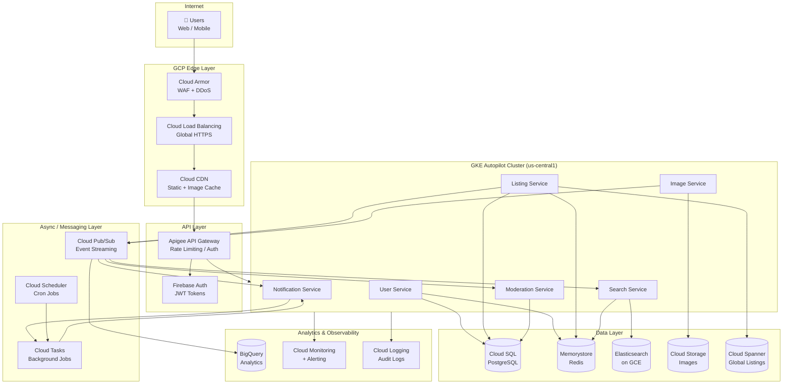
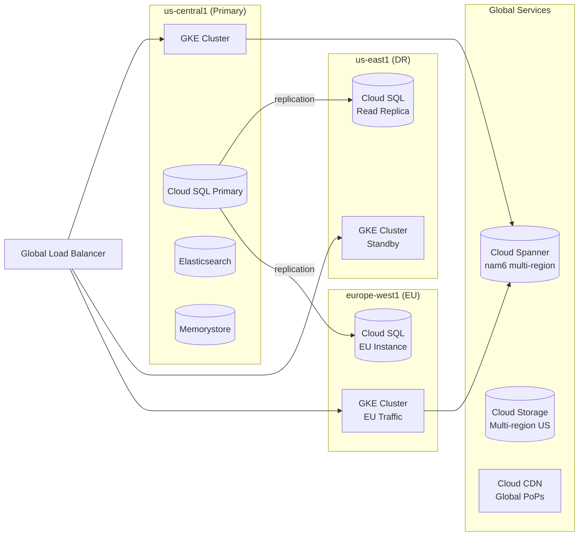

# 5. High-Level Architecture (Google Cloud Platform)

---

## 5.1 Architecture Overview

The Craigslist platform follows a **microservices architecture** deployed on **Google Kubernetes Engine (GKE)**, with clearly separated concerns for ingestion, search, storage, and delivery.

```
┌─────────────────────────────────────────────────────────────────┐
│                        INTERNET                                  │
└──────────────────────┬──────────────────────────────────────────┘
                       │
          ┌────────────▼────────────┐
          │     Cloud Armor (WAF)   │ ← DDoS, OWASP rules
          └────────────┬────────────┘
                       │
          ┌────────────▼────────────┐
          │  Cloud Load Balancing   │ ← Global L7, SSL Termination
          │  (Global HTTPS LB)      │
          └────────────┬────────────┘
                       │
          ┌────────────▼────────────┐
          │     Cloud CDN           │ ← Static assets, images cache
          └────────────┬────────────┘
                       │
          ┌────────────▼────────────┐
          │   Apigee API Gateway    │ ← Rate limiting, auth, routing
          └────────────┬────────────┘
                       │
     ┌─────────────────▼──────────────────────┐
     │         GKE Cluster (Autopilot)         │
     │  ┌──────────┐  ┌──────────┐            │
     │  │  User    │  │ Listing  │            │
     │  │ Service  │  │ Service  │            │
     │  └────┬─────┘  └────┬─────┘            │
     │       │              │                  │
     │  ┌────▼─────┐  ┌────▼─────┐            │
     │  │  Search  │  │  Image   │            │
     │  │ Service  │  │ Service  │            │
     │  └────┬─────┘  └────┬─────┘            │
     │       │              │                  │
     │  ┌────▼─────┐  ┌────▼─────┐            │
     │  │Notif.    │  │Moderation│            │
     │  │ Service  │  │ Service  │            │
     │  └──────────┘  └──────────┘            │
     └─────────────────────────────────────────┘
                       │
        ┌──────────────┼──────────────┐
        │              │              │
  ┌─────▼──────┐ ┌─────▼──────┐ ┌───▼──────────┐
  │ Cloud SQL  │ │Elasticsearch│ │  Memorystore │
  │(PostgreSQL)│ │(Search Idx) │ │   (Redis)    │
  └────────────┘ └────────────┘ └──────────────┘
        │              │
  ┌─────▼──────┐ ┌─────▼──────┐
  │  Cloud     │ │  Cloud     │
  │ Storage    │ │  Pub/Sub   │
  │ (Images)   │ │ (Events)   │
  └────────────┘ └────────────┘
        │
  ┌─────▼──────┐
  │  BigQuery  │
  │(Analytics) │
  └────────────┘
```

---

## 5.2 GCP Architecture Diagram (Mermaid)



---

## 5.3 Multi-Region Strategy

```
Primary Region:    us-central1 (Iowa)       ← Main workload
Secondary Region:  us-east1 (South Carolina) ← Failover + DR
EU Region:         europe-west1 (Belgium)    ← GDPR data residency

Traffic routing:
  - Cloud Load Balancing routes to nearest healthy region
  - Cloud Spanner: multi-region config (nam6) for low-latency global reads
  - Cloud Storage: multi-region bucket (US) for images
  - Cloud SQL: primary in us-central1, cross-region read replica in us-east1
  - Elasticsearch: single region with replicas (cross-region via Cloud Spanner)
```



---

## 5.4 Service Communication

| Pattern | Used For | Technology |
|---------|----------|-----------|
| Synchronous REST | Client ↔ API, inter-service reads | HTTP/2 via Istio service mesh |
| Async events | Listing created → search index, notifications | Cloud Pub/Sub |
| Async tasks | Email sends, expiry jobs | Cloud Tasks |
| Cron | Hourly expiry sweeps, daily digest emails | Cloud Scheduler |
| Cache-aside | Listing/search reads | Memorystore (Redis) |

---

## 5.5 GCP Services Architecture Map

```
┌────────────────────────────────────────────────────────────┐
│                    SECURITY PERIMETER                       │
│                                                            │
│  Cloud Armor ──► WAF Rules + IP Reputation + DDoS         │
│  VPC Service Controls ──► API access boundary             │
│  Cloud IAM ──► Service Account least privilege            │
│  Secret Manager ──► DB passwords, API keys                │
│  Cloud KMS ──► Encryption key management                  │
│                                                            │
└────────────────────────────────────────────────────────────┘
┌────────────────────────────────────────────────────────────┐
│                    NETWORK TOPOLOGY                         │
│                                                            │
│  VPC: craigslist-vpc (10.0.0.0/8)                        │
│    ├── subnet-gke:       10.1.0.0/16  (GKE pods/nodes)  │
│    ├── subnet-data:      10.2.0.0/16  (SQL, Redis)       │
│    ├── subnet-search:    10.3.0.0/16  (Elasticsearch)    │
│    └── subnet-pubsub:    managed by GCP                  │
│                                                            │
│  Private Google Access: enabled for all subnets           │
│  Cloud NAT: outbound internet for GKE pods                │
│  Private Service Connect: CloudSQL, Memorystore access    │
│                                                            │
└────────────────────────────────────────────────────────────┘
```

---

## 5.6 Deployment Architecture (GKE)

```yaml
# GKE Autopilot Config
Cluster:
  name: craigslist-prod
  mode: Autopilot
  region: us-central1
  network: craigslist-vpc
  
Services:
  user-service:
    replicas: 3-10 (HPA based on CPU/RPS)
    resources: 1 vCPU, 2Gi RAM per pod
    
  listing-service:
    replicas: 5-20 (HPA)
    resources: 2 vCPU, 4Gi RAM per pod
    
  search-service:
    replicas: 3-10 (HPA)
    resources: 1 vCPU, 2Gi RAM per pod
    
  image-service:
    replicas: 3-8 (HPA on queue depth)
    resources: 2 vCPU, 4Gi RAM per pod
    
  notification-service:
    replicas: 2-5
    resources: 0.5 vCPU, 1Gi RAM per pod
    
  moderation-service:
    replicas: 2-5
    resources: 1 vCPU, 2Gi RAM per pod
```

---

## 5.7 CI/CD Pipeline

```
Developer Push → GitHub Repository
                       ↓
              Cloud Build (triggers)
                       ↓
         ┌─────────────┴──────────────┐
         │  Unit Tests + Integration  │
         │  Tests + Security Scan     │
         │  (Container Analysis)      │
         └─────────────┬──────────────┘
                       ↓
              Artifact Registry
              (Docker Images)
                       ↓
              Cloud Deploy
         ┌─────────────┴──────────────┐
         │ dev → staging → production │
         │  (approval gate on prod)   │
         └────────────────────────────┘
```

---

## 5.8 Cost Optimization Strategies

| Strategy | GCP Feature | Estimated Savings |
|----------|-------------|-------------------|
| Committed use discounts | 1-year CUD on GKE, Cloud SQL | 25-57% |
| Spot VMs for Elasticsearch | Spot instances with preemption handling | 60-91% |
| Lifecycle policies on GCS | Nearline after 90 days, Coldline after 1 year | ~70% on storage |
| Autoscaling GKE pods | HPA + KEDA | Right-size compute |
| Redis TTL tuning | Expiry on stale cache entries | Reduce Redis size |
| BigQuery partitioned tables | Partition pruning on queries | Reduce query cost |
