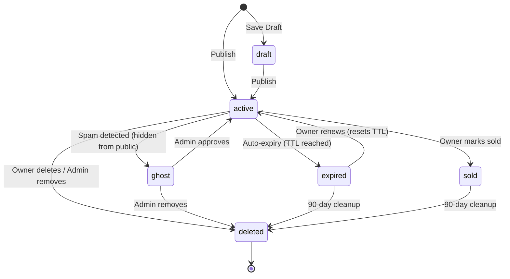

# 6. Detailed Component Design

---

## 6.1 User Service

### Responsibilities
- User registration, login, logout
- Profile management
- Email verification
- OAuth integration (Google, Facebook via Firebase Auth)
- Session management

### Component Design

```
Client Request
     │
     ▼
User Service (GKE)
     │
     ├── Firebase Auth SDK  ─────────► Firebase Authentication
     │   (token validation)              (JWT issuance/verification)
     │
     ├── User Repository ────────────► Cloud SQL (users table)
     │   (CRUD operations)
     │
     ├── Session Manager ────────────► Memorystore Redis
     │   (session cache)                KEY: session:{id} → {user_id, roles}
     │
     └── Email Queue ────────────────► Cloud Tasks (verification emails)
```

### Key Design Decisions

**Password Storage:**
```
bcrypt(password, cost=12) → stored in password_hash
Never store plaintext or reversible hashes
```

**OAuth Flow:**
```
1. Client redirects to Firebase Auth (Google/Facebook)
2. Firebase issues ID token
3. User Service validates ID token via Firebase Admin SDK
4. Creates/updates local user record (oauth_provider, oauth_sub)
5. Issues internal JWT access token
```

**Session Strategy:**
- JWT access token: 1 hour expiry, signed with RSA-256
- Refresh token: 30 days, stored in Redis with sliding window
- Logout: invalidate refresh token in Redis

---

## 6.2 Listing Service

### Responsibilities
- Create, read, update, delete listings
- Handle listing lifecycle (active → expired → deleted)
- Post rate limiting and spam pre-screening
- Trigger downstream events on create/update/delete

### Component Design

```
POST /listings
     │
     ▼
Listing Service
     │
     ├── Rate Limiter ──────────────► Redis (ratelimit:post:*)
     │   Check: 5/day per user,
     │          1/hr per IP
     │
     ├── Spam Pre-screener ─────────► Moderation Service (sync)
     │   (title/desc analysis)         returns: allow | ghost | reject
     │
     ├── Geo Encoder ───────────────► Locations table / Google Maps Geocoding API
     │   Lat/lng from address
     │
     ├── Listing Repository ────────► Cloud SQL (listings table)
     │   Write with idempotency key
     │
     ├── Search Index Publisher ────► Cloud Pub/Sub (listings-events topic)
     │   Event: listing.created
     │
     └── View Count Flush ──────────► Redis INCR → batch flush to Postgres
         (background job, 5min interval)
```

### Listing Lifecycle State Machine



### Listing Expiry Job (Cloud Scheduler)

```
Schedule: every 1 hour
Cloud Scheduler → Cloud Tasks → ExpiryWorker

ExpiryWorker:
  SELECT id FROM listings
  WHERE status = 'active' AND expires_at < NOW()
  LIMIT 10000;

  For each listing:
    UPDATE listings SET status = 'expired' WHERE id = ?
    Publish to Pub/Sub: listing.expired event
    Remove from Elasticsearch index
```

---

## 6.3 Search Service

### Responsibilities
- Full-text search across listing title and description
- Geo-filtered search by city, state, radius
- Faceted results (categories, price ranges)
- Search result caching for popular queries
- Search analytics logging

### Architecture

```
GET /listings/search?q=apartment&city=SF&max_price=2500
     │
     ▼
Search Service
     │
     ├── Cache Lookup ──────────────► Redis
     │   Key: search:{SHA256(params)}     HIT → return cached result
     │   TTL: 5 minutes                   MISS → continue
     │
     ├── Query Builder ─────────────► Build Elasticsearch DSL query
     │
     ├── Elasticsearch Client ──────► Elasticsearch cluster
     │   (Execute search)
     │
     ├── Result Enricher ───────────► Fetch thumbnail URLs from Redis/GCS
     │   (Add image URLs, distance)
     │
     ├── Cache Writer ──────────────► Store in Redis (TTL: 5 min)
     │
     └── Analytics Logger ──────────► Cloud Pub/Sub (search-events topic)
         Event: search.executed         → BigQuery for analytics
```

### Elasticsearch Query Structure

```json
{
  "query": {
    "bool": {
      "must": [
        {
          "multi_match": {
            "query": "apartment",
            "fields": ["title^3", "description", "tags^2"],
            "type": "best_fields",
            "fuzziness": "AUTO"
          }
        }
      ],
      "filter": [
        { "term": { "status": "active" } },
        { "term": { "category_id": "subcat_apts" } },
        { "range": { "price": { "lte": 2500 } } },
        {
          "geo_distance": {
            "distance": "25mi",
            "location.geo_point": { "lat": 37.7749, "lon": -122.4194 }
          }
        }
      ],
      "should": [
        { "term": { "is_promoted": true, "boost": 2.0 } }
      ]
    }
  },
  "sort": [
    { "is_promoted": { "order": "desc" } },
    { "_score": { "order": "desc" } },
    { "created_at": { "order": "desc" } }
  ],
  "aggs": {
    "categories": { "terms": { "field": "category_id", "size": 10 } },
    "price_ranges": {
      "range": {
        "field": "price",
        "ranges": [
          { "to": 500 }, { "from": 500, "to": 1000 },
          { "from": 1000, "to": 2000 }, { "from": 2000 }
        ]
      }
    }
  },
  "size": 25,
  "from": 0
}
```

### Search Index Sync (Pub/Sub Consumer)

```
Cloud Pub/Sub (listings-events)
     │
     ├── listing.created  → Add document to Elasticsearch
     ├── listing.updated  → Update document in Elasticsearch
     ├── listing.expired  → Delete document from Elasticsearch
     ├── listing.deleted  → Delete document from Elasticsearch
     └── listing.ghosted  → Delete document from Elasticsearch

Indexing latency: < 30 seconds (acceptable eventual consistency)
Retry: up to 5 attempts with exponential backoff
Dead Letter Queue: listings-events-dlq (for manual review)
```

---

## 6.4 Image Service

### Responsibilities
- Generate pre-signed GCS upload URLs
- Process uploaded images (resize, strip EXIF, convert)
- Serve processed image URLs via Cloud CDN
- Track image processing status

### Upload Flow

```
Client                    Image Service            GCS
  │                            │                    │
  │ POST /images/upload-url    │                    │
  │ ─────────────────────────► │                    │
  │                            │ Create GCS signed  │
  │                            │ URL (15 min TTL)   │
  │                            │ ──────────────────►│
  │                            │◄── signed URL ─────│
  │◄──── { upload_url, image_id} ─                  │
  │                            │                    │
  │ PUT <signed_url> (image bytes)                  │
  │ ──────────────────────────────────────────────► │
  │◄──── 200 OK ──────────────────────────────────  │
  │                            │                    │
  │                    GCS triggers               GCS triggers
  │                    Cloud Function:            Pub/Sub notification
  │                    image.uploaded event            │
  │                            │                    │
  │                    Image Processor ◄───────────────┘
  │                    (resize → thumbnail/medium/large)
  │                            │
  │                    Update images table status = 'ready'
  │                    Store CDN URLs in images table
```

### Image Processing Pipeline (Cloud Run Function)

```python
# Triggered by GCS object finalize event
def process_image(event):
    image_id = event['metadata']['image_id']
    gcs_path = event['name']
    
    # Download original
    original = download_from_gcs(gcs_path)
    
    # Strip EXIF (privacy: remove GPS coordinates)
    stripped = strip_exif(original)
    
    # Generate variants
    variants = {
        'thumbnail': resize(stripped, width=150, height=150, crop=True),
        'medium':    resize(stripped, width=600),
        'large':     resize(stripped, width=1200),
    }
    
    # Upload variants to GCS
    cdn_urls = {}
    for name, data in variants.items():
        path = f"processed/{image_id}/{name}.webp"
        cdn_url = upload_to_gcs(data, path, format='webp')
        cdn_urls[name] = f"https://cdn.craigslist.com/{path}"
    
    # Update database
    update_image_status(image_id, 'ready', cdn_urls)
```

---

## 6.5 Notification Service

### Responsibilities
- Send transactional emails (verification, listing expiry, contact relay)
- Send saved search alert emails (daily digest)
- Rate limit notifications to prevent spam
- Track delivery status

### Components

```
Cloud Pub/Sub (notification-events)
     │
     ├── user.registered      → Send verification email
     ├── listing.contact      → Relay message to poster (anonymous)
     ├── listing.expiring_soon → Send 3-day expiry warning
     ├── listing.expired      → Send renewal prompt
     └── saved_search.match   → Daily digest of new matching listings

Notification Service
     │
     ├── Template Engine (Jinja2/Handlebars)
     │   Templates stored in Cloud Storage
     │
     ├── Email Provider ─────────────────► SendGrid / Mailgun via Cloud Tasks
     │   (not Google's own SMTP — better deliverability)
     │
     └── Delivery Tracker ───────────────► Cloud SQL (notifications table)
         Status: queued → sent → opened → clicked | bounced | failed
```

### Contact Relay (Privacy-Preserving)

```
1. Buyer sends message via POST /listings/:id/contact
2. Listing Service publishes event: listing.contact with encrypted buyer email
3. Notification Service:
   a. Spam-score the message body
   b. If spam_score > 0.8: drop silently
   c. Else: relay to poster via anonymous email:
      From: reply-<token>@mail.craigslist.com
      To: poster@example.com (looked up from DB)
      Reply-To: reply-<token>@mail.craigslist.com (maps back to buyer)
4. Buyer's actual email is NEVER revealed to poster
```

---

## 6.6 Moderation Service

### Responsibilities
- Automated spam detection on new listings
- Process user flag reports
- Ghost posting (spam flagged, hidden from search)
- Admin review interface backend

### Spam Detection Pipeline

```
New Listing Submitted
         │
         ▼
  ┌──────────────────────────────────────────────┐
  │            Spam Scoring Engine               │
  │                                              │
  │  Score 1: IP reputation check               │
  │    (blocklist: known spam IPs)              │
  │                                              │
  │  Score 2: Account age & history             │
  │    (< 7 days old + first post = higher risk) │
  │                                              │
  │  Score 3: Title/description heuristics      │
  │    (price too good, suspicious URLs,         │
  │     copy-paste duplicate detection)          │
  │                                              │
  │  Score 4: Phone/email pattern matching      │
  │    (blocklisted numbers/email patterns)     │
  │                                              │
  │  Score 5: Image hash dedup                  │
  │    (perceptual hash via PHash)               │
  │                                              │
  │  Composite Score:                            │
  │    < 0.3  → Allow (status: active)          │
  │    0.3-0.7 → Review queue (status: ghost)   │
  │    > 0.7  → Auto-reject (status: ghost)     │
  └──────────────────────────────────────────────┘
```

### Flag Processing

```
User submits flag → listing.flag_count++ (atomic Postgres update)

If flag_count >= 3:
  Auto-ghost listing (status: ghost, removed from search)
  Add to moderation queue

Admin Review:
  - View flagged listing
  - Actions: Approve (restore), Remove (delete), Suspend user
  - Decision logged with admin_id and timestamp
```

---

## 6.7 Analytics Service (BigQuery)

### Event Stream Architecture

```
All Services → Cloud Pub/Sub (analytics-events)
                                │
                                ▼
                    Dataflow Streaming Pipeline
                    (Pub/Sub → BigQuery)
                                │
                                ▼
                    BigQuery Dataset: craigslist_analytics

Tables:
  search_events       - query, filters, result_count, user_id, timestamp
  listing_views       - listing_id, viewer_ip, referrer, timestamp  
  listing_contacts    - listing_id, category, city, timestamp
  user_registrations  - user_id, source, device, timestamp
  listing_created     - listing_id, category, city, price, timestamp
  listing_expired     - listing_id, was_renewed, time_to_expiry
```

### Key Analytics Queries

**Daily Active Listings by City:**
```sql
SELECT location_city, COUNT(*) as active_listings
FROM craigslist_analytics.listing_created
WHERE DATE(timestamp) = CURRENT_DATE()
GROUP BY location_city
ORDER BY active_listings DESC
LIMIT 20;
```

**Search Conversion Funnel:**
```sql
SELECT
  DATE(s.timestamp) as date,
  COUNT(DISTINCT s.session_id) as searches,
  COUNT(DISTINCT v.session_id) as view_clicks,
  COUNT(DISTINCT c.session_id) as contacts,
  ROUND(COUNT(DISTINCT v.session_id) / COUNT(DISTINCT s.session_id) * 100, 2) as ctr_pct
FROM search_events s
LEFT JOIN listing_views v USING (session_id)
LEFT JOIN listing_contacts c USING (session_id)
GROUP BY date
ORDER BY date DESC;
```
