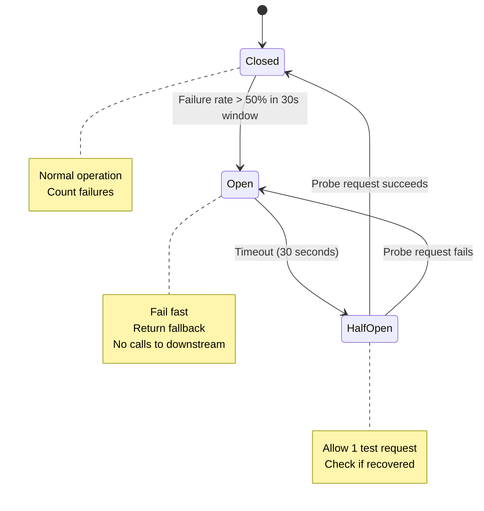

# 8. Failure Scenario Discussion

---

## 8.1 Failure Categories

```
1. Single Component Failures  — Database down, Redis crash
2. Network Failures           — Partition between services
3. Data Integrity Failures    — Duplicate listings, lost updates
4. Overload / Traffic Spikes  — 10× traffic burst
5. External Dependency Failures — Firebase Auth outage
6. Regional / Zonal Outages   — GCP zone failure
7. Cascading Failures         — One service downs others
8. Data Corruption / Ransomware
```

---

## 8.2 Database Failure Scenarios

### Scenario: Cloud SQL Primary Goes Down

**Detection:**
- Cloud SQL sends health checks to monitoring
- Connection errors surface in GKE pods within 10s
- Cloud Monitoring alert fires within 30s

**Impact:**
- All writes fail (listing creates, updates, deletions)
- Reads continue from read replicas (degraded mode)
- User logins may fail (depends on replica config)

**Mitigation Strategy:**
```
1. Cloud SQL High Availability (HA) enabled:
   - Automatic failover to standby in < 60 seconds
   - Failover is transparent to applications via Cloud SQL proxy

2. During failover window (< 60s):
   - Listing Service: queue writes in Cloud Tasks (retry with backoff)
   - Return 503 with "Retry-After: 60" header to clients
   - Reads continue from read replicas

3. After failover:
   - Drain the Cloud Tasks queue
   - Alert on-call engineer with alert + runbook link

4. DR scenario (region failure):
   - Cross-region read replica promoted to primary in us-east1
   - DNS failover via Cloud Load Balancing health check
   - RTO: < 5 minutes, RPO: < 1 minute (replication lag)
```

**Circuit Breaker:**
```python
# Listing Service uses circuit breaker pattern
@circuit_breaker(failure_threshold=5, recovery_timeout=30)
def write_listing(listing_data):
    return db.execute("INSERT INTO listings ...")

# OPEN state: writes queue to Cloud Tasks
# HALF-OPEN state: probe DB before re-enabling
# CLOSED state: normal operation
```

---

### Scenario: Redis (Memorystore) Goes Down

**Impact:**
- Cache misses — all reads go directly to PostgreSQL
- Rate limiting breaks — reads/writes bypass limits temporarily
- Session lookups fail — users get logged out

**Mitigation:**
```
1. Memorystore Standard Tier: automatic HA with replica
   - Failover in < 30 seconds

2. If Redis fully unavailable:
   - Rate limiting: fall back to in-memory counters (per-pod, less accurate)
   - Sessions: fall back to JWT validation only (stateless)
   - Listing cache: serve directly from PostgreSQL
   - Search cache: serve directly from Elasticsearch

3. DB protection during cache miss storm:
   - Connection pool limits (max 100 connections per pod)
   - Implement request coalescing (multiple identical requests → one DB query)
   - Circuit breaker if DB connections saturate
```

---

## 8.3 Search Service Failure

### Scenario: Elasticsearch Cluster Unreachable

**Impact:**
- Search returns no results
- Browse by category still works (PostgreSQL query)
- Create/edit listings still work

**Mitigation:**
```
1. Search Service: return degraded response
   {
     "results": [],
     "message": "Search is temporarily unavailable. Browse by category instead.",
     "fallback_url": "/browse/category/<id>/city/<slug>"
   }

2. Circuit breaker on Elasticsearch calls:
   - After 5 failures: OPEN circuit, return fallback immediately
   - Prevents timeout pile-up on the Search Service pod

3. Background: Elasticsearch auto-recovers via GCE instance restart
   - Unprocessed Pub/Sub messages: retry with up to 7 day retention
   - On recovery: consume backlog and reindex missed listings

4. If data nodes lost (disk failure):
   - 1 replica per shard → any single data node failure causes no data loss
   - Automatic shard reallocation
   - For catastrophic loss: rebuild from PostgreSQL + Cloud Spanner
     (rebuild script: SELECT all active listings → bulk index to ES)
```

---

## 8.4 Traffic Spike / Overload

### Scenario: 10× Normal Traffic (Viral Listing, Bot Attack)

**Normal:**   5,200 read RPS, 350 search RPS
**Spike:**   52,000 read RPS, 3,500 search RPS

**Mitigation:**
```
Layer 1: Cloud Armor
  - DDoS protection automatically absorbs volumetric attacks
  - WAF rules: block suspicious patterns (scrapers, bots)
  - Google absorbs the first hit before it reaches Load Balancer

Layer 2: Cloud Load Balancing
  - Distributes traffic globally across all healthy backends
  - Auto-scales to handle burst with no config needed

Layer 3: GKE HPA (Horizontal Pod Autoscaler)
  - Listing Service: scales from 5 → 20 pods in ~90 seconds
  - Search Service: scales from 3 → 10 pods
  - Triggered by CPU > 60% OR custom RPS metric

Layer 4: Rate Limiting (Apigee)
  - Search: 100 req/min per IP
  - Anonymous browse: 500 req/min per IP
  - Per-account: 1000 req/min
  - Excess → 429 Too Many Requests

Layer 5: Cache
  - Redis absorbs hot listing reads (10 min TTL)
  - Viral listing → cache hit rate approaches 99%

Layer 6: Database Connection Pool
  - Max 100 connections per Cloud SQL instance
  - PgBouncer sidecar in each pod for connection pooling
```

---

## 8.5 Duplicate Listing Creation (Data Integrity)

### Scenario: Client Double-Posts (Network Retry)

**Problem:** User taps "Post" twice due to slow network → two identical listings created.

**Mitigation:**
```
1. Client generates a UUID (Idempotency-Key) per submit action
2. Sends in header: Idempotency-Key: 550e8400-e29b-41d4-a716-446655440000

3. Listing Service:
   a. Check Redis: SETNX idempotency:{key} → listing_id
      TTL: 24 hours
   b. If key exists in Redis: return existing listing (idempotent response)
   c. If not exists: create listing, store key → listing_id in Redis

4. Database level:
   CREATE TABLE listings (
     idempotency_key UUID UNIQUE  -- DB constraint as backup
   );
   
   Prevents race conditions if Redis check races.
```

---

## 8.6 Pub/Sub Message Loss

### Scenario: Listing Created but Search Index Not Updated

**Problem:** Cloud Pub/Sub message dropped or Search Consumer crashes after ACK before processing.

**Mitigation:**
```
1. Consumer does NOT ACK until processing is complete:
   
   def process_message(message):
     try:
       index_listing_in_elasticsearch(message.data)
       message.ack()  # Only ACK after successful indexing
     except Exception as e:
       message.nack()  # Return to queue for retry
   
2. Pub/Sub retry policy:
   - Minimum backoff: 10 seconds
   - Maximum backoff: 600 seconds (10 minutes)
   - Dead letter topic after 5 failed deliveries
   
3. Dead letter queue (listings-events-dlq):
   - Alert fires when DLQ has messages
   - On-call engineer investigates root cause
   - Replay from DLQ after fix

4. Reconciliation job (runs nightly):
   - Query PostgreSQL: all active listings
   - Compare with Elasticsearch: all indexed listings
   - Re-index missing listings (< 0.01% expected)
```

---

## 8.7 Image Processing Failure

### Scenario: Image Processor (Cloud Function) Crashes Mid-Process

**Impact:** Listing created with `processing_status = 'pending'`, images never appear.

**Mitigation:**
```
1. GCS trigger → Cloud Function (idempotent processing):
   - Function checks: if images table status = 'ready', skip (already done)
   - Pure function: same input always produces same output

2. If Cloud Function consistently fails:
   - Cloud Function retry: up to 3 times with backoff
   - After 3 failures: publish to image-processing-dlq

3. Stale image detection job (Cloud Scheduler, hourly):
   SELECT * FROM images
   WHERE processing_status = 'pending'
   AND created_at < NOW() - INTERVAL '2 hours';
   
   → Trigger reprocessing via Cloud Tasks for each stale image

4. User-facing graceful degradation:
   - Listing shown without images
   - "Images are being processed, please check back in a few minutes."
```

---

## 8.8 Cascading Failure Prevention

### Circuit Breaker Pattern (All Inter-Service Calls)



### Bulkhead Pattern (Resource Isolation)

```
Listing Service has separate connection pools:
  - Pool A: 50 connections for PostgreSQL primary (writes)
  - Pool B: 50 connections for PostgreSQL replica (reads)
  - Pool C: 20 connections for Redis
  - Pool D: 10 connections for Moderation Service (internal)

If Moderation Service is slow:
  Pool D exhausts → spam check fails open → listing allowed
  Does NOT affect Pools A, B, C → reads/writes continue normally
```

---

## 8.9 Regional Outage (GCP Zone / Region Failure)

### Scenario: us-central1 Fully Unavailable

```
1. Cloud Load Balancing detects backend unhealthy within 30 seconds
2. Traffic reroutes to us-east1 (DR region)

us-east1 in DR mode:
  - GKE cluster (cold standby) warms up in ~5 minutes
  - Cloud SQL read replica promoted to primary
  - Elasticsearch: either rebuild from Spanner or accept degraded search

Data consistency:
  - Cloud Spanner (multi-region nam6): continues serving from us-east1
  - PostgreSQL: RPO < 1 min (replication lag)
  - Redis: cold cache — DB takes higher load initially

Estimated RTO: 5-10 minutes
Estimated RPO: < 1 minute

Runbook trigger:
  Cloud Monitoring alert → PagerDuty → On-call engineer
  Failover is semi-automatic (one-click in Cloud Console)
```

---

## 8.10 Security Failure Scenarios

### Scenario: Compromised JWT Token (Stolen Access Token)

```
Mitigation:
1. Short-lived access tokens (1 hour) — window of exposure limited
2. Token revocation list in Redis (for logout/compromise)
   - Key: revoked_token:{jti} → 1 (TTL: token expiry time)
   - Every auth check: verify token AND check revocation list

3. Anomaly detection:
   - Token used from 2 countries within 10 minutes → flag + require re-auth
   - Unusual activity (100 listings in 1 hour) → auto-suspend account

4. If private signing key compromised:
   - Rotate to new RSA key pair in Secret Manager
   - Re-issue all tokens (mass logout)
   - Old key marked invalid immediately
```

### Scenario: SQL Injection Attempt

```
All DB access via parameterized queries (ORM/prepared statements):
  db.execute("SELECT * FROM listings WHERE id = %s", [listing_id])
  ← Never string concatenation

Input sanitization:
  - HTML/JS stripped from title and description (no XSS)
  - Price must be numeric
  - Location validated against geocoding API
  - Tags sanitized to alphanumeric + hyphen

WAF (Cloud Armor):
  - OWASP ModSecurity Core Rule Set
  - SQL injection patterns blocked at edge
```

---

## 8.11 Failure Summary Matrix

| Scenario | Detection | Response | RTO | RPO |
|----------|-----------|----------|-----|-----|
| Cloud SQL primary failure | Auto health check | HA failover (automatic) | < 60s | < 1min |
| Redis failure | Connection error | Fall back to DB | 30s | N/A (cache) |
| Elasticsearch failure | Circuit breaker | Degraded search mode | N/A | N/A (re-index) |
| GKE pod crash | Kubernetes liveness probe | Auto-restart pod | < 30s | None (stateless) |
| 10× traffic spike | HPA metrics | Auto-scale pods | 90s | None |
| Pub/Sub message loss | DLQ alert | Manual reprocessing | < 24h | None (replayed) |
| GCP zone failure | LB health check | Cross-zone routing | < 30s | None |
| GCP region failure | LB health check | DR region failover | 5-10min | < 1min |
| Image processing failure | Stale image job | Requeue via Cloud Tasks | 2h | None |
| Duplicate post | Idempotency key | Return existing listing | Immediate | None |
