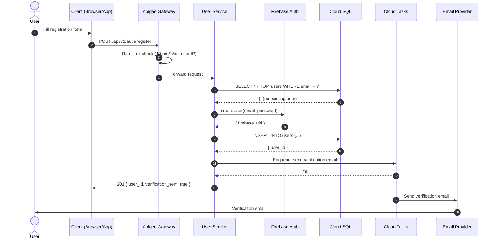
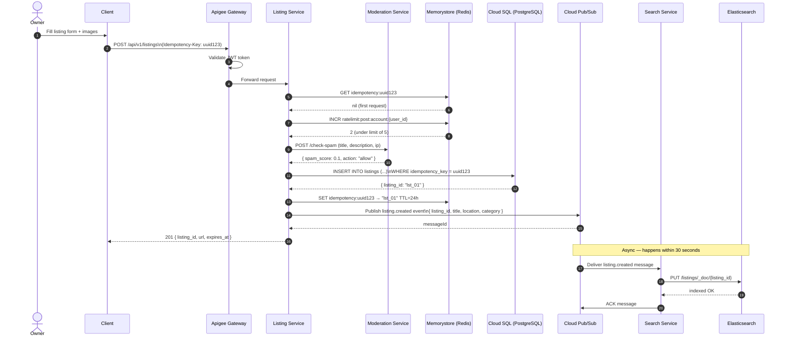
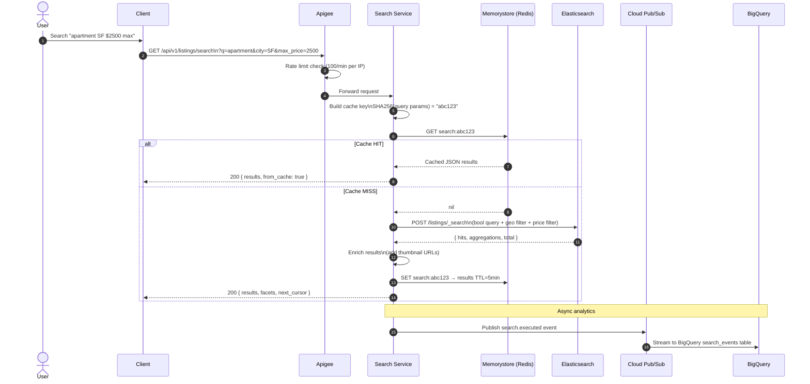
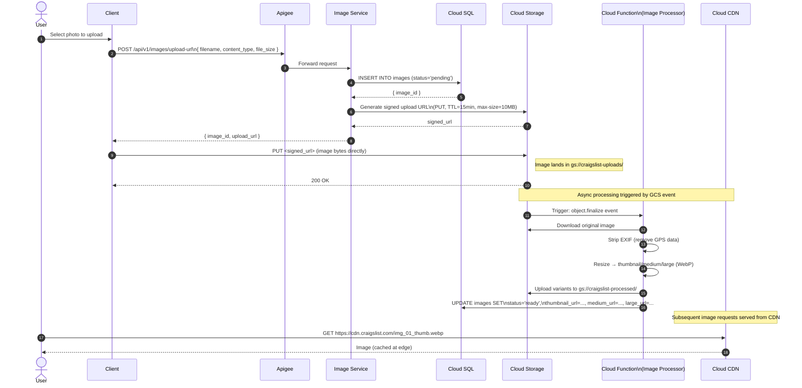
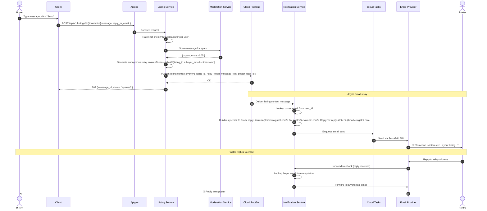
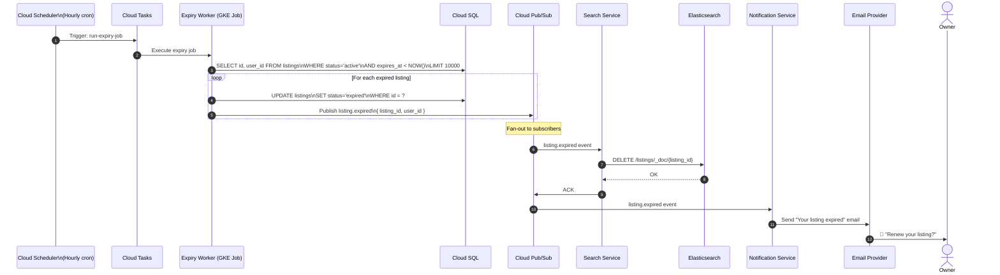
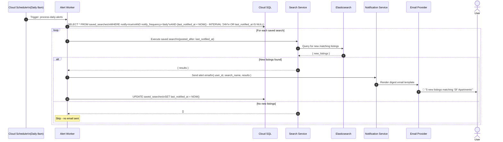
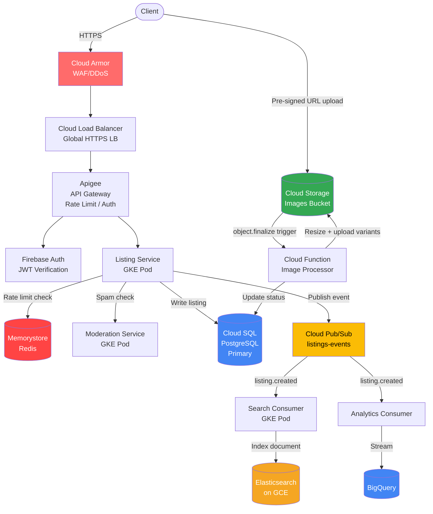

# 9. Sequence Diagrams & Request Flows

---

## 9.1 User Registration Flow

---

## 9.2 Create Listing Flow

---

## 9.3 Search Listing Flow

---

## 9.4 Image Upload Flow

---

## 9.5 Contact Poster Flow (Anonymous Email Relay)

---

## 9.6 Listing Expiry Flow

---

## 9.7 Saved Search Alert Flow

---

## 9.8 Write Path + GCP Services Diagram

---

## 9.9 Key Request Flows Summary

| Flow | Key Services | SLA Target |
|------|-------------|-----------|
| User registration | User Service → Firebase → Cloud SQL → Cloud Tasks | < 500ms |
| Create listing | Listing Service → Moderation → Cloud SQL → Pub/Sub | < 300ms |
| Browse listings | Listing Service → Redis (cache) → Cloud SQL | < 100ms (cache) / 300ms (DB) |
| Search listings | Search Service → Redis → Elasticsearch | < 150ms (cache) / 300ms (ES) |
| Image upload URL | Image Service → Cloud SQL → GCS | < 200ms |
| Contact poster | Listing Service → Moderation → Pub/Sub | < 200ms (async email) |
| Listing expiry | Scheduler → Cloud Tasks → Worker → Cloud SQL + ES | Background, hourly |
| Saved search alert | Scheduler → Worker → ES → Email | Background, daily |
