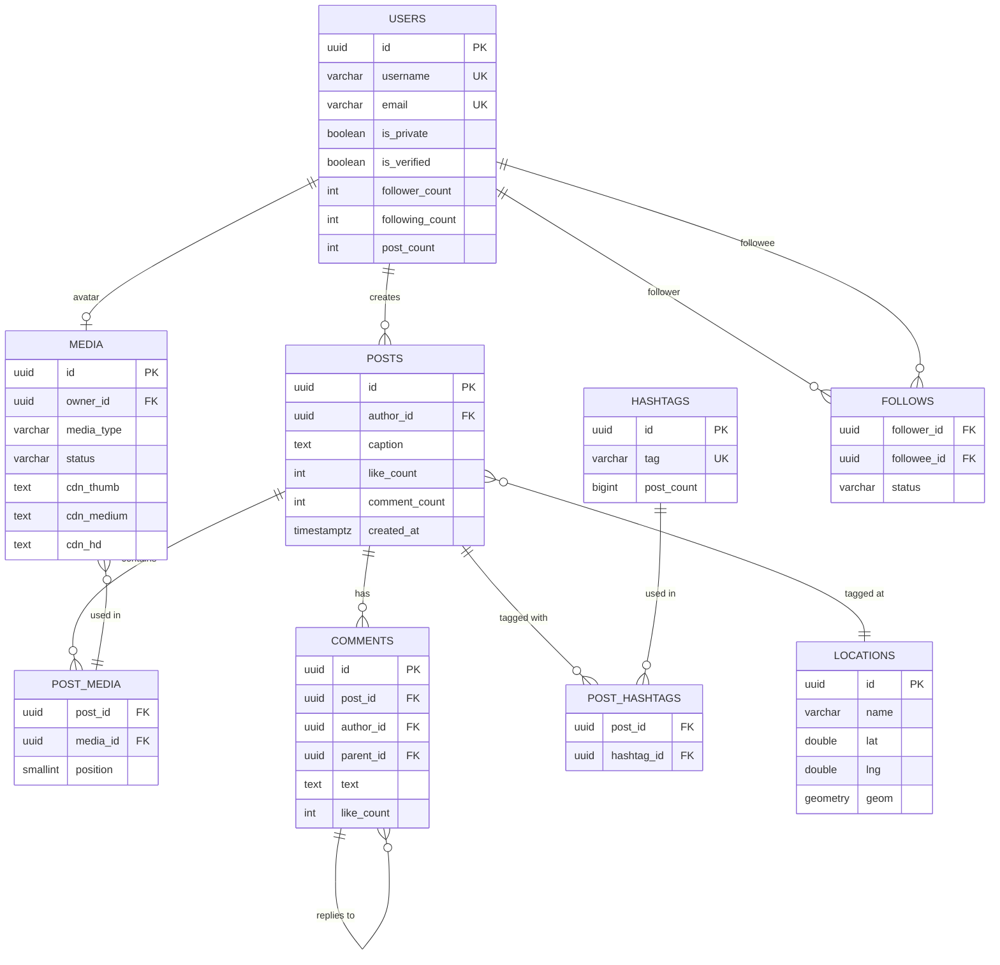

# 04 — Database Design

## System: Photo Sharing Service (Instagram-Scale)

---

## Database Technology Choices

| Store | Technology | Why |
|-------|-----------|-----|
| Users, Posts, Comments | **Cloud SQL (PostgreSQL 16)** | Relational integrity, complex queries, ACID guarantees |
| Follow Graph | **Cloud Spanner** | Globally distributed, strong consistency, bi-directional follow queries |
| Likes | **Cloud Bigtable** | Extreme write throughput (70K/sec peak), simple key lookups |
| Media Metadata | **Cloud Bigtable** | High write throughput, append-only, row key = media_id |
| Feed Cache | **Memorystore (Redis 7)** | Sub-millisecond reads, sorted sets for ordered feeds |
| Hot Like Counts | **Memorystore (Redis 7)** | Counter increments, eventual sync to Bigtable |
| Search Index | **Elasticsearch 8** on GCE | Full-text, fuzzy matching, hashtag & geo search |
| Media Files | **Cloud Storage (GCS)** | 11-nines durability, multi-region, CDN integration |
| Analytics | **BigQuery** | Petabyte-scale analytics, ML feature store |

---

## Schema Design

### 1. `users` Table — Cloud SQL (PostgreSQL)

```sql
CREATE TABLE users (
    id              UUID            PRIMARY KEY DEFAULT gen_random_uuid(),
    username        VARCHAR(30)     NOT NULL UNIQUE,
    email           VARCHAR(255)    NOT NULL UNIQUE,
    phone           VARCHAR(20)     UNIQUE,
    display_name    VARCHAR(100),
    bio             VARCHAR(150),
    website         VARCHAR(255),
    avatar_media_id UUID            REFERENCES media(id),
    is_verified     BOOLEAN         NOT NULL DEFAULT FALSE,
    is_private      BOOLEAN         NOT NULL DEFAULT FALSE,
    is_active       BOOLEAN         NOT NULL DEFAULT TRUE,
    post_count      INT             NOT NULL DEFAULT 0,
    follower_count  INT             NOT NULL DEFAULT 0,
    following_count INT             NOT NULL DEFAULT 0,
    created_at      TIMESTAMPTZ     NOT NULL DEFAULT NOW(),
    updated_at      TIMESTAMPTZ     NOT NULL DEFAULT NOW(),
    deleted_at      TIMESTAMPTZ     -- soft delete for GDPR
);

CREATE INDEX idx_users_username ON users(username);
CREATE INDEX idx_users_email ON users(email);
CREATE INDEX idx_users_created_at ON users(created_at DESC);
-- Partial index for active users only
CREATE INDEX idx_users_active ON users(username) WHERE is_active = TRUE;
```

### 2. `posts` Table — Cloud SQL (PostgreSQL)

```sql
CREATE TABLE posts (
    id              UUID            PRIMARY KEY DEFAULT gen_random_uuid(),
    author_id       UUID            NOT NULL REFERENCES users(id),
    caption         TEXT,
    location_id     UUID            REFERENCES locations(id),
    like_count      INT             NOT NULL DEFAULT 0,  -- counter cache
    comment_count   INT             NOT NULL DEFAULT 0,  -- counter cache
    view_count      BIGINT          NOT NULL DEFAULT 0,
    is_deleted      BOOLEAN         NOT NULL DEFAULT FALSE,
    created_at      TIMESTAMPTZ     NOT NULL DEFAULT NOW(),
    updated_at      TIMESTAMPTZ     NOT NULL DEFAULT NOW()
);

-- Composite index: most common query is "posts by user, latest first"
CREATE INDEX idx_posts_author_created ON posts(author_id, created_at DESC)
    WHERE is_deleted = FALSE;

CREATE INDEX idx_posts_created_at ON posts(created_at DESC)
    WHERE is_deleted = FALSE;

-- Partition by month to keep table manageable
-- (In practice, use declarative partitioning in PostgreSQL 16)
CREATE TABLE posts_2026_03 PARTITION OF posts
    FOR VALUES FROM ('2026-03-01') TO ('2026-04-01');
```

### 3. `post_media` Table — Cloud SQL (PostgreSQL)

```sql
-- Junction table: a post can have multiple media items (carousel)
CREATE TABLE post_media (
    post_id         UUID            NOT NULL REFERENCES posts(id),
    media_id        UUID            NOT NULL REFERENCES media(id),
    position        SMALLINT        NOT NULL DEFAULT 0,  -- carousel order
    PRIMARY KEY (post_id, media_id)
);

CREATE INDEX idx_post_media_post_id ON post_media(post_id, position);
```

### 4. `media` Table — Cloud SQL (PostgreSQL)

```sql
CREATE TABLE media (
    id              UUID            PRIMARY KEY DEFAULT gen_random_uuid(),
    owner_id        UUID            NOT NULL REFERENCES users(id),
    media_type      VARCHAR(10)     NOT NULL CHECK (media_type IN ('photo', 'video')),
    status          VARCHAR(20)     NOT NULL DEFAULT 'processing'
                    CHECK (status IN ('uploading', 'processing', 'ready', 'failed')),
    -- GCS paths
    gcs_original    TEXT,           -- gs://bucket/originals/xxx.jpg
    gcs_thumb       TEXT,           -- gs://bucket/thumbs/xxx.webp
    gcs_medium      TEXT,           -- gs://bucket/medium/xxx.webp
    gcs_hd          TEXT,           -- gs://bucket/hd/xxx.webp
    -- CDN URLs (populated after processing)
    cdn_thumb       TEXT,
    cdn_medium      TEXT,
    cdn_hd          TEXT,
    -- Metadata
    width           INT,
    height          INT,
    duration_ms     INT,            -- for video only
    file_size_bytes BIGINT,
    content_type    VARCHAR(50),
    -- Safety
    csam_checked    BOOLEAN         NOT NULL DEFAULT FALSE,
    nsfw_score      FLOAT,
    created_at      TIMESTAMPTZ     NOT NULL DEFAULT NOW()
);

CREATE INDEX idx_media_owner ON media(owner_id, created_at DESC);
CREATE INDEX idx_media_status ON media(status) WHERE status != 'ready';
```

### 5. `comments` Table — Cloud SQL (PostgreSQL)

```sql
CREATE TABLE comments (
    id              UUID            PRIMARY KEY DEFAULT gen_random_uuid(),
    post_id         UUID            NOT NULL REFERENCES posts(id),
    author_id       UUID            NOT NULL REFERENCES users(id),
    parent_id       UUID            REFERENCES comments(id),  -- for replies
    text            VARCHAR(2200)   NOT NULL,
    like_count      INT             NOT NULL DEFAULT 0,
    is_deleted      BOOLEAN         NOT NULL DEFAULT FALSE,
    created_at      TIMESTAMPTZ     NOT NULL DEFAULT NOW()
);

-- Fetch all top-level comments for a post, newest first
CREATE INDEX idx_comments_post_top_level ON comments(post_id, created_at DESC)
    WHERE parent_id IS NULL AND is_deleted = FALSE;

-- Fetch replies for a comment
CREATE INDEX idx_comments_parent ON comments(parent_id, created_at ASC)
    WHERE is_deleted = FALSE;
```

### 6. `locations` Table — Cloud SQL (PostgreSQL)

```sql
CREATE TABLE locations (
    id              UUID            PRIMARY KEY DEFAULT gen_random_uuid(),
    name            VARCHAR(200)    NOT NULL,
    lat             DOUBLE PRECISION NOT NULL,
    lng             DOUBLE PRECISION NOT NULL,
    post_count      INT             NOT NULL DEFAULT 0,
    created_at      TIMESTAMPTZ     NOT NULL DEFAULT NOW()
);

-- PostGIS for geo queries
CREATE EXTENSION postgis;
ALTER TABLE locations ADD COLUMN geom GEOMETRY(Point, 4326);
UPDATE locations SET geom = ST_SetSRID(ST_MakePoint(lng, lat), 4326);
CREATE INDEX idx_locations_geom ON locations USING GIST(geom);
CREATE INDEX idx_locations_name ON locations USING GIN(to_tsvector('english', name));
```

### 7. `hashtags` + `post_hashtags` — Cloud SQL (PostgreSQL)

```sql
CREATE TABLE hashtags (
    id          UUID        PRIMARY KEY DEFAULT gen_random_uuid(),
    tag         VARCHAR(100) NOT NULL UNIQUE,
    post_count  BIGINT      NOT NULL DEFAULT 0,
    created_at  TIMESTAMPTZ NOT NULL DEFAULT NOW()
);

CREATE TABLE post_hashtags (
    post_id     UUID    NOT NULL REFERENCES posts(id),
    hashtag_id  UUID    NOT NULL REFERENCES hashtags(id),
    PRIMARY KEY (post_id, hashtag_id)
);

CREATE INDEX idx_post_hashtags_hashtag ON post_hashtags(hashtag_id);
```

---

## Cloud Bigtable Schema

### `likes` Table

```
Row key:   {post_id}#{user_id}       (ensures hot-spotting avoidance)
Column family: like_data
  - ts          (timestamp of like action, microseconds)
  - action      ("like" or "unlike")

Example row:
  pst_7t3n8z2k#usr_abc123
    like_data:ts     = 1710242400000000
    like_data:action = "like"
```

**Lookup patterns:**
- "Did user X like post Y?" → exact row key lookup, O(1)
- "Who liked post Y?" → row key prefix scan `{post_id}#*`
- Like count → stored in Redis (Memorystore) counter, async synced to Cloud SQL

### `media_processing_events` Table

```
Row key:   {media_id}#{timestamp_ms}
Column family: event
  - status      (uploading | processing | ready | failed)
  - worker_id
  - duration_ms

Retention: 7 days (TTL-based auto-deletion)
```

---

## Follow Graph — Cloud Spanner

Cloud Spanner is chosen because:
1. Strong consistency globally (needed for private account access control)
2. Handles bi-directional lookups efficiently
3. Horizontally scales write throughput

```sql
-- In Cloud Spanner DDL

CREATE TABLE follows (
    follower_id     STRING(36)  NOT NULL,   -- UUID of the person following
    followee_id     STRING(36)  NOT NULL,   -- UUID of the person being followed
    status          STRING(20)  NOT NULL,   -- 'active', 'pending', 'blocked'
    created_at      TIMESTAMP   NOT NULL OPTIONS (allow_commit_timestamp=true)
) PRIMARY KEY (follower_id, followee_id);

-- Secondary index for "who follows user X?" (fan-out on write reads)
CREATE INDEX idx_follows_followee
    ON follows(followee_id, follower_id)
    STORING (status, created_at);
```

**Access patterns:**
| Query | Index Used |
|-------|-----------|
| "Do I follow user X?" | PK: `(my_id, x_id)` → O(1) point read |
| "Who do I follow?" | PK prefix scan: `follower_id = me` |
| "Who follows me?" | Secondary index: `followee_id = me` |
| "Blocked users" | PK prefix scan with `status = 'blocked'` filter |

---

## Redis (Memorystore) Data Structures

### Feed Cache

```
Key:    feed:{user_id}
Type:   Sorted Set (ZSET)
Score:  feed_ranking_score (float, computed by Feed Ranking Service)
Member: post_id

Example:
  ZADD feed:usr_abc123 0.94 pst_7t3n8z2k
  ZADD feed:usr_abc123 0.87 pst_9z2m1k4x
  ZRANGE feed:usr_abc123 0 19 REV  → top 20 posts

TTL: 24 hours (LRU eviction for inactive users)
Max size: 100 items per user (trim on fan-out write)
```

### Like Counters (Write-Through)

```
Key:    likes:count:{post_id}
Type:   String (atomic integer)
Ops:    INCR / DECR

Sync:   Every 30 seconds, a background job reads all dirty counters
        and writes them to Cloud SQL posts.like_count

Key:    likes:user:{user_id}:{post_id}
Type:   String ("1" = liked, absent = not liked)
TTL:    1 hour (hot posts stay in cache longer via access)
```

### Session / Auth Tokens

```
Key:    session:{session_id}
Type:   Hash
Fields: user_id, device_type, created_at, last_seen
TTL:    30 days (sliding window, refreshed on each request)
```

---

## Elasticsearch Index Schemas

### `users` Index

```json
{
  "mappings": {
    "properties": {
      "id":             { "type": "keyword" },
      "username":       { "type": "text", "analyzer": "standard",
                          "fields": { "keyword": { "type": "keyword" } } },
      "display_name":   { "type": "text", "analyzer": "standard" },
      "bio":            { "type": "text" },
      "follower_count": { "type": "long" },
      "is_verified":    { "type": "boolean" },
      "is_private":     { "type": "boolean" },
      "created_at":     { "type": "date" }
    }
  },
  "settings": {
    "number_of_shards": 5,
    "number_of_replicas": 1
  }
}
```

### `hashtags` Index

```json
{
  "mappings": {
    "properties": {
      "tag":        { "type": "keyword" },
      "post_count": { "type": "long" },
      "trending_score": { "type": "float" }
    }
  }
}
```

---

## Entity-Relationship Diagram



---

## Indexing Strategy

| Table | Index | Type | Justification |
|-------|-------|------|---------------|
| `users` | `username` | BTree Unique | Login, profile lookup, @mention autocomplete |
| `users` | `email` | BTree Unique | Auth lookup |
| `posts` | `(author_id, created_at DESC)` | BTree Composite | Profile page posts grid |
| `posts` | `created_at DESC` | Partial (not deleted) | Global feed, admin queries |
| `comments` | `(post_id, created_at DESC)` | Partial (top-level only) | Comment thread fetch |
| `comments` | `parent_id` | BTree | Reply fetch |
| `follows` (Spanner) | `(followee_id, follower_id)` | Secondary | Follower list |
| `locations` | `geom` | GIST | Nearby location search |
| `hashtags` | `tag` | BTree Unique | Hashtag lookup |

---

## Data Lifecycle Policy

| Data Type | Retention | Action |
|-----------|-----------|--------|
| Active user posts | Indefinite | Remain in hot Cloud SQL |
| Deleted post data | 30 days | Soft delete → purge (GDPR) |
| Media files (GCS) | Indefinite | Tiered: Standard → Nearline (90d) → Coldline (1yr) |
| Media originals | 90 days after upload | Move to Nearline |
| Notification records | 90 days | Delete |
| Feed cache (Redis) | 24 hours TTL | Auto-expire |
| Like events (Bigtable) | 7 days | TTL auto-delete |
| Analytics (BigQuery) | 5 years | Partitioned tables, drop old partitions |
| Audit logs | 1 year | Cloud Logging → GCS archive |
