# 05 — High-Level Architecture

## System: Photo Sharing Service (Instagram-Scale)

**Cloud**: GCP | **Regions**: us-central1 · europe-west1 · asia-east1

---

## Architecture Diagram

```mermaid
graph TB
    subgraph Clients["Client Layer"]
        iOS["iOS App"]
        Android["Android App"]
        Web["Web Browser"]
    end

    subgraph Edge["Edge Layer (Global)"]
        Armor["Cloud Armor\n(WAF + DDoS)"]
        CDN["Cloud CDN\n(200+ PoPs)"]
        GCLB["Cloud Load Balancing\n(Global HTTP(S) LB)"]
    end

    subgraph Gateway["API Gateway Layer"]
        Apigee["Apigee API Gateway\n(Rate Limiting · Auth · Routing)"]
        Firebase["Firebase Authentication\n(JWT · OAuth2 · MFA)"]
    end

    subgraph Services["Service Layer — GKE Autopilot"]
        UserSvc["User Service\n(profiles, auth)"]
        MediaSvc["Media Upload Service\n(presigned URLs, triggers)"]
        FeedSvc["Feed Service\n(generation, ranking)"]
        PostSvc["Post Service\n(CRUD, hashtags)"]
        LikeSvc["Like/Reaction Service\n(counts, user likes)"]
        CommentSvc["Comment Service\n(threads, replies)"]
        SearchSvc["Search Service\n(users, hashtags, locations)"]
        NotifSvc["Notification Service\n(push, in-app)"]
        FollowSvc["Follow Service\n(graph mutations)"]
    end

    subgraph Async["Async Processing Layer"]
        PubSub["Cloud Pub/Sub\n(event bus)"]
        MediaWorker["Media Processing Workers\n(Cloud Run — transcoding, resize, CSAM)"]
        FeedWorker["Feed Fan-out Workers\n(Cloud Run)"]
        NotifWorker["Notification Workers\n(Cloud Run)"]
        SearchWorker["Search Indexer\n(Cloud Run)"]
        CounterWorker["Counter Sync Workers\n(Cloud Scheduler + Cloud Run)"]
    end

    subgraph Data["Data Layer"]
        CloudSQL["Cloud SQL PostgreSQL\n(users · posts · comments · locations)"]
        Spanner["Cloud Spanner\n(follow graph — global)"]
        Bigtable["Cloud Bigtable\n(likes · media events)"]
        Redis["Memorystore Redis\n(feed cache · like counts · sessions)"]
        ES["Elasticsearch on GCE\n(search index — users, hashtags)"]
        GCS["Cloud Storage (GCS)\n(original + processed media)"]
    end

    subgraph Analytics["Analytics & ML Layer"]
        BQ["BigQuery\n(analytics · engagement metrics)"]
        Dataflow["Dataflow\n(stream processing · ETL)"]
        VertexAI["Vertex AI\n(feed ranking model · NSFW detection)"]
    end

    subgraph Observability["Observability"]
        Monitoring["Cloud Monitoring\n(dashboards, alerts)"]
        Logging["Cloud Logging\n(structured logs)"]
        Trace["Cloud Trace\n(distributed tracing)"]
        Profiler["Cloud Profiler\n(CPU + heap profiling)"]
    end

    %% Client to Edge
    iOS --> Armor
    Android --> Armor
    Web --> Armor
    iOS --> CDN
    Android --> CDN
    Web --> CDN

    %% Edge to Gateway
    Armor --> GCLB
    GCLB --> Apigee
    Apigee --> Firebase

    %% Gateway to Services
    Apigee --> UserSvc
    Apigee --> MediaSvc
    Apigee --> FeedSvc
    Apigee --> PostSvc
    Apigee --> LikeSvc
    Apigee --> CommentSvc
    Apigee --> SearchSvc
    Apigee --> NotifSvc
    Apigee --> FollowSvc

    %% Services to Pub/Sub
    MediaSvc --> PubSub
    PostSvc --> PubSub
    LikeSvc --> PubSub
    CommentSvc --> PubSub
    FollowSvc --> PubSub

    %% Pub/Sub to Workers
    PubSub --> MediaWorker
    PubSub --> FeedWorker
    PubSub --> NotifWorker
    PubSub --> SearchWorker
    PubSub --> CounterWorker

    %% Services to Data
    UserSvc --> CloudSQL
    PostSvc --> CloudSQL
    CommentSvc --> CloudSQL
    FollowSvc --> Spanner
    LikeSvc --> Redis
    LikeSvc --> Bigtable
    FeedSvc --> Redis
    SearchSvc --> ES
    MediaSvc --> GCS

    %% Workers to Data
    MediaWorker --> GCS
    MediaWorker --> CloudSQL
    FeedWorker --> Redis
    FeedWorker --> Spanner
    SearchWorker --> ES
    CounterWorker --> CloudSQL
    CounterWorker --> Redis

    %% CDN from GCS
    GCS --> CDN

    %% Analytics
    CloudSQL --> Dataflow
    Bigtable --> Dataflow
    PubSub --> Dataflow
    Dataflow --> BQ
    BQ --> VertexAI
    VertexAI --> FeedSvc

    %% Observability
    Services --> Monitoring
    Services --> Logging
    Services --> Trace
```



---

## Layered Architecture Breakdown

### Layer 1: Edge

| Component | GCP Service | Purpose |
|-----------|-----------|---------|
| **WAF / DDoS** | Cloud Armor | Block OWASP Top 10, rate limit by IP, geo-blocking |
| **CDN** | Cloud CDN | Serve static media from 200+ global PoPs; cache TTL 7 days for photos |
| **Global LB** | Cloud Load Balancing | Single Anycast IP; routes to nearest healthy region |

**CDN Cache Keys:**
- Photos: `cdn.photoshare.io/photos/{media_id}_{variant}.webp` (TTL: 7 days)
- Avatars: `cdn.photoshare.io/avatars/{user_id}_{variant}.webp` (TTL: 1 day)
- Cache invalidation: GCS object event → Cloud Function → CDN API invalidation

---

### Layer 2: API Gateway

| Component | GCP Service | Purpose |
|-----------|-----------|---------|
| **API Gateway** | Apigee | JWT validation, quota enforcement, request routing, API analytics |
| **Authentication** | Firebase Auth | Social login (Google, Apple, Facebook), SMS OTP, JWT issuance |

**Apigee Policies Applied:**
1. VerifyJWT → validate Firebase-issued JWT
2. QuotaPolicy → per-user, per-hour rate limits
3. SpikeArrest → global burst protection (10K RPS max)
4. RequestSizeLimit → max 10MB body
5. ResponseCache → 60s TTL for idempotent GET requests
6. AssignMessage → inject `X-User-ID` header for downstream services

---

### Layer 3: Services (GKE Autopilot)

All services are stateless, containerized microservices deployed on **GKE Autopilot**.

| Service | Replicas (avg/peak) | Scaling Trigger |
|---------|--------------------|----|
| User Service | 30 / 120 | CPU > 60% |
| Media Upload Service | 50 / 200 | QPS > 1,000/pod |
| Post Service | 40 / 160 | CPU > 60% |
| Feed Service | 100 / 400 | p95 latency > 400ms |
| Like Service | 80 / 320 | QPS > 500/pod |
| Comment Service | 40 / 160 | CPU > 60% |
| Follow Service | 20 / 80 | CPU > 60% |
| Search Service | 20 / 80 | CPU > 70% |
| Notification Service | 40 / 160 | Queue depth > 10K |

**Service Mesh**: Istio on GKE
- mTLS between all services
- Circuit breaker (Envoy)
- Distributed tracing (Cloud Trace)
- Retry with exponential backoff

**Config Management**: 
- Secrets → GCP Secret Manager (database passwords, API keys)
- App config → ConfigMap
- Feature flags → Vertex AI Feature Store or LaunchDarkly

---

### Layer 4: Async Processing (Event-Driven)

**Cloud Pub/Sub Topics:**

| Topic | Publisher | Subscriber(s) |
|-------|-----------|---------------|
| `media.uploaded` | Media Upload Svc | Media Processing Worker, CSAM Scanner |
| `post.created` | Post Service | Feed Fan-out Worker, Search Indexer, Notification Worker |
| `post.liked` | Like Service | Counter Sync Worker, Notification Worker |
| `post.commented` | Comment Service | Notification Worker, Counter Sync Worker |
| `user.followed` | Follow Service | Feed Fan-out Worker (retroactive), Notification Worker |
| `media.processed` | Media Worker | Post Service (status update) |

**Subscription types:**
- Media processing: pull subscription, 1 concurrent message per worker
- Feed fan-out: push subscription to Cloud Run, auto-scales on backlog
- Notifications: push to Cloud Run, TTL 1 hour (drop stale notifications)

---

### Layer 5: Data Layer

See [04-database-design.md](04-database-design.md) for full schema.

**Data Flow Summary:**

```
Write path (Photo Upload):
  Client → GCS (direct via presigned URL)
         → Pub/Sub: media.uploaded
         → Media Worker: resize → GCS (3 variants)
                        → CSAM check (PhotoDNA)
                        → Update media.status = 'ready'
         → Post Service: create post record in Cloud SQL
         → Pub/Sub: post.created
         → Fan-out Worker: push post_id to ~300 follower feed caches in Redis

Read path (Feed):
  Client → Feed Service → Redis ZSET (hit: ~95% of requests)
                       → Fan-out on read (miss: inactive user / celeb-heavy)
                       → Rank & merge → return top 20 posts
```

---

### Layer 6: Analytics & ML

| Component | Purpose |
|-----------|---------|
| **Dataflow** | Real-time event streaming (Pub/Sub → BigQuery), ETL jobs |
| **BigQuery** | Ad-hoc analytics, engagement metrics, daily/weekly reports |
| **Vertex AI** | Feed ranking model (trained daily on BigQuery features), NSFW image classifier |

**Feed Ranking Features (ML Model):**
- Post age (recency)
- Author-viewer relationship strength (interaction history)
- Post engagement velocity (likes/min in first hour)
- User's historical preference for content type/author
- Viewer's current session signals (device, time of day)

---

### Layer 7: Multi-Region Deployment

```
                   ┌─────────────────────────────┐
                   │    Global Load Balancer      │
                   │    (Anycast IP: 34.x.x.x)   │
                   └────────────┬────────────────-┘
              ┌─────────────────┼──────────────────┐
              ▼                 ▼                  ▼
    ┌──────────────┐  ┌──────────────┐  ┌──────────────┐
    │ us-central1  │  │europe-west1  │  │ asia-east1   │
    │  (Primary)   │  │  (Secondary) │  │  (Secondary) │
    │              │  │              │  │              │
    │ GKE Autopilot│  │ GKE Autopilot│  │ GKE Autopilot│
    │ Cloud SQL HA │  │ Cloud SQL HA │  │ Cloud SQL HA │
    │ Bigtable     │  │ Bigtable     │  │ Bigtable     │
    │ Redis HA     │  │ Redis HA     │  │ Redis HA     │
    └──────────────┘  └──────────────┘  └──────────────┘
              │                 │                  │
              └─────────────────┼──────────────────┘
                                ▼
                   ┌────────────────────────┐
                   │  Cloud Spanner (Global)│
                   │  GCS Multi-Region      │
                   │  BigQuery (Global)     │
                   └────────────────────────┘
```

**Replication Strategy:**
- **Cloud SQL**: Single primary per region + read replicas; cross-region async replication
- **Cloud Spanner**: Multi-region config (nam-eur-asia1) — global strong consistency
- **GCS**: `MULTI_REGIONAL` bucket (US-EU-ASIA) — automatic geo-replication
- **Redis**: Regional only (feed cache is non-critical, rebuilt on miss)
- **Bigtable**: Replication enabled across all 3 regions

---

## Security Architecture

```
Cloud Armor (L7 WAF)
    → Block OWASP Top 10, SQLi, XSS
    → Rate limit by IP: 1000 req/min
    → Geo-blocking for sanctioned regions
    → Adaptive protection (ML-based DDoS)

Apigee (API Layer)
    → JWT validation (Firebase RS256)
    → OAuth 2.0 scopes enforcement
    → API key management for 3rd party partners

GKE (Service Layer)
    → Workload Identity (no service account key files)
    → Pod Security Standards (restricted)
    → Network Policy: services only talk to their direct dependencies
    → Istio mTLS between all pods

Data Layer
    → Cloud SQL: Private IP only, Cloud SQL Auth Proxy
    → All data encrypted at rest (Google-managed KMS)
    → GCS: Uniform bucket-level ACLs, no public access
    → Secret Manager for all credentials
```
