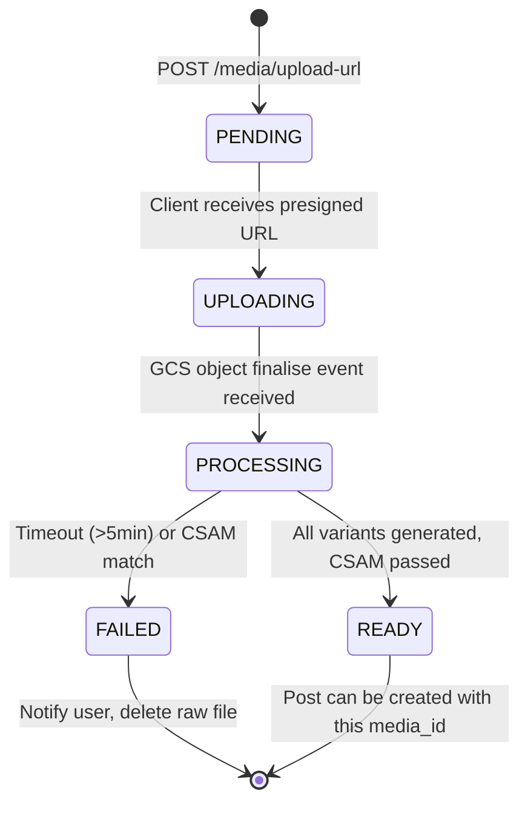
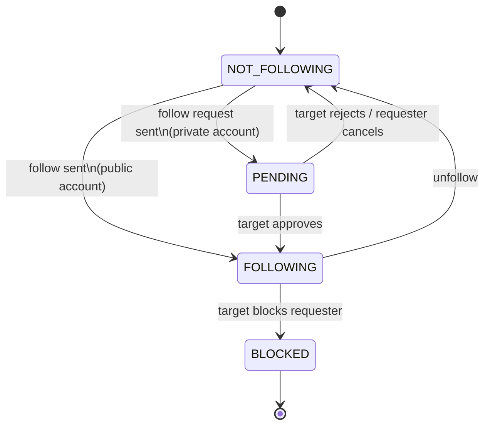

# 06 — Detailed Component Design

## System: Photo Sharing Service (Instagram-Scale)

---

## Component 1: Media Upload Service

### Responsibilities
- Issue presigned GCS upload URLs to clients
- Validate file type, size, and ownership
- Track upload state machine
- Trigger `media.uploaded` Pub/Sub event on completion
- Prevent duplicate uploads via idempotency keys

### Upload State Machine



### Presigned URL Flow

```
1. Client → POST /v1/media/upload-url
   Server:
   a. Authenticate user (JWT)
   b. Validate content_type ∈ {image/jpeg, image/png, image/webp, video/mp4}
   c. Validate file_size ≤ 20MB (photos) or ≤ 500MB (video)
   d. Validate idempotency: check if upload_id already exists
   e. Generate signed URL:
      - GCS.sign_url(bucket="photoshare-uploads", key="{user_id}/{upload_id}/original",
                     method="PUT", expiry="15 min", headers={"Content-Type": content_type})
   f. Insert media record: status='uploading', upload_id
   g. Return: { upload_id, presigned_url, media_id, expires_at }

2. Client → PUT <presigned_url>  (binary upload directly to GCS)
   GCS → Pub/Sub notification: media.uploaded
   (GCS bucket notification trigger, no app server involvement)

3. Media Worker picks up event → processes (see Component 2)
```

### Internal Architecture

```
┌─────────────────────────────────────────┐
│         Media Upload Service            │
│                                         │
│  ┌──────────────┐  ┌──────────────────┐ │
│  │  REST Handler│  │ GCS Event Handler│ │
│  │  (Gin/gRPC)  │  │ (Pub/Sub webhook)│ │
│  └──────┬───────┘  └────────┬─────────┘ │
│         │                   │           │
│  ┌──────▼───────────────────▼─────────┐ │
│  │        Upload Orchestrator         │ │
│  │  - Validate → Sign → Persist →     │ │
│  │  - Idempotency check (Redis)        │ │
│  └────────────────────────────────────┘ │
│         │               │               │
│    ┌────▼────┐    ┌──────▼─────┐        │
│    │  GCS    │    │  Pub/Sub   │        │
│    │ Signer  │    │  Publisher │        │
│    └─────────┘    └────────────┘        │
└─────────────────────────────────────────┘
```

---

## Component 2: Media Processing Workers (Cloud Run)

### Responsibilities
- Subscribe to `media.uploaded` Pub/Sub events
- Download raw file from GCS
- Run CSAM detection (PhotoDNA hash matching)
- Run NSFW classification (Vertex AI Vision API)
- Generate 3 image variants (thumbnail, medium, HD) using libvips
- Upload variants to GCS under CDN-accessible paths
- Update `media` table status → `ready`
- Publish `media.processed` event

### Processing Pipeline

```
media.uploaded event received
        │
        ▼
┌───────────────────────┐
│  1. Download original │  ← GCS streaming read
│     from GCS          │
└───────────┬───────────┘
            │
            ▼
┌───────────────────────┐
│  2. CSAM Check        │  ← PhotoDNA hash matching
│  (Microsoft PhotoDNA  │     Database of known CSAM hashes
│   + NeuralHash)       │     ← MATCH → delete, flag account, alert
└───────────┬───────────┘
            │ PASS
            ▼
┌───────────────────────┐
│  3. NSFW Score        │  ← Vertex AI Vision SafeSearch API
│  (adult, violence,    │     Score stored in media.nsfw_score
│   racy)               │     Scores > 0.8 go to human review queue
└───────────┬───────────┘
            │
            ▼
┌───────────────────────────────────────────────┐
│  4. Image Processing (libvips — 10× faster    │
│     than ImageMagick)                         │
│                                               │
│  Variants generated in parallel:             │
│  ├── thumbnail: 150×150 WebP, quality=80      │
│  ├── medium:   640×640  WebP, quality=82      │
│  └── hd:       1080×1080 WebP, quality=85     │
│                                               │
│  Metadata extracted:                          │
│  └── EXIF: strip location, preserve date      │
│      (Privacy: GPS coords removed)            │
└───────────┬───────────────────────────────────┘
            │
            ▼
┌───────────────────────┐
│  5. Upload to GCS     │  ← All 3 variants + WebP conversion
│  CDN-cacheable paths  │
└───────────┬───────────┘
            │
            ▼
┌───────────────────────┐
│  6. Update DB         │  ← media.status='ready', cdn_urls
│  Publish processed    │     Publish media.processed to Pub/Sub
│  event                │
└───────────────────────┘
```

### Scaling

- Cloud Run autoscales 0 → 500 instances
- Each instance handles 1 photo concurrently (CPU-bound libvips)
- Pub/Sub min ack deadline: 5 minutes (video processing can be slow)
- Dead letter queue after 3 failed attempts → alert ops team

---

## Component 3: Feed Service + Feed Fan-out Workers

### The Celebrity Problem

A naive fan-out-on-write approach breaks for celebrities:
- Kylie Jenner: 400M followers
- A single post by her would require 400M Redis ZADD operations
- At 50K ZADD/sec → 8,000 seconds = 2+ hours of fan-out

**Solution: Hybrid Push-Pull Model**

```
User category         | Follower threshold | Fan-out strategy
─────────────────────────────────────────────────────────────
Regular user          | < 1M followers     | Push (fan-out on write)
Power user            | 1M – 10M followers | Push to first 100K followers,
                      |                    |   Pull for rest
Celebrity             | > 10M followers    | Pull only (fan-out on read)
```

### Fan-out on Write (Regular Users)

```
post.created event received by Fan-out Worker:
  1. Fetch followers from Cloud Spanner:
     SELECT follower_id FROM follows
     WHERE followee_id = {author_id}
     AND status = 'active'
     LIMIT 1,000,000  -- batch in pages of 10K

  2. For each follower:
     a. Compute feed_score (recency + engagement weight)
     b. ZADD feed:{follower_id} {score} {post_id}
     c. ZREMRANGEBYRANK feed:{follower_id} 0 -101  -- keep top 100 only
     d. Expire key: EXPIRE feed:{follower_id} 86400

  3. Parallelise with 100 goroutines; pipeline Redis writes in batches of 500
  4. Estimated time for 300-follower user: <50ms
```

### Fan-out on Read (Celebrities / Cold Users)

```
GET /v1/feed → Feed Service:
  1. Check Redis for cached feed:
     ZRANGE feed:{user_id} 0 19 REV → hit if key exists

  2. On cache miss (inactive user or celeb-heavy follows):
     a. Fetch user's following list from Cloud Spanner
     b. For each followee_id:
        - Regular users: get recent post IDs from Redis ZSET
        - Celebrities: query Cloud SQL directly:
            SELECT id, created_at FROM posts
            WHERE author_id = {celebrity_id}
            AND created_at > NOW() - INTERVAL '7 days'
            ORDER BY created_at DESC LIMIT 10
     c. Merge all post lists, score & rank
     d. Store top 100 in Redis feed cache (ZADD)
     e. Return top 20

  3. Feed scoring formula (simplified):
     score = recency_weight * 0.4
           + engagement_velocity * 0.3
           + relationship_strength * 0.2
           + content_preference * 0.1
```

### Feed Service Internal Architecture

```
┌─────────────────────────────────────────────────────┐
│                   Feed Service                       │
│                                                     │
│  ┌─────────────────┐    ┌────────────────────────┐  │
│  │  Feed API Layer │    │  Feed Ranker           │  │
│  │  (REST + gRPC)  │    │  (apply ML scores)     │  │
│  └────────┬────────┘    └───────────┬────────────┘  │
│           │                         │               │
│  ┌────────▼─────────────────────────▼────────────┐  │
│  │            Feed Aggregator                    │  │
│  │  - Check Redis cache (cache-first)            │  │
│  │  - On miss: fan-out-on-read for celebrities   │  │
│  │  - Merge + dedupe post IDs                    │  │
│  │  - Filter: blocked users, hidden posts        │  │
│  └────────────────────────────────────────────────┘  │
│           │             │              │             │
│     ┌─────▼─────┐ ┌─────▼─────┐ ┌────▼──────┐      │
│     │  Redis    │ │  Spanner  │ │  Cloud SQL │      │
│     │  (cache)  │ │  (follows)│ │  (posts)  │      │
│     └───────────┘ └───────────┘ └───────────┘      │
└─────────────────────────────────────────────────────┘
```

---

## Component 4: Like Service

### Architecture Decision: Skip Redis for Write Durability

Likes are high-volume, eventually consistent. Strategy:

```
Write path:
  Client → PUT /v1/posts/{id}/like
        → Like Service:
            1. Write to Bigtable: row key = {post_id}#{user_id}
               (durable, not lost on Redis crash)
            2. INCR likes:count:{post_id} in Redis
               (for fast read of current count)
            3. SET likes:user:{user_id}:{post_id} = "1" in Redis
               (for fast "did I like this?" check)
            4. Publish post.liked event → Pub/Sub
            5. Return: { like_count: <redis_count>, is_liked: true }

Counter Sync (every 30 seconds via Cloud Scheduler):
  1. Scan Redis for dirty like:count:* keys
  2. Batch UPDATE posts SET like_count = <redis_val>
     WHERE id = <post_id>
  3. Clear dirty flags

Read path:
  - like_count comes from Redis counter (fast, slightly stale)
  - "is_liked_by_me" comes from Redis bit (fast) or Bigtable fallback
```

### Like Deduplication

```python
# Pseudo-code for idempotent like
def like_post(user_id: str, post_id: str) -> dict:
    row_key = f"{post_id}#{user_id}"

    # Check current state in Bigtable
    existing = bigtable.read_row(row_key, columns=["like_data:action"])

    if existing and existing["like_data:action"] == "like":
        # Already liked — return current count, no-op
        count = redis.get(f"likes:count:{post_id}")
        return {"like_count": int(count), "is_liked_by_me": True}

    # Write to Bigtable
    bigtable.mutate_row(row_key, SetCell("like_data", "action", "like"),
                                 SetCell("like_data", "ts", now_micros()))
    # Increment Redis counter
    count = redis.incr(f"likes:count:{post_id}")
    redis.set(f"likes:user:{user_id}:{post_id}", "1", ex=3600)

    return {"like_count": count, "is_liked_by_me": True}
```

---

## Component 5: Notification Service

### Notification Types & Delivery

| Type | Trigger Event | Delivery | Priority |
|------|--------------|----------|----------|
| `like` | post.liked | In-app only | Low |
| `comment` | post.commented | Push + In-app | Medium |
| `follow` | user.followed | Push + In-app | Medium |
| `mention` | post.created (tagged) | Push + In-app | High |
| `follow_request` | user.follow_request | Push + In-app | High |

### Architecture

```
┌────────────────────────────────────────────────────────┐
│                 Notification Service                    │
│                                                        │
│  Pub/Sub Subscribers:                                  │
│  [post.liked] [post.commented] [user.followed] ...     │
│          │                                             │
│  ┌───────▼──────────────────────────────────────────┐  │
│  │           Notification Dispatcher                │  │
│  │  1. Fan-out to recipient(s)                      │  │
│  │  2. Check notification preferences (do-not-      │  │
│  │     disturb, like notifications off, etc.)       │  │
│  │  3. Deduplicate: batch "X and 5 others liked..." │  │
│  │  4. Persist to notifications table               │  │
│  └──────────┬───────────────────────┬───────────────┘  │
│             │                       │                  │
│  ┌──────────▼──────┐   ┌────────────▼────────────────┐ │
│  │  Push Delivery  │   │  In-App Delivery             │ │
│  │  Firebase FCM   │   │  WebSocket / SSE             │ │
│  │  (iOS APNs,     │   │  (active users via           │ │
│  │   Android FCM)  │   │   GKE long-lived connections)│ │
│  └─────────────────┘   └────────────────────────────-─┘ │
└────────────────────────────────────────────────────────┘
```

### Notification Batching (Anti-Spam)

```
Problem: Post goes viral → 50K likes in 1 hour
         Without batching: 50K push notifications to author

Solution: Sliding window aggregation
  - First like on post → send push immediately
  - Subsequent likes → buffer for 30 min
  - After buffer: "Alex and 149 others liked your photo" (batch)

Implementation:
  Redis key: notif_batch:{post_id}:like:{recipient_id}
  TTL: 30 minutes
  On expiry: Cloud Function reads batch → sends single aggregated push
```

---

## Component 6: Search Service

### Architecture

```
Elasticsearch 8 Cluster (GCE):
  - 20 nodes: 10 data nodes (16 vCPU, 64GB RAM each)
                        5 master nodes (4 vCPU, 16GB RAM)
                        5 coordinating nodes (8 vCPU, 32GB RAM)
  - 3 shards per index, 1 replica each

Indices:
  - users    (500M docs, ~250 GB)
  - hashtags (50M docs, ~5 GB)
  - locations (5M docs, ~500 MB)

Search query types:
  1. Prefix/autocomplete: username starts with "pr..."
     → Edge N-gram tokenizer on username field
  2. Full-text: bio, display name
     → BM25 scoring
  3. Hashtag exact: "#beach"
     → Keyword field match
  4. Trending: hashtags sorted by post_count DESC (last 24h)
     → Sorted by a separate "trending_score" refreshed hourly
```

### Real-Time Index Updates (Search Indexer Worker)

```
Pub/Sub events → Search Indexer Worker (Cloud Run):
  - user.created / user.updated → ES upsert to users index
  - post.created → extract hashtags → ES upsert to hashtags index
  - post.deleted → mark as inactive (not physically deleted for
                   hashtag count integrity)

Latency: new user searchable within 10 seconds of creation
```

---

## Component 7: Follow Service

### Private Account Follow Request Flow



### Follow Write Path (Cloud Spanner)

```python
# Strong consistency required: follow change immediately affects
# what content the follower can access on a private account

def follow_user(follower_id: str, target_id: str):
    target = users.get(target_id)

    with spanner.transaction():
        if target.is_private:
            # Insert pending follow
            spanner.insert("follows", columns=["follower_id", "followee_id",
                            "status", "created_at"],
                           values=[(follower_id, target_id, "pending", NOW)])
            # Trigger notification: follow_request
        else:
            # Insert active follow immediately
            spanner.insert("follows", columns=["follower_id", "followee_id",
                            "status", "created_at"],
                           values=[(follower_id, target_id, "active", NOW)])
            # Update follower/following counts (via counter service)
            # Trigger retroactive feed backfill (last 20 posts from target)
            pubsub.publish("user.followed", {"follower": follower_id,
                                              "followee": target_id})
```

### Feed Backfill on New Follow

When user A follows user B, A's feed should include B's recent posts:
```
Fan-out Worker on user.followed event:
  1. Fetch last 20 posts from B (Cloud SQL query)
  2. For each post: compute feed_score
  3. Merge into A's Redis feed cache:
     ZADD feed:{A} {score} {post_id}  (only if score > current min)
  4. Trim cache to max 100 items
```
