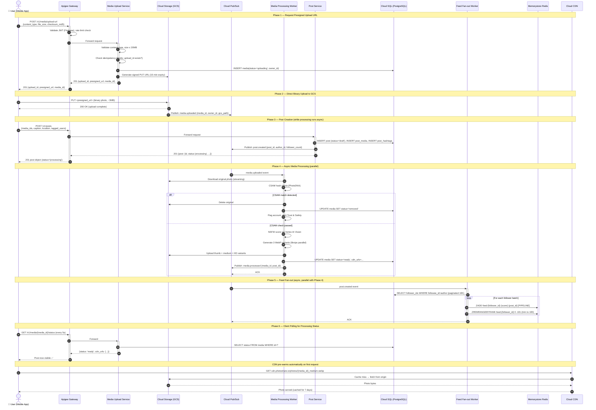
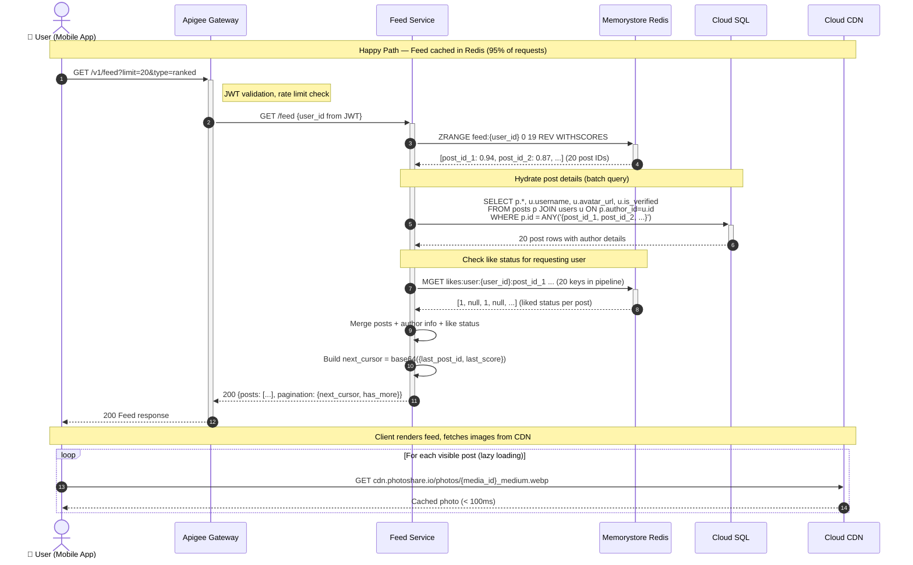
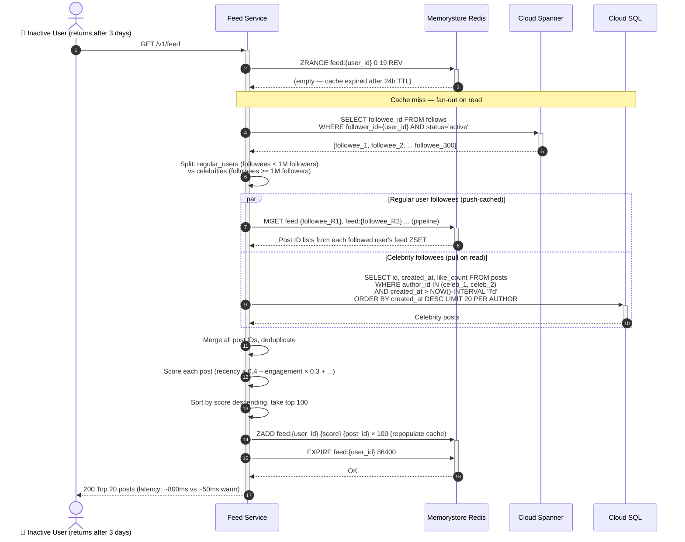
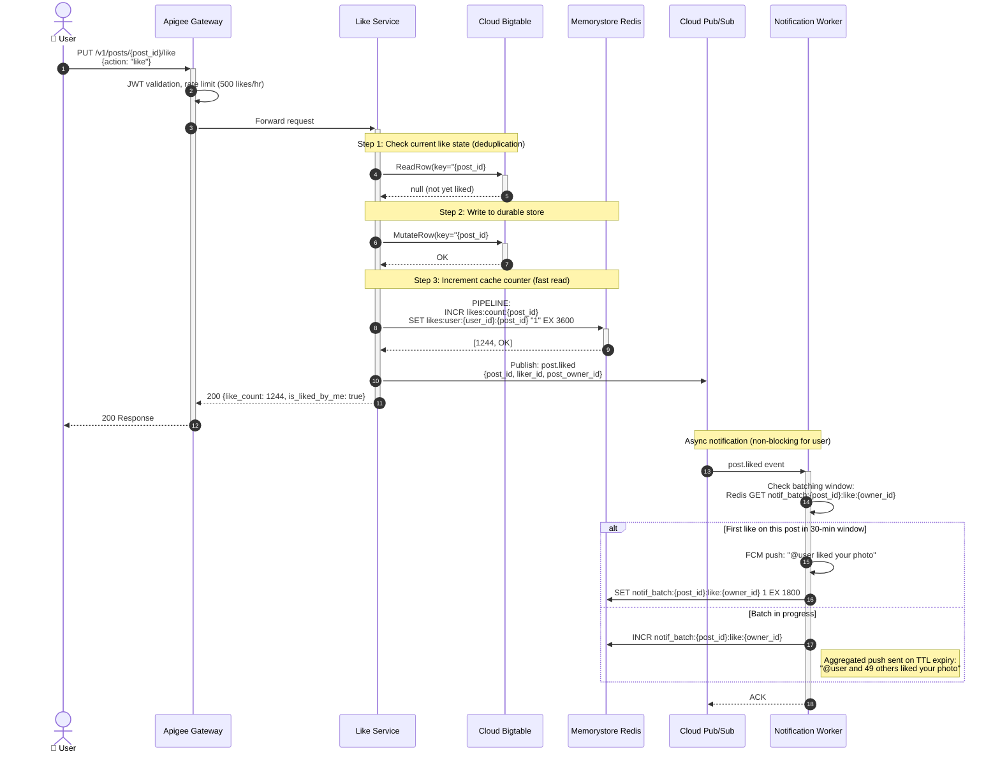
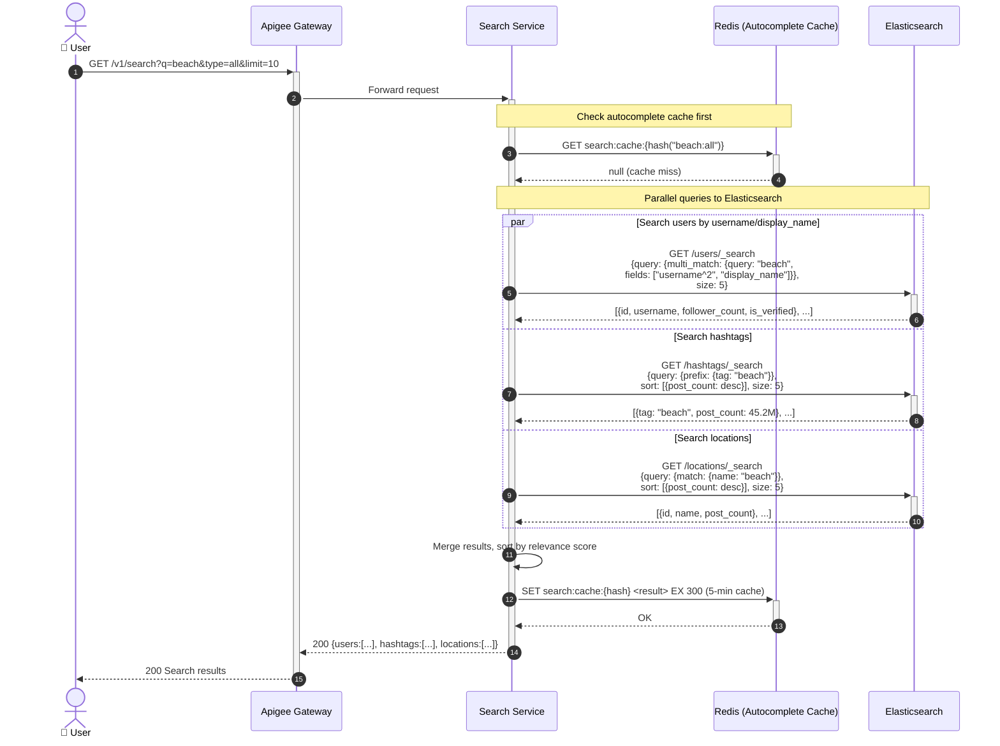
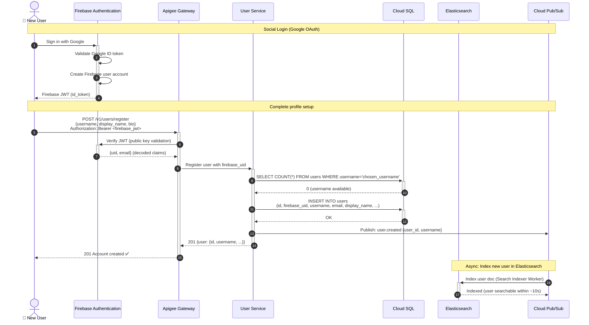

# 09 — Sequence Diagrams

## System: Photo Sharing Service (Instagram-Scale)

---

## Flow 1: Photo Upload & Post Creation



---

## Flow 2: Feed Fetch (Warm Cache Path)



---

## Flow 2b: Feed Fetch (Cold Cache / Celebrity Follow Path)



---

## Flow 3: Follow a User

```mermaid
sequenceDiagram
    autonumber
    actor Follower as 📱 Follower (User A)
    participant Apigee as Apigee Gateway
    participant FollowSvc as Follow Service
    participant Spanner as Cloud Spanner
    participant PubSub as Cloud Pub/Sub
    participant FeedWorker as Feed Fan-out Worker
    participant NotifWorker as Notification Worker
    participant Redis as Memorystore Redis

    Follower->>+Apigee: PUT /v1/users/{target_user_id}/follow<br/>{action: "follow"}
    Apigee->>+FollowSvc: Forward request

    FollowSvc->>+Spanner: BEGIN TRANSACTION
    FollowSvc->>Spanner: SELECT is_private FROM users WHERE id={target_id}

    alt Target account is PUBLIC
        FollowSvc->>Spanner: INSERT follows(follower_id=A, followee_id=B,<br/>status='active', created_at=NOW)
        FollowSvc->>Spanner: COMMIT
        Spanner-->>FollowSvc: OK

        FollowSvc->>PubSub: Publish: user.followed<br/>{follower_id: A, followee_id: B, type: 'new_follow'}
        FollowSvc-->>-Apigee: 200 {is_following: true, is_pending: false}

        Note over FollowSvc,Redis: Async: Feed backfill + notification
        PubSub->>+FeedWorker: user.followed event
        FeedWorker->>Spanner: SELECT id FROM posts WHERE author_id=B<br/>ORDER BY created_at DESC LIMIT 20
        FeedWorker->>Redis: ZADD feed:{A} {score} {post_id} × 20
        FeedWorker-->>-PubSub: ACK

        PubSub->>+NotifWorker: user.followed event
        NotifWorker->>NotifWorker: Check B's notification preferences
        NotifWorker->>NotifWorker: FCM push: "A started following you"
        NotifWorker-->>-PubSub: ACK

    else Target account is PRIVATE
        FollowSvc->>Spanner: INSERT follows(follower_id=A, followee_id=B,<br/>status='pending', created_at=NOW)
        FollowSvc->>Spanner: COMMIT
        Spanner-->>FollowSvc: OK

        FollowSvc->>PubSub: Publish: follow.requested<br/>{requester_id: A, target_id: B}
        FollowSvc-->>-Apigee: 200 {is_following: false, is_pending: true}

        PubSub->>+NotifWorker: follow.requested event
        NotifWorker->>NotifWorker: Push to B: "A requested to follow you"
        NotifWorker-->>-PubSub: ACK
    end

    Apigee-->>-Follower: 200 Response
```

---

## Flow 4: Like a Post



---

## Flow 5: Search



---

## Flow 6: User Registration


