# 05 — High-Level Architecture

## Overview

The system is a **globally distributed L7 load balancer** built on GCP. It uses a layered architecture with:
- **Anycast edge** for global traffic ingestion
- **Regional proxy clusters** for connection termination, SSL offload, and request routing
- **Shared control plane** for configuration management, health checking, and observability

---

## Architecture Diagram

```mermaid
graph TB
    subgraph Internet["🌐 Internet"]
        C1[Client — US]
        C2[Client — EU]
    end

    subgraph GCP_Edge["GCP Edge Layer"]
        CA[Cloud Armor<br/>WAF + DDoS Protection]
        CDN[Cloud CDN<br/>Static Asset Cache]
        GCLB[Cloud Load Balancing<br/>Anycast Global HTTPS LB<br/>Anycast IP: 34.x.x.x]
    end

    subgraph Control_Plane["Control Plane — GKE Autopilot (us-central1)"]
        API[Control Plane API<br/>lb-api Service<br/>Cloud Run]
        HC[Health Check Engine<br/>health-checker DaemonSet]
        CFG[Config Manager<br/>config-sync Service]
        PS[Cloud Pub/Sub<br/>config-events topic<br/>health-events topic]
        SQL[(Cloud SQL<br/>PostgreSQL 15<br/>HA + Read Replica)]
        SECRET[Secret Manager<br/>TLS keys, API creds]
        SCHED[Cloud Scheduler<br/>Periodic health triggers]
    end

    subgraph Region_US["Region: us-central1 — Data Plane"]
        ILB_US[Internal L4 LB<br/>GCP Internal HTTPS LB]
        subgraph LB_Pool_US["LB Node Pool — n2-standard-32 × 20"]
            LB1[LB Node 1<br/>Envoy Proxy]
            LB2[LB Node 2<br/>Envoy Proxy]
            LB3[LB Node N<br/>Envoy Proxy]
        end
        REDIS_US[(Memorystore Redis<br/>us-central1<br/>Health + Sessions + RateLimits)]
        subgraph Backends_US["Backend Web Servers"]
            BE1[Backend 10.0.1.1]
            BE2[Backend 10.0.1.2]
            BEN[Backend 10.0.1.N]
        end
    end

    subgraph Region_EU["Region: europe-west1 — Data Plane"]
        ILB_EU[Internal L4 LB<br/>GCP Internal HTTPS LB]
        subgraph LB_Pool_EU["LB Node Pool — n2-standard-32 × 20"]
            LB4[LB Node 1<br/>Envoy Proxy]
            LB5[LB Node N<br/>Envoy Proxy]
        end
        REDIS_EU[(Memorystore Redis<br/>europe-west1)]
        subgraph Backends_EU["Backend Web Servers"]
            BE4[Backend 10.1.1.1]
            BEM[Backend 10.1.1.N]
        end
    end

    subgraph Observability["Observability Stack"]
        MON[Cloud Monitoring<br/>Dashboards + Alerting]
        LOG[Cloud Logging<br/>Structured Logs]
        TRACE[Cloud Trace<br/>Distributed Tracing]
        BQ[(BigQuery<br/>Access Logs + Analytics)]
        DF[Dataflow<br/>Log Pipeline]
    end

    C1 -->|HTTPS| CA
    C2 -->|HTTPS| CA
    CA --> CDN
    CDN -->|Cache miss| GCLB
    GCLB -->|Geo-route| ILB_US
    GCLB -->|Geo-route| ILB_EU

    ILB_US --> LB1 & LB2 & LB3
    ILB_EU --> LB4 & LB5

    LB1 & LB2 & LB3 <-->|Read health/sessions| REDIS_US
    LB4 & LB5 <-->|Read health/sessions| REDIS_EU

    LB1 & LB2 & LB3 -->|HTTP/HTTPS| BE1 & BE2 & BEN
    LB4 & LB5 -->|HTTP/HTTPS| BE4 & BEM

    HC -->|TCP/HTTP probes| BE1 & BE2 & BEN & BE4 & BEM
    HC -->|Write health state| REDIS_US & REDIS_EU
    HC -->|Publish health events| PS

    CFG <-->|Read/Write config| SQL
    CFG -->|Subscribe| PS
    CFG -->|Push xDS config| LB1 & LB2 & LB3 & LB4 & LB5

    API <-->|CRUD| SQL
    API -->|Publish change events| PS
    API -->|Read secrets| SECRET

    LB1 & LB2 & LB3 & LB4 & LB5 -->|Access logs| DF
    DF -->|Stream| BQ
    DF -->|Metrics| MON

    LB1 & LB2 & LB3 & LB4 & LB5 -->|Traces| TRACE
    LB1 & LB2 & LB3 & LB4 & LB5 -->|Logs| LOG
```



---

## Layer-by-Layer Explanation

### Layer 1: Edge (Cloud Armor + Cloud CDN + GCLB)

| Component | Role |
|-----------|------|
| **Cloud Armor** | L7 WAF — blocks SQLi, XSS, OWASP Top 10; DDoS mitigation at Google's network edge |
| **Cloud CDN** | Caches static responses (images, JS, CSS) at Google PoPs; reduces LB load by ~40% |
| **Cloud Load Balancing** | Anycast global L7 LB; geo-routes requests to the nearest healthy regional cluster using Google's backbone network |

**Anycast routing:** A single global IP (e.g., `34.120.x.x`) is advertised from all GCP PoPs. TCP connections are established at the nearest PoP, and traffic is carried over Google's private network to the regional data plane.

---

### Layer 2: Data Plane (Regional LB Nodes)

Each **LB Node** runs **Envoy Proxy** configured via the **xDS control plane** API:

| Envoy Subsystem | Function |
|-----------------|---------|
| **Listener** | Accept TLS connections, SNI routing |
| **TLS Inspector** | SSL termination using certificates from Secret Manager |
| **HTTP Connection Manager (HCM)** | HTTP/1.1 + HTTP/2 demux, header manipulation |
| **Router Filter** | Evaluate routing rules → select upstream cluster (pool) |
| **Rate Limit Filter** | Token bucket check against Redis |
| **Load Balancer Policy** | Least connections / WRR / IP hash per cluster |
| **Health Checker** | Passive health tracking (outlier detection) |
| **Circuit Breaker** | Envoy native circuit breaking per cluster |

Configuration is delivered dynamically via **xDS APIs** (CDS, EDS, RDS, LDS) — no node restarts needed for config changes.

---

### Layer 3: Control Plane

| Service | Tech | Responsibility |
|---------|------|---------------|
| **Control Plane API** | Cloud Run (auto-scaling) | REST API for pool/backend/rule CRUD |
| **Config Manager** | GKE Deployment | Watches Cloud SQL + Pub/Sub; pushes xDS config to LB nodes |
| **Health Check Engine** | GKE DaemonSet | Runs active health probes per region; writes results to Redis |
| **Cloud SQL** | PostgreSQL 15 (HA) | Source of truth for all configuration |
| **Memorystore Redis** | Redis 7 (Regional) | Ephemeral hot state — health status, sessions, rate limits |
| **Cloud Pub/Sub** | Managed | Config change events, health state events |
| **Secret Manager** | Managed | TLS private keys, API credentials |

---

### Layer 4: Observability

| Component | Purpose |
|-----------|---------|
| **Cloud Monitoring** | Real-time dashboards, SLO tracking, alerting (PagerDuty integration) |
| **Cloud Logging** | Structured JSON access logs from LB nodes |
| **Cloud Trace** | Distributed request traces (sampled at 1%) |
| **Dataflow** | Streaming pipeline: Pub/Sub → BigQuery for access log analytics |
| **BigQuery** | Historical log analysis, capacity planning, SLA reporting |

---

## Request Flow Summary

```
1. Client DNS → Anycast IP (Cloud DNS)
2. TCP/TLS handshake at nearest GCP PoP (Cloud Armor + GCLB)
3. CDN check — cache hit? → serve directly
4. Cache miss → GCLB geo-routes to regional ILB
5. ILB round-robins to available LB Node
6. LB Node:
   a. SSL termination (certificate from Secret Manager)
   b. Evaluate routing rules (in-memory, refreshed every 30s)
   c. Rate limit check (Redis atomic INCR)
   d. Sticky session check (Redis GET lb:session:{id})
   e. Select backend (Least Connections from Redis lb:conns:{id})
   f. Circuit breaker check (Redis GET lb:cb:{pool_id})
   g. Forward request to backend (plain HTTP over VPC)
7. Backend responds → LB streams response back to client
8. LB logs request to Cloud Logging → Pub/Sub → Dataflow → BigQuery
```

---

## Multi-Region Failover

```
Normal:     US (60% traffic) + EU (40% traffic) — geo-routed by GCLB
            
US failure: GCLB detects unhealthy US backend group (via health checks)
            All traffic rerouted to EU within < 30 seconds
            EU auto-scales GKE node pool (HPA triggers)
            
Recovery:   US region recovers → GCLB gradually shifts traffic back (canary)
```

---

## GCP Services Used

| Service | Tier / Config | Purpose |
|---------|--------------|---------|
| Cloud Armor | Enterprise | WAF, DDoS, geo-blocking |
| Cloud CDN | Standard | Static asset caching |
| Cloud Load Balancing | Global HTTPS | Anycast + geo-routing |
| GKE Autopilot | — | LB node pool, control plane services |
| Cloud Run | — | Control plane API (serverless) |
| Cloud SQL (PostgreSQL 15) | HA, db-n1-standard-4, 1 read replica | Config store |
| Memorystore for Redis 7 | M2 (26 GB), HA | Hot state |
| Cloud Pub/Sub | — | Event bus |
| Cloud Storage | Standard + Coldline + Archive | Log archival |
| BigQuery | On-demand | Log analytics |
| Dataflow | Streaming | Log pipeline |
| Secret Manager | — | TLS keys, credentials |
| Certificate Manager | — | Managed TLS certs |
| Cloud Monitoring | — | Observability |
| Cloud Logging | — | Structured logs |
| Cloud Trace | — | Distributed tracing |
| Cloud Scheduler | — | Periodic cleanup jobs |
