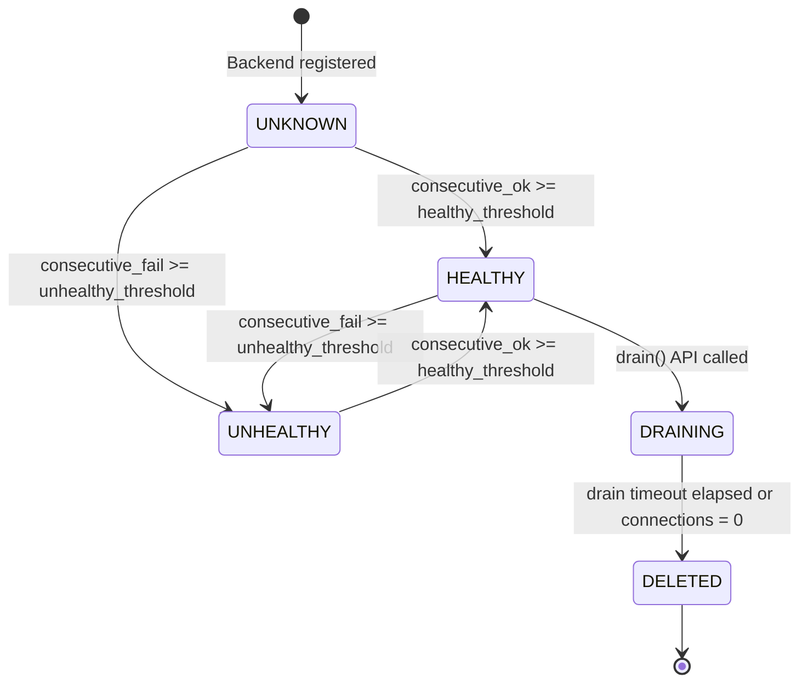

# 06 — Detailed Component Design

---

## Component 1: Envoy Proxy (Data Plane Node)

Envoy is the packet-forwarding engine on each LB node. It is configured entirely via xDS APIs — no restarts required for config changes.

### Responsibilities
- Accept and terminate TLS connections (SNI-aware)
- Protocol demultiplexing: HTTP/1.1, HTTP/2, WebSocket upgrades
- Apply routing rules (path prefix, host header, method, custom headers)
- Execute load balancing algorithm against backend cluster
- Apply rate limiting (via ext_authz or ratelimit sidecar calling Redis)
- Track passive health via outlier detection
- Enforce circuit breaker state
- Emit access logs, metrics, and traces

### Internal Architecture

```
┌────────────────────────────────────────────────────────────────┐
│                      ENVOY PROXY NODE                          │
│                                                                │
│  ┌──────────────────────────────────────────────────────────┐  │
│  │  LISTENERS                                               │  │
│  │  :443 (HTTPS/HTTP2)  :80 (HTTP redirect)                 │  │
│  │  :8443 (WebSocket)                                       │  │
│  └──────────────────────┬───────────────────────────────────┘  │
│                         │                                      │
│  ┌──────────────────────▼───────────────────────────────────┐  │
│  │  FILTER CHAIN                                            │  │
│  │  ┌─────────────────────────────────────────────────────┐ │  │
│  │  │ 1. TLS Inspector (SNI → cert selection)             │ │  │
│  │  │ 2. HTTP Connection Manager (HCM)                    │ │  │
│  │  │    ├─ HTTP/1.1 codec   ├─ HTTP/2 codec              │ │  │
│  │  │    └─ WebSocket upgrade filter                      │ │  │
│  │  │ 3. Router Filter Chain:                             │ │  │
│  │  │    ├─ Rate Limit Filter  (Redis token bucket)       │ │  │
│  │  │    ├─ Header Manipulation Filter (X-Forwarded-For)  │ │  │
│  │  │    ├─ Access Log Filter                             │ │  │
│  │  │    └─ Router (match rules → upstream cluster)       │ │  │
│  │  └─────────────────────────────────────────────────────┘ │  │
│  └──────────────────────┬───────────────────────────────────┘  │
│                         │                                      │
│  ┌──────────────────────▼───────────────────────────────────┐  │
│  │  CLUSTER MANAGER                                         │  │
│  │  ┌─────────────┐  ┌─────────────┐  ┌─────────────┐      │  │
│  │  │  Cluster A  │  │  Cluster B  │  │  Cluster N  │      │  │
│  │  │(pool-a1b2c3)│  │(pool-v2-can)│  │  ...        │      │  │
│  │  │ LB: LEAST   │  │ LB: WRR     │  │             │      │  │
│  │  │ CONNECTIONS │  │ 10%/90%     │  │             │      │  │
│  │  └─────────────┘  └─────────────┘  └─────────────┘      │  │
│  └──────────────────────┬───────────────────────────────────┘  │
│                         │                                      │
│  ┌──────────────────────▼───────────────────────────────────┐  │
│  │  OUTLIER DETECTION + CIRCUIT BREAKER                     │  │
│  │  - Consecutive 5xx tracking per backend                  │  │
│  │  - Error rate over sliding window                        │  │
│  │  - Ejection: 10% of cluster ejected at a time           │  │
│  └──────────────────────────────────────────────────────────┘  │
└────────────────────────────────────────────────────────────────┘
```

### Load Balancing Algorithm Implementation

#### Least Connections
```python
# Pseudocode — actual implementation is C++ in Envoy
def pick_backend(cluster: Cluster) -> Backend:
    healthy = [b for b in cluster.backends if b.health == HEALTHY]
    # Read connection counts from Redis (atomic, pre-fetched with local cache)
    return min(healthy, key=lambda b: redis.get(f"lb:conns:{b.id}"))

# On request accept:
redis.incr(f"lb:conns:{backend.id}")

# On connection close:
redis.decr(f"lb:conns:{backend.id}")
```

#### Consistent Hashing (for sticky sessions without cookies)
```python
# CH ring with vnodes for even distribution
def build_ring(backends: List[Backend], vnodes: int = 150) -> SortedDict:
    ring = SortedDict()
    for backend in backends:
        for i in range(vnodes * backend.weight // 100):
            key = sha256(f"{backend.id}:{i}").hexdigest()
            ring[key] = backend
    return ring

def pick_backend(ring: SortedDict, client_ip: str) -> Backend:
    hash_key = sha256(client_ip).hexdigest()
    # Find first node >= hash_key (wrap around)
    idx = ring.bisect_left(hash_key)
    if idx >= len(ring):
        idx = 0
    return ring.peekitem(idx)[1]
```

### xDS Configuration (Envoy dynamic config)

```yaml
# Cluster Discovery Service (CDS) snippet sent by Config Manager
resources:
- "@type": type.googleapis.com/envoy.config.cluster.v3.Cluster
  name: pool-a1b2c3d4
  type: STRICT_DNS
  lb_policy: LEAST_REQUEST
  circuit_breakers:
    thresholds:
    - priority: DEFAULT
      max_connections: 2000
      max_pending_requests: 1000
      max_requests: 5000
  outlier_detection:
    consecutive_5xx: 3
    interval: 5s
    base_ejection_time: 30s
    max_ejection_percent: 50
    enforcing_consecutive_5xx: 100
  health_checks:
  - timeout: 2s
    interval: 5s
    unhealthy_threshold: 3
    healthy_threshold: 2
    http_health_check:
      path: /healthz
```

---

## Component 2: Health Check Engine

### Responsibilities
- Schedule and execute active health probes for every backend in every region
- Write probe results to Redis `lb:health:{backend_id}`
- Publish health state change events to Cloud Pub/Sub `health-events` topic
- Support probe types: HTTP, HTTPS, TCP
- Implement backoff on repeated failures to avoid thundering-herd to broken backends

### Algorithm: Health Check State Machine



### Probe Implementation

```python
async def probe_backend(backend: Backend, config: HealthCheckConfig) -> ProbeResult:
    try:
        if config.protocol == "HTTP":
            async with aiohttp.ClientSession(timeout=aiohttp.ClientTimeout(
                total=config.timeout_secs
            )) as session:
                async with session.head(
                    f"http://{backend.address}:{backend.port}{config.path}"
                ) as resp:
                    success = resp.status in config.expected_codes
                    return ProbeResult(success=success, status_code=resp.status)
        elif config.protocol == "TCP":
            reader, writer = await asyncio.wait_for(
                asyncio.open_connection(backend.address, backend.port),
                timeout=config.timeout_secs
            )
            writer.close()
            return ProbeResult(success=True)
    except Exception as e:
        return ProbeResult(success=False, error=str(e))

async def run_health_loop(backend: Backend, config: HealthCheckConfig):
    while True:
        result = await probe_backend(backend, config)
        await update_health_state(backend, result)
        
        # Adaptive interval: back off to 30s after 10 consecutive failures
        interval = config.interval_secs
        if result.consecutive_failures > 10:
            interval = min(interval * 2, 30)
        
        await asyncio.sleep(interval)
```

### Distributed Coordination

Each health check node is responsible for a **shard** of backends (assigned via consistent hashing on `backend_id`). This prevents duplicate probes from multiple nodes.

```
Total backends: 10,000
Health check nodes (DaemonSet, 1 per LB node): 20 per region
Backends per node: 10,000 / 20 = 500 backends per health checker
```

---

## Component 3: Config Manager (xDS Control Plane)

### Responsibilities
- Maintain the xDS management server (implements CDS, EDS, RDS, LDS)
- Watch Cloud SQL and Redis for config changes (via Pub/Sub)
- Push delta updates to all connected Envoy nodes within 30s
- Handle Envoy ADS (Aggregated Discovery Service) streams

### Config Update Flow

```
1. Operator calls POST /v1/pools (via Control Plane API)
2. API writes to Cloud SQL → publishes to Pub/Sub topic: config-events
3. Config Manager consumes Pub/Sub message
4. Config Manager queries Cloud SQL for updated config
5. Config Manager computes xDS delta (Incremental xDS / DeltaDiscoveryResponse)
6. Config Manager pushes delta to all connected Envoy nodes via gRPC streaming
7. Envoy nodes apply config change (zero-downtime, hot reload)
8. Envoy nodes ACK the update
```

### In-Memory Config Cache (per Config Manager instance)

```python
@dataclass
class ConfigCache:
    pools: Dict[str, PoolConfig]             # pool_id → config
    backends: Dict[str, List[BackendConfig]] # pool_id → [backends]
    rules: List[RoutingRule]                 # sorted by priority
    rate_limits: List[RateLimitPolicy]
    
    # Subscribed Envoy nodes
    envoy_streams: Dict[str, EnvoyADSStream] # node_id → gRPC stream
    
    # Version tracking for incremental xDS
    version_nonce: int = 0
```

---

## Component 4: Rate Limiter

Rate limiting is implemented as an **Envoy ext_authz** sidecar (Redis-backed token bucket) or via Envoy's native **rate limit service** integration.

### Token Bucket Algorithm

```python
def check_rate_limit(policy: RateLimitPolicy, scope_key: str) -> RateLimitResult:
    redis_key = f"lb:rl:{policy.policy_id}:{scope_key}"
    now_ms = time.time_ns() // 1_000_000
    
    # Lua script for atomicity — avoids race conditions
    lua_script = """
    local tokens_key = KEYS[1]
    local rate = tonumber(ARGV[1])        -- tokens per ms
    local burst = tonumber(ARGV[2])       -- max bucket size
    local now = tonumber(ARGV[3])         -- current time in ms
    
    local state = redis.call('HMGET', tokens_key, 'tokens', 'last_refill')
    local tokens = tonumber(state[1]) or burst * 1000
    local last_refill = tonumber(state[2]) or now
    
    -- Add tokens proportional to elapsed time
    local elapsed = math.max(0, now - last_refill)
    tokens = math.min(burst * 1000, tokens + elapsed * rate)
    
    if tokens >= 1000 then
        tokens = tokens - 1000   -- consume 1 token
        redis.call('HMSET', tokens_key, 'tokens', tokens, 'last_refill', now)
        redis.call('EXPIRE', tokens_key, ARGV[4])
        return {1, math.floor(tokens / 1000)}  -- allowed, remaining
    else
        redis.call('HMSET', tokens_key, 'tokens', tokens, 'last_refill', now)
        redis.call('EXPIRE', tokens_key, ARGV[4])
        local retry_after = math.ceil((1000 - tokens) / rate)
        return {0, retry_after}  -- rejected, retry_after_ms
    end
    """
    
    rate_per_ms = (policy.rate_per_minute / 60.0) / 1000.0
    result = redis.eval(
        lua_script, 1, redis_key,
        rate_per_ms, policy.burst_size, now_ms, policy.window_seconds * 2
    )
    
    return RateLimitResult(
        allowed=bool(result[0]),
        remaining=result[1],
        retry_after_ms=result[1] if not result[0] else 0
    )
```

---

## Component 5: Session Affinity Manager

### Cookie-Based Sticky Sessions

```
Request arrives:
  1. Check for LB_AFFINITY cookie in request headers
  2. If cookie present:
     a. Redis GET lb:session:{cookie_value}
     b. If backend exists and is HEALTHY → route to that backend
     c. If backend UNHEALTHY or missing → pick new backend (fallback)
  3. If no cookie:
     a. Pick backend via normal LB algorithm
     b. Generate session_id = UUID v4
     c. Redis SET lb:session:{session_id} {backend_id} EX {ttl}
     d. Inject Set-Cookie: LB_AFFINITY={session_id}; HttpOnly; Secure; SameSite=Strict
```

### IP-Hash Sticky Sessions (no cookie storage)

```
session_id = sha256(client_ip + salt)[:16]  
backend = consistent_hash_ring.lookup(session_id)
# No Redis storage needed — deterministic from IP
# Limitation: all traffic from same /24 subnet may hash to same backend
```

---

## Component 6: SSL/TLS Terminator

### Certificate Management

```
Certificates stored in GCP Certificate Manager (managed renewal)
Private keys stored in Secret Manager (never written to disk)

TLS config:
  - TLS 1.2 (minimum), TLS 1.3 preferred
  - Session tickets enabled (TLS 1.2 resumption without master secret storage)
  - OCSP stapling enabled
  - HSTS header injected: max-age=31536000; includeSubDomains

Cipher suites (TLS 1.3): TLS_AES_256_GCM_SHA384, TLS_CHACHA20_POLY1305_SHA256
Cipher suites (TLS 1.2): ECDHE-RSA-AES256-GCM-SHA384, ECDHE-RSA-CHACHA20-POLY1305

SNI routing:
  *.company.com → cert-wildcard-company
  api.partner.com → cert-partner-api
```

### TLS Session Resumption Rate

```
Target: > 90% session resumption (reduces CPU cost by ~10× vs full handshake)

Implementation: TLS 1.3 session tickets
  - Ticket key rotated every 24 hours
  - Keys synchronized across all LB nodes via Secret Manager + Pub/Sub
  - Ticket lifetime: 1 hour (client-controlled)
  
Full handshake CPU: ~1ms (ECDHE P-256)
Resumed handshake CPU: ~0.05ms
At 1M RPS with 90% resumption: 
  ~100K full handshakes/s × 1ms = 100 CPU cores for TLS alone
  Distributed across 20 nodes = 5 cores/node for TLS
```
