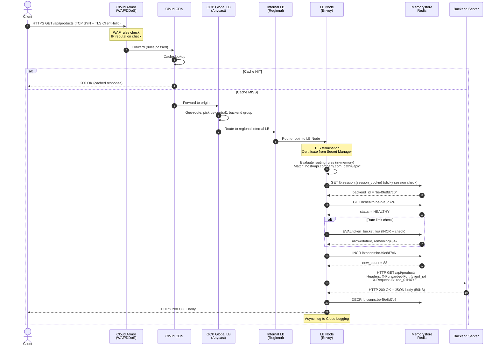
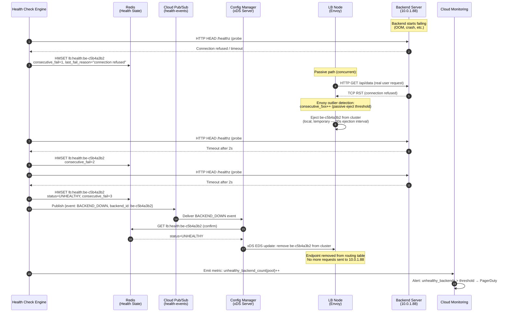
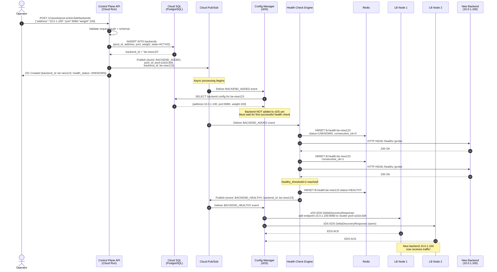
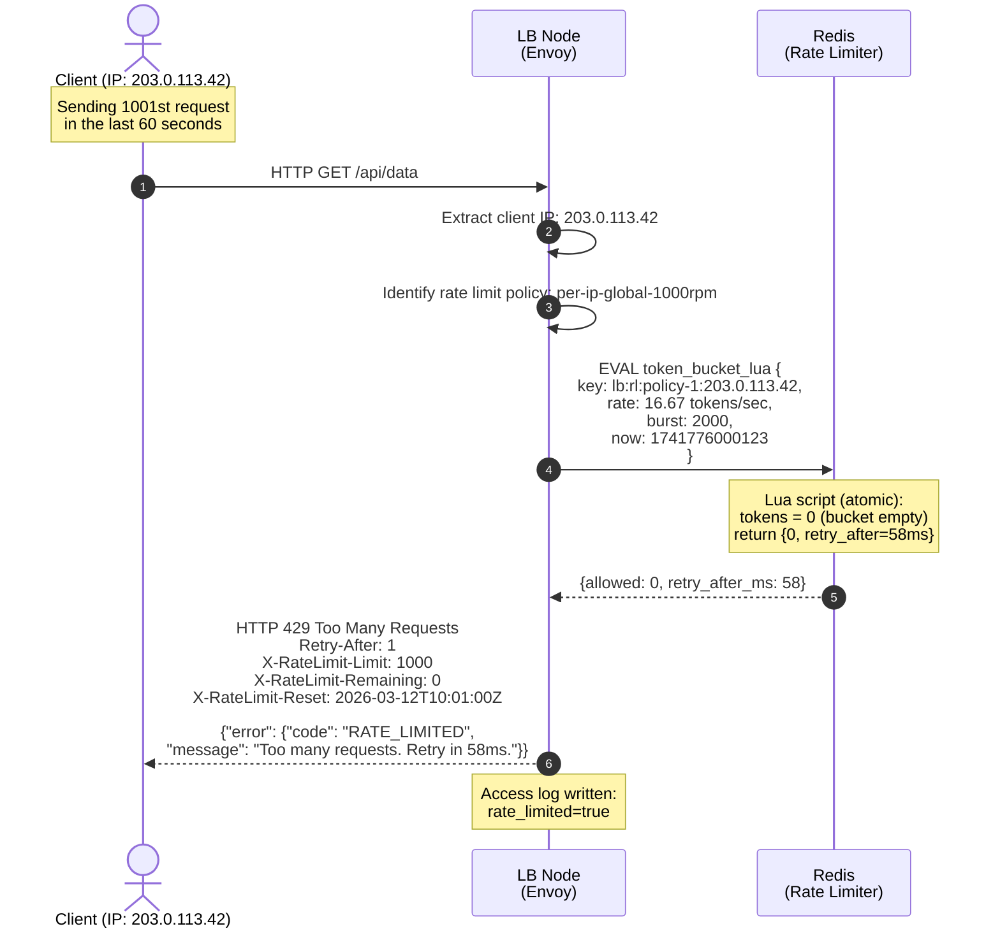
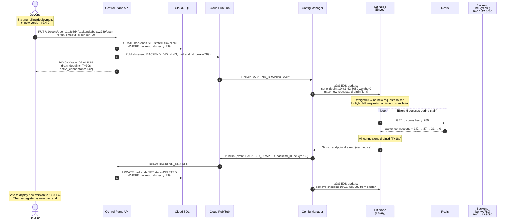
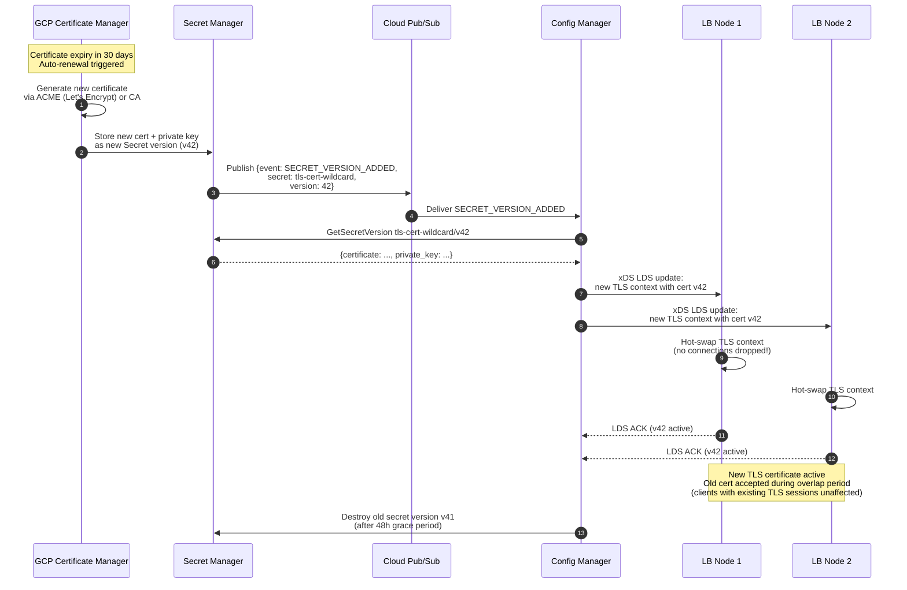
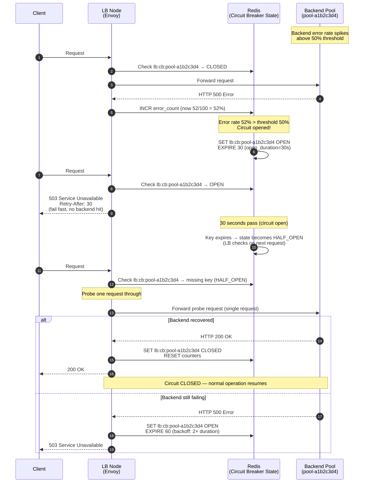

# 09 — Sequence Diagrams

---

## Diagram 1: Normal Request Flow (L7 HTTP/HTTPS)

---

## Diagram 2: Backend Failure Detection & Failover

---

## Diagram 3: New Backend Registration & Config Propagation

---

## Diagram 4: Rate Limit — Request Rejected

---

## Diagram 5: Graceful Backend Drain (Rolling Deployment)

---

## Diagram 6: SSL Certificate Rotation

---

## Diagram 7: Circuit Breaker — Open/Half-Open/Close Transitions

