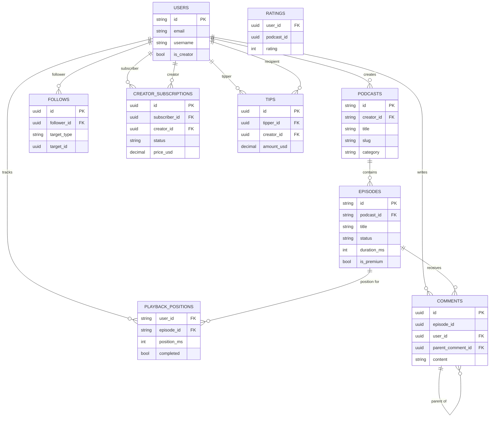

# Database Design — Podcast Hosting Platform

---

## Storage Technology Mapping

| Data Type | Technology | Reason |
|-----------|-----------|--------|
| Podcast & episode metadata | **Cloud Spanner** | Globally distributed, ACID, scales to billions of rows |
| User profiles | **Cloud Spanner** | Same instance; globally consistent user identity |
| Social graph (follows, likes) | **Cloud SQL (PostgreSQL)** | Graph-style queries, foreign keys, lower write volume |
| Creator subscriptions & tips | **Cloud SQL (PostgreSQL)** | Financial records, strong consistency, Stripe IDs |
| RSS feed cache | **Memorystore Redis** | Sub-millisecond reads, TTL-based invalidation |
| Playback positions (hot) | **Memorystore Redis** | Ultra-low latency writes (30s heartbeat) |
| Playback positions (cold) | **Cloud Spanner** | Async flush from Redis every 5 min |
| Comments | **Cloud SQL (PostgreSQL)** | Tree-structure queries (CTEs), moderate volume |
| Ratings | **Cloud SQL (PostgreSQL)** | Simple aggregates |
| Analytics events | **BigQuery** | Petabyte-scale append-only analytics |
| Search index | **Elasticsearch on GCE** | Full-text + geo + faceted search |
| Real-time live chat | **Cloud Firestore** | Real-time listeners, sub-second delivery |
| Audio / artwork / transcripts | **Cloud Storage (GCS)** | Binary blob storage |
| Ad campaign targeting | **Cloud SQL (PostgreSQL)** | Complex targeting queries |

---

## 1. Cloud Spanner — Core Metadata Schema

### `users`
```sql
CREATE TABLE users (
  id              STRING(36) NOT NULL,   -- UUID v4
  email           STRING(255) NOT NULL,
  username        STRING(50)  NOT NULL,
  display_name    STRING(100),
  avatar_url      STRING(500),
  bio             STRING(1000),
  country_code    STRING(2),
  is_creator      BOOL NOT NULL DEFAULT FALSE,
  is_verified     BOOL NOT NULL DEFAULT FALSE,
  created_at      TIMESTAMP NOT NULL OPTIONS (allow_commit_timestamp=true),
  updated_at      TIMESTAMP NOT NULL OPTIONS (allow_commit_timestamp=true),
  deleted_at      TIMESTAMP,             -- soft delete
) PRIMARY KEY (id);

CREATE UNIQUE INDEX idx_users_email    ON users(email)    WHERE deleted_at IS NULL;
CREATE UNIQUE INDEX idx_users_username ON users(username) WHERE deleted_at IS NULL;
```

### `podcasts`
```sql
CREATE TABLE podcasts (
  id              STRING(36) NOT NULL,
  creator_id      STRING(36) NOT NULL,
  title           STRING(255) NOT NULL,
  slug            STRING(100) NOT NULL,  -- URL-safe, unique
  description     STRING(4000),
  artwork_url     STRING(500),
  language        STRING(10),            -- BCP-47
  category        STRING(100),           -- iTunes category
  explicit        BOOL NOT NULL DEFAULT FALSE,
  rss_url         STRING(500),
  website_url     STRING(500),
  status          STRING(20) NOT NULL DEFAULT 'active', -- active, suspended, deleted
  episode_count   INT64 NOT NULL DEFAULT 0,
  follower_count  INT64 NOT NULL DEFAULT 0,
  created_at      TIMESTAMP NOT NULL OPTIONS (allow_commit_timestamp=true),
  updated_at      TIMESTAMP NOT NULL OPTIONS (allow_commit_timestamp=true),
  deleted_at      TIMESTAMP,
  FOREIGN KEY (creator_id) REFERENCES users(id),
) PRIMARY KEY (id);

CREATE UNIQUE INDEX idx_podcasts_slug       ON podcasts(slug)       WHERE deleted_at IS NULL;
CREATE INDEX        idx_podcasts_creator    ON podcasts(creator_id) STORING (title, artwork_url, status);
CREATE INDEX        idx_podcasts_category   ON podcasts(category, created_at DESC);
```

### `episodes`
```sql
CREATE TABLE episodes (
  id              STRING(36) NOT NULL,
  podcast_id      STRING(36) NOT NULL,
  title           STRING(500) NOT NULL,
  description     STRING(8000),
  audio_url_base  STRING(500),           -- base path in GCS; clients append /{bitrate}.m3u8
  duration_ms     INT64,
  file_size_bytes INT64,
  season_number   INT64,
  episode_number  INT64,
  explicit        BOOL NOT NULL DEFAULT FALSE,
  is_premium      BOOL NOT NULL DEFAULT FALSE,
  transcript_url  STRING(500),
  chapters_json   JSON,                  -- array of {title, start_ms}
  status          STRING(20) NOT NULL DEFAULT 'draft',
  -- status enum: draft | processing | scheduled | published | unlisted | deleted
  published_at    TIMESTAMP,
  scheduled_for   TIMESTAMP,
  play_count      INT64 NOT NULL DEFAULT 0,
  unique_listeners INT64 NOT NULL DEFAULT 0,
  created_at      TIMESTAMP NOT NULL OPTIONS (allow_commit_timestamp=true),
  updated_at      TIMESTAMP NOT NULL OPTIONS (allow_commit_timestamp=true),
  FOREIGN KEY (podcast_id) REFERENCES podcasts(id),
) PRIMARY KEY (podcast_id, id),
  INTERLEAVE IN PARENT podcasts ON DELETE CASCADE;

CREATE INDEX idx_episodes_published ON episodes(podcast_id, published_at DESC)
  WHERE status = 'published'
  STORING (title, duration_ms, audio_url_base, is_premium);

CREATE INDEX idx_episodes_status ON episodes(status, scheduled_for)
  WHERE status = 'scheduled';
```
> **Interleaving**: Episodes are interleaved under Podcasts in Spanner — reads for "all episodes of a podcast" are co-located on the same server, eliminating cross-node joins.

### `playback_positions`
```sql
CREATE TABLE playback_positions (
  user_id     STRING(36) NOT NULL,
  episode_id  STRING(36) NOT NULL,
  position_ms INT64 NOT NULL DEFAULT 0,
  completed   BOOL NOT NULL DEFAULT FALSE,
  device_id   STRING(100),
  updated_at  TIMESTAMP NOT NULL OPTIONS (allow_commit_timestamp=true),
) PRIMARY KEY (user_id, episode_id);

CREATE INDEX idx_playback_user ON playback_positions(user_id, updated_at DESC);
```
> **Hot path**: Written to Redis on every heartbeat, async flushed to Spanner every 5 min. Redis key: `pos:{user_id}:{episode_id}` (TTL = 30 days).

---

## 2. Cloud SQL (PostgreSQL) — Social & Monetization

### `follows`
```sql
CREATE TABLE follows (
  id           UUID PRIMARY KEY DEFAULT gen_random_uuid(),
  follower_id  UUID NOT NULL REFERENCES users(id) ON DELETE CASCADE,
  target_type  TEXT NOT NULL CHECK (target_type IN ('podcast', 'user')),
  target_id    UUID NOT NULL,
  followed_at  TIMESTAMPTZ NOT NULL DEFAULT now()
);

-- Prevent duplicate follows
CREATE UNIQUE INDEX idx_follows_unique
  ON follows(follower_id, target_type, target_id);

-- "Who follows podcast X?" — used for fan-out notifications
CREATE INDEX idx_follows_target
  ON follows(target_type, target_id, followed_at DESC);

-- "What does user X follow?" — used for activity feed
CREATE INDEX idx_follows_follower
  ON follows(follower_id, followed_at DESC);
```

### `ratings`
```sql
CREATE TABLE ratings (
  user_id    UUID NOT NULL REFERENCES users(id) ON DELETE CASCADE,
  podcast_id UUID NOT NULL,
  rating     SMALLINT NOT NULL CHECK (rating BETWEEN 1 AND 5),
  created_at TIMESTAMPTZ NOT NULL DEFAULT now(),
  updated_at TIMESTAMPTZ NOT NULL DEFAULT now(),
  PRIMARY KEY (user_id, podcast_id)
);

-- Aggregate index for average rating queries
CREATE INDEX idx_ratings_podcast ON ratings(podcast_id);
```

### `comments`
```sql
CREATE TABLE comments (
  id                UUID PRIMARY KEY DEFAULT gen_random_uuid(),
  episode_id        UUID NOT NULL,
  user_id           UUID NOT NULL REFERENCES users(id) ON DELETE CASCADE,
  parent_comment_id UUID REFERENCES comments(id) ON DELETE CASCADE,
  depth             SMALLINT NOT NULL DEFAULT 0 CHECK (depth <= 2),  -- max 3 levels
  content           TEXT NOT NULL CHECK (char_length(content) <= 2000),
  like_count        INT NOT NULL DEFAULT 0,
  is_deleted        BOOLEAN NOT NULL DEFAULT FALSE,  -- soft delete preserves thread
  created_at        TIMESTAMPTZ NOT NULL DEFAULT now(),
  updated_at        TIMESTAMPTZ NOT NULL DEFAULT now()
);

CREATE INDEX idx_comments_episode
  ON comments(episode_id, created_at DESC)
  WHERE is_deleted = FALSE AND parent_comment_id IS NULL;

CREATE INDEX idx_comments_parent
  ON comments(parent_comment_id, created_at ASC)
  WHERE is_deleted = FALSE;
```

### `creator_subscriptions`
```sql
CREATE TABLE creator_subscriptions (
  id                  UUID PRIMARY KEY DEFAULT gen_random_uuid(),
  subscriber_id       UUID NOT NULL REFERENCES users(id),
  creator_id          UUID NOT NULL REFERENCES users(id),
  tier_id             TEXT NOT NULL,
  price_usd           NUMERIC(10,2) NOT NULL,
  billing_cycle       TEXT NOT NULL CHECK (billing_cycle IN ('monthly', 'annual')),
  status              TEXT NOT NULL DEFAULT 'active',
  -- status: active | past_due | canceled | paused
  stripe_subscription_id TEXT UNIQUE,
  current_period_start TIMESTAMPTZ NOT NULL,
  current_period_end   TIMESTAMPTZ NOT NULL,
  canceled_at          TIMESTAMPTZ,
  created_at           TIMESTAMPTZ NOT NULL DEFAULT now()
);

CREATE UNIQUE INDEX idx_creator_subs_unique
  ON creator_subscriptions(subscriber_id, creator_id)
  WHERE status = 'active';

CREATE INDEX idx_creator_subs_creator
  ON creator_subscriptions(creator_id, status, current_period_end);
```

### `tips`
```sql
CREATE TABLE tips (
  id                UUID PRIMARY KEY DEFAULT gen_random_uuid(),
  tipper_id         UUID NOT NULL REFERENCES users(id),
  creator_id        UUID NOT NULL REFERENCES users(id),
  amount_usd        NUMERIC(10,2) NOT NULL CHECK (amount_usd >= 1.00),
  creator_payout    NUMERIC(10,2) NOT NULL,  -- 80%
  platform_fee      NUMERIC(10,2) NOT NULL,  -- 20%
  message           TEXT CHECK (char_length(message) <= 500),
  stripe_payment_id TEXT UNIQUE NOT NULL,
  status            TEXT NOT NULL DEFAULT 'completed',
  created_at        TIMESTAMPTZ NOT NULL DEFAULT now()
);

CREATE INDEX idx_tips_creator ON tips(creator_id, created_at DESC);
CREATE INDEX idx_tips_tipper  ON tips(tipper_id, created_at DESC);
```

### `ad_campaigns`
```sql
CREATE TABLE ad_campaigns (
  id              UUID PRIMARY KEY DEFAULT gen_random_uuid(),
  advertiser_id   UUID NOT NULL REFERENCES users(id),
  name            TEXT NOT NULL,
  budget_usd      NUMERIC(12,2) NOT NULL,
  spent_usd       NUMERIC(12,2) NOT NULL DEFAULT 0,
  cpm_usd         NUMERIC(8,4) NOT NULL,  -- cost per thousand impressions
  targeting       JSONB NOT NULL DEFAULT '{}',
  -- targeting: {genres: [...], countries: [...], min_listeners: N}
  placement       TEXT NOT NULL CHECK (placement IN ('pre_roll', 'mid_roll', 'post_roll')),
  vast_url        TEXT,
  status          TEXT NOT NULL DEFAULT 'draft',
  start_date      DATE NOT NULL,
  end_date        DATE NOT NULL,
  created_at      TIMESTAMPTZ NOT NULL DEFAULT now()
);

CREATE INDEX idx_campaigns_active
  ON ad_campaigns USING BRIN (start_date, end_date)
  WHERE status = 'active';

CREATE INDEX idx_campaigns_targeting
  ON ad_campaigns USING GIN (targeting);
```

---

## 3. BigQuery — Analytics Schema

### `play_events` (partitioned, clustered)
```sql
CREATE TABLE `podcast_platform.analytics.play_events`
(
  event_id        STRING,
  event_type      STRING,     -- heartbeat | play_start | play_pause | play_end
  session_id      STRING,
  user_id         STRING,
  episode_id      STRING,
  podcast_id      STRING,
  position_ms     INT64,
  device_type     STRING,
  country_code    STRING,
  app_version     STRING,
  client_ip_hash  STRING,     -- hashed for privacy (GDPR)
  event_timestamp TIMESTAMP
)
PARTITION BY DATE(event_timestamp)
CLUSTER BY podcast_id, episode_id, event_type;
```
> **Retention**: 2 years raw. After 90 days, Dataflow aggregates into `daily_episode_stats`. Raw purged at 2 years for GDPR.

### `daily_episode_stats` (materialized aggregates)
```sql
CREATE TABLE `podcast_platform.analytics.daily_episode_stats`
(
  stat_date        DATE,
  episode_id       STRING,
  podcast_id       STRING,
  total_plays      INT64,
  unique_listeners INT64,
  total_listen_ms  INT64,
  completion_count INT64,
  country_code     STRING
)
PARTITION BY stat_date
CLUSTER BY podcast_id;
```

---

## 4. Redis Cache Key Design

| Key Pattern | Value | TTL | Purpose |
|-------------|-------|-----|---------|
| `rss:feed:{podcast_id}` | XML string | 5 min | RSS feed cache |
| `pos:{user_id}:{ep_id}` | INT (ms) | 30 days | Playback position |
| `ep:meta:{ep_id}` | JSON (episode) | 10 min | Episode metadata |
| `pod:meta:{pod_id}` | JSON (podcast) | 10 min | Podcast metadata |
| `user:session:{uid}` | JSON (session) | 24 hr | User session data |
| `stream:token:{ep_id}:{uid}` | signed_url | 2 hr | CDN signed URL |
| `search:suggest:{prefix}` | JSON array | 1 hr | Search autocomplete |
| `live:viewers:{stream_id}` | INT (count) | Real-time | Live viewer count |

---

## 5. ER Diagram (Core Tables)



---

## 6. Data Partitioning Strategy

### Cloud Spanner

| Table | Partition Key | Strategy |
|-------|--------------|----------|
| `users` | `id` (UUID) | Auto-split by Spanner; UUID prevents hotspot |
| `podcasts` | `id` (UUID) | Auto-split; interleaved under `users` not needed (fan-out) |
| `episodes` | `(podcast_id, id)` | **Interleaved** under `podcasts` — co-located read |
| `playback_positions` | `(user_id, episode_id)` | Co-located per-user reading across all episodes |

### BigQuery

| Table | Partition | Cluster | Reason |
|-------|-----------|---------|--------|
| `play_events` | `DATE(event_timestamp)` | `podcast_id, episode_id` | Prune by date; cluster for per-episode queries |
| `daily_episode_stats` | `stat_date` | `podcast_id` | Date range queries per creator |

### PostgreSQL (Cloud SQL)

| Table | Partition | Reason |
|-------|-----------|--------|
| `follows` | None (B-tree indexes sufficient at <1B rows) | — |
| `comments` | Range partition by `created_at` year | Old episodes have cold comments |
| `creator_subscriptions` | None | Low volume (~10M rows) |

---

## 7. Indexing Strategy

### Most Critical Indexes (Interview Focus)

| Index | Table | Query It Serves | Type |
|-------|-------|----------------|------|
| `idx_episodes_published` | `episodes` | "List published episodes for podcast X" | Partial index, covering |
| `idx_follows_target` | `follows` | "Find all followers of podcast X" (notification fan-out) | B-tree |
| `idx_follows_follower` | `follows` | "What does user X follow?" (activity feed) | B-tree |
| `idx_comments_episode` | `comments` | Top-level comments for an episode | Partial (not deleted) |
| `idx_campaigns_targeting` | `ad_campaigns` | Match campaign by genre/country | GIN on JSONB |

---

## 8. Data Lifecycle & Retention

| Data | Hot (Active) | Warm (Archive) | Cold / Delete |
|------|-------------|----------------|---------------|
| Audio files (GCS) | Standard (0-90 days) → Nearline (90 days-2 yrs) | Coldline (>2 yrs) | Creator-initiated only |
| Raw analytics events | BigQuery (0-90 days) | Auto-archived daily stats | Purge at 2 years (GDPR) |
| Transcripts | GCS Standard (always) | Never archived (~80KB each) | With episode deletion |
| Playback positions | Redis (30 days TTL) + Spanner (permanent) | — | User account deletion |
| RSS feed cache | Redis TTL 5 min | — | Invalidated on publish |
| Live stream recordings | Processed within 24h, stored as episode | Same as episodes | — |
| User data | Spanner (active) | Soft-deleted 30 days | Hard delete on GDPR request |
| Logs (Cloud Logging) | 30 days hot | BigQuery export | Purge at 365 days |
