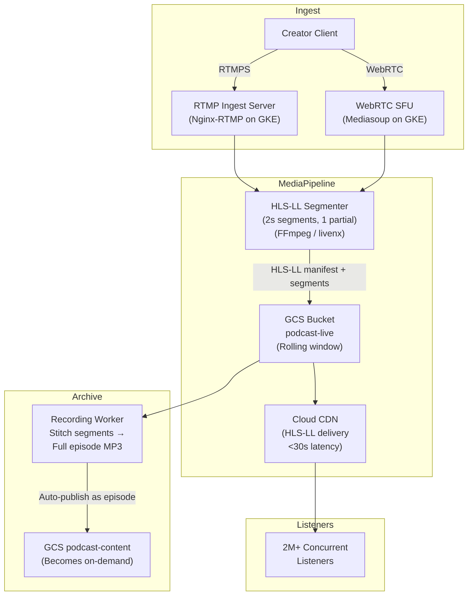
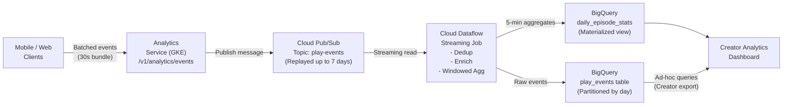
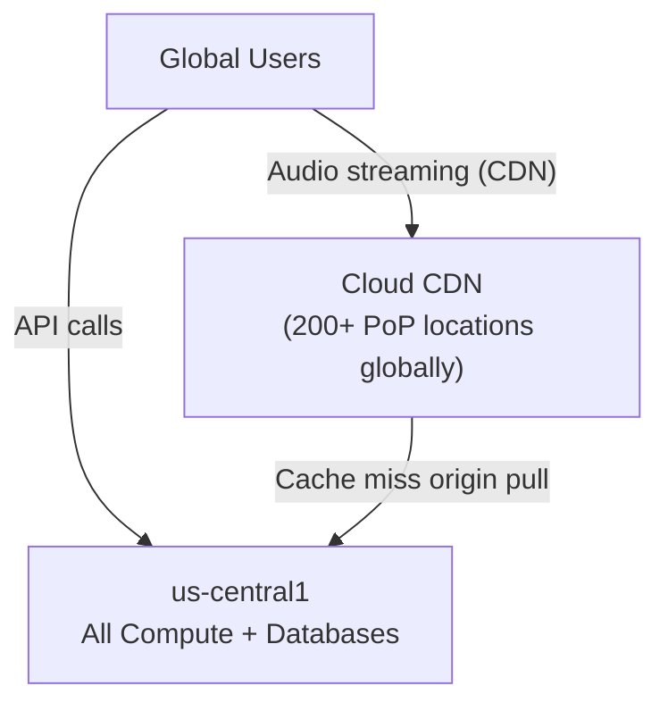
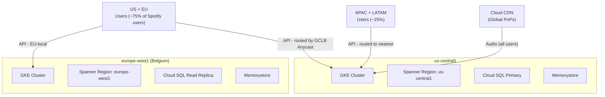
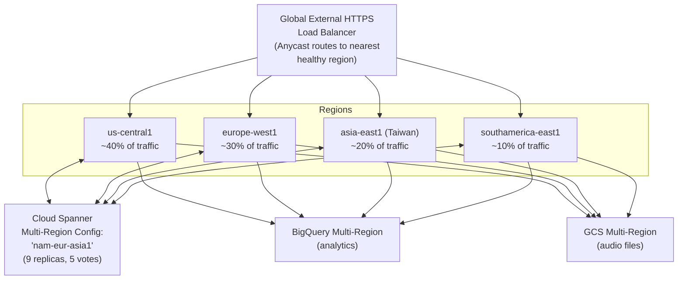

# High-Level Architecture — Podcast Hosting Platform

---

## 1. Full System Architecture (GCP)

```mermaid
flowchart TD
    subgraph Internet["Internet / Clients"]
        WebApp["Web App\n(React SPA)"]
        iOS["iOS App\n(Swift)"]
        Android["Android App\n(Kotlin)"]
        PodApps["3rd-Party\nPodcast Apps\n(RSS Consumers)"]
    end

    subgraph Edge["Edge Layer — Global"]
        Armor["Cloud Armor\n(WAF + DDoS + Bot Protection)"]
        CDN["Cloud CDN\n(Audio Segments + Artwork\n+ Static Assets)"]
        LB["Global External HTTPS\nLoad Balancing\n(Anycast IP)"]
    end

    subgraph Gateway["API Layer"]
        Apigee["Apigee API Gateway\n(Rate Limiting · Auth · Routing\nRequest Logging · API Keys)"]
        FirebaseAuth["Firebase Authentication\n(JWT · OAuth 2.0 · Social Login)"]
    end

    subgraph Compute["GKE Autopilot — Microservices"]
        direction LR
        UpSvc["Upload\nService"]
        StreamSvc["Streaming\nService"]
        RssSvc["RSS\nService"]
        TransOrch["Transcription\nOrchestrator"]
        AnalSvc["Analytics\nService"]
        MonSvc["Monetization\nService"]
        SocSvc["Social\nService"]
        SrchSvc["Search\nService"]
        UsrSvc["User\nService"]
        NotifSvc["Notification\nService"]
        LiveSvc["Live Streaming\nService"]
        AdSvc["Ad\nService"]
    end

    subgraph DataLayer["Data Layer"]
        Spanner["Cloud Spanner\n(Multi-region)\nPodcast + Episode\nMetadata + Playback"]
        PGDB["Cloud SQL\nPostgreSQL\nSocial + Subscriptions\n+ Monetization"]
        Redis["Memorystore Redis\n(HA Cluster)\nRSS Cache · Hot Metadata\nPlayback Positions · Sessions"]
        ES["Elasticsearch\non GCE\nFull-text Search\n+ Transcript Index"]
        FS["Cloud Firestore\nLive Chat\n+ Real-time State"]
        GCS["Cloud Storage GCS\nAudio Files (7+ PB)\nArtwork · Transcripts\nRecordings"]
        BQ["BigQuery\nAnalytics DW\n(58 TB+/year)"]
    end

    subgraph AsyncLayer["Async / Event Layer"]
        PubSub["Cloud Pub/Sub\n(Event Bus)\nAnalytics · Publish Events\nNotifications"]
        Dataflow["Cloud Dataflow\n(Streaming ETL)\nEvents → BigQuery\nRetention Curves"]
        Tasks["Cloud Tasks\n(Job Queue)\nTranscode · Email\nRSS Regen · Reports"]
        Scheduler["Cloud Scheduler\n(Cron)\nPayout Runs · Cleanup\nIndex Refresh"]
    end

    subgraph Workers["Async Workers (Cloud Run)"]
        TransWorker["Transcoding Workers\n(FFmpeg / GKE Jobs)"]
        TranscriptWorker["Transcription Workers\n(GCP Speech-to-Text API)"]
        EmailWorker["Email Worker\n(SendGrid)"]
        PushWorker["Push Notification\nWorker (FCM / APNs)"]
    end

    subgraph Observability["Observability"]
        Monitoring["Cloud Monitoring\n+ Alerting"]
        Logging["Cloud Logging\n(All Services)"]
        Trace["Cloud Trace\n(Distributed Tracing)"]
        Profiler["Cloud Profiler"]
    end

    WebApp & iOS & Android --> Armor
    PodApps -->|RSS HTTP| CDN
    Armor --> CDN
    CDN -->|Cache MISS| LB
    LB --> Apigee
    Apigee --> FirebaseAuth
    Apigee --> Compute

    UpSvc --> GCS
    UpSvc --> Tasks
    UpSvc --> PubSub
    UpSvc --> Spanner

    StreamSvc --> GCS
    StreamSvc --> Redis
    StreamSvc --> Spanner

    RssSvc --> Redis
    RssSvc --> Spanner

    LiveSvc --> GCS
    LiveSvc --> FS
    LiveSvc --> CDN

    TransOrch --> Tasks
    AnalSvc --> PubSub

    MonSvc --> PGDB
    SocSvc --> PGDB
    SocSvc --> FS
    SrchSvc --> ES
    UsrSvc --> Spanner
    NotifSvc --> PubSub

    PubSub --> Dataflow
    PubSub --> PushWorker
    PubSub --> EmailWorker
    Dataflow --> BQ
    Tasks --> TransWorker
    Tasks --> TranscriptWorker
    Tasks --> EmailWorker
    Scheduler --> Tasks

    Compute --> Monitoring
    Compute --> Logging
    Compute --> Trace
```

---

## 2. Audio Delivery Architecture

```mermaid
flowchart LR
    Creator["Creator Client"]
    UpSvc["Upload Service\n(GKE)"]
    GCS_RAW["GCS Bucket\npodcast-raw-uploads"]
    Tasks["Cloud Tasks\n(Transcode Queue)"]
    TransWorker["Transcoding Workers\n(GKE Jobs / Cloud Run)"]
    GCS_CONTENT["GCS Bucket\npodcast-content\n(HLS segments per bitrate)"]
    CDN["Cloud CDN\n(Pop in 200+ cities)"]
    Listener["Listener Client"]

    Creator -->|"1. POST /upload-url\n(get signed URL)"| UpSvc
    UpSvc -->|"2. Return signed URL\n(direct GCS write)"| Creator
    Creator -->|"3. PUT raw file\ndirectly to GCS"| GCS_RAW
    GCS_RAW -->|"4. GCS Pub/Sub notification"| Tasks
    Tasks -->|"5. Dispatch transcode job"| TransWorker
    TransWorker -->|"6. Segment audio into HLS\n4 bitrates × N segments"| GCS_CONTENT
    GCS_CONTENT -->|"7. CDN pulls on first request\n(origin pull)"| CDN
    Listener -->|"8. GET manifest.m3u8\n(signed CDN URL, 2hr TTL)"| CDN
    CDN -->|"9. Stream HLS segments"| Listener
```

---

## 3. Live Streaming Architecture

---

## 4. Analytics Pipeline Architecture

---

## 5. Geographic Deployment Strategies

### 5.1 Single-Region Deployment: `us-central1`

**Pros**:
- Lowest operational complexity (one region to monitor/deploy)
- Lowest cost (~$2-3M/month infra at this scale)
- Simplest data consistency model (no cross-region synchronization)
- Fastest to market for an MVP

**Cons**:
- API latency: 150-300ms for APAC/EU users (audio unaffected via CDN)
- Single region = single failure domain. `us-central1` outage = full platform outage
- US-only regulatory compliance (GDPR data residency challenges)
- Higher GCS egress cost since origin is US but CDN cache misses traverse globe

**When to use**: MVP, <50M MAU, US-first strategy

---

### 5.2 Multi-Region Deployment: `us-central1` + `europe-west1`

**Pros**:
- API latency: <50ms for US+EU (covers ~75% of users)
- Separate EU data residency — GDPR compliance with EU Spanner replica
- Failover: if US region fails, EU can serve degraded but available
- Cost: ~$4-5M/month (roughly 2× single region)

**Cons**:
- Cross-region replication lag (Spanner: <1s, PostgreSQL: few seconds)
- More complex deployment, CI/CD pipelines must deploy to both regions
- Split-brain scenarios during network partition between regions
- APAC still has 150ms+ API latency

**Data Residency**: EU users' data written to `europe-west1` Spanner instance. Analytics via BigQuery dataset in `EU` multi-region.

**When to use**: 50M–300M MAU, EU expansion required, GDPR hard requirement

---

### 5.3 Global Active-Active: US + EU + APAC + LATAM

**Pros**:
- <50ms API latency for 95%+ of global users
- Maximum availability (N-2 region failure tolerance with Spanner quorum)
- Best offline/CDN cache performance (audio origin in 4 regions reduces misses)
- Full regulatory compliance in all jurisdictions

**Cons**:
- **Cost**: ~$8-12M/month infra (4× single region + Spanner multi-region premium)
- **Complexity**: 4 Kubernetes clusters, 4 PostgreSQL setups, multi-region Spanner config
- **Conflict resolution**: Eventual consistency conflicts in social graph (follows, comments)
- **Operational overhead**: 4 on-call rotations, 4 regional deploys, region-aware feature flags
- **Spanner multi-region write latency**: ~100ms (vs <10ms single region) due to 2PC

**Spanner Multi-Region Config**: `nam-eur-asia1` — leader replicas in US; followers in EU + APAC; witnesses in LATAM. Leader re-election available for write locality optimization.

**When to use**: 300M+ MAU, global expansion, Spotify-scale

---

### 5.4 Geographic Strategy Decision Matrix

| Factor | Single Region | Multi-Region | Global Active-Active |
|--------|:---:|:---:|:---:|
| API latency (global p99) | 300ms | 80ms | 50ms |
| Audio latency (CDN — all equal) | <2s | <2s | <2s |
| Infrastructure cost | $ | $$ | $$$$ |
| Operational complexity | Low | Medium | Very High |
| GDPR compliance | Hard | Easy | Easy |
| Recovery from region failure | Full outage | Degraded | No visible impact |
| Write consistency | Strong | Eventual (lag) | Strong (Spanner quorum) |
| Time to market | Fastest | Medium | Slowest |

> **Recommendation for this design**: Start with **Multi-Region (US + EU)** for launch. Expand to Global Active-Active after 100M MAU is sustained. Audio delivery is CDN-bound regardless — compute geo matters mainly for API latency.

---

## 6. GCP Service Selection Rationale

| Category | Service Used | Why Chosen | Alternative Considered |
|----------|-------------|------------|----------------------|
| Object Storage | **Cloud Storage (GCS)** | 11-nines durability, CDN-native integration | S3 (rejected — GCP context) |
| Serving Layer | **Cloud CDN** | 200+ PoPs, signed URL support, GCS integration | Fastly, Akamai |
| API Gateway | **Apigee** | Enterprise rate limiting, OAuth, analytics | Cloud Endpoints (less powerful) |
| Auth | **Firebase Authentication** | Social OAuth, JWT, SDKs for all platforms | Cloud Identity Platform |
| Compute | **GKE Autopilot** | Auto-scaling, Node auto-provisioning, bin-packing | Cloud Run (stateless only) |
| Relational (global) | **Cloud Spanner** | Globally distributed ACID, no hotspots | AlloyDB (single-region only) |
| Relational (regional) | **Cloud SQL (PostgreSQL)** | Social graph queries, lower cost than Spanner | Cloud Spanner (over-engineered for social) |
| Cache | **Memorystore (Redis)** | Managed Redis, HA cluster mode | Memcached (no persistence) |
| Search | **Elasticsearch on GCE** | Full-text + geo + faceted + transcript search | Vertex AI Search (less control) |
| Real-time | **Cloud Firestore** | Native real-time listeners, serverless | Redis Pub/Sub (no mobile SDKs) |
| Message Bus | **Cloud Pub/Sub** | Infinite scale, 7-day replay, push/pull | Kafka on GKE (more ops overhead) |
| Stream ETL | **Cloud Dataflow** | Apache Beam, auto-scale, exactly-once | Spark Streaming on Dataproc |
| Analytics DW | **BigQuery** | Serverless SQL, partitioned tables, petabyte scale | Redshift (not GCP) |
| Job Queue | **Cloud Tasks** | Exactly-once delivery, retry, scheduling | Pub/Sub (no per-task control) |
| Cron | **Cloud Scheduler** | Managed cron, pub/sub trigger | Kubernetes CronJob |
| Transcription | **GCP Speech-to-Text API** | 100+ languages, speaker diarization, timestamps | Whisper on GPU (higher cost, more control) |
| WAF/DDoS | **Cloud Armor** | Layer 7 rules, adaptive protection | Cloudflare (external) |
| Secrets | **Secret Manager** | Versioned secrets, IAM-controlled, audit log | Vault (more ops) |
| Monitoring | **Cloud Monitoring + Logging + Trace** | Native GCP integration | Datadog (additional cost) |
