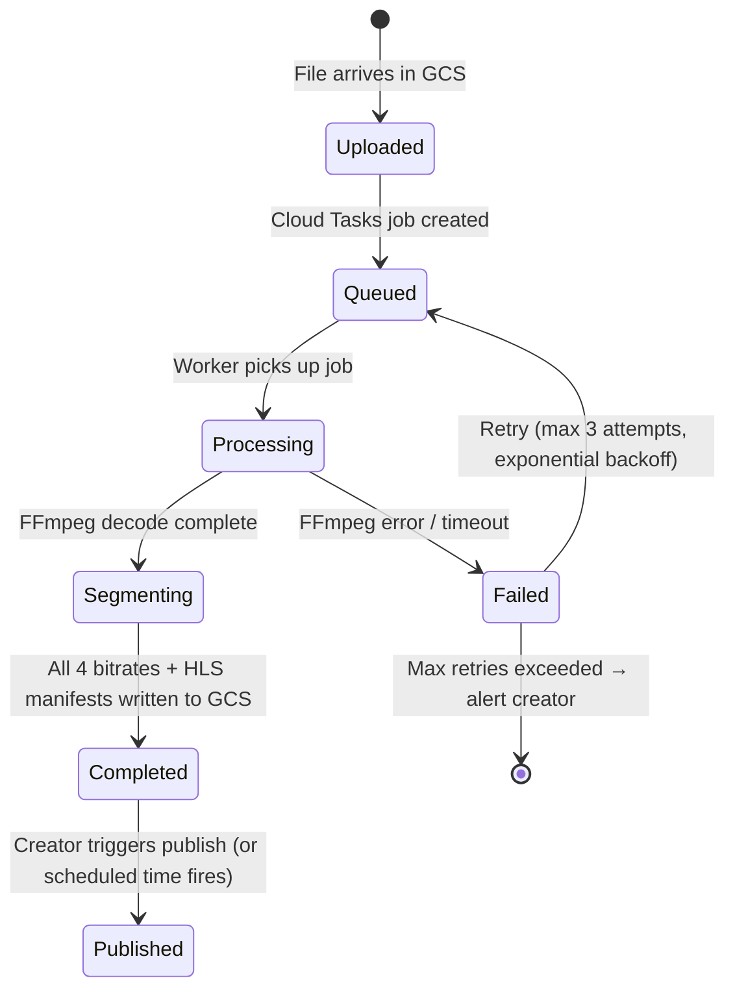
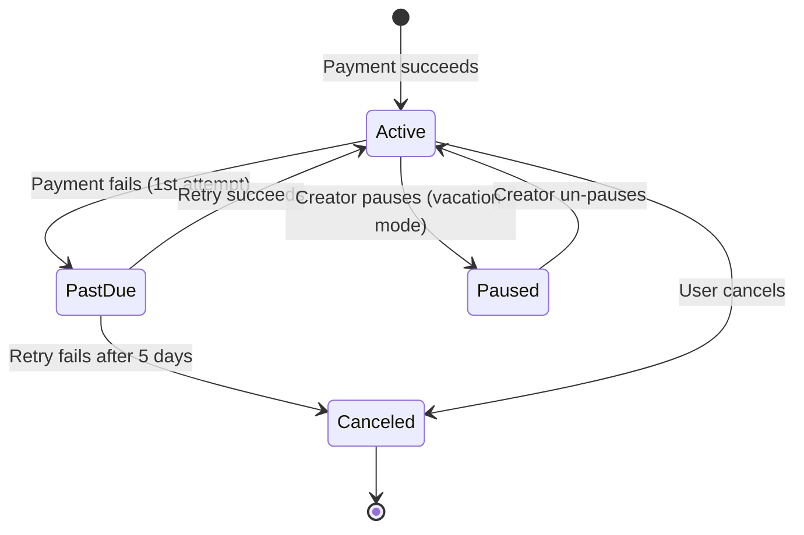

# Detailed Component Design — Podcast Hosting Platform

---

## Component 1: Upload Service

### Responsibilities
- Issue pre-signed GCS upload URLs (creators never upload through our servers)
- Track upload progress and resume support via GCS resumable upload sessions
- Validate uploaded files: MIME type, file size, audio duration
- Trigger transcoding pipeline on successful upload
- Persist episode metadata to Cloud Spanner
- Publish `episode.uploaded` event to Pub/Sub

### Architecture

```
Creator Client
    │
    ├─ 1. POST /upload-url → Upload Service ──► Spanner (create episode draft)
    │                                       ──► Return GCS signed URL
    │
    ├─ 2. PUT {gcs_signed_url} ──────────────────────► GCS (direct upload)
    │
    │   GCS triggers Pub/Sub notification on object finalize
    │                          │
    │                          ▼
    │              Cloud Tasks (Transcode Queue)
    │                          │
    │                          ▼
    └─ 3. POST /episodes ─► Upload Service ──► Spanner (update episode status)
                                             ──► Cloud Tasks (dispatch transcode)
                                             ──► Pub/Sub (episode.processing)
```

### Resumable Upload Protocol
```
1. Client sends POST /upload-url with file size + checksum
2. Upload Service calls GCS resumable upload initiation API
   → Returns upload session URI (valid 7 days)
3. Client sends PUT with Content-Range: bytes 0-10485759/98765432
   → GCS returns 308 Resume Incomplete with Range header
4. On network drop, client sends PUT with Content-Range: bytes */98765432
   → GCS returns current state (how many bytes received)
5. Client resumes from last acknowledged byte
```

### Transcode Job State Machine



### Key Algorithms
- **Deduplication**: SHA-256 checksum on upload. If same hash exists, return existing `episode_id` without re-uploading.
- **Chunked Validation**: Validate MIME type from first 512 bytes (magic bytes), not Content-Type header (can be spoofed).
- **Format Acceptance**: MP3, AAC, WAV, FLAC, OGG, M4A — all converted to HLS-segmented AAC internally.

---

## Component 2: Streaming Service

### Responsibilities
- Generate time-limited signed CDN URLs for HLS manifests
- Serve playback position (from Redis, fall back to Spanner)
- Handle premium episode access validation (check subscription)
- Provide adaptive master manifest pointing to 4 bitrate variants

### HLS Manifest Hierarchy

```
adaptive_master.m3u8         ← Client requests this first
├── 192k/playlist.m3u8       ← 192 kbps variant
├── 128k/playlist.m3u8       ← 128 kbps variant (most common)
├── 64k/playlist.m3u8        ← 64 kbps (mobile data saver)
└── 32k/playlist.m3u8        ← 32 kbps (ultra low bandwidth)

Each variant playlist:
/episodes/ep_abc/128k/playlist.m3u8
├── 000.aac   (10s segment)
├── 001.aac
├── ...
└── 287.aac   (last segment of 47m54s episode)
```

### Signed URL Generation
```python
def generate_signed_manifest_url(episode_id: str, user_id: str) -> dict:
    # Check episode access (premium gate)
    episode = spanner.get(episode_id)
    if episode.is_premium:
        sub = redis.get(f"sub:{user_id}:{episode.podcast.creator_id}")
        if not sub:
            sub = pg.check_active_subscription(user_id, episode.podcast.creator_id)
            redis.setex(f"sub:{user_id}:{episode.podcast.creator_id}", 3600, sub)
        if not sub:
            raise ForbiddenError("Subscription required")

    # Generate CDN signed URL (Cloud CDN signed URL with key)
    base_path = f"/episodes/{episode_id}/"
    expiry = int(time.time()) + 7200  # 2-hour TTL
    url_signature = hmac_sha256(CDN_SIGNING_KEY, f"GET\n{base_path}\n{expiry}")

    return {
        "manifest_url": f"https://cdn.podcastplatform.com{base_path}adaptive.m3u8"
                        f"?Expires={expiry}&KeyName=cdn-key-1&Signature={url_signature}",
        "expires_at": datetime.utcfromtimestamp(expiry).isoformat(),
    }
```

### Playback State Sync
```
Every 30 seconds, client POST /playback-position:
  1. Write position_ms to Redis: SET pos:{uid}:{ep_id} {ms} EX 2592000
  2. Every 5 minutes, async flush job reads Redis and batch-writes to Spanner
  3. On device switch: GET /playback-position reads Redis first, falls back to Spanner
```

---

## Component 3: RSS Service

### Responsibilities
- Serve valid RSS 2.0 / iTunes Podcast namespace XML feeds
- Cache feeds in Redis with 5-minute TTL
- Regenerate feed on `episode.published` Pub/Sub event
- Support custom domain mapping (CNAME to platform)
- Count RSS downloads per IAB v2.1 methodology

### Feed Caching Architecture

```
Listener Client / Podcast App
    │
    ├─ GET /v1/feeds/{slug}/rss
    │         │
    │         ▼
    │    RSS Service (GKE)
    │         │
    │    Check Redis: rss:feed:{podcast_id}
    │    ├─ HIT (95%+) ─────────────────────► Return XML (from cache)
    │    │
    │    └─ MISS ──► Query Spanner (podcast + last 50 episodes)
    │                ──► Generate XML string
    │                ──► Redis SET rss:feed:{podcast_id} EX 300
    │                ──► Return XML
    │
    [On episode.published event via Pub/Sub]
    │
    └─ RSS Service subscriber ──► DELETE rss:feed:{podcast_id} from Redis
                                ──► Proactively regenerate and cache (warm cache)
```

### IAB v2.1 Download Counting
A "download" is counted only when:
1. The request is not from a known bot/spider (verified against IAB list)
2. The same IP doesn't re-request the same episode within 24 hours
3. The request is a full enclosure fetch (not just the RSS XML itself)

Implementation:
```python
# In Redis: Bloom filter for (ip_hash, episode_id) pairs to deduplicate
# Key: bloom:downloads:{episode_id}:{date}
# TTL: 25 hours
def count_download(episode_id: str, ip: str, user_agent: str) -> bool:
    if is_known_bot(user_agent):
        return False  # don't count
    ip_hash = sha256(ip + SECRET_SALT)[:16]
    bloom_key = f"bloom:downloads:{episode_id}:{today()}"
    if not redis.bf_add(bloom_key, ip_hash):
        return False  # duplicate within 24h
    redis.expire(bloom_key, 90000)  # 25 hours
    # Increment counter in BigQuery via Pub/Sub
    pubsub.publish("rss-download-events", {"episode_id": episode_id})
    return True
```

---

## Component 4: Transcription Service

### Responsibilities
- Orchestrate async transcription jobs triggered by episode upload
- Call GCP Speech-to-Text API with speaker diarization + word timestamps
- Store word-level transcript JSON and SRT in GCS
- Index transcript text in Elasticsearch for full-text search
- Detect chapter boundaries using silence + topic analysis
- Allow creators to edit transcripts via CMS

### Transcription Pipeline

```
episode.uploaded Pub/Sub event
    │
    ▼
Transcription Orchestrator (GKE)
    │
    ├─ Create Cloud Tasks job: transcribe:{episode_id}
    │
    ▼
Transcription Worker (Cloud Run — scales to 0)
    │
    ├─ 1. Fetch audio from GCS (128k MP3)
    ├─ 2. Split into 5-minute chunks (Speech-to-Text API limit: 60 min)
    ├─ 3. Submit all chunks in parallel to GCP Speech-to-Text API
    │      - Features: SPEAKER_DIARIZATION, word_time_offsets, punctuation
    │      - Model: latest_long (optimized for podcasts)
    │      - Language: auto-detect + requested override
    ├─ 4. Merge chunk outputs, align word timestamps
    ├─ 5. Detect chapters (silence >5s + semantic topic shift)
    ├─ 6. Write to GCS: transcripts/{episode_id}/words.json
    │                    transcripts/{episode_id}/transcript.srt
    │                    transcripts/{episode_id}/transcript.txt
    ├─ 7. Update Spanner: episodes.transcript_url, episodes.chapters_json
    ├─ 8. Index in Elasticsearch: {episode_id, podcast_id, full_text_content}
    └─ 9. Publish episode.transcribed to Pub/Sub
```

### Cost Optimization
- GCP Speech-to-Text pricing: ~$0.016/min for enhanced model
- 1M episodes/month × 45 min = 45M minutes/month × $0.016 = **$720,000/month**
- Optimization: Only transcribe episodes with >100 plays in first 24h (demand-driven)
- Batch transcription: 80% episodes processed during off-peak hours (00:00–08:00 UTC)
- Fallback: Open-source Whisper on GKE GPU nodes for cost arbitrage above 10M episodes/month

---

## Component 5: Analytics Pipeline

### Responsibilities
- Ingest 140,000+ batched events/sec peak from clients
- Deduplicate events (clients may retry batches)
- Enrich events (IP → country via MaxMind, episode → podcast_id lookup)
- Compute 5-minute aggregate windows for near-real-time dashboards
- Build per-episode retention curves (histogram of position_ms at stream-end)
- Power creator analytics API via BigQuery

### Pipeline Stages

```
[Clients] ──batch──► Analytics Service (GKE)
                          │
                          ├─ Validate event schema
                          ├─ Authenticate session token
                          └─ Publish to Pub/Sub topic: raw-play-events

         ┌────────────────┘
         ▼
  Pub/Sub: raw-play-events
  (7-day replay buffer, ~800 GB/day)
         │
         ▼
  Cloud Dataflow Streaming Job
         │
         ├─ Stage 1: Parse + validate
         │           Deserialize JSON from Pub/Sub
         │
         ├─ Stage 2: Dedup
         │           Stateful window: deduplicate on (session_id, event_type, position_ms)
         │           within 10-second window
         │
         ├─ Stage 3: Enrich
         │           - IP → country_code (MaxMind GeoIP, in-memory)
         │           - episode_id → podcast_id (Redis lookup)
         │
         ├─ Stage 4: Write to BigQuery
         │           Table: play_events (partitioned by DATE(event_timestamp))
         │           Clustered by: podcast_id, episode_id
         │
         └─ Stage 5: 5-minute windowed aggregation
                     Group by: (episode_id, 5-min window)
                     Compute: plays, unique_sessions, sum_position_ms
                     Write to: daily_episode_stats (streaming inserts)
                     → Powers near-real-time dashboard
```

### Retention Curve Computation
```sql
-- Run daily via BigQuery scheduled query
INSERT INTO daily_retention_curves
SELECT
    episode_id,
    DATE(event_timestamp) AS stat_date,
    FLOOR(position_ms / 60000) AS minute_mark,
    COUNT(DISTINCT session_id) AS listeners_at_minute
FROM play_events
WHERE event_type = 'heartbeat'
  AND DATE(event_timestamp) = DATE_SUB(CURRENT_DATE(), INTERVAL 1 DAY)
GROUP BY 1, 2, 3;
```

---

## Component 6: Monetization Service

### Responsibilities
- Manage creator subscription tiers (CRUD)
- Handle subscription lifecycle via Stripe webhooks
- Gate premium episode access (interacts with Streaming Service)
- Process tips (one-time payments via Stripe)
- Manage programmatic ad targeting and VAST URL generation
- Calculate and queue creator payouts (weekly via Stripe Connect)
- Revenue split: 80% creator / 20% platform

### Subscription State Machine



### Ad Targeting Engine
```python
def select_ad_for_episode(episode_id: str, listener_profile: dict) -> Optional[Ad]:
    """
    Called by client on episode stream start. VAST URL returned.
    Targeting criteria: genre match, country, CPM highest bid wins.
    """
    episode = get_episode(episode_id)
    podcast = get_podcast(episode.podcast_id)

    # Query active campaigns matching criteria
    campaigns = pg.query("""
        SELECT id, vast_url, cpm_usd
        FROM ad_campaigns
        WHERE status = 'active'
          AND start_date <= CURRENT_DATE AND end_date >= CURRENT_DATE
          AND (targeting->>'countries' IS NULL
               OR targeting->'countries' ? :country)
          AND (targeting->>'genres' IS NULL
               OR targeting->'genres' ? :genre)
          AND (spent_usd < budget_usd)
        ORDER BY cpm_usd DESC
        LIMIT 1
    """, country=listener_profile["country"], genre=podcast.category)

    if not campaigns:
        return None

    # Record impression (async via Pub/Sub)
    pubsub.publish("ad-impressions", {
        "campaign_id": campaigns[0]["id"],
        "episode_id": episode_id,
        "cpm_usd": campaigns[0]["cpm_usd"]
    })

    return Ad(vast_url=campaigns[0]["vast_url"])
```

### Payout Flow
```
Every Sunday at 02:00 UTC (Cloud Scheduler triggers Cloud Tasks job):
1. Query BigQuery: total ad revenue per creator for past week
2. Query PostgreSQL: total subscription revenue per creator for past week
3. Query PostgreSQL: total tips received per creator for past week
4. Compute payout = (ad_revenue + subscription_revenue + tips) × 0.80
5. Create Stripe Connect transfer to creator's connected account
6. Write payout record to PostgreSQL: status = 'pending'
7. Stripe webhook: 'transfer.paid' → update status = 'completed'
```

---

## Component 7: Social Service

### Responsibilities
- Manage follow graph (user↔podcast, user↔creator)
- Serve activity feed (fan-out on write for small accounts, fan-out on read for creators >1M followers)
- Thread comments with 3-level nesting
- Aggregate podcast ratings with recency weighting
- Trigger notifications via Notification Service

### Activity Feed: Fan-Out Strategy

```
Hybrid approach based on creator follower count:

Small creator (<100K followers): FAN-OUT ON WRITE
  episode.published event
      │
      ▼
  Social Service reads all follower IDs from PostgreSQL follows table
      │ (up to 100K rows — acceptable)
      ▼
  For each follower: Redis LPUSH feed:{user_id} {activity_json}
  Redis list TTL: 30 days, max length: 1000 items (LTRIM)

Large creator (>100K followers): FAN-OUT ON READ
  Activity NOT pushed to individual feeds at publish time
  Instead: feed:{user_id} contains only small-creator activities
  
  On GET /activity-feed:
    1. Read user follows from PostgreSQL (large creators list)
    2. For each large creator: fetch latest N episodes from Spanner
    3. Merge sorted with Redis feed:{user_id} by timestamp
    4. Return unified paginated feed

  Threshold: 100K followers (configurable via feature flag)
```

### Comment Threading
```sql
-- Fetch top-level comments + 2 levels of replies in a single query
WITH RECURSIVE comment_tree AS (
    -- Base: top-level comments
    SELECT *, 0 AS depth
    FROM comments
    WHERE episode_id = $1
      AND parent_comment_id IS NULL
      AND is_deleted = FALSE
    ORDER BY like_count DESC
    LIMIT 20

    UNION ALL

    -- Recursive: replies up to depth 2
    SELECT c.*, ct.depth + 1
    FROM comments c
    JOIN comment_tree ct ON c.parent_comment_id = ct.id
    WHERE c.is_deleted = FALSE
      AND ct.depth < 2
)
SELECT * FROM comment_tree ORDER BY depth, created_at;
```

---

## Component 8: Search Service

### Responsibilities
- Full-text search across podcast titles, descriptions, episode titles
- Transcript word search (find episodes by what was said)
- Geographic and category filtering
- Autocomplete / typeahead suggestions
- Index updates on episode publish / transcript completion

### Elasticsearch Index Schema

```json
{
  "mappings": {
    "properties": {
      "podcast_id":      { "type": "keyword" },
      "episode_id":      { "type": "keyword" },
      "type":            { "type": "keyword" },
      "title":           { "type": "text", "analyzer": "english" },
      "description":     { "type": "text", "analyzer": "english" },
      "transcript_text": { "type": "text", "analyzer": "english", "index_options": "offsets" },
      "category":        { "type": "keyword" },
      "language":        { "type": "keyword" },
      "published_at":    { "type": "date" },
      "play_count":      { "type": "long" },
      "artwork_url":     { "type": "keyword", "index": false },
      "suggest": {
        "type": "completion",
        "analyzer": "simple",
        "preserve_separators": true
      }
    }
  }
}
```

### Autocomplete / Suggest
```
GET /v1/search?q=artif&type=suggest
→ Elasticsearch completion suggester:

{
  "_source": ["title", "type", "podcast_id"],
  "suggest": {
    "podcast_suggest": {
      "prefix": "artif",
      "completion": { "field": "suggest", "size": 5, "fuzzy": { "fuzziness": 1 } }
    }
  }
}
```

---

## Component 9: Live Streaming Service

### Responsibilities
- Accept RTMP or WebRTC ingest from creators
- Segment into HLS Low-Latency (HLS-LL) 2-second partial segments
- Distribute via Cloud CDN with <30-second end-to-end latency
- Manage real-time chat via Firestore
- Record stream → auto-create on-demand episode
- Handle stream interruptions gracefully (reconnect buffer)

### Latency Budget (HLS-LL)

```
Component                     Latency
─────────────────────────────────────
Creator encoding buffer        2 sec
RTMP → Media server ingest     <1 sec
HLS-LL segment (2s target)     2 sec
CDN propagation (nearest PoP)  1-3 sec
Player buffer (1 segment)      2 sec
─────────────────────────────────────
Total (typical)                8-10 sec
Worst case (far CDN PoP)       <30 sec
```

### Stream Resilience
```
Creator RTMP disconnect:
  - Media server holds "live edge" for 30 seconds
  - Sends "stream interrupted" message to Firestore (real-time to listeners)
  - Creator has 30s to reconnect using same stream key
  - If reconnected: seamless continuation
  - If not: stream ends, recording finalizes automatically

Viewer too slow (buffer underrun):
  - HLS-LL player falls back to 10-second catchup mode
  - Can select lower bitrate automatically
  - No "live edge" if >60s behind (serve as VOD from GCS)
```
