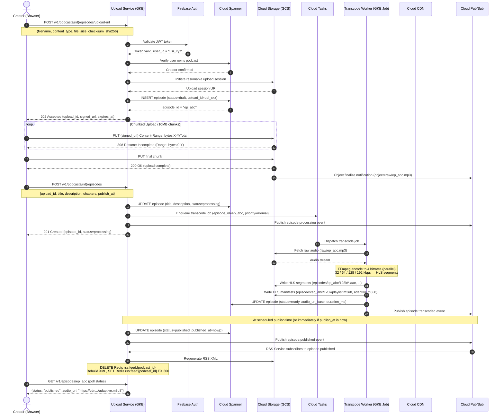
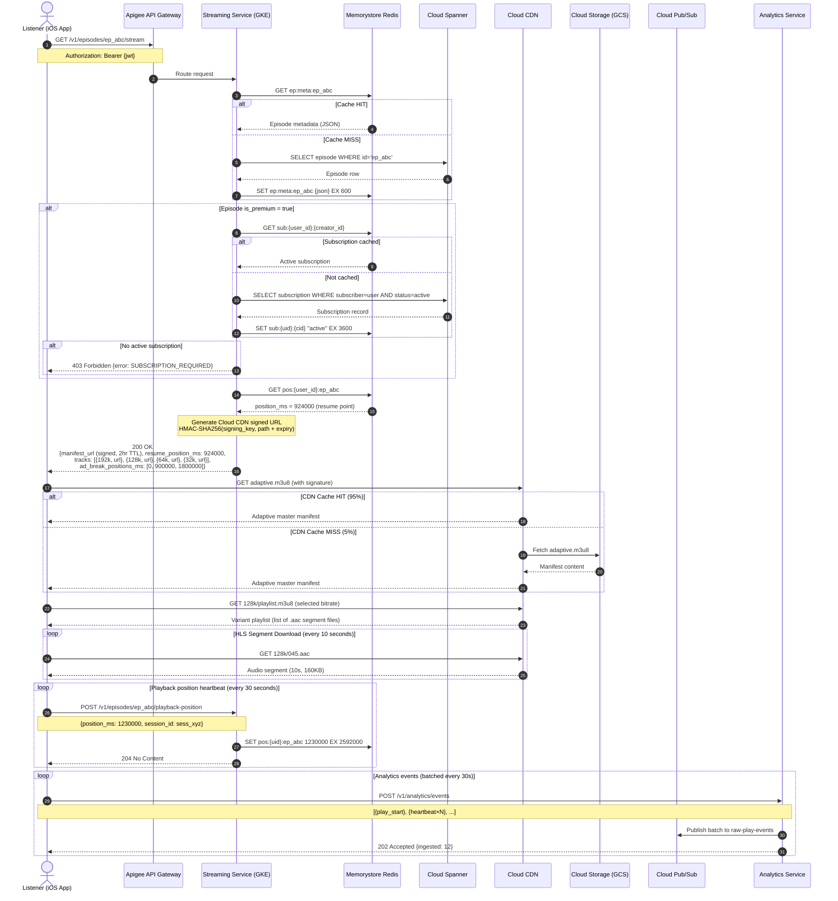
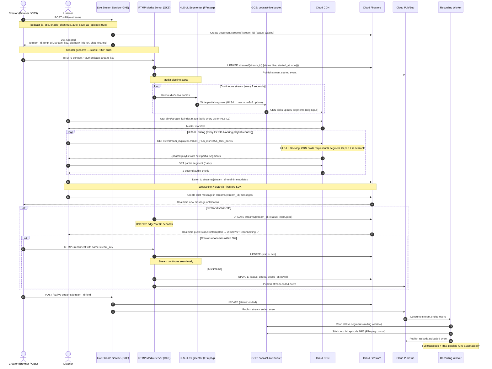
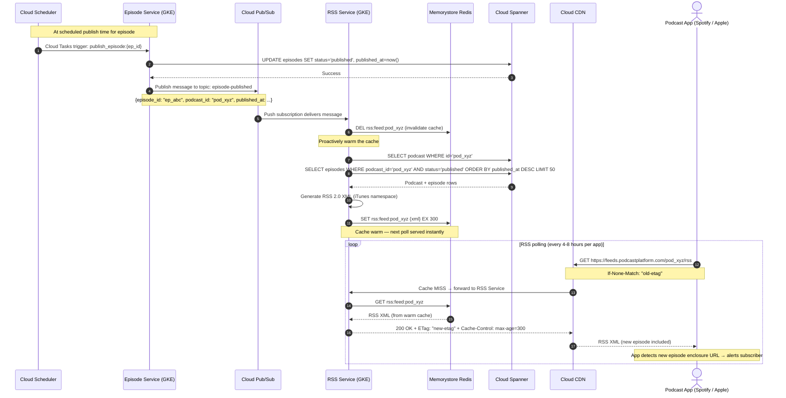
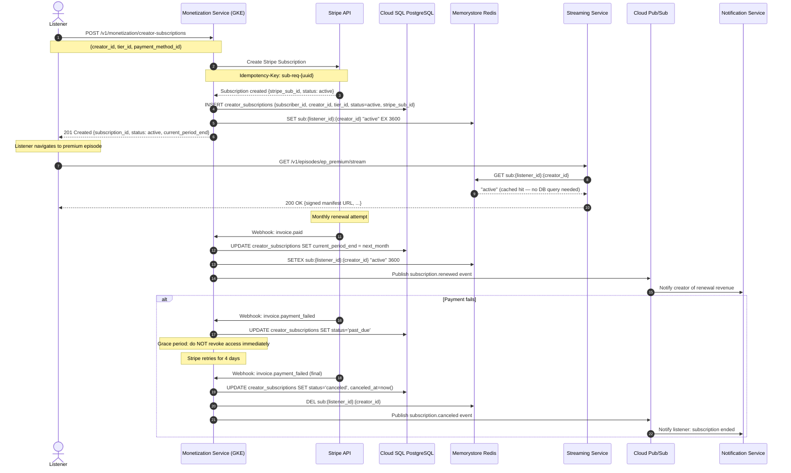
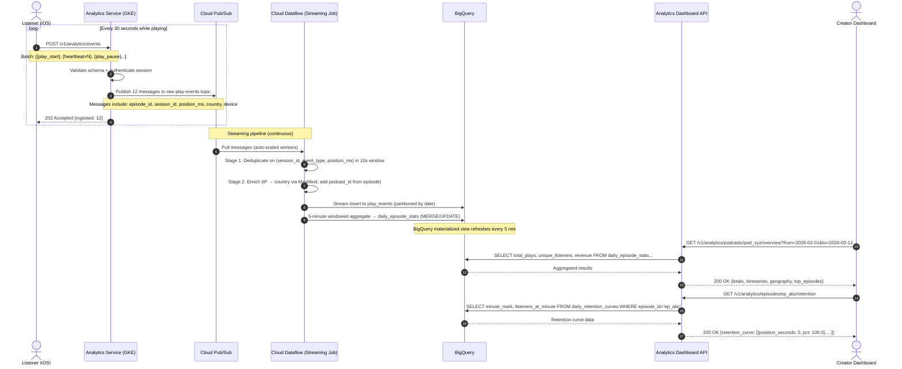
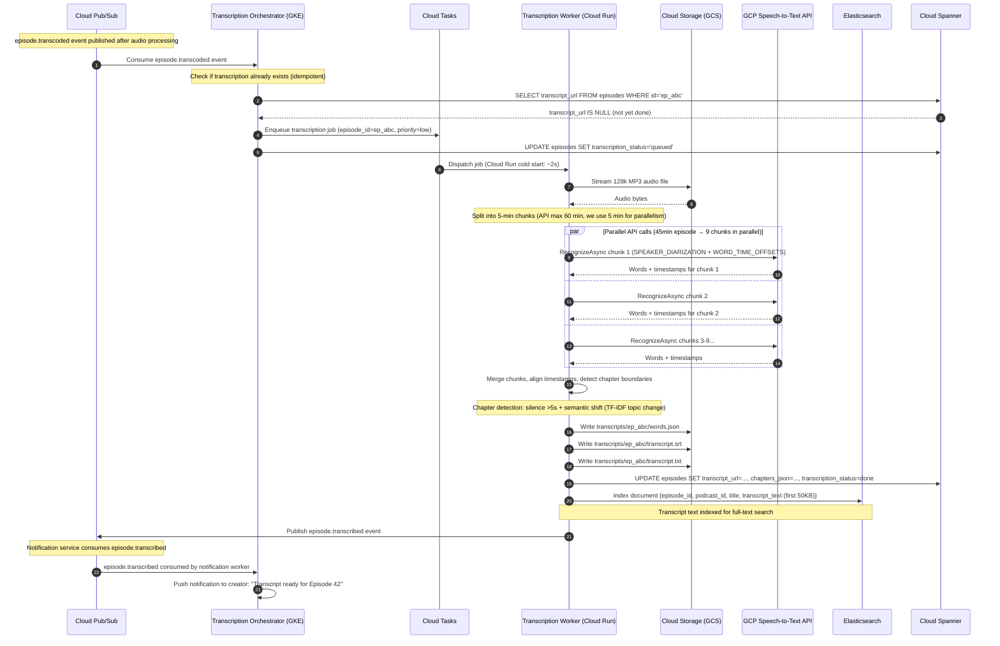
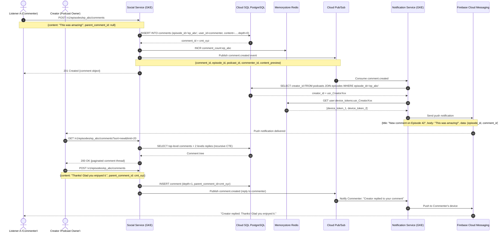

# Sequence Diagrams — Podcast Hosting Platform

> All diagrams use Mermaid `sequenceDiagram` syntax.
> `autonumber` labels each step for reference.

---

## Diagram 1: Episode Upload Flow (Full End-to-End)

---

## Diagram 2: On-Demand Streaming Flow

---

## Diagram 3: Live Streaming Flow

---

## Diagram 4: RSS Feed Update on Episode Publish

---

## Diagram 5: Creator Subscription & Premium Episode Access

---

## Diagram 6: Analytics Event → Creator Dashboard

---

## Diagram 7: Transcription Pipeline

---

## Diagram 8: Comment + Notification Flow

