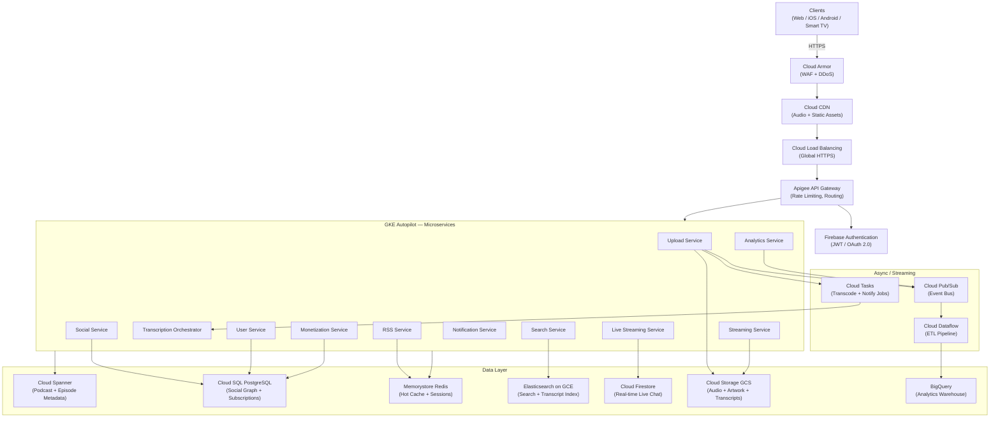

# Podcast Hosting Platform — System Design

> **Scale**: Spotify-scale · **500M MAU / 200M DAU** · **GCP** · Eventual Consistency
> **Purpose**: Full interview prep + production architecture learning

---

## Document Index

| # | File | Description |
|---|------|-------------|
| — | [README.md](README.md) | This overview index |
| 1 | [01-requirements.md](01-requirements.md) | Functional & Non-Functional Requirements |
| 2 | [02-traffic-estimation.md](02-traffic-estimation.md) | Back-of-envelope Traffic, Storage & Bandwidth |
| 3 | [03-api-design.md](03-api-design.md) | RESTful API Design with Full Request/Response Examples |
| 4 | [04-database-design.md](04-database-design.md) | Schema Design, Indexes, Caching, Data Lifecycle |
| 5 | [05-high-level-architecture.md](05-high-level-architecture.md) | Architecture Diagrams & GCP Service Map |
| 6 | [06-detailed-components.md](06-detailed-components.md) | Deep Dive into Every Microservice |
| 7 | [07-tradeoffs.md](07-tradeoffs.md) | Every Major Design Trade-off Explained |
| 8 | [08-failure-scenarios.md](08-failure-scenarios.md) | Failure Modes, Detection, Mitigation, RTO/RPO |
| 9 | [09-sequence-diagrams.md](09-sequence-diagrams.md) | Mermaid Sequence Diagrams for All Key Flows |

---

## The System in 60 Seconds

**What it is**: A globally distributed podcast platform where creators upload audio, and 500M listeners stream on-demand or live — with real-time analytics, monetization (subscriptions/ads/tips), social features, RSS syndication, and auto-transcription.

**The 5 Hardest Problems**:

| Problem | Scale | Solution |
|---------|-------|----------|
| Audio delivery | 2.4 Tbps peak | GCS + Cloud CDN + signed URLs |
| Upload + transcode pipeline | 1M episodes/day | Async workers via Cloud Tasks + GKE |
| Live streaming | <30s latency | WebRTC ingest → HLS-LL → CDN |
| RSS feeds | 32,500 polls/sec | Redis cache + CDN + event-driven regen |
| Analytics ingestion | 140,000 events/sec | Pub/Sub → Dataflow → BigQuery pipeline |

**Numbers to memorize for interviews**:
- **18.75M** concurrent streams at peak
- **2.4 Tbps** CDN bandwidth at peak
- **140 TB** new audio uploaded daily
- **~65 PB** total storage Year 1
- **140,000** analytics events/sec at peak
- **140,000** API RPS at peak

---

## System Architecture Overview

---

## Geographic Deployment Options (Summary)

| Strategy | Compute Regions | Cost | p99 Latency | Complexity | Best For |
|---------|-----------------|----|------------|------------|----------|
| **Single Region** | `us-central1` | $ (1×) | <20ms US, 200ms+ APAC | Low | MVP / US-only launch |
| **Multi-Region** | US + EU | $$ (2×) | <30ms US+EU, 150ms APAC | Medium | Global launch, covers 75% of users |
| **Global Active-Active** | US + EU + APAC + LATAM | $$$$ (4×) | <50ms worldwide | High | Full Spotify-scale |

> CDN PoPs are deployed globally regardless of compute region — audio latency is CDN-bounded, not compute-bounded.
> See [05-high-level-architecture.md](05-high-level-architecture.md) for full analysis with pros/cons.

---

## Interview Preparation Guide

### 45-Minute Interview Structure

| Phase | Duration | Focus Area |
|-------|----------|-----------|
| Clarifying Questions | 5 min | Scale, features, consistency, geo |
| Requirements | 5 min | Functional + non-functional |
| Estimation | 5 min | RPS, storage, bandwidth |
| High-Level Architecture | 15 min | Services, data flow, GCP services |
| Deep Dive | 10 min | Upload pipeline OR streaming service |
| Trade-offs | 5 min | Region strategy, consistency, sync vs async |

### Things Most Candidates Miss
1. **Resumable uploads** — podcast files are huge (up to 2 GB); network drops must be handled
2. **Adaptive bitrate** — provide 4 quality levels, client auto-selects based on bandwidth
3. **Signed URLs with TTL** — audio files can't be public; prevent hotlinking
4. **RSS caching** — RSS feeds change rarely but get polled millions of times/day
5. **Batch analytics events** — don't send one HTTP call per second of listening
6. **Idempotent publish** — episode publish must be idempotent (retry-safe)
7. **Live vs on-demand are separate architectures** — live uses WebRTC/HLS-LL, not the same pipeline

### Quick Decision Frameworks
- **Consistency question**: "Is this user-visible and financial? → Strong. Otherwise → Eventual."
- **Database question**: "Is it globally distributed metadata? → Spanner. Social graph? → PostgreSQL. Real-time? → Firestore. Search? → Elasticsearch."
- **Queue question**: "High-throughput events? → Pub/Sub. Retry-able jobs? → Cloud Tasks."
- **Storage question**: "Binary blobs? → GCS. Hot structured data? → Redis. Cold analytics? → BigQuery."
